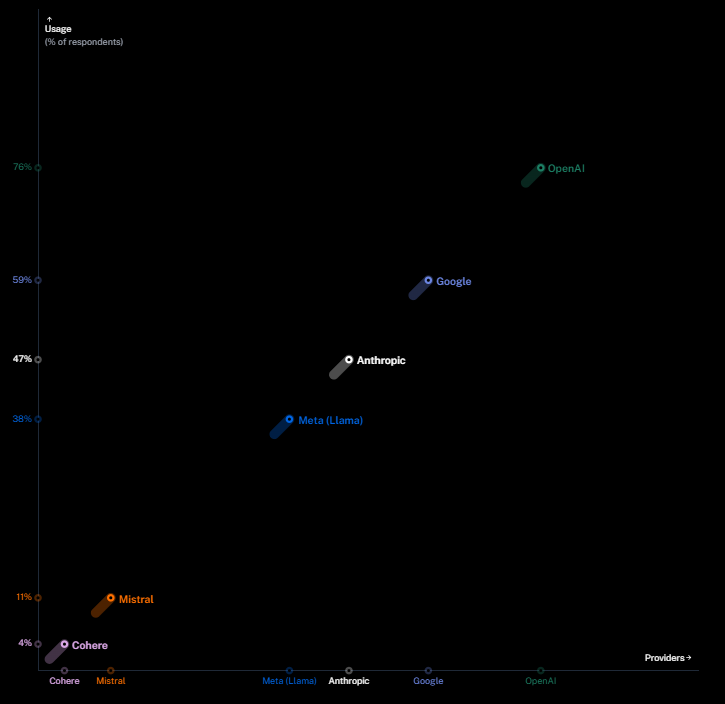
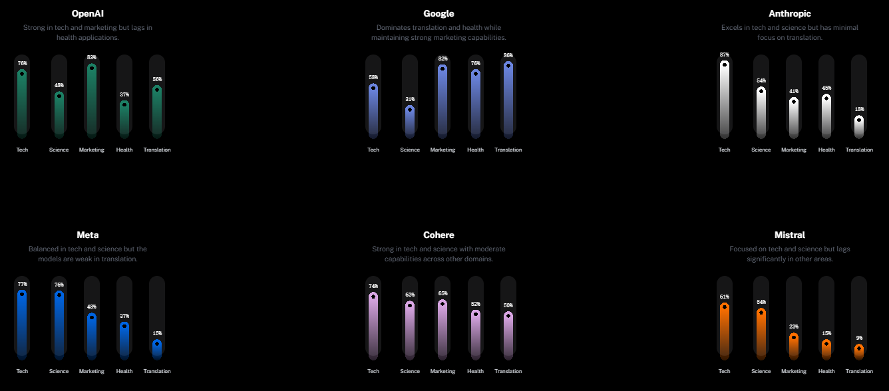
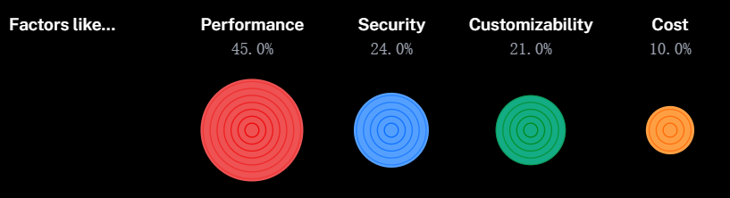
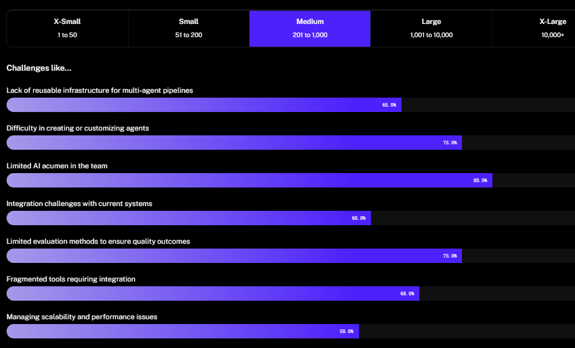
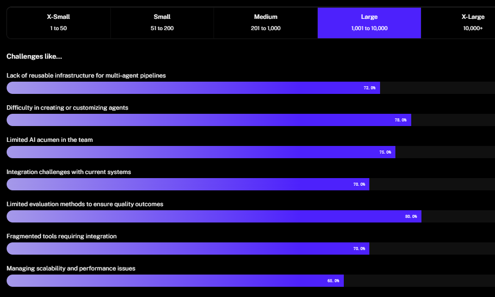
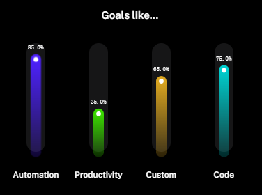
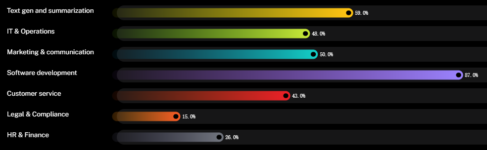
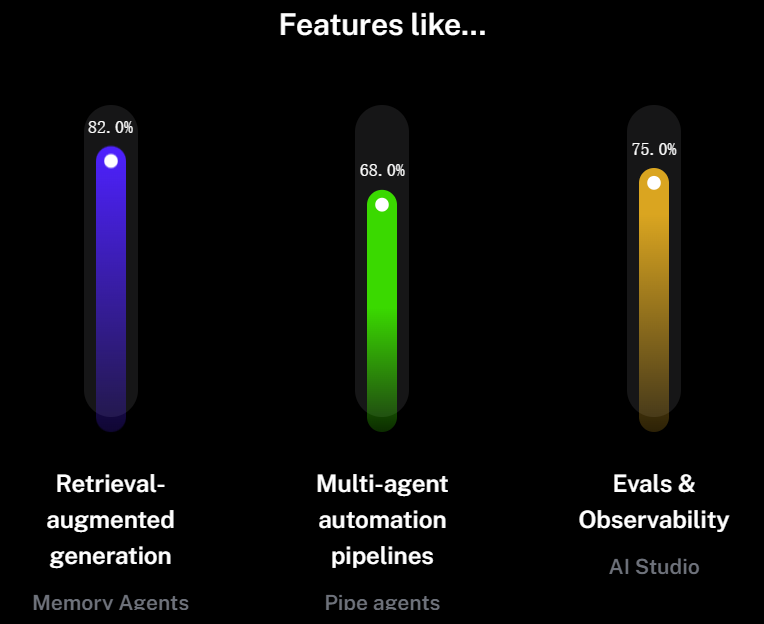
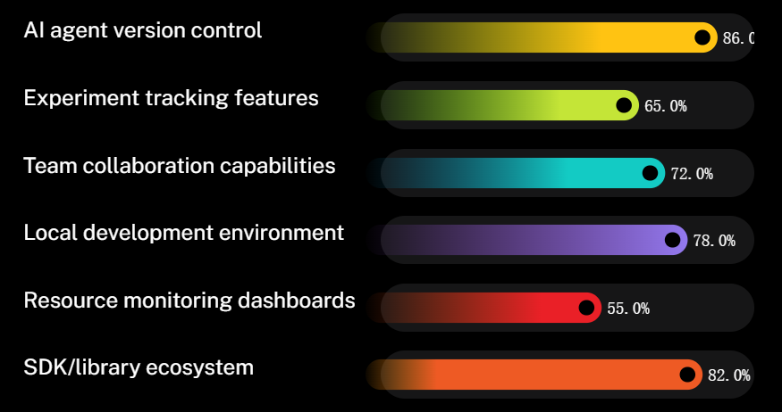
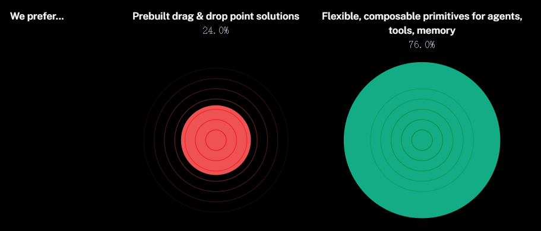

Langbase：关于AI Agents现状的研究报告

[TOC]

2024 年，AI Agents 成为热门概念，2025 年则有望成为其爆发元年。AI Agents 在企业场景中的应用日益广泛，但在落地过程中也面临着诸多挑战。本文将基于 Langbase 的研究报告，探讨 AI Agents 的发展现状，包括 LLM 提供商的选择、应用场景、落地制约因素以及所需的配套基建等方面。

# 1. 研究背景与参与者

Langbase 对来自 100 多个国家的 3400 多位专业人士进行了调查，涵盖 C 级高管（46%）、工程师（26%）、客户支持（17%）、市场营销（8%）、IT（3%）等多个职业领域。

# 2. LLM 提供商的选择

## 2.1 市场格局

OpenAI 是 2024 年领先的 AI/LLM 提供商，谷歌紧随其后，Anthropic 也备受青睐，Meta 的 Llama、Mistral 和 Cohere 虽市场份额较小但呈增长态势。

## 2.2 应用领域

OpenAI 在技术和市场营销应用方面领先，谷歌模型在健康和翻译领域占主导，Anthropic 在技术任务中受欢迎，Meta 广泛用于技术和科学应用，Cohere 在多个领域应用价值均衡。

## 2.3 影响LLM选择的因素

在选择大型语言模型 （LLM） 时，大多数受访者优先考虑准确性，其次是安全性和可定制性。成本是影响最小的因素。

# 3. 制约 AI Agents 落地的因素

- 生产挑战
  - 部署到生产环境面临定制化难、质量保证评估方法有限、缺乏可重用基础设施等问题，还包括碎片化工具、集成和可扩展性问题。

- 工作流程顾虑
  - 规模化和部署复杂性是首要问题，其次是数据隐私和安全合规性，缺乏监控工具和高基础设施成本也有阻碍，同时存在对 AI 驱动解决方案的抵制或怀疑。

# 4. AI Agents 在企业的应用场景

- 主要目标
  - 自动化和简化是企业采用 AI 的首要目标，同时定制解决方案和改善协作也备受关注。

- 具体场景
  - LLM 在软件开发中应用广泛（87%），在市场营销、IT 运营、文本摘要方面也有显著应用，客户服务、人力资源和法律等领域的应用兴趣也在增长。

# 5. AI Agents 所需的配套基建

- 关键基础设施功能
  - 多智能体检索增强生成（RAG）能力、评估工具和多智能体自动化管道是关键需求。

- 开发平台选择因素
  - 开发者重视 AI Agent 版本控制、SDK 或库生态系统和本地开发环境，团队协作和实验功能也较重要，资源监控仪表板相对次要。

# 6. 更喜欢哪些工具

在编排AI pipeline时，更喜欢哪些AI工具？

大多数受访者更喜欢提供灵活、基础基元来设计定制 AI 管道的开发工具。虽然预构建的单点解决方案解决了特定问题，但它们的可定制性较低，这表明 AI 工作流程设计对定制的需求很大。

# 7. 小结

AI Agents 在 2025 年具有巨大的发展潜力，但要实现广泛落地，还需要克服诸多挑战，包括技术优化、基础设施建设以及提高用户信任度等方面。

原文链接：https://langbase.com/state-of-ai-agents

