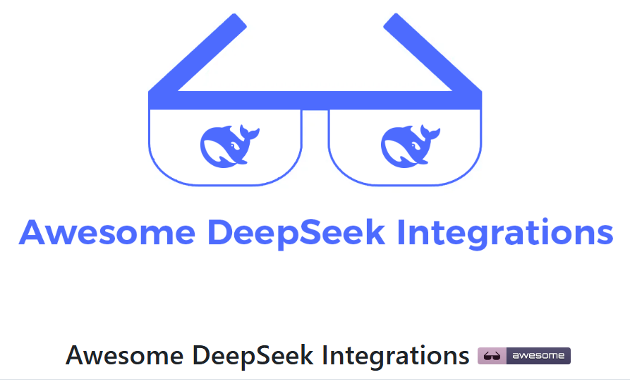
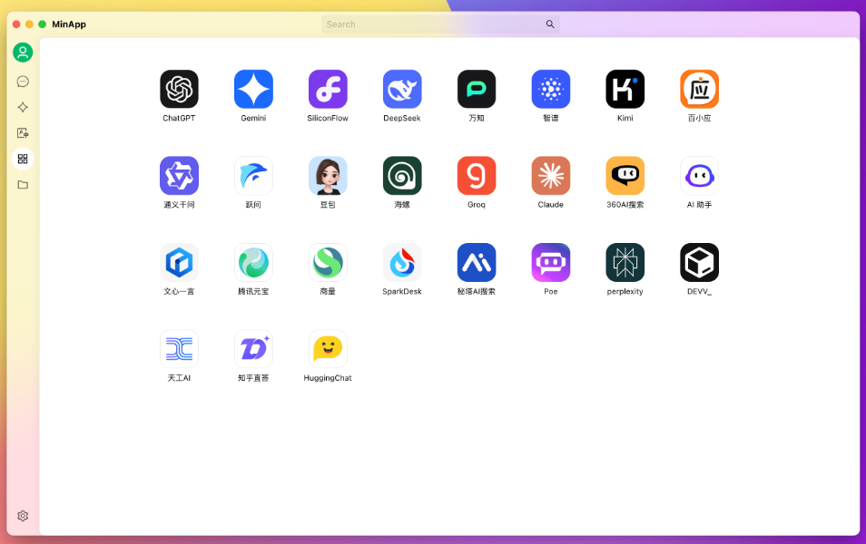
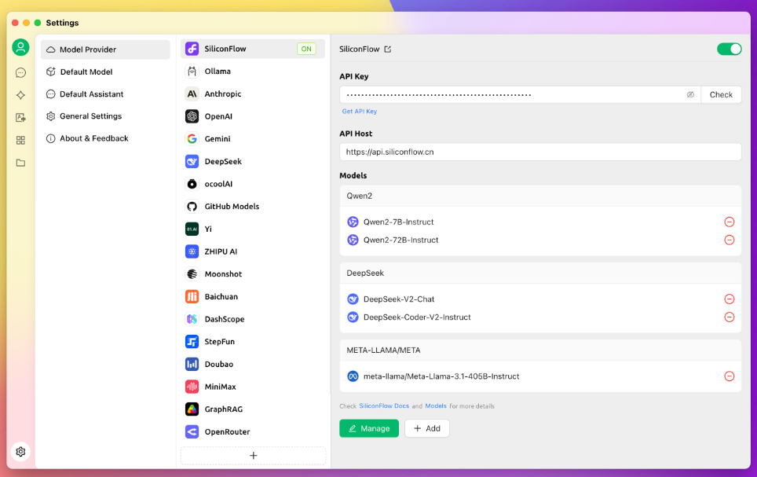

[TOC]

今天就带大家看看 GitHub 上基于 DeepSeek 的几个超热门开源项目，每一个都能狠狠提升生产力，赶紧码住！

# 1. 对话编程助手：DeepSeek Engineer

现在 AI 大模型这么火，开发者们的工作方式也跟着变了。写代码时，要是遇到代码补全、错误修复、文件重构这些难题，找 AI 帮忙已经是常规操作啦。今天要给大家介绍的 DeepSeek Engineer，更是把 AI 辅助编程玩出了新高度！

它能让咱在命令行里直接和 AI “唠嗑” 编程那些事儿，实现本地代码的智能修改。不管是刚入门的编程小白，还是经验丰富的大佬，用它都超合适。而且，这个工具集成了 DeepSeek 超厉害的 R1 推理模型，在修改代码的过程中，还能展示出 AI 分析和解决编程问题的思考过程，这对学习编程和优化代码都超有帮助！操作也方便，所有功能在命令行就能搞定，完全不用担心切换各种界面的麻烦。如果你也想试试 DeepSeek 推理模型的强大编码能力，提升编程效率，那这款工具必须安排上！

GitHub 地址：https://github.com/Doriandarko/deepseek-engineer

# 2. DeepSeek 实用工具大集合：Awesome DeepSeek Integration

DeepSeek 不仅模型厉害，还吸引了一大波开发者基于它开发各种实用工具。官方团队也很贴心，整理了一份超全的工具合集 ——Awesome DeepSeek Integration，涵盖了应用程序、AI Agent、浏览器插件、开发插件等好多类别，不管是日常办公还是专业开发，需要的工具这里基本都能找到。

桌面端有像 Cherry Studio、Chatbox 这些功能超全的 AI 助手；移动端有 Pal、ToMemo 等便捷应用；浏览器插件里，RSSFlow、ChatGPT Box 都很实用；翻译方面，macOS 系统可以用 Bob，Windows 系统有 STranslate，浏览器插件还有沉浸式翻译。

对开发者来说，VS Code 和 Neovim 的插件，以及 Continue、Cline 等工具，能在日常开发时帮上大忙。还有针对特定场景的工具，比如给视频翻译字幕的 Video Subtitle Master，辅助阅读论文的 PapersGPT 等等。不得不说，这份工具合集真的太全面了，赶紧去淘一淘，说不定就能发现宝藏工具！

GitHub 地址：https://github.com/deepseek-ai/awesome-deepseek-integration



# 3. 一站式管理 AI 助手：Cherry Studio

大家平时用 AI 的时候，是不是经常在 Claude、Gemini、DeepSeek 这些平台间来回切换？频繁切换不仅麻烦，还容易打断思路。别担心，Cherry Studio 来拯救大家啦！



这是一款超强大的 AI 助手管理工具，就像是给各种 AI “英雄” 们建了一个温馨的家。它内置了 300 多个预配置的 AI 智能体，从学习辅导到编程开发，各个领域都能覆盖。要是这些还不够，咱还能根据自己的需求，轻松创建专属的 AI 助手。它支持同时打开多个大模型对话窗口，在同一个界面里，就能用不同的大模型高效完成工作任务。



在文档处理方面，Cherry Studio 也很出色，txt、png、docs、pdf 等各种格式的文件都能导入，还提供云端备份功能，再也不用担心文件丢失啦。另外，全局搜索、话题管理、AI 翻译这些实用功能它都有，还有明暗主题切换、代码高亮这些贴心设计。而且，不管你用的是 Windows、macOS 还是 Linux 系统，都能直接下载开箱即用的安装包，不用复杂配置就能轻松上手。找一款省心好用的 AI 助手管理工具，选它准没错！

GitHub 地址：https://github.com/kangfenmao/cherry-studio

```
笔者能力有限，欢迎批评指正或者在留言区讨论。
```