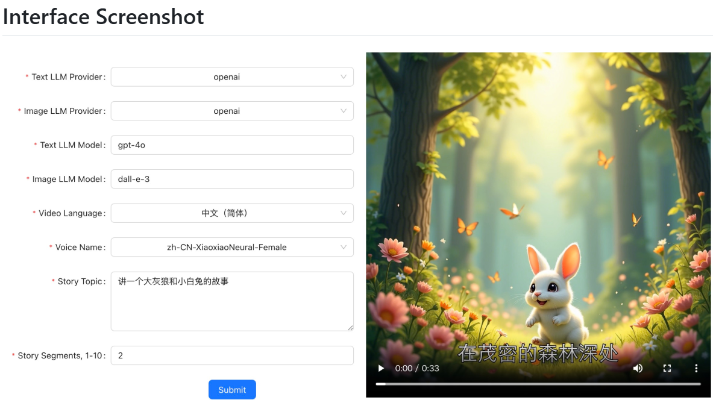
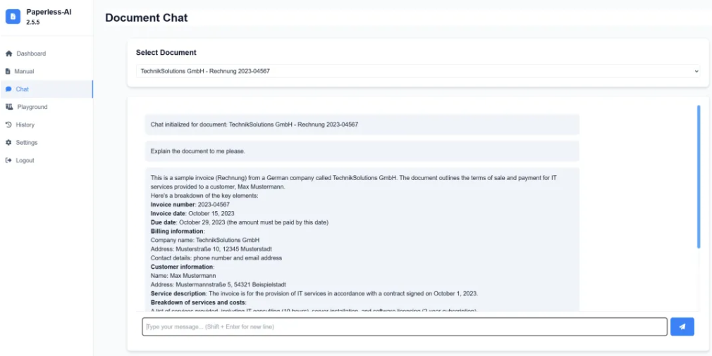
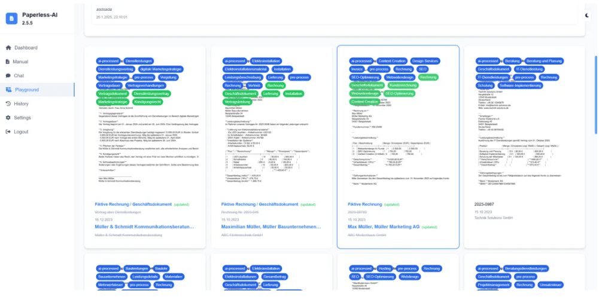

[TOC]

DeepSeek 掀起的科技热潮那是一浪高过一浪，各大巨头在 AI 赛道上杀得难解难分。全球开发者的创意在 GitHub 上疯狂迸发，好多基于 DeepSeek 的宝藏工具涌现出来，直接把 AI 能力融入到咱们日常工作里。今天我就给大家分享几个 GitHub 上超火的开源项目，主打一个简单好上手，效率直接拉满！

# 1. DeepSeek 网页助手：浏览器的 “超级外挂”

```
github: https://github.com/browser-use/browser-use
```

咱平时工作，是不是经常在网页上做一些重复又繁琐的事儿？像填表单、商品比价、查看运营数据，虽说不难，可特别费时间。给大家安利一款最近超火的开源工具 ——Browser - use。它就像是给 AI 安了双灵活的手，能直接操控浏览器，不管多复杂的网页自动化操作都不在话下！


它的厉害之处在于，不需要你是技术大神，只要把任务简单描述一下，它就能自动执行。不管是对比不同模型的价格、在线购物自动结账，还是根据简历自动投合适的职位，这些复杂任务都能轻松搞定。而且部署超简单，几步就能搞定，还支持 DeepSeek R1、OpenAI 等多种大模型。要是你想从重复劳动里解脱出来，让 AI 帮你搞定繁琐的网页操作，这款工具必须试试！

# 2. DeepSeek 赚钱利器：故事视频一键生成器

```
github: https://github.com/alecm20/story-flicks
```

当下短视频火得一塌糊涂，儿童故事类视频更是热门中的热门，动不动就几十万、上百万的播放量，哪个自媒体人看了不心动？今天给大家介绍一个堪称 “赚钱神器” 的开源项目 ——Story - Flicks。它借助 DeepSeek 等 AI 模型的强大能力，把故事视频创作的门槛降到了谷底。



只要输入故事主题，短短几分钟，就能生成一个包含精美图片、连贯内容和专业配音的完整故事视频，内容产出效率直接起飞！它还有语言和声音定制功能，可以根据不同需求选择视频语言和声音风格，而且生成后能直接在页面实时预览效果，都不用额外的播放器，操作简单到飞起。有了它，打造儿童内容账号积累粉丝，或者结合热点快速制作应景故事抢占流量，都变得轻轻松松！

# 3. DeepSeek 文档助手：文档管理的智能管家

```
github: https://github.com/clusterzx/paperless-ai
```

工作里的文档越来越多，整理、分类、检索这些事儿简直让人头秃，大把时间浪费在找文件和组织文件上，又单调又耗时。别愁啦，今天给大家分享的开源工具 Paperless - AI，给 Paperless - ngx 开源文档管理系统注入了 AI 的强大力量。



它就像给文档管理系统请了个不知疲倦的智能助手，能自动扫描新文件、提取关键信息、分配标签、识别文档类型，甚至还能自动归类到对应的人或组织。



更绝的是，它还有个简单好用的聊天功能，有关于文档的问题，直接问 AI，马上就能得到答案，再也不用一页页翻文件了。它还支持 OpenAI、DeepSeek、Ollama 等多种主流大模型，通过 Docker 一键就能部署，配置简单，上手超容易。要是你正被大量文档管理折磨，或者想要一个更智能高效的文件组织系统，这款结合多种 AI 能力的文档助手可别错过！

```
笔者能力有限欢迎批评指正或者在留言区讨论。
```


