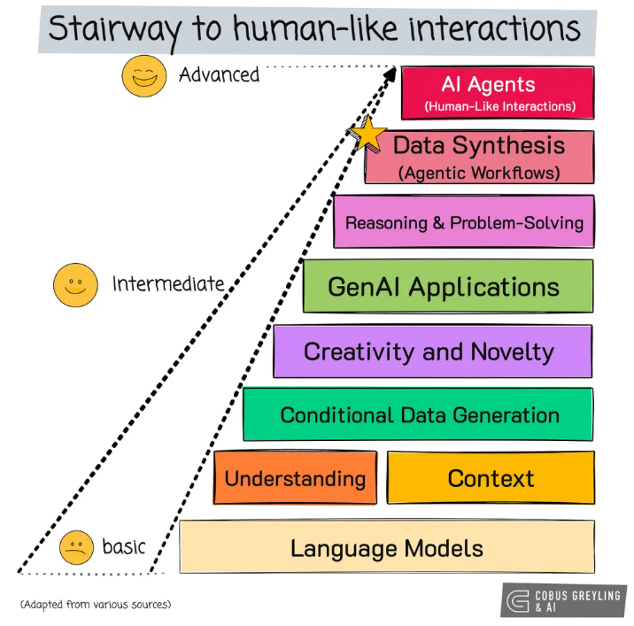
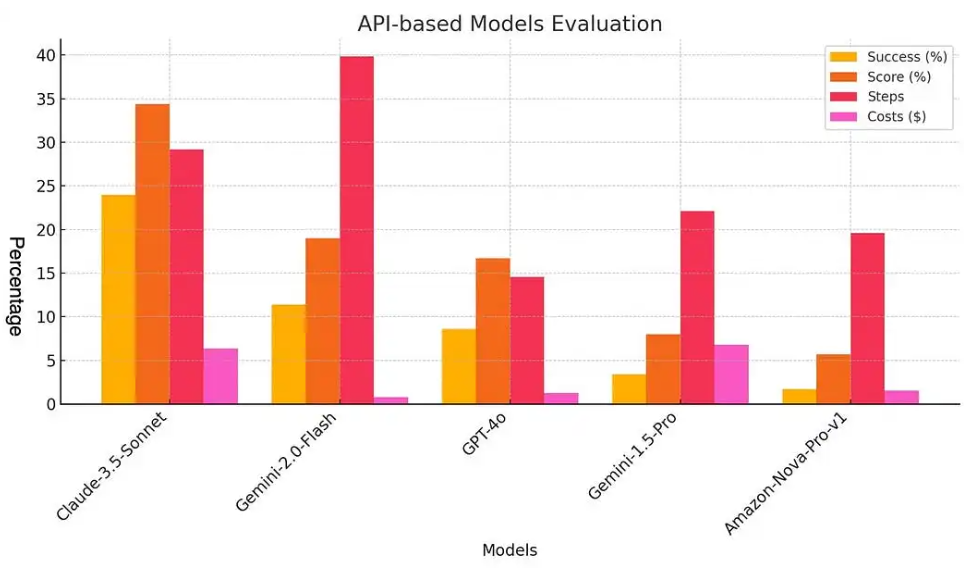
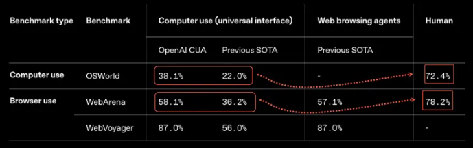
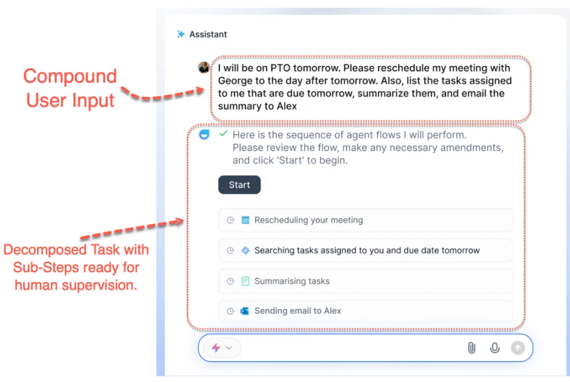

[TOC]

# 1. AI 技术转折点：焦点悄然转移

当下的科技发展速度简直像坐火箭！从大型语言模型（LLM）横空出世，到能和人类进行数字互动的 AI Agent 闪亮登场，每一次变革都震撼世界。不过最近，在 AI 商业化应用的战场上，大家的目光正从 AI Agent 慢慢转向 Agentic Workflow 和数据合成。这背后到底藏着什么秘密呢？今天咱就来好好唠一唠。

# 2. AI Agent 遇冷？背后原因很现实

曾经，Salesforce 和 Service 这些大公司对 AI Agent 寄予厚望，各种营销宣传铺天盖地，展示出的 AI Agent 原型那叫一个酷炫，仿佛未来已来。可理想很丰满，现实却有点 “打脸”。

实际用起来就会发现，AI Agent 的技术准确性根本没达到大家预期。就拿 Claude AI Agent Computer Interface（ACI）来说，它的性能和人类相比，竟然只有 14%，这差距不是一星半点。TheAgentFactory 的数据也很 “扎心”，AI Agent 的成功率仅有 20% 左右，成本高、步骤繁琐，表现实在差强人意。

即便 OpenAI Operator 发布后，计算机和网页浏览的准确率有所提升，能达到 30% - 50%，但和人类 70% 以上的准确率相比，还是远远不够。而且，具备网页浏览功能的 AI Agent 还特别 “脆弱”，容易遭受恶意弹窗攻击，安全性让人担忧。

另外，AI Agent 执行任务主要靠网页浏览器（像 Webvoyager、OpenAI Operator）或者操作系统的完整 GUI（比如 Anthropic），把 GUI 当成 API 来用。

但最初想用单独 API 的想法根本不现实，开发成本高，很多商业场景还找不到现成能用的 API，这就像给 AI Agent 的发展套上了重重枷锁。所以，AI Agent 热度下降也是无奈之举。

# 3. Agentic Workflow 崛起，凭什么？

现代知识工作里，难题可不少。有报告显示，员工们居然要花 30% 的时间在搜索信息上，知识工作者解答复杂问题时，还得在一堆文档里 “大海捞针”，整合信息，效率低不说，还特别费精力。

这个时候，Agentic Workflow 闪亮登场啦！它就像个智能小助手，能把复杂任务拆分成一个个简单的子任务，再按顺序一步步执行。比如你说 “我明天要休假，请把我和乔治的会议改到后天，再列出我明天到期的任务，总结一下发给亚历克斯”，它马上就能规划出 “重新安排会议 - 搜索明天到期任务 - 总结任务 - 给亚历克斯发邮件” 这样清晰的流程。而且在执行过程中，可观察性、可检查性和可发现性都安排得明明白白，有啥问题一眼就能看到。

在这个过程中，数据合成的重要性也凸显出来。

Agentic Workflow 能把工作数据和资源整合到一起，帮工作者快速找到答案。就拿 ChatGPT 的 Deep Research 来说，它不是新模型，却有着超厉害的新型 Agentic 能力，能进行多步互联网研究，解决复杂问题。以前人类得花好几个小时完成的任务，它十几分钟就能搞定，完美诠释了什么叫高效的数据合成应用。还有 LlamaIndex 提出的 Agentic RAG 概念，核心就是把数据合成后精准提供给特定人群，满足大家的需求。

未来，个人 Agentic Workflow 和信息合成会越来越火，就像在桌面上进行智能编排一样，大大提高工作效率。

# 4. 推理能力：AI 解决问题的 “新武器”

现在的 AI 模型越来越聪明啦，把推理能力当成了核心技能之一。为啥呢？因为通过推理，模型可以把复杂问题拆分成一个个好处理的小部分，然后像人类思考一样，系统地解决问题。这就好比把一个大难题拆成了许多小零件，逐个击破。

这种创新的方法不仅让模型解决问题的速度更快了，而且得出结论的过程也更透明。以前，模型给出的答案就像 “黑匣子”，让人摸不着头脑，现在有了推理过程，用户能清楚看到模型是怎么一步步得出结论的，结果更让人信服。一开始，用户需要在给模型的提示里加上推理要求，再给它展示几次示例，慢慢地，模型就能学会这种方法，变得越来越智能。

# 5. 别追潮流，解决问题才是王道

在这个科技飞速发展的时代，新技术层出不穷，每天都有号称能颠覆行业的新玩意儿冒出来。很多企业都被这些潮流牵着走，一会儿追捧这个工具，一会儿痴迷那个趋势，像之前有些自称是 RAG 公司、Prompt Engineering 实验场的，最后却没取得什么实质性成果。

创新可不是看谁掌握了最新技术，而是要看能不能用这些技术创造出实实在在的价值。不管是提升客户体验、优化运营流程，还是解决社会上的各种需求，关键都在于学会利用技术，给出真正有用的解决方案。只有把目光聚焦在解决现实商业挑战上，企业才能在这波科技浪潮中站稳脚跟，不被淘汰。
