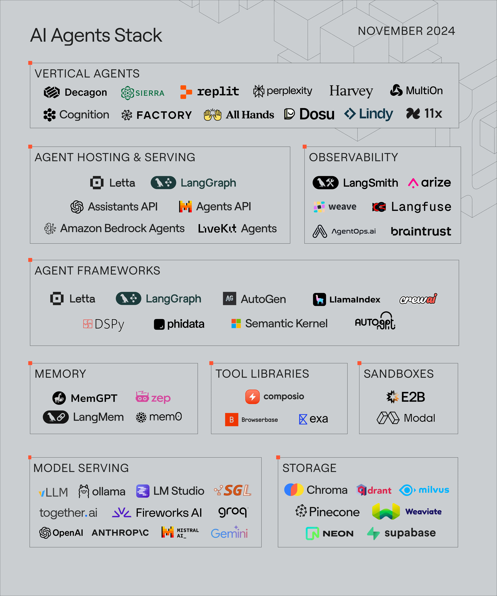

```
原文链接：https://www.letta.com/blog/ai-agents-stack
```

[TOC]

在人工智能领域持续演进的当下，AI 智能体技术栈正逐渐崭露头角。虽然市面上有不少关于智能体技术栈和市场的分析，但我们发现这些分类往往与开发者的实际使用情况存在偏差。过去几个月里，智能体软件生态系统在内存管理、工具使用、安全执行和部署等方面都取得了显著进展。基于我们在开源人工智能领域一年多的实践经验，以及 7 年以上的人工智能研究经历，今天就来和大家分享我们所理解的 “AI 智能体技术栈”。

# 1. AI Agent技术栈全景

AI Agent技术栈大致可以分为三个关键层级，分别是智能体托管与服务、智能体框架，以及大语言模型（LLM）与存储。接下来，让我们深入剖析每个层级的具体内容。



## 1.1 模型服务

大语言模型是 AI 智能体的核心所在。要使用这些模型，就需要通过推理引擎来提供服务，多数情况下，推理引擎是在付费 API 服务背后运行的。在基于封闭 API 的模型推理服务提供商中，OpenAI 和 Anthropic 凭借前沿的私有模型占据领先地位。而 Together.AI、Fireworks 和 Groq 则是热门选择，它们通过付费 API 提供开源权重模型（如 Llama 3）的服务。在本地模型推理领域，vLLM 在基于 GPU 的生产级服务负载方面表现出色，SGLang 作为新兴项目，也受到了不少开发者的关注。对于人工智能爱好者来说，Ollama 和 LM Studio 则是在个人电脑（如 M 系列苹果笔记本电脑）上运行模型的热门之选。


## 1.2 存储

存储对于有状态的智能体至关重要，因为智能体的会话历史、记忆以及用于检索增强生成（RAG）的外部数据源等持久化状态，都依赖于存储。像 Chroma、Weaviate、Pinecone、Qdrant 和 Milvus 等向量数据库，常用于存储智能体的 “外部记忆”，这样智能体就能够利用那些超出上下文窗口容量的庞大数据源和会话历史。自上世纪 80 年代就存在的传统数据库 Postgres，如今通过 pgvector 扩展也支持了向量搜索。基于 Postgres 的 Neon（serverless  Postgres）和 Supabase 等公司，还为智能体提供了基于嵌入的搜索和存储服务。


## 1.3 工具与库

AI 智能体与普通 AI 聊天机器人的主要区别之一，就在于智能体能够调用 “工具”（或 “函数”）。多数情况下，这一操作的实现机制是大语言模型生成结构化输出（例如 JSON 对象），其中会指定要调用的函数以及提供的参数。这里有个常见的误解，工具的执行并非由大语言模型提供商完成，大语言模型只是选择调用什么工具以及提供什么参数。支持任意工具或参数的智能体服务，必须借助沙箱（如 Modal、E2B）来确保安全执行。所有智能体都通过 OpenAI 定义的 JSON 模式来调用工具，这意味着不同框架的智能体和工具实际上是兼容的。Composio 是一个广受欢迎的通用工具库，还具备授权管理功能。Browserbase 是专门用于网页浏览的工具，Exa 则提供了网页搜索的专业工具。随着更多智能体的开发，我们预计工具生态系统将不断壮大，并为智能体提供诸如身份验证和访问控制等新功能。


## 1.4 智能体框架


智能体框架负责协调大语言模型的调用并管理智能体的状态。不同框架在以下方面各有不同的设计：

- **智能体状态管理**：大多数框架引入了 “状态序列化” 的概念，通过将序列化后的状态（如 JSON、字节）保存到文件中，智能体可以在后续重新加载到同一脚本中，这些状态包括会话历史、智能体记忆以及执行阶段等。在 Letta 中，所有状态都由数据库（如消息表、智能体状态表、内存块表）支持，因此不存在 “序列化” 的概念，因为智能体状态始终是持久化的，这使得查询智能体状态变得非常容易（例如，按日期查找过去的消息）。状态的表示和管理方式，不仅决定了智能体应用在处理更长会话历史或更多智能体时的扩展能力，还影响着随着时间推移，状态访问和修改的灵活性。
- **智能体上下文窗口结构**：每次调用大语言模型时，框架都会将智能体的状态 “编译” 到上下文窗口中。不同框架向上下文窗口中放置数据（如指令、消息缓冲区等）的方式各不相同，这会对性能产生影响。我们建议选择上下文窗口透明的框架，因为这最终决定了你对智能体行为的控制方式。
- **跨智能体通信（即多智能体）**：Llama Index 通过消息队列实现智能体之间的通信，而 CrewAI 和 AutoGen 则有专门的多智能体抽象器。Letta 和 LangGraph 都支持智能体直接相互调用，这既可以实现集中式（通过主管智能体）通信，也能实现分布式通信。如今，大多数框架都同时支持多智能体和单智能体，因为设计良好的单智能体系统应便于实现跨智能体协作。
- **内存管理方法**：大语言模型的一个基本限制是其有限的上下文窗口，这就需要采用一些技术来管理内存。有些框架内置了内存管理功能，而有些则需要开发者自行管理。CrewAI 和 AutoGen 仅依赖基于 RAG 的内存管理，而 phidata 和 Letta 则采用了诸如自编辑内存（源自 MemGPT）和递归总结等额外技术。Letta 智能体自带一套内存管理工具，支持智能体通过文本或数据搜索之前的消息、写入记忆以及编辑自身的上下文窗口。
- **对开源模型的支持**：模型提供商通常会采用一些幕后技巧，让大语言模型生成正确格式的文本（例如用于工具调用），比如在模型输出的工具参数不规范时重新采样，或者在提示中添加暗示（例如 “请输出 JSON 格式”）。支持开源模型要求框架能够应对这些挑战，因此部分框架对开源模型的支持有所限制，仅支持主要的模型提供商。在构建智能体时，选择合适的框架取决于你的应用需求，例如你是要构建对话式智能体还是工作流，是希望在笔记本环境中运行智能体还是将其作为服务部署，以及你对开源权重模型支持的需求等。

## 1.5 智能体托管与服务

目前，大多数智能体框架所构建的智能体，仅存在于编写它们的 Python 脚本或 Jupyter 笔记本中。但我们认为，智能体的未来发展方向是将其作为一种服务，部署到本地或云基础设施上，并通过 REST API 进行访问。就像 OpenAI 的 ChatCompletion API 成为与大语言模型服务交互的行业标准一样，我们预计未来也会出现占据主导地位的智能体 API，只是目前尚未有定论。将智能体作为服务进行部署，比部署大语言模型服务要复杂得多，这主要是因为存在状态管理和安全工具执行等问题。工具及其所需的依赖项和运行环境，都需要明确存储在数据库中，因为服务需要重新创建运行它们的环境（而当工具和智能体在同一脚本中运行时，就不存在这个问题）。应用程序可能需要运行数百万个智能体，每个智能体的会话历史还会不断增长。从原型开发到生产部署的过程中，智能体状态不可避免地要经过数据规范化处理，并且智能体之间的交互必须通过 REST API 来定义。目前，这一过程通常由开发者编写自己的 FastAPI 和数据库代码来完成，但随着智能体技术的成熟，我们预计这一功能将更多地集成到框架中。


# 2. 小结

AI 智能体技术栈目前仍处于发展的初期阶段，但它的发展潜力巨大。随着时间的推移，我们期待看到这个生态系统不断拓展和演变。