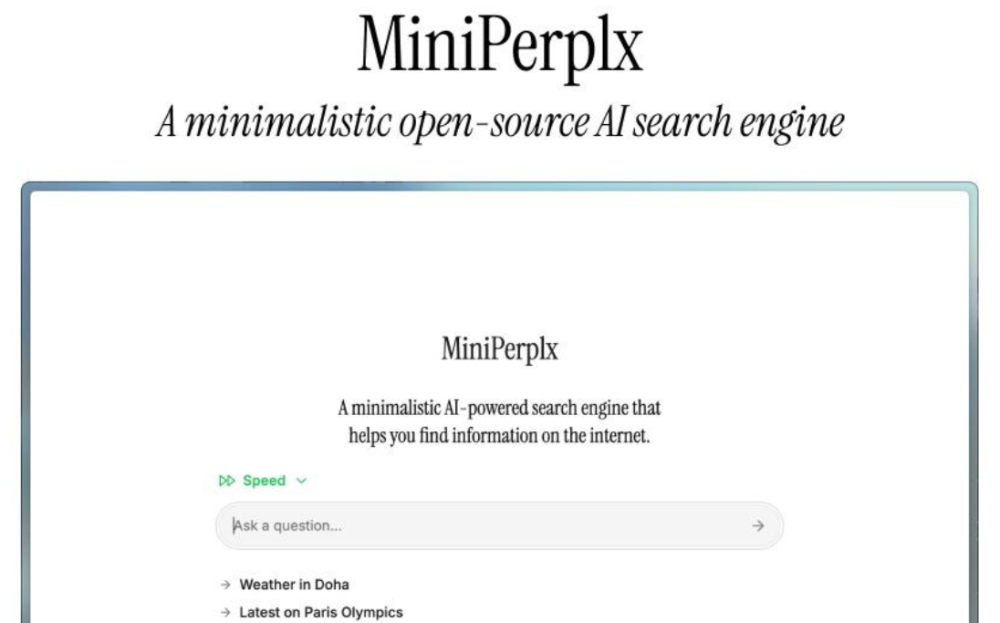

[TOC]

# 1. MiniPerplx 概述

MiniPerplx 是一款极简的人工智能搜索引擎，它由 Vercel AI SDK 提供支持，可帮助用户在互联网上查找各类信息。该项目在 GitHub 上开源，已获得 400 多个 star。

目前可用的一些tool：web_search、programming 、find_place、x_search、get_weather_data、tmdb_search等。

```
官网：https://mplx.run/
github：https://github.com/zaidmukaddam/miniperplx
```



# 2. 功能特点

## 2.1 智能搜索规划与精准结果呈现

MiniPerplx 引入了 Agent 大脑，能够根据用户的 Query 进行智能规划（Plan），再调用相应的 Tool 进行搜索。这一机制使得搜索过程更加精准和高效，与传统搜索引擎相比，它不仅仅是简单地匹配关键词，而是能够更好地理解用户的搜索意图，从而提供更符合需求的搜索结果。例如，在查询复杂问题或需要多步骤检索信息时，MiniPerplx 能够有条不紊地规划搜索策略，而其他搜索引擎可能只能返回较为宽泛或不够精准的结果。

## 2.2 丰富的搜索类型

- **学术与多媒体资源搜索优势**：它提供了广泛的搜索类型，涵盖学术论文搜索、YouTube 视频搜索、电影和电视节目搜索等。在学术领域，研究者可以更方便地获取专业文献；对于普通用户，能够轻松找到各类多媒体资源，如视频和影视节目相关信息，这是许多传统搜索引擎在深度和广度上所不及的。传统搜索引擎可能在学术资源整合或多媒体内容检索的精准度上存在不足，而 MiniPerplx 专门针对这些领域进行了优化。
- **产品与社交平台搜索拓展**：还支持产品搜索（如在亚马逊上搜索产品）和 X 帖子搜索，进一步拓展了用户获取信息的渠道。这意味着用户在购物决策或了解社交动态等方面可以直接使用 MiniPerplx 获取更直接、更有针对性的信息，而其他搜索引擎可能需要用户在多个平台间切换查找，增加了搜索成本。
- **网页搜索**：运用 Tavily 的 API 在网络上进行广泛搜索，为用户提供丰富的网页信息。
- **学术论文搜索**：方便学术研究者查找相关的学术文献，助力学术研究。
- **YouTube 视频搜索**：用户可以通过它快速找到 YouTube 上的视频资源，并获取视频的时间戳和成绩单。
- **电影和电视节目搜索**：不仅能搜索热门电影和电视节目，还能获取特定电影或电视节目的详细信息。

## 2.3 强大的集成功能

- **代码处理能力突出**：集成了 E2B 代码解释器，可执行代码并返回结果，能够处理诸如数学计算、代码生成等需要计算或代码执行的任务。这使得 MiniPerplx 在面对一些需要实时计算或编程辅助的搜索需求时表现卓越，例如解决复杂数学问题、编写代码片段等。相比之下，大多数传统搜索引擎缺乏这样的代码执行功能，无法满足此类用户需求。
- **多语言编程支持便捷**：支持在多种语言中运行代码片段，方便不同编程背景的用户使用。无论是专业程序员还是编程初学者，在需要搜索与编程相关的信息或进行代码验证时，MiniPerplx 都能提供有力支持，而其他搜索引擎往往不具备这样的编程环境集成能力。

## 2.4 多样化的信息获取

MiniPerplx 为用户提供了一站式的信息获取服务。用户无需在多个应用或网站间切换，即可在搜索过程中获取多方面的辅助信息，这在日常查询、出行规划和跨语言交流等场景中极大地提升了搜索效率，而其他搜索引擎通常需要用户分别打开不同的平台来获取这些信息。

- **特定 URL 搜索**：可以从特定 URL 获取信息，满足用户对特定来源信息的需求。
- **天气查询**：借助 OpenWeather 的 API，获取任何位置的当前天气信息，方便用户出行规划。
- **地图服务**：通过 Google 地图 API、Mapbox API 和 TripAdvisor API，帮助用户获取任何地方的位置信息。
- **翻译功能**：利用 Microsoft 的翻译 API，将文本翻译成不同语言，打破语言障碍。
- **产品搜索**：能够在亚马逊上搜索产品，为购物提供便利。
- **X 帖子搜索**：可搜索[X.com](https://x.com/)上的帖子，拓展信息获取渠道。
- **航班追踪**：使用 AviationStack 的 API 追踪航班，方便旅客随时掌握航班动态。

# 3. 技术支持与模型应用

MiniPerplx 使用 Anthropic 的模型获取问题答案，同时支持多种大型语言模型（LLM），如 GPT - 4 等，用户可根据需求选择不同模型进行搜索和代码执行。

# 4. 与其他搜索引擎的区别

许多传统搜索引擎主要侧重于文本数据的信息提取，而 MiniPerplx 不仅具备这些功能，还结合了网络搜索和代码解释器，能够处理需要代码执行的任务，从而解决更广泛的问题，为用户提供更全面、强大的搜索服务。

# 5. 小结

总之，MiniPerplx 作为一款开源的人工智能搜索引擎，以其智能规划、丰富功能、强大集成能力和多模型支持等特点，在众多搜索引擎中脱颖而出。无论是普通用户查找日常信息，还是专业人士进行学术研究、编程开发等工作，MiniPerplx 都可能成为一个有力的助手，为用户带来更高效、便捷的搜索体验。