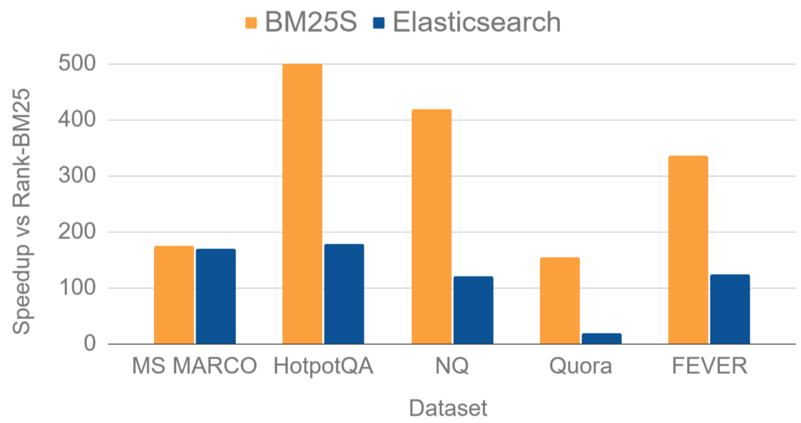
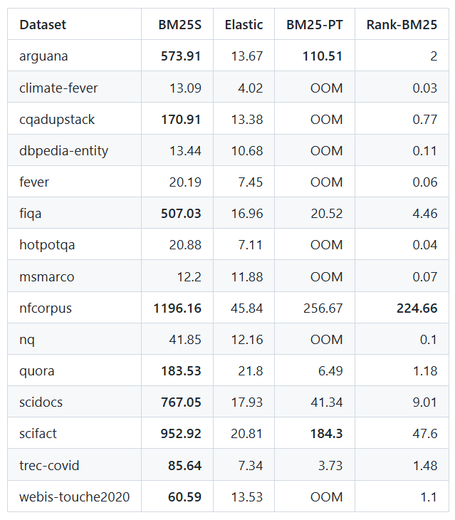

```
github：https://github.com/xhluca/bm25s
```

[TOC]

在信息如潮水般涌来的今天，从海量文本里精准、快速地捞出自己想要的内容，变得越来越重要。就像在一座巨大的图书馆里找特定的一本书，要是没有高效的检索工具，那可太让人头疼了。今天就给大家分享一款超厉害的文本检索库 ——BM25S，它就像是图书馆里的智能导航，能帮你轻松找到目标 “书籍”。

# 1. BM25S 诞生记：解决痛点，横空出世

大家都知道 BM25 算法，它在信息检索领域可是响当当的角色。但随着数据规模越来越大，传统 BM25 算法就像小马拉大车，逐渐有些力不从心，速度慢、内存消耗大这些问题越来越突出。

BM25S 就是为了解决这些痛点诞生的，它是由研究者 Xing Han Lù 开发的，基于 Python 和 SciPy 稀疏矩阵实现。简单来说，它站在传统 BM25 算法的肩膀上，利用现代技术对其进行了全面升级，目标就是要在保证检索准确性的同时，大幅提升速度和内存使用效率。

# 2. 核心特性大揭秘：速度、内存、灵活度都拉满

## 2.1 速度之王：快到超乎想象

BM25S 的速度优势简直逆天！它通过预先计算并存储文档得分，查询时直接从 “得分仓库” 里取数据，速度快到飞起。和其他流行的 Python 实现相比，它的查询响应速度能提升高达 500 倍。

## 2.2 内存 “小能手”：低占用超省心

处理大规模数据集时，内存很容易不够用。BM25S 采用内存映射技术，把索引存储在磁盘上，需要的时候再加载，就像把不常用的东西放在仓库，要用了再去取，这样大大降低了内存占用，在处理大数据集时优势明显，完全不用担心内存被占满而导致程序崩溃。

## 2.3 纯 Python 打造：简单易用零门槛

对于咱们 Python 开发者来说，BM25S 简直太友好了。它完全用 Python 实现，只依赖 NumPy 和 SciPy 这两个常用库，安装和使用都非常简单，不需要复杂的环境配置。就算是新手小白，也能在几分钟内上手，轻松开启文本检索的探索之旅。

## 2.4 灵活百变：满足各种需求

每个人的检索需求都不太一样，BM25S 深谙这一点，它支持多种 BM25 变体算法，像原始 BM25、BM25L、BM25 + 等。不管你是做学术研究，还是开发商业应用，都能找到最适合自己的 “配方”，定制出最符合需求的检索功能。

## 2.5 与 Hugging Face 梦幻联动：资源共享超方便

Hugging Face 是机器学习领域的 “宝藏库”，BM25S 和它无缝集成，这可太棒了！用户可以轻松分享和使用预训练的 BM25 索引，就像在一个巨大的知识共享平台上，大家可以互相借鉴、共同进步，极大地提高了开发效率。

# 3. 工作原理深度剖析：提前准备，快速响应

BM25S 的核心创新点是 “急切稀疏评分”，听起来有点复杂，其实原理很巧妙。它就像一个勤劳的小蜜蜂，在索引构建阶段，把所有可能的得分都计算好，存放在稀疏矩阵里。虽然这样会让索引变大一点，但查询时就轻松多了，直接从矩阵里提取得分，不用再临时计算。

具体工作流程是这样的：先对输入的文档集合进行预处理，分词、去停用词，把文档整理得干干净净；接着构建索引，计算每个词在每个文档中的 BM25 得分，存到稀疏矩阵；查询时，直接从预计算的矩阵里提取得分；最后根据得分给文档排序，把最相关的结果呈现给用户。这种把计算工作提前做的方式，就像提前把食材准备好，做饭时就能快速出锅，大大提高了在线查询的速度。

# 4. 上手体验：简单几步，开启高效检索

使用 BM25S 非常简单，几步就能搞定。先安装，在命令行输入`pip install bm25s`就行，如果想要词干提取功能，可以安装额外依赖`pip install bm25s[full]` 。

安装好后，就可以用下面的代码体验一把快速检索的快乐：

```python
import bm25s
import Stemmer # optional: for stemming

# 创建文档集合
corpus = [
    "a cat is a feline and likes to purr",
    "a dog is the human's best friend and loves to play",
    "a bird is a beautiful animal that can fly",
    "a fish is a creature that lives in water and swims",
]

# 可选：创建词干提取器
stemmer = Stemmer.Stemmer("english")
# 对文档集合进行分词并获取token id
corpus_tokens = bm25s.tokenize(corpus, stopwords="en", stemmer=stemmer)

# 创建BM25模型并索引文档
retriever = bm25s.BM25()
retriever.index(corpus_tokens)

# 查询文档
query = "does the fish purr like a cat?"
query_tokens = bm25s.tokenize(query, stemmer=stemmer)

# 获取前k个结果
results, scores = retriever.retrieve(query_tokens, k=2)
for i in range(results.shape[1]):
    doc, score = results[0, i], scores[0, i]
    print(f"Rank {i + 1} (score: {score:.2f}): {doc}")

# 保存模型和文档集合
retriever.save("animal_index_bm25", corpus=corpus)
# 后续需要时加载模型
reloaded_retriever = bm25s.BM25.load("animal_index_bm25", load_corpus=True)
```

这段代码展示了从创建文档集合、索引构建到查询、保存和加载模型的完整过程，是不是很简单？而且 BM25S 还提供了很多高级功能，比如自定义分词、选择不同的 BM25 变体算法、内存映射等，满足各种复杂场景的需求。

# 5. 性能实测：碾压对手，实力超群

研究者对 BM25S 进行了一系列严格的基准测试，和其他流行的 BM25 实现（像 ElasticSearch、rank - bm25 等）对比。测试用的是 BEIR 项目的多个数据集，在单线程 Intel Xeon CPU @ 2.70GHz 环境下测量每秒查询次数（QPS）。



结果简直惊艳！在绝大多数数据集上，BM25S 都把对手远远甩在身后。比如在 msmarco 数据集上，BM25S 的 QPS 达到 12.20，而最接近的 ElasticSearch 只有 11.88，传统的 rank - bm25 更是只有 0.07。在其他数据集上，BM25S 同样表现出色，很多场景下 QPS 都远超其他选手，而且在处理大规模数据集时，优势更加明显。



# 6. 应用场景

## 6.1 大规模文本检索：轻松应对海量数据

对于包含数百万甚至数十亿文档的大型语料库，BM25S 的高性能和低内存占用优势就凸显出来了。它能在海量文本中快速定位，精准找到相关信息，就像在茫茫大海里捞针，别人还在发愁，它已经把 “针” 捞出来了。

## 6.2 实时搜索系统：瞬间响应不卡顿

在需要快速响应的实时搜索系统中，时间就是用户体验。BM25S 极低的查询延迟，能让用户在输入查询词的瞬间就得到结果，大大提升了用户满意度，无论是电商搜索，还是新闻搜索，都能完美适配。

## 6.3 资源受限环境：小身材有大能量

在内存或计算资源有限的环境中，很多检索工具都施展不开，BM25S 却能游刃有余。它的低资源消耗特性，让它在嵌入式设备、移动设备等场景中也能发挥重要作用，为用户提供高效的检索服务。

## 6.4 学术研究：科研人的得力助手

对于需要进行大规模文本检索实验的研究人员来说，BM25S 就是一个宝藏工具。它简单易用、功能强大，还能和其他研究工具配合使用，帮助科研人员快速筛选和分析数据，加速科研进程。

## 6.5 作为神经检索的基线：对比评估好帮手

在评估更复杂的神经网络检索模型时，需要一个可靠的基线系统。BM25S 凭借其出色的性能和稳定性，成为了理想之选，为研究人员评估新模型提供了重要参考。

# 7. 未来展望：持续进化，未来可期

虽然 BM25S 现在已经很厉害了，但开发团队并不满足，他们正在探索多个方向，让 BM25S 变得更强大。比如增强多语言支持，以后不管是中文、英文还是其他语言的文本检索，它都能轻松应对；研究分布式计算，处理更大规模的数据；探索和深度学习结合，创造更强大的混合检索系统；针对医疗、法律等特定领域优化，让检索更专业；实现实时索引更新，保证数据的时效性。

BM25S 的出现，给文本检索领域带来了新的活力。它让在各种环境下构建高性能检索系统变得轻松可行，不管你是开发者、研究人员，还是对文本检索感兴趣的小伙伴，都值得深入了解和尝试。

