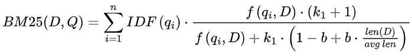
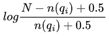

[TOC]

在信息检索和文本挖掘领域，BM25 算法凭借其出色的性能，成为经典且广泛应用的技术。今天，咱们就深入探讨一下 BM25 算法，揭开它的神秘面纱。

# 1. BM25 基本原理

## 1.1 基于 TF-IDF 的改进

BM25 算法是基于 TF-IDF（词频 - 逆文档频率）思想进行优化的。TF-IDF 通过计算词频（TF）和逆文档频率（IDF）来衡量一个词对文档的重要程度。但在实际应用中，简单的 TF-IDF 存在一些问题，比如未考虑文档长度差异的影响，也没有对词频过高的情况进行合理处理。

BM25 算法对此进行了改进。它引入饱和函数和文档长度因子，让算法在衡量词与文档相关性时更加精准。

## 1.2 饱和函数的作用

在文档中，某些词可能出现次数过多，如果直接按照 TF-IDF 计算，这些词的权重会过大，可能会掩盖其他重要词的作用。BM25 算法引入饱和函数来调整词项出现次数（TF）的权重，有效避免了某个词项权重过高的问题，使得算法能更合理地评估每个词对文档相关性的贡献。

## 1.3 文档长度因子的意义

不同文档长度差异很大，如果不考虑文档长度，短文档可能因为词频较低，在检索中处于劣势。BM25 引入的文档长度因子，使得文档长度对权重的影响不再是简单的线性关系。它会根据文档的平均长度，对不同长度文档中的词权重进行调整，让算法能更好地适应各种长度的文档，提高检索的公平性和准确性。

## 1.4 计算公式详解

BM25 的计算公式为：



这里的 n 是查询中的词项数；qi是查询中的第 i 个词项；IDF(qi)是逆文档频率，计算方式通常是：



N 是文档总数，n(qi)是包含词项qi的文档数；f(qi,D)是词项qi在文档 D 中的出现次数（TF）；len(D)是文档 D 的长度；avglen是所有文档的平均长度；k1和 b 是调整参数，通常 k1=1.5，b=0.75。这个公式综合考虑了词频、逆文档频率、文档长度等多个因素，通过加权计算得出查询与文档之间的相关性得分，得分越高，表示文档与查询越相关。

# 2. BM25 算法实现

## 2.1 Python 实现示例

下面是一个简单的 Python 实现 BM25 算法的代码示例：

```python
import math
from collections import Counter


class BM25:
    def __init__(self, corpus, k1=1.5, b=0.75):
        self.k1 = k1
        self.b = b
        self.corpus = corpus
        self.doc_lengths = [len(doc) for doc in corpus]
        self.avg_doc_length = sum(self.doc_lengths) / len(self.doc_lengths)
        self.doc_count = len(corpus)
        self.doc_term_freqs = [Counter(doc) for doc in corpus]
        self.inverted_index = self.build_inverted_index()

    def build_inverted_index(self):
        inverted_index = {}
        for doc_id, doc_term_freq in enumerate(self.doc_term_freqs):
            for term, freq in doc_term_freq.items():
                if term not in inverted_index:
                    inverted_index[term] = []
                inverted_index[term].append((doc_id, freq))
        return inverted_index

    def idf(self, term):
        doc_freq = len(self.inverted_index.get(term, []))
        if doc_freq == 0:
            return 0
        return math.log((self.doc_count - doc_freq + 0.5) / (doc_freq + 0.5) + 1.0)

    def bm25_score(self, query_terms, doc_id):
        score = 0
        doc_length = self.doc_lengths[doc_id]
        for term in query_terms:
            tf = self.doc_term_freqs[doc_id].get(term, 0)
            idf = self.idf(term)
            numerator = tf * (self.k1 + 1)
            denominator = tf + self.k1 * (1 - self.b + self.b * (doc_length / self.avg_doc_length))
            score += idf * (numerator / denominator)
        return score

    def rank_documents(self, query):
        query_terms = query.split()
        scores = [(doc_id, self.bm25_score(query_terms, doc_id)) for doc_id in range(self.doc_count)]
        sorted_scores = sorted(scores, key=lambda x: x[1], reverse=True)
        return sorted_scores


# Example usage
corpus = [
    "The quick brown fox jumps over the lazy dog",
    "A quick brown dog outpaces a swift fox",
    "The dog is lazy but the fox is swift",
    "Lazy dogs and swift foxes"
]
bm25 = BM25(corpus)
query = "quick brown dog"
result = bm25.rank_documents(query)
print("BM25 Scores for the query '{}':".format(query))
for doc_id, score in result:
    print("Document {}: {}".format(doc_id, score))
```

这段代码首先定义了一个`BM25`类，在初始化时计算语料库的一些基本统计信息，如文档长度、平均文档长度、文档词频等，并构建倒排索引。`idf`方法用于计算逆文档频率，`bm25_score`方法根据 BM25 公式计算查询与单个文档的相关性得分，`rank_documents`方法则对所有文档进行打分并排序，返回与查询相关性最高的文档列表。

## 2.2 实际应用中的优化与扩展

在实际应用中，通常还需要进行更复杂的文本预处理工作，比如去除停用词、词干化或词形还原等，以提高算法性能。去除停用词可以减少无意义词汇对计算的干扰，词干化或词形还原能将不同形式的同一个词统一，增强检索的准确性。

此外，还可以根据具体需求调整`k1`和`b`等参数，以达到更好的检索效果。同时，代码中也可以引入多线程或分布式计算的方式，提高算法在大规模数据下的计算效率。

BM25 算法在信息检索、文本挖掘、问答系统等多个领域都有着广泛的应用。无论是搜索引擎的文档排序，还是在问答系统中匹配相似问题，它都能发挥重要作用。


