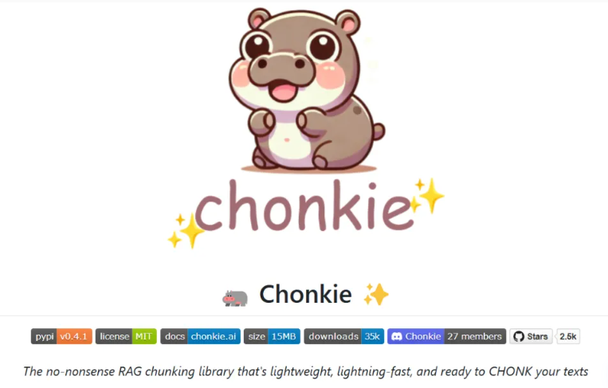

```
https://github.com/chonkie-ai
```

[TOC]

在自然语言处理（NLP）中，RAG（检索增强生成）技术可谓大放异彩。它能让模型借助大量文本数据，生成更精准、更丰富的内容。不过，在 RAG 的实际运用中，有个关键环节却常常让开发者们头疼不已，那就是文本分块（Chunking）。今天，就给大家介绍一款堪称 “救星” 的神器 ——Chonkie 库，让 RAG 中的文本分块难题迎刃而解！



# 1. 为啥文本分块这么重要？

简单来说，文本分块就是把长长的文本拆解成一个个小块，这些小块可以是词语、句子、段落，或者语义单元。这可不是多此一举，它的作用至关重要。

1. **适配模型输入限制**：大多数深度学习模型都有输入长度的 “门槛”。就拿 GPT-2 来说，它最多只能处理 1024 个 token 的输入。要是一股脑把超长文本塞进去，模型就会 “罢工”，不是内存告急，就是性能大幅下降。把文本分块后，每一块都能控制在模型可接受的范围内，模型运行起来自然更顺畅，效率也大大提高。
2. **强化上下文理解**：文本的语义往往是连贯的，会跨越多个句子甚至段落。在 RAG 应用中，经常需要依据不同的文本块来检索信息。合理分块能保留清晰的上下文，让模型更好地把握语义关系，避免关键信息 “走失”。
3. **提升 RAG 效果**：信息检索是 RAG 的核心步骤。通过文本分块，我们可以更精细地划定检索范围，让模型从分块中精准提取关键信息，生成的内容准确性和相关性都更上一层楼。
4. **减轻计算负担**：处理海量文本数据时，如果直接将其整体丢给模型，不仅效率低下，还容易遭遇性能瓶颈。而分块处理后，模型可以并行处理多个小文本片段，计算效率实现飞跃。

# 2. 搭建 RAG 应用时的 “分块困境”

虽然文本分块好处多多，但在搭建 RAG 应用的过程中，实现分块操作却困难重重。市面上的相关库和工具繁多，可要么安装流程繁琐得让人望而却步，要么实际运行效率低得让人抓狂。要是自己动手编写分块代码，不仅耗时费力，还不一定能达到理想效果。很多开发者都在苦苦寻觅一个既简单又高效的解决方案，却常常无功而返。

# 3. Chonkie 库

Chonkie 库是一款专为 RAG 文本分块打造的宝藏工具，它的出现就是为了让分块操作变得轻松简单，能无缝集成到 RAG 应用中。

- **功能强大，满足多样需求**：Chonkie 支持多种分块方式，无论你是想按固定大小的 token 分块，还是按单词、句子分块，亦或是基于语义规则分块，它都能满足。
  - 按固定大小 token 分块的 TokenChunker
  - 按单词分块的 WordChunker
  - 按句子分块的 SentenceChunker
  - 基于可定制规则进行层次化语义分块的 RecursiveChunker
  - 依据语义相似性分块的 SemanticChunker
  - 基于语义双重合并方法分块的 SDPMChunker
  - 实验性的先文本嵌入再分块以获取高质量 chunk 嵌入的 LateChunker
- **简单易用，新手也能轻松上手**：Chonkie 的安装、导入和调用都极其简单
  - 安装时，只需在命令行输入`pip install chonkie` 就搞定了。
  - 如果还想使用更多分块器，输入`pip install chonkie[all]`即可。
  - 不过，为了避免安装包过大，建议只安装自己需要的分块器。
- **速度超快，性能卓越**：Chonkie 的运行速度快得惊人！
  - 默认安装包仅有 15MB，相比其他动辄 80MB 到 171MB 的工具包，简直是 “轻量级选手”。
  - 在实际性能上，它更是一骑绝尘。
    - 进行 Token Chunking 时，比最慢的替代方案快 33 倍；
    - Sentence Chunking 速度几乎是竞争对手的两倍；
    - Semantic Chunking 也比其他工具快最多 2.5 倍。
- **轻量精简，扩展性强**：Chonkie 只保留了最核心、最必要的功能，没有任何冗余代码，这使得它运行起来更加高效。而且，它能和各种常见的 tokenizer 完美兼容，开发者可以根据项目需求自由搭配，扩展性超强。

# 4. Chonkie 库使用示例

下面，通过一个简单的代码示例，带大家感受下 Chonkie 的使用过程。

```python
from chonkie import TokenChunker
from tokenizers import Tokenizer


# 初始化tokenizer，这里使用预训练的GPT-2模型
tokenizer = Tokenizer.from_pretrained("gpt2")
# 创建chunker
chunker = TokenChunker(tokenizer)
# 对文本进行分块
chunks = chunker("Woah! Chonkie, the chunking library is so cool! I love ")
# 输出每个chunk的信息
for chunk in chunks:
    print(f"Chunk: {chunk.text}")
    print(f"Tokens: {chunk.token_count}")
```

在这段代码中，首先导入了`TokenChunker`，接着用预训练的 GPT-2 模型初始化`tokenizer`，创建`chunker`后，就能轻松对文本进行分块，并输出每个分块的具体内容和包含的 token 数量。

Chonkie 库为 RAG 文本分块带来了全新的解决方案，无论是功能、速度，还是易用性和扩展性，都表现得十分出色。如果大家正在为 RAG 应用中的文本分块问题烦恼，不妨试试 Chonkie 库。


