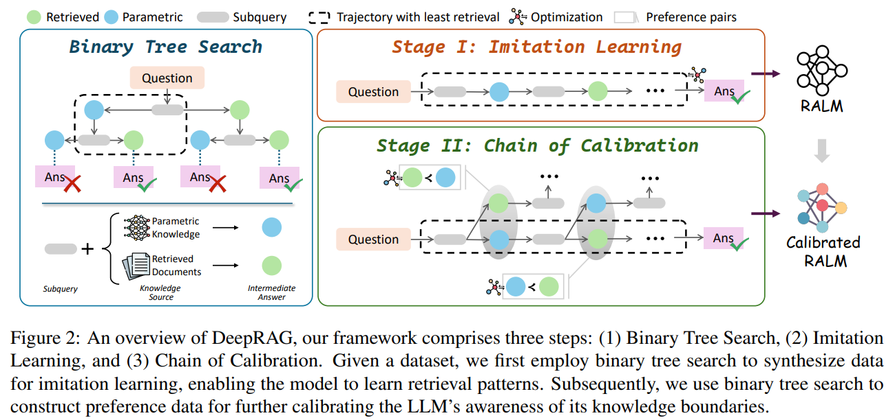
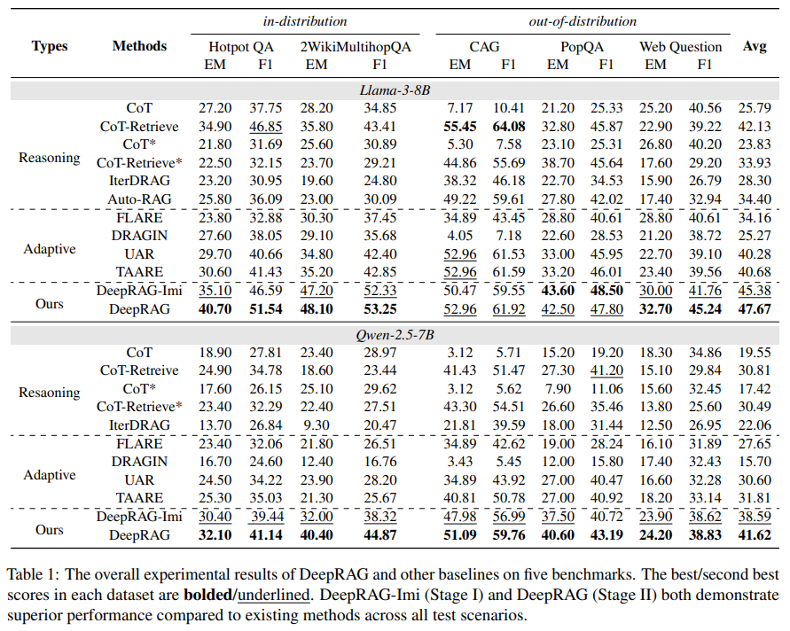

```
论文标题：DeepRAG: Thinking to Retrieval Step by Step for Large Language Models
论文链接：https://arxiv.org/pdf/2502.01142
机构：中国科学院大学
```

[TOC]

# 1. 科研人的深夜难题：大模型的 “不靠谱” 答案

大语言模型生成的答案，看似自信满满却又存在漏洞百出的时候。虽然大模型推理能力不错，但事实性幻觉问题真的很严重。就好比问它一些需要最新知识或者精确信息的问题，它可能就会胡编乱造，根源就在于模型参数化知识的时效性、准确性和覆盖范围都有限。

这时候，检索增强生成（RAG）技术进入了人们的视野，大家都期待它能借助外部知识库增强大模型的准确性，解决幻觉问题。可实际用起来，却出现了不少让人头疼的状况。

# 2. 传统 RAG 的 “痛点”：检索混乱，答案堪忧

## 2.1 任务分解不合理，检索盲目无章

传统 RAG 通常采用 “简单拆分 + 统一检索” 的方式。把一个复杂问题拆分成几个子问题，然后逐个检索相关文档。但问题就来了，有些问题其实依靠大模型自身的知识就能回答，根本不需要额外检索，可系统还是盲目地去检索，不仅浪费资源，还会引入干扰信息，把原本清晰的推理逻辑搅乱。而且，对于什么情况下需要检索、检索多少条内容最合适，现有 RAG 方法完全没有智能判断的能力，检索就像没头的苍蝇一样盲目。

## 2.2 过度检索添乱，答案质量下滑

好多 RAG 系统还秉持着 “检索越多越好” 的理念，这可坑苦了大模型。比如你问 “2024 年最新的 Transformer 改进方向”，系统可能一股脑地检索出大量过时的论文，甚至一些无关的基础教程。大模型面对这么多杂乱无章的信息，就像在一堆垃圾里找宝贝，不仅增加了筛选的难度，还容易被无关信息误导，导致最终给出的答案质量大打折扣。这归根结底，就是因为传统 RAG 缺乏 “智能检索决策” 的能力。

# 3. DeepRAG 登场：像人类一样思考检索的 “智多星”

《DeepRAG—— 检索增强推理的新范式》的论，为解决这些难题带来了希望。



## 3.1 引入 MDP：检索决策的 “智慧大脑”

DeepRAG 的核心创新点，就是把检索增强推理建模成了马尔可夫决策过程（MDP）。这就相当于给大模型的检索系统装上了一个超级智能的 “决策引擎”。在推理的每一个步骤中，大模型都会像人一样思考：这个问题我 “心里有底” 吗？如果确定自己知道答案，就直接利用参数化知识进行推理；要是不太确定，就触发检索，而且还能精准地挑选出最相关的信息。并且这个决策是动态变化的，不会一开始就把所有问题都扔给检索系统，大大减少了不必要的噪音干扰，检索过程变得更加精准、高效。

## 3.2 逐步查询：避开信息 “陷阱” 的妙招

在检索方式上，DeepRAG 抛弃了传统 RAG “一次性检索” 的老套路，采用逐步查询的方法。传统 RAG 一次性检索大量文档，看似信息收集得很全，但其中大部分都是冗余的，这些多余的信息就像陷阱一样，很容易干扰大模型的判断。而 DeepRAG 则聪明得多，它在推理过程中会分阶段进行检索，每一次检索的内容都是当前推理真正急需的。这样一来，就完美避开了无关信息的干扰，让最终答案的准确率大幅提升。

## 3.3 检索推理自主平衡：大模型的 “聪明抉择”

DeepRAG 还有一个特别厉害的地方，就是让 LLM 自己决定是靠 “记忆”（已有知识）来回答问题，还是 “去外面查资料”（检索外部信息）。比如，当被问到 “爱因斯坦是哪一年出生的” 这种基础事实性问题时，DeepRAG 知道这属于自己 “知识储备” 范围内的内容，不需要检索就能直接给出答案；但要是遇到涉及最新研究进展之类的问题，它就会自动触发检索，然后结合最新资料进行推理。这种机制让检索冗余大幅减少，RAG 变得更加智能、高效。

# 4. DeepRAG 实验效果

DeepRAG 研究人员为了验证它的实力，在多个公开的问答数据集上进行了实验，结果真的太惊艳了！



在多个基准数据集上，DeepRAG 的表现远超传统 RAG。

准确率提升可能是因为在回答问题时，DeepRAG 能够有效减少因错误检索导致的干扰，给出的答案更加精准可靠。

检索效率提升是因为通过智能决策，DeepRAG 调用外部知识库的次数比传统 RAG 少了很多，但最终回答却更加准确。而且，由于采用了逐步检索的方式，避免了无关信息的干扰，答案中的噪音减少，更加简洁明了，直击要点。

和其他方法对比，无论是像 CoT、CoT-Retrieve 这些推理类方法，还是 FLARE、DRAGIN 这些自适应检索方法，DeepRAG 在各个数据集上都展现出了强大的优势。在一些对时间敏感的数据集，或者知识图谱不太完整的数据集上，DeepRAG 依然能够保持良好的性能，充分证明了它的泛化能力和鲁棒性。

# 5. 落地小窍门：如何在项目中应用 DeepRAG

如果你也想在自己的项目里用上 DeepRAG，这里有几个实用的小建议。

## 5.1 借助 LangChain 构建智能检索策略

可以结合 LangChain 这个强大的工具，利用它的自适应检索功能来实现 DeepRAG 的理念。这样就能避免盲目检索，让检索过程更加智能、有针对性，充分发挥 DeepRAG 的优势。

## 5.2 利用强化学习优化检索决策

把 DeepRAG 的 MDP 框架和强化学习结合起来。在实际应用中，让检索策略通过不断地学习和优化，根据不同的情况做出更合理的决策，就像给检索系统注入了一个不断进化的 “智慧灵魂”。

## 5.3 设计多轮交互提升推理精度

参考 DeepRAG 逐步查询的思路，设计多轮交互的机制。这样可以避免一次性返回大量冗余信息，通过一步步的交互，逐步引导模型深入思考，从而提升推理精度，给出更符合用户需求的答案。

DeepRAG 的出现，为大模型检索增强推理领域带来了新的曙光。它解决了传统 RAG 存在的诸多问题，让大模型在面对复杂问题时，能够更加智能、准确地检索信息并给出答案。如果你在使用 RAG 的过程中，也被信息冗余、回答失真等问题困扰，不妨试试 DeepRAG，说不定会有效果！


