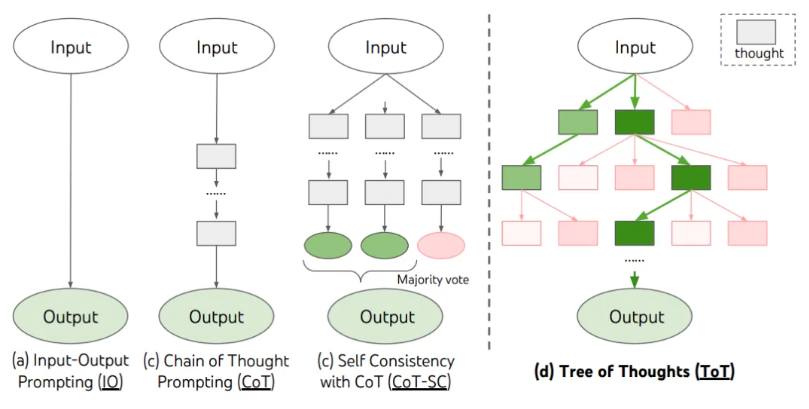
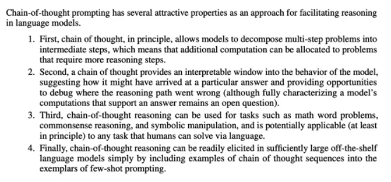
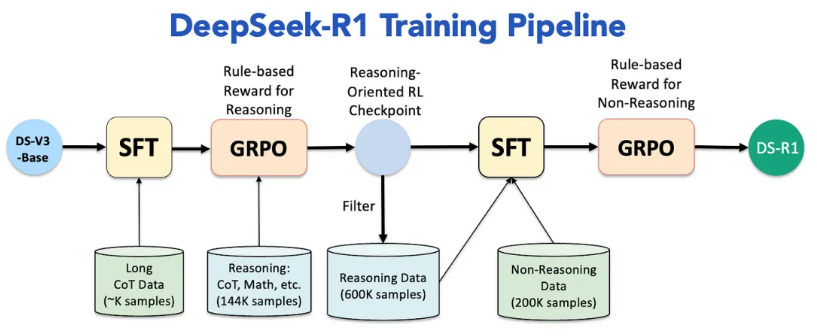
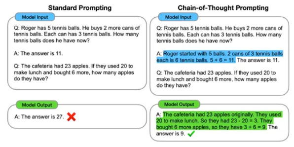
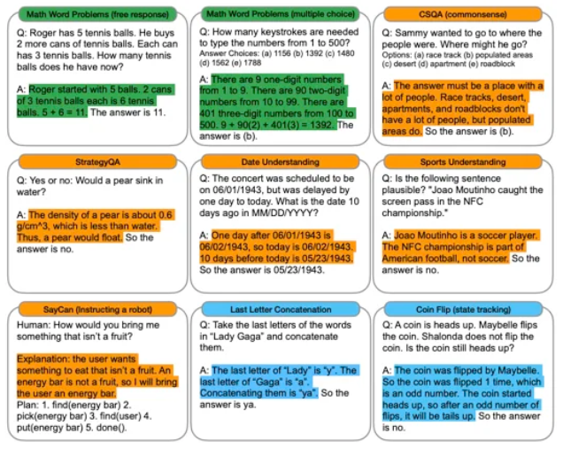

[TOC]

AI 圈超火的 DeepSeek-R1 模型！它在逻辑推理、数学计算、复杂问答这些难题面前，就像开了挂一样厉害。而它的 “秘密武器”之一就是思维链（CoT）技术，今天咱们就一起来揭开它的神秘面纱！

# 1. 思维链（CoT）究竟是什么？

思维链（Chain of Thought，简称 CoT），简单来说，就是让大模型模仿人类思考的过程。大家想想，咱们平时遇到复杂问题时，是不是会一步步分析，最后得出答案？思维链就是让模型也这么干，把复杂问题拆分成一个个简单步骤，再逐步推导，这样就能得出最终答案！

这个超厉害的概念，是在《Chain-of-Thought Prompting Elicits Reasoning in Large Language Models》这篇论文里提出的。它有很多厉害的地方：

- **智能分配计算力**：碰到那种需要多步推理的难题，思维链能把问题拆成中间步骤，让模型把更多的计算能力用在刀刃上，专门攻克这些难题。
- **可解释性超强**：以前模型给出答案，咱们都不知道它咋想的。现在有了思维链，就像给模型的思考过程开了一扇窗，能清楚看到它是怎么得出答案的。要是推理过程出了错，也能顺着这个思路去检查、调试。
- **应用超广泛**：不管是数学应用题、常识推理，还是符号操作，思维链都能大显身手。而且从理论上讲，只要是人类能用语言解决的问题，它都有可能搞定！
- **激发超简单**：在足够大的现成语言模型里，只要在少样本提示的示例里加一些思维链序列的例子，就能轻松激发模型的思维链推理能力。

# 2. DeepSeek-R1 如何运用思维链（CoT）？

DeepSeek-R1 模型在使用思维链技术的时候，有一套自己的 “训练秘籍”。

首先，它得让模型具备输出思维链的能力。

然后，再通过人类反馈强化学习（RLHF）和基于规则的推理奖励（Rule Base Reward for Reasoning）对模型进行强化训练。

经过这样的训练，DeepSeek-R1 模型在推理的时候，就能自然而然地生成思维链，还能按照咱们人类期望的方式来思考和回答问题！

# 3. Chain-of-Thought Prompting 是什么？

这是引导大语言模型生成思维链的关键方法。简单来讲，就是在给模型的提示里，加入中间推理步骤的示例，这样就能引导模型生成类似的思维链啦。具体有这几个步骤：

1. **分步提示设计**：在编写大模型应用时，咱们可以用特定格式的提示（Prompt）来要求模型展示思考过程。比如说，用 “Let's think step by step” 这样的关键词，就能触发模型一步步推理。而且它还支持零样本（Zero-shot）和少样本（Few-shot）两种模式，就算没有太多示例，也能让模型开动脑筋！
2. **中间状态生成**：模型会把中间推理步骤生成文本，每一个步骤都能作为后面推理的基础，就像搭积木一样，一步一步搭出完整的推理过程。它是通过自回归的方式，逐步生成这些内容的。
3. **结果提取**：等模型把推理过程都写出来了，咱们就能从生成的文本里找到最终答案啦。一般像 “Therefore, the answer is” 这样的关键词后面，跟着的就是答案。

# 4. 如何让大语言模型（LLM）生成思维链？

方法就是刚刚提到的 Chain-of-Thought Prompting。

在少样本提示里，给每个示例都加上和答案相关的思维链。这些示例得清楚展示出，怎么从问题出发，经过一系列中间步骤，最后得出结论。这样一来，大语言模型在遇到新问题时，就会照着这些示例的思路，分解问题、生成思维链了。

