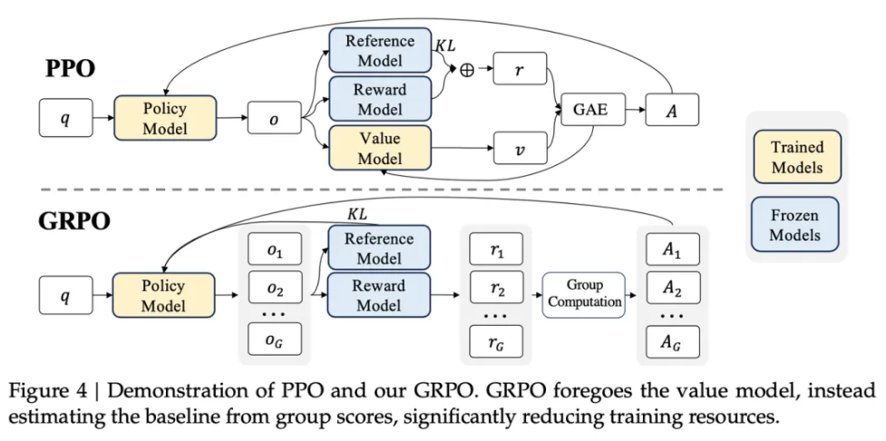

[TOC]

在大语言模型（LLMs）的飞速发展进程中，DeepSeek-R1 凭借出色的性能脱颖而出，吸引了无数目光。而它背后的 “秘密武器”——GRPO（Group Relative Policy Optimization）强化学习算法，更是成为大家热议的焦点。今天，咱们就用通俗易懂的方式，深入剖析一下这个让 DeepSeek-R1 大放异彩的 GRPO 算法！

# 1. GRPO 诞生的 “前因后果”

在大语言模型的微调环节，强化学习（RL）起着举足轻重的作用。一直以来，近端策略优化（PPO）算法都是 LLM 微调的常用手段。但随着模型规模越来越大，PPO 的问题逐渐暴露出来。

想象一下，PPO 就像是一个背着沉重背包的行者，这个背包就是与策略模型大小相当的价值网络，用来估计优势函数。在处理数十亿甚至千亿参数的大型语言模型时，维护和更新这个价值网络，需要耗费大量的计算资源和内存空间，训练过程变得又慢又艰难，就像行者被沉重背包拖累，举步维艰。

而且，PPO 在更新策略时，就像一辆刹车不太灵的汽车，策略分布容易发生剧烈变化，导致训练稳定性大打折扣。为了解决这些难题，DeepSeek 的研究人员经过不懈努力，研发出了 GRPO 算法，致力于让大语言模型的训练更加高效、稳定。

# 2. GRPO 的核心 “智慧”

GRPO 的核心思路十分巧妙，简单来说，它不走寻常路，不再依赖传统的价值网络（也就是批评模型）来评估动作价值，而是通过组内相对奖励来优化策略模型。

这就好比在学校里评选优秀学生，以前是每个学生单独打分（依赖价值网络评估每个动作价值），现在则是把学生分成小组，根据小组内每个学生的相对表现来评选（根据组内动作相对表现调整策略）。这样做有不少好处：

- **计算负担大幅减轻**：不用再维护价值网络这个 “耗能大户”，就像行者扔掉了沉重的背包，训练过程中的内存占用和计算代价显著降低。
- **训练稳定性显著提高**：通过组内比较来估计优势函数，就像小组内互相竞争，大家的水平差距能更准确地体现出来，减少了策略更新的波动，让训练过程更加平稳。
- **策略更新更易掌控**：GRPO 引入了 KL 散度约束，这就像是给策略更新上了一把锁，防止策略更新幅度过大，保持策略分布的稳定。

从数学角度看，GRPO 的目标是在保持策略更新稳定的同时，最大化预期累积奖励。它的目标函数虽然有点复杂，但可以简单理解为通过对采样动作组的奖励进行处理和约束，实现对策略模型的优化 。

# 3. GRPO 算法的 “操作指南”

## 3.1 采样动作组

面对每个输入状态，GRPO 会像抽奖一样，按照当前策略的概率分布，从众多可能的动作中采样出一组动作。这样做能保证采样的动作丰富多样，就像抽奖时各种奖项都有机会被抽到，为后续的评估和优化提供更多可能性。

## 3.2 奖励评估

每个采样动作都会接受奖励函数的 “考验”，根据任务的不同，奖励函数的评判标准也不一样。在数学推理任务中，如果模型给出的答案正确，就能获得较高的奖励值；在代码生成任务里，代码能成功运行，奖励值也会相应提高。

## 3.3 计算相对优势

这一步是把每个动作的奖励值进行归一化处理，得到相对优势。简单理解，就是把每个动作的奖励值放在一起比较，看看它在这组动作中的相对表现如何。

比如，大家考试后，老师不仅告诉你考了多少分，还会告诉你在班级里的排名情况，这个排名就类似于相对优势。通过计算相对优势，可以更准确地评估每个动作的优劣。

## 3.4 策略更新

根据计算出的相对优势，GRPO 会对策略模型的参数进行调整。对于那些相对优势为正的动作，就像班级里成绩排名靠前的学生，会增加它们出现的概率；相对优势为负的动作，则会减少概率。

## 3.5 KL 散度约束

为了避免策略更新 “失控”，GRPO 引入了 KL 散度约束。它就像一个 “稳压器”，限制新旧策略之间的差异，确保策略分布的变化在合理范围内，让模型训练更加稳定。

# 4. GRPO 与 PPO 的 “大对决”

## 4.1 算法结构差异明显

PPO 严重依赖价值网络来估计优势函数，价值网络不仅计算复杂，还占用大量内存。而 GRPO 则果断抛弃价值网络，通过组内相对奖励来估计优势函数，大大减少了计算和存储需求。

在奖励计算方式上，PPO 使用广义优势估计（GAE），要综合考虑每个动作的即时奖励和未来奖励的折扣总和，计算过程比较繁琐。GRPO 则简单直接，采样一组动作计算奖励值，归一化后就得到相对优势。

策略更新机制方面，PPO 通过裁剪概率比来控制策略更新幅度，GRPO 则引入 KL 散度约束，能更精准地调整策略更新的程度。计算效率上，PPO 因为价值网络的拖累，在大规模语言模型训练中速度较慢，GRPO 则凭借精简的结构，计算效率更高，更适合大规模模型的微调。

## 4.2 优势与局限各有不同

PPO 的优势在于稳定性较好，通过裁剪概率比能有效防止策略更新过于激进，而且适用范围广，在多种强化学习任务中都能发挥不错的效果。但它的局限也很明显，计算负担重，在大规模模型中，维护价值网络成本太高；策略更新方差较大，会影响训练的稳定性。

GRPO 的优势突出：

- 计算效率高，训练速度比 PPO 快 30%，内存占用还能减少 50%；
- 稳定性强，组内相对奖励计算减少了策略更新的方差；
- 可控性好，KL 散度约束让策略更新更精细。

不过，GRPO 也有短板：

- 每个状态都要采样一组动作，采样成本较高；
- 在奖励信号稀疏的任务中，表现可能不如 PPO 稳定。

# 5. GRPO 在 DeepSeek-R1 中的 “实战成果”

## 5.1 多阶段训练铸就 “全能选手”

DeepSeek-R1 模型运用 GRPO 算法进行训练，采用了多阶段策略。

在监督微调（SFT）阶段，用高质量标注数据对基础模型进行 “打磨”，让模型在特定任务上初步具备一定性能。

接着进入强化学习（RL）阶段，按照 GRPO 算法流程，采样动作组、评估奖励、计算相对优势、更新策略，不断迭代优化。

然后通过拒绝采样（RS）阶段生成合成数据集，提升模型的通用性和连贯性。

最后在最终强化学习阶段，再次运用 GRPO 算法，重点优化模型的实用性和无害性。

## 5.2 实验成绩相当亮眼

经过这样的训练，DeepSeek-R1 在各项任务中表现出色。

在 2024 年美国数学邀请赛（AIME）中，通过率 @1 得分高达 71.0%，相比未使用 GRPO 算法的模型，性能提升显著。

代码生成任务里，生成代码的可运行性达到 85%，正确率达到 70%，能产出高质量代码。

在写作、角色扮演等通用任务中，模型的通用性和连贯性也很强。

而且，GRPO 算法让训练效率大幅提高，帮助 DeepSeek-R1 在更短时间内完成训练，同时保持高性能。

# 6. GRPO 与 OpenAI RLHF 算法的 “大比拼”

OpenAI 的 RLHF 算法大名鼎鼎，它基于人类反馈，通过奖励建模和强化学习来优化模型输出，让结果更符合人类偏好。和 GRPO 比起来，二者各有千秋。

- 从算法原理看，GRPO 通过组内相对奖励机制估计优势函数，还加入 KL 散度正则项；RLHF 则依赖人类反馈进行奖励建模和优化。
- 训练效率上，GRPO 简化流程，计算开销和内存需求低，训练速度快；RLHF 训练过程复杂，计算成本高。
- 策略更新稳定性方面，GRPO 通过组内相对奖励和 KL 散度正则化，更新稳定且可控；RLHF 的稳定性取决于奖励模型的准确性和标注数据质量，容易出现偏差。
- 应用场景中，GRPO 特别适合数学推理、代码生成这类需要推理能力的任务；RLHF 通用性强，在聊天机器人、内容生成等优化模型输出符合人类偏好的任务中表现出色。
- 资源需求上，GRPO 对大规模语言模型更友好，资源需求低；RLHF 则需要大量人类标注数据和计算资源。
- 模型性能上，GRPO 在特定任务（如数学推理）中解题准确率提升显著；RLHF 生成的输出更符合人类偏好，能减少有害内容生成。

GRPO 算法为大语言模型的训练带来了新的思路和方法，虽然它还有一些需要完善的地方，但在 DeepSeek-R1 中的成功应用，已经让我们看到了它的巨大潜力。

