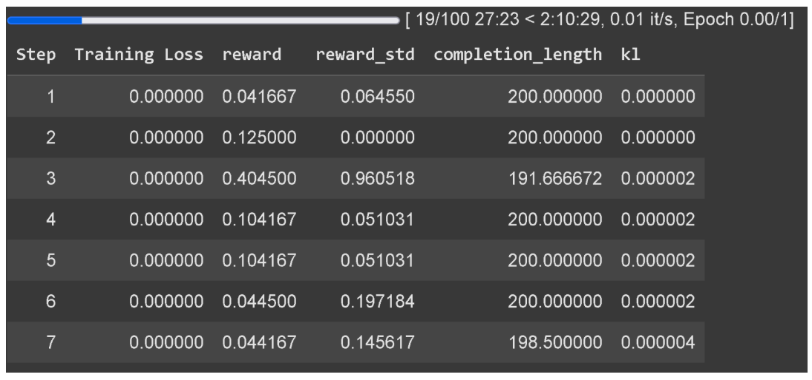
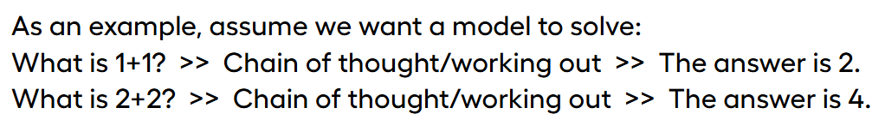
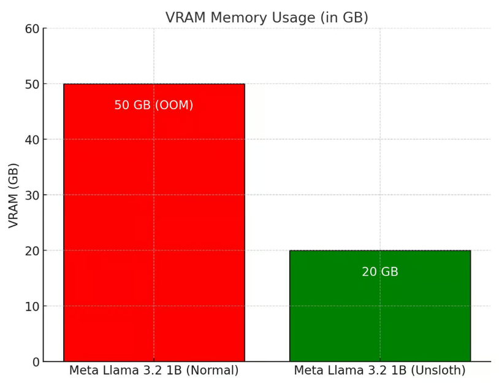

[TOC]

```
原文链接：https://unsloth.ai/blog/r1-reasoning
demo：https://colab.research.google.com/github/unslothai/notebooks/blob/main/nb/Llama3.1_(8B)-GRPO.ipynb
```

DeepSeek-R1 模型的出现引起了广泛关注，众多开源复现项目纷纷涌现（Open-R1、simpleRL-reason、Tiny-Zero、Mini-R1等）。然而，受 GPU 条件的限制，有些小伙伴可能无法顺利运行这些项目。今天，我们就来介绍一个神奇的工具 ——Unsloth AI，它可以帮助我们在有限的资源下训练自己的 DeepSeek-R1 推理模型，特别是通过 GRPO（Group Relative Policy Optimization）技术，实现了资源的大幅降低。

# 1. Unsloth AI 的神奇之处

## 1.1 GRPO 技术简介

GRPO 是一种强化学习算法，它与依赖价值函数的近端策略优化（PPO）不同，不需要价值函数就能有效优化响应。它的工作原理是让模型生成多组响应，然后根据正确性或其他设定的奖励函数对每个响应进行评分，计算组平均分数，并将每个回答的分数与组平均分数进行比较，最后模型会得到强化，以支持得分更高的反应。

## 1.2 资源大幅降低

Unsloth AI 通过对整个 GRPO 流程的增强，使其使用的 VRAM比 Hugging Face + FA2 少 80%。这意味着，我们可以使用更少的硬件资源来训练自己的 DeepSeek-R1 推理模型。例如，使用 Qwen2.5（1.5B）模型，仅需要 7GB 的 VRAM 就可以重现 R1-Zero 的 “顿悟时刻”，这对于那些没有强大 GPU 支持的用户来说，无疑是一个巨大的福音。

# 2. 训练自己的 DeepSeek-R1 推理模型

## 2.1 模型支持与参数要求

- **模型范围**：Unsloth AI 可以将多种模型转换为推理模型，包括 Llama 3.1（8B）、Phi-4（14B）、Mistral（7B）、Qwen2.5（7B）等，只要这些模型的参数不超过 15B。
- **参数建议**：为了正确生成思考标记，建议将 GRPO 应用于至少 1.5B 参数的模型。如果使用的是基础模型，需要确保有一个聊天模板。

## 2.2 训练过程与注意事项

- 训练流程
  - **数据收集**：开始训练前，需要准备好输入和输出数据，例如问题和答案。这些数据将用于模型的训练，帮助模型学习如何进行推理。
  - **模型训练**：使用 Unsloth AI 提供的工具和接口，将准备好的数据输入到模型中进行训练。在训练过程中，模型会根据 GRPO 算法不断调整自己的参数，以提高推理能力。
  - **结果评估**：训练完成后，需要对模型的推理结果进行评估。可以通过与已知的正确答案进行比较，来评估模型的准确性和可靠性。

- 注意事项
  - **奖励函数设计**：在训练过程中，需要设计合适的奖励函数来激励模型的推理行为。例如，如果模型给出了正确答案，可以给予奖励；如果模型出现错误或不合理的回答，可以给予惩罚。这样可以引导模型学习到正确的推理方式。
  - **训练时间**：为了获得良好的训练结果，需要训练300步，12 个小时。Unsloth AI 在 Colab 上的示例只训练了一个小时，因此结果可能低于标准。
  - **软件依赖**：如果在本地使用 GRPO，需要确保已经安装了 “pip install diffusers”。



# 3. GRPO 的神奇效果

## 3.1 “顿悟时刻” 重现

DeepSeek 的研究人员在使用纯强化学习（RL）训练 R1-Zero 时观察到了 “顿悟时刻”，模型学会了通过重新评估其初始方法延长其思考时间，而无需任何人工指导或预定义指令。通过 Unsloth AI 使用 GRPO 训练模型，也可以重现这种神奇的效果。例如，在一个测试示例中，对于 “Which is bigger? 9.11 or 9.9?” 这个问题，使用 GRPO 训练的 Phi-4 模型能够给出正确答案，而没有使用 GRPO 训练的模型则没有思考标记和正确答案。


## 3.2 推理能力培养

GRPO 算法可以引导模型自动展示推理能力并创建推理轨迹。例如，对于 “1 + 1 等于多少？”“2 + 2 等于多少？” 这样的简单数学问题，模型可以通过逐步的计算和思考，给出正确的答案。这表明，通过 GRPO 训练，模型可以学习到如何进行推理，从而提高自己的智能水平。



# 4. Unsloth AI 的其他优势

## 4.1 吞吐量与 VRAM 节省

Unsloth AI 使用 vLLM 直接在微调堆栈中，实现了 20 倍的吞吐量提升和 50% 的 VRAM 节省。在 1x A100 40GB 显卡上，Unsloth 的动态 4 位量化 Llama 3.2 3B Instruct 模型可以达到每秒 4000 个token左右的生成速度，而在 16GB Tesla T4（免费 Colab GPU）上，可以达到每秒 300 个token。此外，Unsloth 还神奇地消除了加载 vLLM 和 Unsloth 时的双重内存使用，为 Llama 3.1 8B 节省了约 5GB 的内存，为 Llama 3.2 3B 节省了约 3GB 的内存。



## 4.2 vLLM 的特点

- **动态量化**：vLLM 可以动态地将模型的某些层量化为 4 位，某些层量化为 16 位，这样可以在保持模型较小的同时，显著提高模型的准确性。
- **参数优化**：vLLM 可以自动选择多个参数来优化内存、VRAM 效率和最大吞吐量，例如调整分块预填充令牌的数量、最大序列数等。
- **性能提升**
  - **默认设置**：vLLM 默认启用 - O3 优化，并启用前缀缓存，以提高模型的性能。
  - **硬件加速**：在旧显卡上，Flashinfer 可能会比 vLLM 慢 10%。此外，FP8 KV 缓存会使事情变慢 10%，但可以使吞吐量潜力翻倍。

- **LoRA 支持**：vLLM 允许通过解析状态字典而不是从磁盘加载来加载 LoRA，这可以使 GRPO 训练运行速度提高 1.5 倍。

# 5. 小结

Unsloth AI 的出现为我们训练自己的 DeepSeek-R1 推理模型提供了一个强大的工具，特别是通过 GRPO 技术，实现了资源的大幅降低，让更多人能够参与到人工智能的研究和应用中。同时，Unsloth AI 还具有其他诸多优势，如吞吐量提升、VRAM 节省和 vLLM 的特点等。


