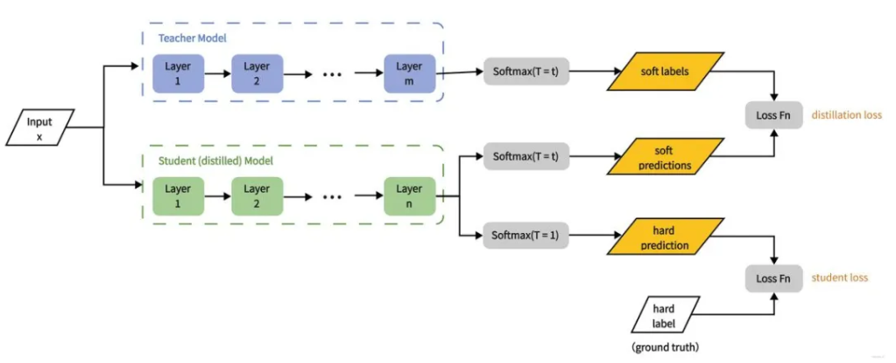
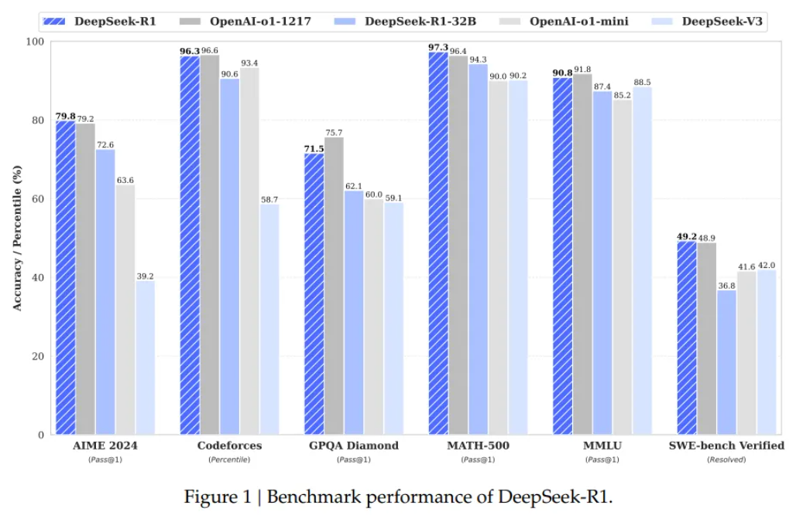

[TOC]

最近，AI 圈被 DeepSeek 发布的 R1 模型狠狠刷屏了！这款国产模型在各项测试里表现超惊艳，好多指标都能和 OpenAI 的 o1 系列正面 battle，直接晋升行业新标杆。大家在热议 R1 强大性能时，有个技术频繁出现在讨论中，那就是 “蒸馏技术”。今天咱们就来深度扒一扒这个助力 DeepSeek R1 大放异彩的神秘技术！

# 1. 蒸馏技术是什么？

蒸馏技术，英文名叫 Knowledge Distillation，简称 KD，是 2015 年由 Geoffrey Hinton、Oriol Vinyals 和 Jeff Dean 这几位 AI 界大佬提出的。简单来说，它就像是一场 AI 界的 “师徒传承”。强大的教师模型是知识渊博的师父，经过海量数据训练，掌握了超多复杂的模式和特征；而学生模型则像初出茅庐的小徒弟，虽然没那么厉害，但能通过学习师父的 “经验” 和 “思考方式” 来提升自己。

打个比方，在图像识别里，要判断一张照片里是猫还是狗，大的教师模型能精准判断，给出 “猫” 80% 可能性、“狗” 10% 可能性、“其他动物” 10% 可能性这样详细的结果。小的学生模型要是自己瞎摸索训练，很难达到这么高的准确率。但借助蒸馏技术，它就能学到大模型的判断方法，哪怕在手机这种计算能力有限的设备上，也能快速又准确地识别图像。

# 2. 蒸馏技术的基本原理

## 2.1 教师模型与学生模型准备

这就好比组织一场教学，得先有经验丰富的老师和充满潜力的学生。教师模型一般是经过大规模训练的复杂深度网络，像图像识别里常用的 ResNet - 101，在大规模数据集（如 ImageNet）上训练后，能轻松识别图像里的细微差别。学生模型则结构简单、参数少，层数和神经元数量都比教师模型少很多，但胜在潜力大，通过蒸馏能一步步变强。

## 2.2 知识传递过程

准备好 “师徒” 后，就进入关键的知识传递阶段。这时，学生模型不仅要学习原始数据的标签（硬目标），更要学习教师模型的输出（软目标）。软目标可厉害啦，它包含丰富的概率信息，能帮学生模型理解更多细节。就像做一道题，正确答案 “猫” 是硬目标，而教师模型给出 “猫” 80% 概率、“狗” 10% 概率等概率分布就是软目标，这让学生模型明白，即便确定是猫，也不能完全排除其他可能性，从而学到整个推理过程。

## 2.3 损失函数与优化

为了让学生模型尽可能靠近教师模型的输出，得用一个损失函数来衡量它们之间的差异。损失函数一般包含两部分：KL 散度，用来计算两个概率分布的差异，也就是衡量学生模型和教师模型输出的 “距离”，督促学生模型模仿教师模型；交叉熵损失，用于衡量学生模型预测标签和真实标签的差距，反映预测的误差。不断调整学生模型的参数，让损失函数最小化，学生模型就能逐渐吸收教师模型的 “智慧”，提升自身性能。

# 3. DeepSeek 蒸馏技术的创新点

## 3.1 数据蒸馏与模型蒸馏结合

DeepSeek 把数据蒸馏和模型蒸馏巧妙结合，实现了从大型复杂模型到小型高效模型的知识迁移，既提升性能又降低计算成本。

数据蒸馏方面，它利用强大的教师模型生成或优化数据，比如进行数据增强、生成伪标签、优化数据分布。教师模型能对原始数据加工，生成超多丰富多样的训练数据样本，让小模型学习起来更高效。

模型蒸馏上，DeepSeek 采用监督微调（SFT）的方式，用教师模型生成的 800,000 个推理数据样本，对 Qwen 和 Llama 系列等小基础模型进行微调，而且没有额外的强化学习（RL）阶段，蒸馏过程又快又高效。两者结合效果显著，像 DeepSeek-R1-Distill-Qwen-7B 在 AIME 2024 测试中 Pass@1 达到 55.5%，超越了当时最先进的开源模型 QwQ-32B-Preview 。

## 3.2 高效知识迁移策略

DeepSeek 在知识迁移策略上大胆创新，采用基于特征的蒸馏和特定任务蒸馏。

基于特征的蒸馏，会把教师模型中间层的特征信息传递给学生模型，帮助学生模型抓住数据的本质特征；特定任务蒸馏则针对不同任务，比如自然语言处理里的机器翻译、文本生成等，对蒸馏过程专门优化。在这些策略助力下，蒸馏模型在多个基准测试中成绩优异。

DeepSeek-R1-Distill-Qwen-32B 在 AIME 2024 上 Pass@1 达到 72.6%，在 MATH - 500 上更是高达 94.3% ，性能直逼甚至超越原始大型模型，计算效率还超高。

# 4. DeepSeek 蒸馏模型的架构与训练

## 4.1 蒸馏模型架构设计

DeepSeek 在蒸馏模型架构设计上，完美平衡了效率和性能。

教师模型选的是自家研发的 DeepSeek-R1，拥有 671B 参数，推理能力超强，知识储备丰富，为蒸馏提供了充足的知识 “弹药”。学生模型基于 Qwen 和 Llama 系列架构，计算效率高、内存占用少，在资源受限的环境也能高效运行。

架构设计还有不少亮点：

- 层次化特征提取机制，教师模型处理数据时生成的多层特征表示，包含丰富语义信息，学生模型学了能更好理解数据结构和模式；
- 多任务适应性机制，让学生模型能根据不同任务（如文本分类、机器翻译）调整结构和参数，泛化能力大大增强。
- 而且，DeepSeek 还采用参数共享与压缩技术，减少学生模型的参数数量和存储需求；
- 引入轻量化模块设计，像轻量级注意力机制模块，处理长文本又快又好。

## 4.2 训练过程与优化方法

训练数据主要来自教师模型生成的推理数据样本，DeepSeek 还会用数据增强技术，对原始数据扩展、修改和优化，生成丰富多样的训练样本，提升学生模型的学习效率。

训练时，采用监督微调（SFT），学生模型通过学习教师模型的输出概率分布来调整自身参数，努力靠近教师模型的性能。损失函数设计成混合损失函数，结合软标签损失和硬标签损失，软标签损失让学生模型模仿教师模型的输出概率分布，硬标签损失保证能正确预测真实标签，双管齐下，让学生模型高效学到关键知识。

优化方法也很讲究：

- 引入温度参数调整软标签分布，训练初期温度高，分布更平滑，方便学生模型学习；
- 随着训练推进，温度逐渐降低，提升蒸馏效果。
- 采用动态学习率调整策略，根据训练进度和模型性能灵活调整学习率，保证训练稳定、收敛速度快。
- 还引入正则化技术，比如 L2 正则化项约束模型参数，防止模型过于复杂，提高泛化能力。

# 5. 蒸馏模型的性能表现

## 5.1 推理效率大幅提升

DeepSeek 的蒸馏模型在推理效率上简直开了挂！

- 参数量大幅减少，像 DeepSeek-R1-Distill-Qwen-7B 参数量只有 7B，相比 671B 参数的原始 DeepSeek-R1，计算复杂度骤降，推理时需要的计算资源大大减少，特别适合在资源受限的环境部署。
- 内存占用也跟着减少，DeepSeek-R1-Distill-Llama-8B 内存占用只有原始模型的 1/80 左右，对硬件要求更低。
- 推理速度更是提升显著，DeepSeek-R1-Distill-Qwen - 32B 处理复杂推理任务时，速度比原始模型快约 50 倍，能快速响应用户请求，提供实时推理结果。

## 5.2 性能与原始模型对比不落下风

别看蒸馏模型参数量少了很多，但靠着高效的知识迁移策略，性能依然能打，甚至在某些方面超越原始大型模型。DeepSeek 通过监督微调（SFT）等策略，让学生模型学习教师模型的关键知识和推理模式，保持高性能。在多个基准测试中，蒸馏模型成绩亮眼。DeepSeek-R1-Distill-Qwen-7B 在 AIME 2024 基准测试中 Pass@1 达到 55.5%，超越 QwQ-32B-Preview；DeepSeek-R1-Distill-Qwen-32B 在 AIME 2024 上 Pass@1 为 72.6% ，在 MATH-500 上 Pass@1 高达 94.3% 。和原始模型相比，DeepSeek-R1-Distill-Llama-70B 在 AIME 2024 上 Pass@1 为 70.0% ，在 MATH-500 上 Pass@1 为 94.5% ，虽然绝对性能稍有差距，但在计算效率和资源占用方面优势巨大，实际应用价值超高。

# 6. 蒸馏技术面临的挑战

## 6.1 突破蒸馏的 “隐性天花板”

虽说 DeepSeek 的蒸馏技术成果显著，但也面临挑战。学生模型的性能很难超越教师模型的固有能力，这就像有个 “隐性天花板”，限制了模型在新领域或复杂任务中的扩展性。在多模态数据处理任务里，学生模型处理复杂的图像与文本融合任务时，推理能力常常受限于教师模型的固有模式，很难实现深层次创新。

## 6.2 多模态数据的蒸馏挑战

多模态数据包含图像、文本、语音等多种类型，复杂性和多样性让蒸馏难度直线上升。不同模态的数据特征和结构差异大，融合起来困难重重，图像是高维像素矩阵，文本是离散词序列，融合时需要复杂的特征提取和映射技术。而且，不同模态数据在语义层面要对齐才能有效迁移知识，像图像与文本对齐任务，要保证图像物体和文本描述准确对应，这对语义理解能力要求极高。此外，处理多模态数据本身就需要大量计算资源，蒸馏时要同时处理多个模态，计算复杂度更是飙升。

DeepSeek 的蒸馏技术为 AI 模型的发展带来了新的突破，让小模型也能拥有大能量。但技术发展的道路上挑战重重，相信随着研究的深入，这些难题都会被一一攻克，蒸馏技术也将在更多领域大放光彩，推动 AI 行业迈向新高度！要是你对蒸馏技术还有啥疑问或者想法，欢迎在评论区留言讨论呀！

