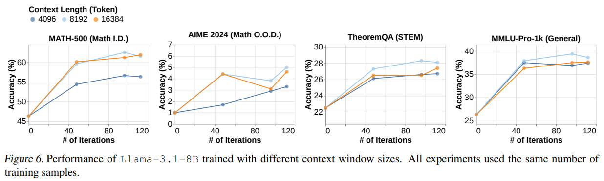

```
论文名称: Demystifying Long Chain-of-Thought Reasoning in LLMs
机构: 卡耐基梅隆大学
论文链接: https://arxiv.org/abs/2502.03373v1
发表日期: 2025年2月5日
GitHub：https://github.com/eddycmu/demystify-long-cot.git
```

[TOC]

在人工智能领域，大语言模型（LLMs）近年来发展迅猛，展现出了令人惊叹的能力。无论是解答复杂的数学问题，还是编写代码，LLMs 都能应对自如。这其中，链式思考（Chain-of-Thought，CoT）技术发挥了关键作用。它就像为模型注入了 “思考的脉络”，让模型在给出最终答案前，能够逐步生成中间推理步骤，大大提高了问题解决的准确性。

然而，当面对数学竞赛、博士级科学问答以及软件工程等高度复杂的推理任务时，即便有 CoT 技术加持，LLMs 仍显得力不从心。这些任务需要更深入的思考过程，比如精准识别并纠正错误、将复杂问题拆解成可解决的小部分，以及尝试多种不同的解决方法。

OpenAI 的 o1 和 DeepSeek 的 R1 模型带来了新的突破，它们通过扩展推理计算并采用长 CoT，显著提升了性能。这种方式让 LLMs 能够进行更长、更结构化的推理，类似人类的深度思考过程。受此启发，研究人员纷纷尝试训练 LLM 生成长 CoT，现有方法大多依赖可验证的奖励信号，以避免强化学习（RL）中的奖励黑客现象，但 LLM 学习和生成长 CoT 的机制仍未完全明晰。卡耐基梅隆大学的研究者们发表的《Demystifying Long Chain-of-Thought Reasoning in LLMs》这篇论文，就致力于系统研究长 CoT 生成的内在机制，为优化训练策略提供指导。

# 1. 论文核心发现

## 1.1 有监督微调（SFT）：训练的 “加速器”

SFT 并非生成长 CoT 的必要条件，但却能成为训练过程的 “加速器”。研究发现，使用长 CoT 数据进行 SFT，模型能够达到更高的性能上限。这就好比为模型搭建了一个更高的起跳平台，让它后续的提升空间更大。而短 CoT 数据进行 SFT，模型性能容易较早达到瓶颈，后续提升难度较大。

在获取长 CoT SFT 数据时，研究对比了两种方法：一是通过提示短 CoT 模型生成基本动作，再组合成长 CoT 轨迹；二是从现有的长 CoT 模型中提取轨迹。结果显示，从现有长 CoT 模型提取的轨迹，能让模型更好地泛化，在不同任务中表现更出色，并且在 RL 阶段的提升效果也更显著。

## 1.2 奖励机制：长链思考的 “稳定器”

随着训练计算量的增加，LLMs 的推理能力有提升的可能，但并非必然。此时，奖励机制就如同一个精准的 “稳定器”，对稳定 CoT 长度增长和促进深度推理至关重要。

简单的奖励函数，如只奖励正确答案，会导致 CoT 长度不稳定，甚至引发奖励黑客现象 —— 模型可能通过重复生成 token 来增加 CoT 长度，而非真正提升推理能力。为解决这一问题，论文引入了余弦长度缩放奖励，并加入重复惩罚机制。余弦奖励根据 CoT 的长度调整奖励，正确的短 CoT 能获得更高奖励，鼓励模型高效思考；错误的短 CoT 则受到更严厉惩罚，促使模型深入思考。重复惩罚机制有效抑制了模型的重复行为，让模型专注于提升推理能力。实验表明，采用这种奖励机制训练的模型，训练过程更加稳定，在各项任务中的表现也更优异。

## 1.3 可验证奖励信号：数据拓展的 “新方向”

可验证奖励信号对于稳定长 CoT RL 十分关键，但高质量的相关数据较为稀缺。论文探索利用从网络提取的带有噪声的解决方案（如 WebInstruct 数据集），并结合过滤机制来扩大可验证数据规模。实验发现，将这类数据加入到 SFT 中，可以增强模型的泛化能力，让模型在面对不同类型的任务时都能更好地适应。在 RL 阶段，使用规则验证器过滤带有短答案的数据集，能够更有效地利用这些噪声数据，提升模型性能。在一些超出分布（OOD）的任务，如 STEM 推理中，这种方法的效果尤为显著。

## 1.4 基础模型能力挖掘：潜藏的 “宝藏”

纠错、回溯等核心能力其实在基础模型中已经存在，只是需要合适的方式去激发。通过 RL 来激励这些能力，需要大量计算资源支持，并且评估其涌现需要更精细的方法。

研究发现，直接从基础模型进行 RL 训练，虽然能提升模型性能，但在激励长 CoT 行为（如回溯、纠错）方面效果不佳，模型输出长度也可能受限。相比之下，从长 CoT SFT 模型初始化的 RL 通常表现更好。此外，研究还发现互联网上的讨论论坛中存在大量长 CoT 模式，这表明长 CoT 能力可能在预训练阶段就已被部分学习，RL 更多是引导模型重新组合这些已有能力，以更好地解决复杂问题。

# 2. 训练 LLM 长链思考的方法详解

## 2.1 有监督微调（SFT）

在 SFT 环节，长 CoT 和短 CoT 数据对模型的影响差异明显。长 CoT SFT 能让模型接触到更丰富、更深入的推理过程，有助于模型学习到更复杂的知识，从而达到更高的性能上限。而短 CoT SFT 在提升模型性能方面相对有限，且容易达到瓶颈。

在数据获取上，从现有长 CoT 模型提取轨迹的优势突出。这种数据包含了成熟的推理模式，能让模型更好地理解和应用这些模式，进而在不同任务中表现更出色。就好比学生学习优秀同学的解题思路，能更快掌握知识并灵活运用。

## 2.2 强化学习（RL）

奖励函数设计是 RL 的核心。简单奖励函数的弊端促使研究人员创新设计了余弦长度缩放奖励和重复惩罚机制。这种新机制不仅稳定了 CoT 的增长，还鼓励模型探索分支和回溯等推理行为，让模型在面对问题时能够尝试多种思考路径，提升推理能力。

可验证奖励信号在长 CoT RL 中起着关键作用。研究人员探索使用带噪声的网络提取数据，并结合过滤机制，为扩大可验证数据规模提供了新途径。这使得模型能够在更丰富的数据上进行训练，提升泛化能力。

直接从基模型进行 RL 训练和从长 CoT SFT 模型初始化 RL 的效果不同。实验表明，从长 CoT SFT 模型初始化的 RL 表现更优。这表明在训练前为模型打好基础（通过 SFT），能让 RL 阶段的训练效果事半功倍。

不同类型的奖励和惩罚需要不同的最优折扣因子。例如，较低的折扣因子对重复惩罚更有效，能及时抑制模型的不良行为；较高的折扣因子对正确性奖励更有利，可提高模型追求正确答案的积极性。合理调整这些折扣因子，能优化模型训练效果。

## 2.3 模型结构相关因素

模型要充分利用更大的上下文窗口，需要更多的训练样本。实验显示，虽然 8K 窗口比 4K 窗口表现更好，但 16K 窗口在相同训练样本下不如 8K 窗口，这表明模型对大窗口的有效利用需要更多训练，就像人阅读长篇文章，阅读能力需逐步提升才能更好理解内容。

当训练计算量足够时，模型可能会出现通过重复增加 CoT 长度的奖励攻击现象。为解决这一问题，研究人员引入 n - gram 重复惩罚机制。该机制有效减少了模型的重复行为，提高了模型性能，确保模型专注于真正的推理过程。

# 3. 实验

论文通过大量实验验证了上述发现。在 SFT 扩展性实验中，使用长 CoT 进行 SFT 的模型性能上限更高，短 CoT SFT 的模型则较早饱和。在 SFT 对 RL 初始化作用的实验中，长 CoT SFT 初始化的模型在 RL 阶段更容易提升性能，而短 CoT SFT 初始化的模型提升幅度较小。


从现有长 CoT 模型蒸馏得到的数据，比通过动作提示框架构建的数据泛化能力更好，且在 RL 阶段仍有提升空间。在奖励设计影响实验中，简单奖励函数导致 CoT 长度不稳定且出现奖励黑客现象，而余弦奖励有效稳定了 CoT 长度，提升了模型训练效率和性能，奖励超参数也对 CoT 长度和模型行为产生显著影响。


模型充分利用更大的上下文窗口需要更多训练数据，8K 窗口在相同训练样本下表现优于 16K 窗口。将带噪声的 WebInstruct 数据加入 SFT，能提高模型泛化能力；使用规则验证器过滤带有短答案的数据集，可提升 RL 性能。直接从基础模型开始 RL 训练，在激励长 CoT 行为方面效果不佳，且输出长度可能受限，而从长 CoT SFT 模型初始化的 RL 表现更好。互联网上的讨论论坛中存在大量长 CoT 模式，表明长 CoT 能力可能在预训练阶段已被部分学习。



# 4. 小结

这篇论文深入剖析了 LLM 长链思考的机制，通过一系列实验揭示了 SFT、奖励机制、可验证奖励信号扩展以及基础模型能力挖掘等方面的关键信息，为训练具有深度推理能力的 AI 提供了重要的理论基础和实践指导。它明确指出了训练长 CoT 面临的挑战，并给出了切实可行的方法，为未来的研究指明了方向。

```
笔者能力有限，欢迎批评指正或者在留言区讨论
```

