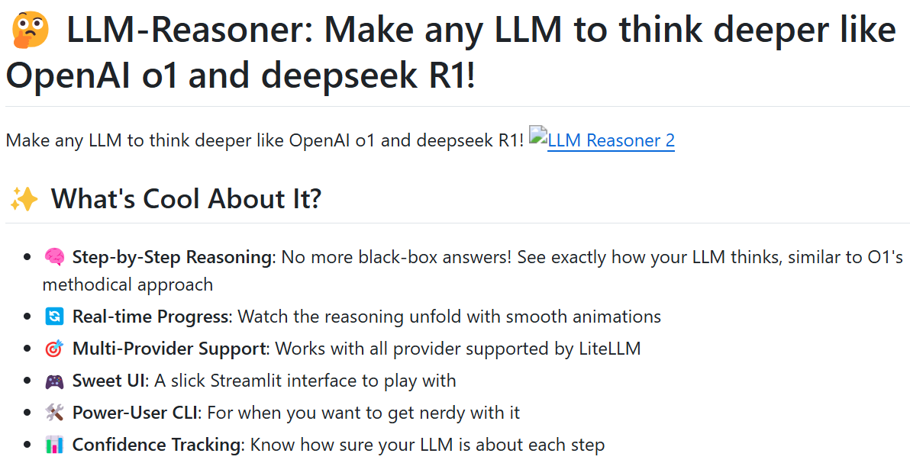

```
github: https://github.com/harishsg993010/LLM-Reasoner
```

[TOC]

今天给大家分享一个超厉害的库 ——LLM - Reasoner，它就像给大模型开了 “智慧外挂”，能让任何大语言模型（LLM）都像 OpenAI o1 和 DeepSeek R1 一样深入思考！不管你是 AI 技术控，还是想提升大模型使用体验的小伙伴，都别错过～



# 1. LLM - Reasoner 是啥 “宝藏”？

LLM - Reasoner 本质是个库，致力于打破大模型给出 “黑箱答案” 的局面。以往，大模型输出结果时，咱根本不知道它是怎么思考的，就像拆盲盒，充满未知。但有了 LLM - Reasoner，这一切都变啦！它能让我们清晰地看到大模型的推理过程，了解每一步是如何得出的，是不是超酷？

# 2. 亮点满满，实力 “圈粉”

- **循序渐进的推理**：不再对大模型的思考过程一头雾水，LLM - Reasoner 会像 O1 的系统方法一样，把推理过程一步步展示出来，让答案的得出有理有据。
- **实时进度查看**：通过流畅的动画，我们可以直观地看到推理是如何展开的。这就好比看一场思维的 “电影”，每一个情节都清晰呈现，满足我们的好奇心。
- **多提供商支持**：只要是 LiteLLM 支持的提供商，LLM - Reasoner 都能兼容。这意味着无论你常用哪个大模型服务，它都能适配，灵活性拉满。
- **精美的 UI 界面**：基于 Streamlit 打造的界面，颜值超高！操作简单又直观，就算是技术小白也能轻松上手。
- **高级用户 CLI**：对于技术大神们，它还提供了高级用户命令行界面（CLI），可以无缝嵌入代码，满足个性化开发需求。
- **信心跟踪**：能让我们了解大模型对每个推理步骤的确定程度。这样一来，我们对答案的可靠性就有了更清晰的判断，使用起来更安心。

# 3. 国内小伙伴的使用指南

国内的小伙伴可能在使用 OpenAI 相关服务时有些不便，别担心，LLM - Reasoner 早就考虑到啦！大家可以选择与 OpenAI 接口兼容的模型，或者用 llama_cpp_python 启动本地 LLM 服务，这个服务接口和 OpenAI 接口是兼容的，轻松就能用上这个神器。

# 4. 快速上手教程

- **安装超简单**：打开终端，输入`pip install llm - reasoner`，按回车，等待安装完成就行，就这么轻松！
- **设置 OpenAI key**：安装好后，还需要设置 OpenAI 的 API key。在终端输入`export OPENAI_API_KEY="sk - your - key"`，记得把 “sk - your - key” 换成你自己的 OpenAI API 密钥哦。要是没有 OpenAI 账号，按照上面说的，选择其他兼容模型或搭建本地服务就好。
- **基础用法示例**
  - **查看可用模型**：想知道有哪些模型能用？在终端输入`llm - reasoner models`，所有可用模型就会一目了然啦。
  - **生成推理链**：比如想了解 “飞机是怎么飞起来的”，就在终端输入`llm - reasoner reason "How do planes fly?" --min - steps 5`，这里的 “--min - steps 5” 表示最少推理 5 步，你可以根据需求调整。
  - **启动 UI 界面**：要是喜欢图形化操作，输入`llm - reasoner ui`，就能打开漂亮的 Streamlit 界面，在里面轻松探索大模型的推理世界。
- **代码中使用**：对于喜欢在代码里 “折腾” 的小伙伴，下面这段代码可以安排上：

```python
from llm_reasoner import ReasonChain
import asyncio

async def main():
    # 创建一个推理链，可自行设置参数
    chain = ReasonChain(
        model="gpt - 4",  # 选择你想用的模型
        min_steps=3,  # 最小推理步数
        temperature=0.2,  # 控制生成内容的创造性，数值越低越保守
        timeout=30.0  # 设置超时时间
    )
    # 逐步查看推理过程
    async for step in chain.generate_with_metadata("Why is the sky blue?"):
        print(f"\nStep {step.number}: {step.title}")
        print(f"Thinking Time: {step.thinking_time:.2f}s")
        print(f"Confidence: {step.confidence:.2f}")
        print(step.content)

asyncio.run(main())
```

运行这段代码，就能看到大模型针对 “天空为什么是蓝色的” 这个问题一步步推理，还能知道每步的思考时间和大模型对答案的信心程度！

```
笔者能力有限，欢迎批评指正或者在留言区讨论。
```