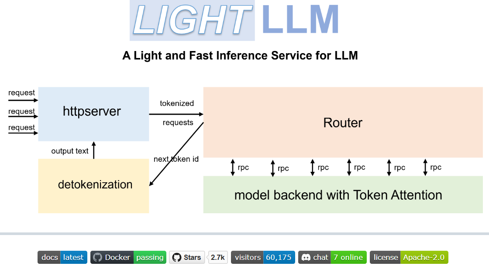
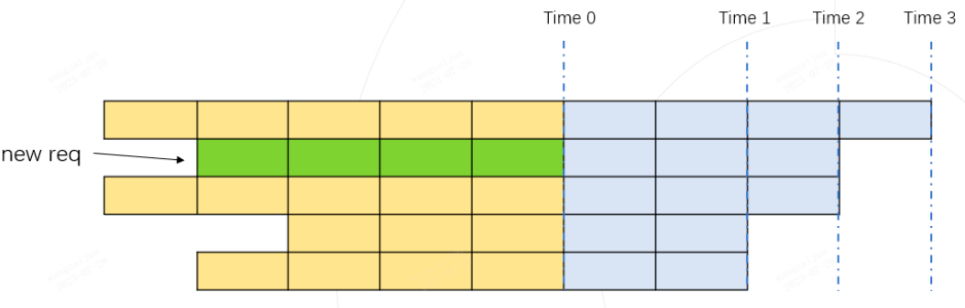
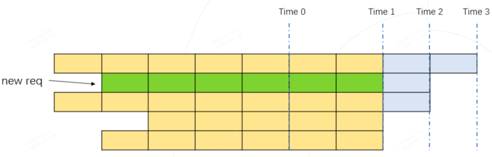
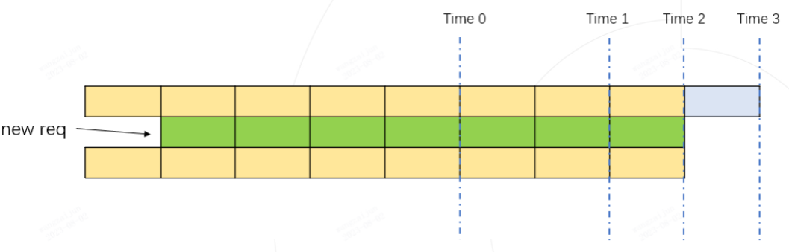
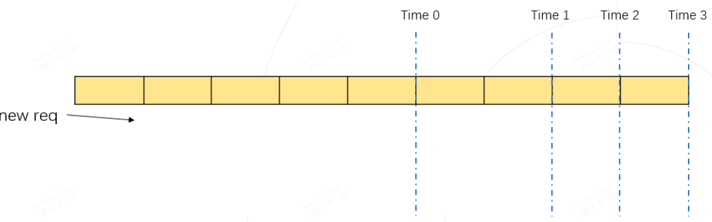
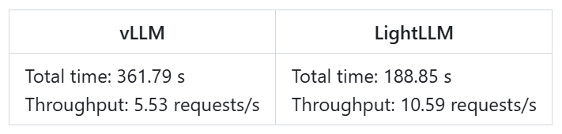

[TOC]

欢迎关注微信公众号：鸿煊的学习笔记



自 ChatGPT 掀起热潮以来，LLM备受瞩目。无论是文本创作、信息检索还是问题解答，都展现出非凡的潜力。然而，在这些模型迈向广泛应用的征程中，却面临着一道难以逾越的鸿沟 —— 如何在各类服务器上实现低成本、高吞吐的部署。

参数量动辄千亿的大语言模型，对服务器资源的需求巨大，高昂的部署成本和有限的吞吐量，如同两把枷锁，束缚了其进一步普及的脚步。为了打破这一僵局，让更多人能够畅享大语言模型带来的便利，一个创新性的解决方案 ——LightLLM 推理服务框架应运而生。

LightLLM 引入了一种更为精细的 kv cache 管理算法 TokenAttention，同时，精心设计的 Efficient Router 调度实现，与 TokenAttention 紧密配合，如一台精密的导航仪，确保数据在模型中的顺畅流转。在它们的协同作用下，LightLLM 在大多数场景中展现出卓越的性能，吞吐量超越了 vLLM 和 Text Generation Inference，在部分情况下，性能提升幅度更是高达 4 倍左右。

LightLLM 不仅性能卓越，而且灵活易用。无论你是经验丰富的开发者，还是刚刚踏入人工智能领域的新手，都能轻松上手部署。

# 1. LLM Serving 的挑战

大语言模型在自然语言处理领域表现卓越，如 BLOOM、LLaMA 等模型不仅能进行日常对话，还能助力生产工作，提高效率。然而，其部署面临诸多挑战：

- **显存碎片化严重**：模型权重及推理时的 KV Cache 需占用大量显存，易导致显存利用率低。

- **请求调度效率低**：请求长度动态变化，可能造成 GPU 空转或利用率低。

- **kernel 定制化难度高**：为高效利用显存和提高服务吞吐量，需定制 cuda c kernel，对普通研究员难度较大。

# 2. 已有的解决方案和问题

为应对上述挑战，涌现出诸多优秀的 LLM 推理框架，如 FasterTransformer、Text-Generation-Inference（TGI）、vLLM 等，它们各具特色：

### 2.1 NV Triton + FasterTransformer

- **核心 feature**：算子高效，静态速度快。
- **问题**：没有良好的服务调度处理功能，且主体用 C++ 开发，二次开发成本较高。

### 2.2 Text-Generation-Inference（TGI）

- **核心 feature**：具有优秀的服务接口和服务调度特性，如 Continuous Batch。
- **问题**：推理性能、调度策略、显存管理存在缺憾，显存碎片化严重，难以达到较高吞吐量。

### 2.3 vLLM

- **核心 feature**：显存管理优秀，引入 PageAttention。
- **问题**：请求调度效率不高，整体实现细节更适合小模型部署，在大模型上并发性能不理想。

# 3. LightLLM 是什么

LightLLM 是一款基于 Python 的 LLM 推理和服务框架，以轻量级设计、易于扩展和高速性能著称。它利用了众多优秀开源实现的优势，如 FasterTransformer、TGI、vLLM 和 FlashAttention 等，致力于解决大模型推理部署中的显存碎片化、请求调度等问题，为研究员提供轻量级的本地部署和定制修改方案，以探索最优服务架构。项目地址为https://github.com/ModelTC/lightllm/。

# 4. LightLLM 的特点

- **轻量级设计**：占用资源少，易于部署和扩展，方便更多人参与其中，快速上手进行本地部署和定制修改。

- **高性能**：通过多种优化技术，如三进程异步协作、Token Attention、Efficient Router 等，实现高速推理，在不同大小模型下都能保持稳健性能，获得更高的吞吐量。

- **易用性**：提供 Docker 容器和详细文档，简化使用流程，降低使用门槛。

- **广泛兼容性**：支持多种模型（如 BLOOM、LLaMA、StarCoder 等）和 GPU 架构，确保广泛的适用性。

# 5. LightLLM 的主要特性

## 5.1 三进程异步协作

将 tokenization、模型推理和 detokenization 异步执行，提高 GPU 利用率。tokenization 在 httpserver 中完成，router 和 model 使用独立进程，detokenization 也用独立进程，进程间通过管道 Pipe 和 “zmq” 库通信，主进程 httpserver 负责连接客户端与内部，router 和 detokenizer 通过 asyncio 构建异步死循环处理任务，通过 “request_id” 保持输入输出对应关系。

## 5.2 Nopad（无填充）

支持跨多个模型的无填零注意操作，有效处理长度差异较大的请求。

## 5.3 动态批处理

实现请求的动态批处理调度，优化资源分配，根据请求情况灵活调整批处理策略，提高系统处理效率。

## 5.4 FlashAttention

结合 FlashAttention 提高速度并减少推理过程中 GPU 内存占用，通过平铺减少 GPU 高带宽存储器和片上 SRAM 之间的存储器读写次数，优化注意力计算过程。

## 5.5 张量并行性

利用多个 GPU 的张量并行性进行更快的推理，加速模型计算过程，适用于大规模模型部署。

## 5.6 TokenAttention

实现逐 Token 的 KV 缓存内存管理机制，允许在推理过程中零内存浪费，以 Token 为粒度管理显存，能精确计算系统可容纳新 Token 数量，配合高性能 Router 可最大化 GPU 利用率。

## 5.7 高性能路由器

与 TokenAttention 合作，精心管理每个 token 的 GPU 内存，优化系统吞吐量，通过精确判断请求能否与运行 Batch 融合，合理配置避免 OOM 风险。

## 5.8 Int8KV 缓存

此功能将使 token 的容量几乎增加一倍（仅 LLAMA 支持），进一步提升模型性能。

# 6. LightLLM 支持的模型

LightLLM 支持多种流行的大型语言模型

- [BLOOM](https://huggingface.co/bigscience/bloom)
- [LLaMA](https://github.com/facebookresearch/llama)
- [LLaMA V2](https://huggingface.co/meta-llama)
- [StarCoder](https://github.com/bigcode-project/starcoder)
- [Qwen-7b](https://github.com/QwenLM/Qwen-7B)
- [ChatGLM2-6b](https://github.com/THUDM/ChatGLM2-6B)
- [InternLM-7b](https://github.com/InternLM/InternLM)
- [InternVL-Chat](https://huggingface.co/OpenGVLab/InternVL-Chat-V1-5)
- [Qwen-VL](https://huggingface.co/Qwen/Qwen-VL)
- [Qwen-VL-Chat](https://huggingface.co/Qwen/Qwen-VL-Chat)
- [Qwen2-VL](https://huggingface.co/Qwen/Qwen2-VL-7B-Instruct)
- [Llava-7b](https://huggingface.co/liuhaotian/llava-v1.5-7b)
- [Llava-13b](https://huggingface.co/liuhaotian/llava-v1.5-13b)
- [Mixtral](https://huggingface.co/mistralai/Mixtral-8x7B-Instruct-v0.1)
- [Stablelm](https://huggingface.co/stabilityai/stablelm-2-1_6b)
- [MiniCPM](https://huggingface.co/openbmb/MiniCPM-2B-sft-bf16)
- [Phi-3](https://huggingface.co/collections/microsoft/phi-3-6626e15e9585a200d2d761e3)
- [CohereForAI](https://huggingface.co/CohereForAI/c4ai-command-r-plus)
- [DeepSeek-V2-Lite](https://huggingface.co/deepseek-ai/DeepSeek-V2-Lite)
- [DeepSeek-V2](https://huggingface.co/deepseek-ai/DeepSeek-V2)

不同模型在启动时可能需要设置特定参数，例如启动 Qwen-7b 时需设置 “--eos_id 151643 --trust_remote_code” 等参数。

# 7. LightLLM 技术原理

## 7.1 TokenAttention 显存管理

- **初始化**：模型初始化时，根据设置的 max_total_token_num 预先分配 KV Cache，并创建 Token Table 记录输入 token 存储位置。

  - 具体地，在模型初始化时，系统根据用户设置的 max_total_token_num 预先分配 KV Cache，并创建 Token Table 来记录输入 token 的实际存储位置。其中，max_total_token_num为部署环境的硬件显存一次最多能容纳的token总量。
  - 当请求到来时，系统首先检查预分配的Token Cache中是否有可用的连续空间用于存储请求的KV 缓存。系统倾向于为请求分配连续的显存，以最大限度地减少推理过程中的访存时间，仅当连续空间不足时，才会为请求分配非连续显存。分配的空间会记录到Token Table中，以便于后续的注意力计算。
  - 对于自回归过程新生成的 token 的缓存，仅需从预先分配的 Token 缓存中找到未使用的空间，并将相应的记录添加到 Token Table 中即可。

  

- **请求处理**：新请求到来时，检查 Token Cache 中是否有连续空间存储 KV 缓存，倾向分配连续显存，空间不足时分配非连续显存并记录到 Token Table；自回归生成新 token 时，从预分配 Token 缓存找未使用空间并记录；利用 torch Tensor 在 GPU 上的并行计算特性管理 Cache 状态，通过状态定义和计算高效筛选未使用空间进行分配，请求完成后删除 Token Table 记录释放空间，实现零内存浪费并精确计算剩余可容纳 token 量。

## 7.2 Efficient Router 请求管理

Router 主要功能是管理请求，判断能否与已有运行 Batch 融合推理。通过估计合并后推理过程中 Token 最大占用量是否小于 max_total_token_num 来决定，利用 numpy 实现高效计算示例，根据请求待输出长度排序，计算不同时刻 token 占用量，保证最大 token 使用量不超上限则可合并推理，合理配置可避免 OOM 风险。



如上图所示，每行代表一个请求当前的运行状态，深色代表已经运行完的历史 kv cache token， 每个格子代表一个token，灰色代表待生成的token，待生成的token数由每个请求设置的最大输出长度和已经生成的token数决定。上图中的第二行绿色格子所在的行代表一个新到达的请求，图中将所有请求按照待输出的长度进行从大到小的顺序排列。

如果我们假设将新请求融合到Batch中进行推理，那token的最大使用量必然在 时刻 Time 1， Time 2， Time 3 中某个时刻到来。我们只需要计算这三个时刻对应的token使用量都不超过 max_total_token_num, 则代表新的请求可以加入到Batch中进行融合推理。

Time 1 token 的总占用量为：黄色格子数量 + 绿色格子数量 （下图）



Time 2 token 的总占用量为：黄色格子数量 + 绿色格子数量（下图）



Time 3 token 的总占用量为：黄色格子数量（下图）



实际的 token 最大使用量，必然是 Time 1， Time 2， Time 3 其中之一。

只要保证动态推理过程中的最大token使用量 <= max_total_token_num, 说明新的请求可以进行合并Batch推理。

为了快速的计算一个Batch的所有请求需要的最大token使用量，我们利用numpy实现了一个高效的示例实现，下面是python伪代码：

```python
import numpy as np  
  
def demo():  
    max_total_token_num = 100  
    req_list = [(5, 4), (4, 3), (5, 3), (3, 2), (4, 2)]  # (run_len, left_output_len)  
    req_list.sort(key=lambda x: -x[1])  
  
    left_out_len_array = np.array([e[1] for e in req_list])  
    has_run_len_array = np.array([e[0] for e in req_list])  
    cum_run_len_array = np.cumsum(has_run_len_array)  
    size_array = np.arange(1, len(req_list) + 1, 1)  
    need_max_token_num = (left_out_len_array * size_array + cum_run_len_array).max()  
  
    if need_max_token_num <= max_total_token_num:  
        print("ok")  
    else:  
        print("oom")  
```

# 8. LightLLM 性能表现

## 8.1 与主流推理框架对比

在数据集 ShareGPT_Vicuna_unfiltered 上，LightLLM 与 TGI、NV Triton + FasterTransformer、vLLM 对比，在不同大小模型下均获得更高吞吐量。如在 LLaMA - 7B 模型上，LightLLM 总时间为 188.85s，吞吐量为 10.59 requests/s，而 vLLM 总时间为 361.79s，吞吐量为 5.53 requests/s。



## 8.2 TGI 兼容与消融分析

将 TokenAttention 和 Router 特性接入 TGI 后，可显著提升其性能，给原始 TGI 带来 4 倍以上性能提升，有效改善显存碎片化问题。

## 8.3 长短不齐请求下的提升

针对问题差异更大的请求集合测试，LightLLM 的高性能 Router 在问题长度差异大的请求下，能更好利用 GPU 资源，带来近 50% 的性能提升。

# 9. LightLLM 应用场景

- 自然语言处理：如文本生成、翻译、摘要等任务，帮助用户快速生成高质量文本内容。
- 对话系统：用于聊天机器人、客服系统等，实现智能对话交互，提升用户体验。
- 内容创作：辅助代码生成、创意写作等，激发创作灵感，提高创作效率。
- 教育辅导：作为智能辅导系统、学习助手等，为学生提供个性化学习支持。

# 10. LightLLM 如何使用

## 10.1 安装

- 确保已安装相关依赖，github仓库的代码的环境是 CUDA 12.4 及 Python 3.9 环境。可参考 requirements.txt 安装依赖，如使用 cuda 12.4，执行 “pip install -r requirements.txt --extra-index-url https://download.pytorch.org/whl/cu124”。

```
# for cuda 12.4
pip install -r requirements.txt --extra-index-url https://download.pytorch.org/whl/cu124
```

- 安装 Triton Package，推荐使用 triton==3.0.0，执行 “pip install triton==3.0.0 --no-deps”
- 若在 H800 或 V100 运行，可尝试 triton-nightly 获取更好性能，执行 “pip install --index-url https://aiinfra.pkgs.visualstudio.com/PublicPackages/_packaging/Triton-Nightly/pypi/simple/triton-nightly”。

从源代码安装 LightLLM，执行 “python setup.py install”。

## 10.2 容器使用

- 可使用官方 Docker 容器更方便运行模型，先从 GitHub Container Registry 拉取容器，执行

  ```
  docker pull ghcr.io/modeltc/lightllm:main
  ```

- 运行容器时进行 GPU 支持和端口映射，如

  ```
  docker run -it --gpus all -p 8080:8080                  \
          --shm-size 1g -v your_local_path:/data/         \
          ghcr.io/modeltc/lightllm:main /bin/bash
  ```

- 也可以自己创建容器。命令如下：

  ```
  docker build -t <image_name> .
  docker run -it --gpus all -p 8080:8080                  \
          --shm-size 1g -v your_local_path:/data/         \
          <image_name> /bin/bash
  ```

- 也可使用辅助脚本启动容器和服务器，命令

  ```
  python tools/quick_launch_docker.py --help
  ```

  若使用多个 GPU，可能需增加共享内存大小，如添加 “--shm-size” 参数。

## 10.3 模型运行

- 以 LLaMA 模型为例，启动服务器时执行 “python -m lightllm.server.api_server --model_dir /path/llama - 7B --host 0.0.0.0 --port 8080 --tp 1 --max_total_token_num 128868”，

  ```
  python -m lightllm.server.api_server --model_dir /path/llama-7B     \
                                       --host 0.0.0.0                 \
                                       --port 8080                    \
                                       --tp 1                         \
                                       --max_total_token_num 120000
  ```

- 参数 max_total_token_num 受部署环境显存影响，也可指定 “--mem_fraction” 自动计算。还可设置其他参数，如 “--mem_fraction”。如下：

  ```
  python -m lightllm.server.api_server --model_dir /path/llama-7B     \
                                       --host 0.0.0.0                 \
                                       --port 8080                    \
                                       --tp 1                         \
                                       --mem_faction 0.9
  ```

- 在命令行发起查询，如：

  ```
  curl http://127.0.0.1:8080/generate     \
      -X POST                             \
      -d '{"inputs":"What is AI?","parameters":{"max_new_tokens":17, "frequency_penalty":1}}' \
      -H 'Content-Type: application/json'
  ```

- 从 Python 发起查询时，需导入相关库，设置请求 URL、参数、数据格式等，如：

```python
import time
import requests
import json

url = 'http://localhost:888/generate'
data = {
    "inputs": "What is AI?",
    "parameters": {
        'do_sample': False,
        'ignore_eos': False,
        'max_new_tokens': 1024,
    }
}
headers = {'Content-Type': 'application/json'}
response = requests.post(url, headers=headers, data=json.dumps(data))
if response.status_code == 200:
    print(response.json())
else:
    print("Error:", response.status_code, response.text)
```

## 10.4 多模态模型运行

- 运行 QWen - VL 模型，执行： 

  ```
  python -m lightllm.server.api_server \
      --host 0.0.0.0                 \
      --port 8080                    \
      --tp 1                         \
      --max_total_token_num 12000    \
      --trust_remote_code            \
      --enable_multimodal            \
      --cache_capacity 1000          \
      --model_dir /path/of/Qwen-VL or /path/of/Qwen-VL-Chat
  ```

- 运行 Llava 模型，执行：

  ```
  python -m lightllm.server.api_server \
      --host 0.0.0.0                 \
      --port 8080                    \
      --tp 1                         \
      --max_total_token_num 12000    \
      --trust_remote_code            \
      --enable_multimodal            \
      --cache_capacity 1000          \
      --model_dir /path/of/llava-v1.5-7b or /path/of/llava-v1.5-13b
  ```

## 10.5 查询多模态模型

从 QWen-VL 查询：

```python
import time
import requests
import base64
import json

url = 'http://localhost:8080/generate'
headers = {'Content-Type': 'application/json'}
uri = "/local/path/of/image"  # 或 "/http/path/of/image"
if uri.startswith("http"):
    images = [{"type": "url", "data": uri}]
else:
    with open(uri, 'rb') as fin:
        b64 = base64.b64encode(fin.read()).decode("utf-8")
    images = [{'type': "base64", "data": b64}]
data = {
    "input": "对图片的描述",
    "parameters": {
        "max_new_tokens": 100,
        "stop_sequences": "<|InnerThoughtBegin|>",
    },
    "multimodal_params": {
        "images": images,
    }
}
response = requests.post(url, headers=headers, data=json.dumps(data))
if response.status_code == 200:
    print(response.json())
else:
    print("Error:", response.status_code, response.text)
```

从 QWen-VL-Chat 查询时，定义函数处理查询和图像数据，如：

```python
import json
import requests
import base64

def run_once(query, uris):
    images = []
    for uri in uris:
        if uri.startswith("http"):
            images.append({"type": "url", "data": uri})
        else:
            with open(uri, 'rb') as fin:
                b64 = base64.b64encode(fin.read()).decode("utf-8")
            images.append({'type': "base64", "data": b64})
    data = {
        "inputs": query,
        "parameters": {
            "max_new_tokens": 200,
            "stop_sequences": "<|InnerThoughtBegin|>", "<|FunctionCallBegin|>", "<|FunctionCallEnd|>",
        },
        "multimodal_params": {
            "images": images,
        }
    }
    url = "http://127.0.0.1:888/generate"
    headers = {'Content-Type': 'application/json'}
    response = requests.post(url, headers=headers, data=json.dumps(data))
    if response.status_code == 200:
        print("+result: {}".format(response.json()))
    else:
        print("+error: {}".format(response.status_code, response.text))

multi_img, multi_round = [
    "<|InnerThoughtBegin|>system You are a helpful assistant.<|InnerThoughtEnd|>",
    "<|InnerThoughtBegin|>user </img> </img> 上面两张图片分别是哪两个城市?请对它们进行对比。<|InnerThoughtEnd|>",
    "<|InnerThoughtBegin|>assistant 根据提供的信息,两张图片分别是重庆和北京。<|InnerThoughtEnd|>",
    "<|InnerThoughtBegin|>user 这两座城市分别在什么地方?<|InnerThoughtEnd|>",
    "<|InnerThoughtBegin|>assistant",
]
run_once(multi_img, multi_round, ["assets/mm_tutorial/Chongqing.jpeg", "assets/mm_tutorial/Beijing.jpeg"])
```

从 Llava 查询时，类似 QWen-VL 查询设置请求参数和处理图像数据，如：

```python
import time
import requests
import json
import base64

url = 'http://localhost:8080/generate'
headers = {'Content-Type': 'application/json'}
uri = "/local/path/of/image"  # 或 "/http/path/of/image"
if uri.startswith("http"):
    images = [{"type": "url", "data": uri}]
else:
    with open(uri, 'rb') as fin:
        b64 = base64.b64encode(fin.read()).decode("utf-8")
    images = [{'type': "base64", "data": b64}]
data = {
    "inputs": "A chat between a curious human and an artificial intelligence assistant. The assistant gives helpful, detailed, a",
    "parameters": {
        "max_new_tokens": 200,
    },
    "multimodal_params": {
        "images": images,
    }
}
response = requests.post(url, headers=headers, data=json.dumps(data))
if response.status_code == 200:
    print(response.json())
else:
    print('Error:', response.status_code, response.text)
```

参考：

- https://zhuanlan.zhihu.com/p/660193055
- https://github.com/ModelTC/lightllm/tree/main
- https://gitcode.com/gh_mirrors/li/lightllm?utm_source=artical_gitcode&index=top&type=card&webUrl
- https://aibard123.com/digest/2023/0803/LightLLM%E7%BA%AFPython%E8%B6%85%E8%BD%BB%E9%87%8F%E9%AB%98%E6%80%A7%E8%83%BDLLM%E6%8E%A8%E7%90%86%E6%A1%86%E6%9E%B6/


