```
原文链接：https://towardsdatascience.com/an-overview-of-the-lora-family-515d81134725/
```

[TOC]

在大语言模型（LLMs）的训练领域，Low - Rank Adaptation（LoRA）技术堪称一项重大突破。它就像给模型训练开启了一条 “高速通道”，让我们能更高效地为特定任务训练大语言模型。如今，LoRA 在众多应用场景中广泛使用，并且引发了一系列改进研究，催生出了许多变体，这些变体从不同角度优化 LoRA，提升训练速度、性能，或者两者兼得。今天，咱们就来深入了解一下 LoRA 及其家族成员的奥秘。

# 1. LoRA：基础概念与核心优势

LoRA 的核心做法是在预训练权重矩阵 W 旁边添加两个较小的可训练矩阵 A 和 B，同时不改变 W 的参数。想象一下，预训练的权重矩阵 W 是一个经验丰富的 “老将”，已经具备了很多通用知识，但在应对特定任务时还不够完美。这时，矩阵 A 和 B 就像是两个灵活的 “小助手”，在不打扰 “老将” 的情况下，通过自身的训练，为模型在特定任务上提供额外助力。

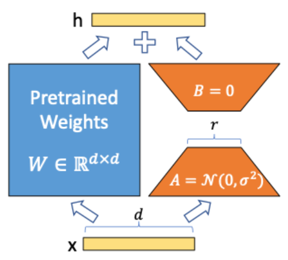

假设原始参数矩阵 W 的大小是 d x d，矩阵 A 的大小是 r x d，矩阵 B 的大小是 d x r，这里的 r 比 d 小很多（比如通常取 r=16） ，r 被称为秩。训练时，输入数据在经过 W 的同时也会经过 A 和 B，B 的输出会与 W 的输出相加，以此来影响模型的最终预测结果。并且，A 和 B 的添加可以应用于神经网络内部的多个层，而不只是在模型的最后添加一层。

在初始化时，矩阵 A 被赋予均值为零、有一定方差的随机值，矩阵 B 则被初始化为全零矩阵。这样的初始化方式能确保在训练初期，LoRA 矩阵不会对原始 W 的输出产生随机干扰，只有在 A 和 B 的参数朝着理想方向调整后，才会逐步对原始输出起到补充优化作用 。与传统的微调方法相比，LoRA 最大的优势就是大幅减少了需要训练的参数数量，却能达到相当的性能表现。

# 2. LoRA+：优化学习率，提升训练效率

LoRA + 在 LoRA 的基础上，为矩阵 A 和 B 引入了不同的学习率。在大多数神经网络训练中，通常会对所有权重矩阵采用相同的学习率。然而，LoRA + 的研究者发现，对于 LoRA 中的适配器矩阵（即 A 和 B）而言，这种单一学习率并非最优选择。

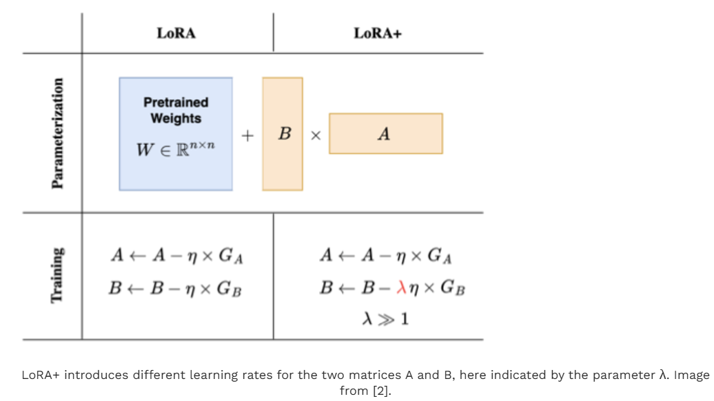

从理论上讲，当模型的神经元数量增多，模型变得更 “宽” 时，基于神经网络初始化的一些数值特性，将矩阵 B 的学习率设置得比矩阵 A 高很多，能够提升训练效率。直观地理解，矩阵 B 初始化为零，它就像一张 “白纸”，可以接受更大的更新步长来快速学习；而矩阵 A 是随机初始化的，更新时需要更谨慎。

实际验证也表明，将矩阵 B 的学习率设置为矩阵 A 的 16 倍时，在像 RoBERTa 或 Llama - 7b 这样的模型训练中，不仅能使模型准确率有大约 2% 的小幅度提升，还能将训练时间缩短一半。

# 3. VeRA：减少参数，借助随机投影 “四两拨千斤”

VeRA（Vector - based Random Matrix Adaptation）另辟蹊径，它不再训练矩阵 A 和 B，而是将它们初始化为共享的随机权重矩阵，同时添加两个新的向量 d 和 b 进行训练。这一做法可能让人疑惑：不训练 A 和 B，它们能发挥什么作用呢？

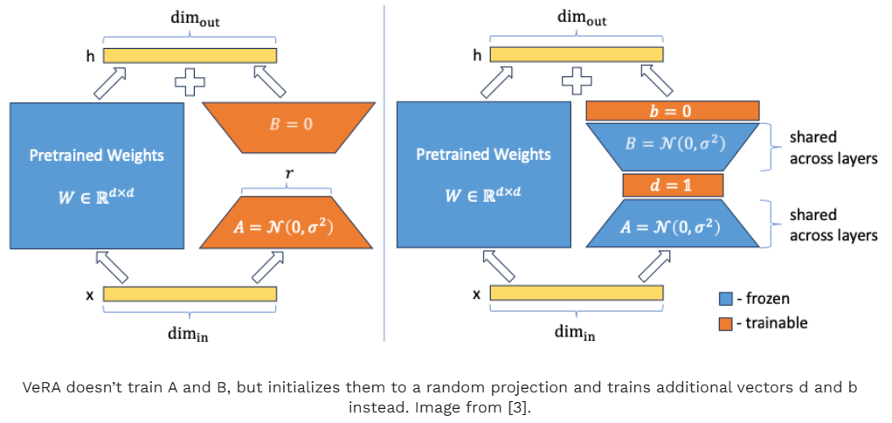

这背后涉及到随机投影的研究。在大型神经网络中，其实只有一小部分权重对模型在特定任务上的行为和性能起到关键作用。基于这个原理，VeRA 通过在随机初始化的矩阵后添加投影向量 d 和 b，实现了与调整矩阵中稀疏参数类似的效果。而且，与原始 LoRA 不同，VeRA 中的矩阵 B 不再初始化为零，而是和矩阵 A 一样随机初始化。

以给 GPT - 3 引入秩为 16 的 LoRA 层为例，使用传统 LoRA 方法会有 7550 万个参数，而 VeRA 仅需 280 万个参数，参数减少了 97%。在 GLUE 或 E2E 等常见基准测试中，VeRA 模型的性能仅略低于完全微调的模型或使用原始 LoRA 技术的模型。

# 4. LoRA - FA：冻结矩阵 A，简化训练

LoRA - FA（LoRA with Frozen - A）和 VeRA 的思路有些相似，它在初始化后冻结矩阵 A，让 A 充当随机投影的角色，只训练矩阵 B。矩阵 B 的初始化方式和原始 LoRA 一样，为零矩阵。通过这种方式，LoRA - FA 将需要训练的参数数量减少了一半，同时在性能上与普通 LoRA 相当。

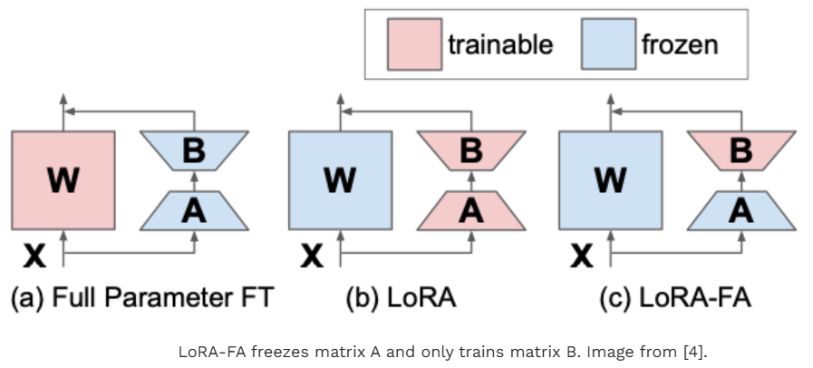

# 5. LoRA - drop：智能筛选，减少不必要训练

在神经网络中，虽然添加 LoRA 矩阵比微调整个模型成本低，但添加的 LoRA 适配器越多，训练成本依然会增加。LoRA - drop 就像是一个 “智能筛选器”，它引入一种算法来判断哪些层值得用 LoRA 进行增强，哪些层则不需要。

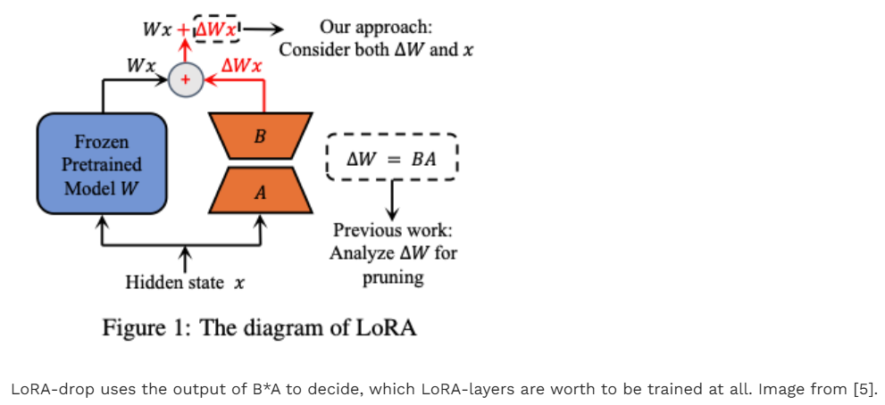

具体操作分两步：第一步，先从数据集中采样一个子集，用这个子集训练 LoRA 适配器几次，然后计算每个 LoRA 适配器的重要性，计算方式是B x A x x（其中 x 是输入），这个结果代表了 LoRA 适配器对冻结层输出的改变程度，值越大说明对冻结层行为影响越大，也就越重要；第二步，根据计算出的重要性，选择最重要的 LoRA 层。可以通过设定阈值，累加重要性值达到阈值时确定所选层，也可以直接选取前 n 个重要性最高的层。确定好要训练的层后，再用整个数据集对这些层进行完整训练，其他层则固定为一组共享参数，不再训练。实验表明，与训练所有 LoRA 层相比，LoRA - drop 在准确率上仅有微小变化，但由于减少了训练参数数量，大大降低了计算时间。

# 6. AdaLoRA：动态调整矩阵秩，精准分配资源

AdaLoRA（Adaptive LoRA）的独特之处在于能够动态调整 LoRA 矩阵的秩。在实际应用中，并非所有层都需要添加相同规模的 LoRA 矩阵，有些层对模型性能的影响更大，需要更高的秩来进行更精细的调整。

AdaLoRA 通过考虑 LoRA 矩阵的奇异值来判断其重要性。简单来说，矩阵乘法可以看作是对向量应用一个函数，当我们想减少矩阵参数又希望函数行为改变尽可能小时，可以通过计算矩阵的特征值（奇异值是特征值的平方根）来决定保留哪些行。对于那些只捕获少量方差、对函数贡献不大的行，可以将其设置为零，从而缩小矩阵的秩。

与 LoRA - drop 不同，AdaLoRA 不是完全舍弃某些层的适配器，而是根据情况降低一些层适配器的秩，使得不同的适配器可以有不同的秩。并且，AdaLoRA 在计算时不会每次都显式计算奇异值（因为计算成本高），而是通过奇异值分解来获取奇异值。同时，它不仅考虑奇异值，还会结合损失对某些参数的敏感度来综合判断。在许多场景下，同样的总参数数量，AdaLoRA 通过更合理地分配可训练参数，比标准 LoRA 方法获得了更好的分数。

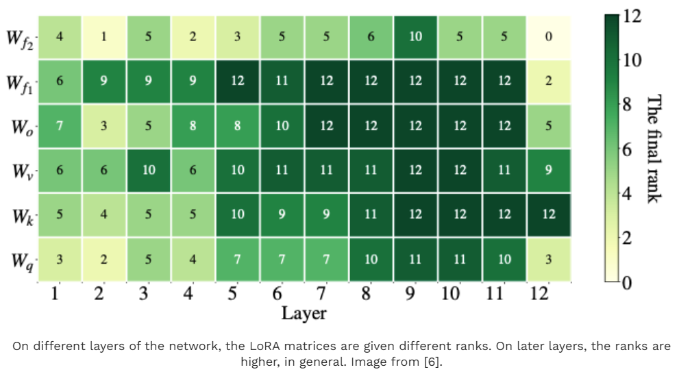

# 7. DoRA：分解权重，更接近微调效果

DoRA（Weight - Decomposed Low - Rank Adaption）基于一种新颖的思路：将每个矩阵分解为幅度和方向两个部分。就像在二维空间中，一个向量既可以用坐标表示，也可以用长度（幅度）和角度（方向）来描述。DoRA 将这种分解方式应用于描述模型训练步骤中权重更新的矩阵，无论是传统微调训练的模型还是使用 LoRA 适配器训练的模型。

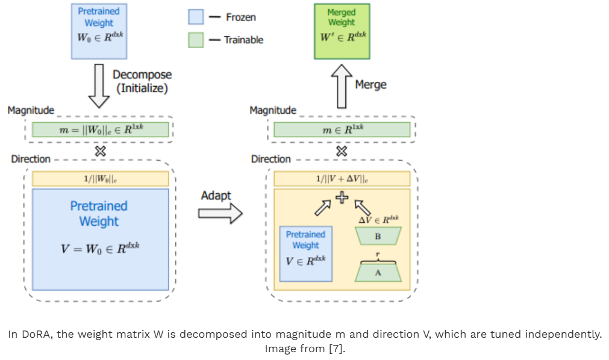

研究发现，微调训练和 LoRA 训练在幅度和方向变化的关系上存在差异。微调训练中，方向和幅度更新之间存在较小的负相关，而 LoRA 训练中则是较强的正相关。DoRA 通过将预训练矩阵 W 分解为大小为 1 x d 的幅度向量 m 和方向矩阵 V，分别对它们进行独立训练。方向矩阵 V 像标准 LoRA 方法一样，通过 B x A 进行增强，幅度向量 m 则直接进行训练。这样，DoRA 在训练时能够更灵活地调整幅度和方向，使两者关系更接近微调训练。在多个基准测试中，DoRA 的准确率超过了 LoRA，这表明它通过分解权重更新，在使用 LoRA 较小参数空间的同时，实现了更接近微调的训练效果。

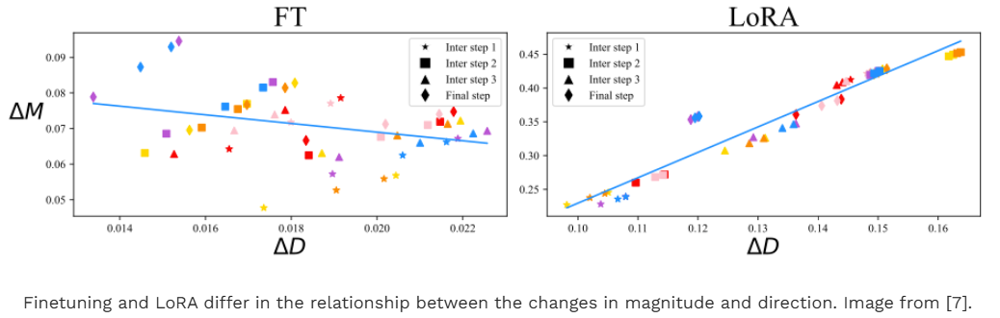

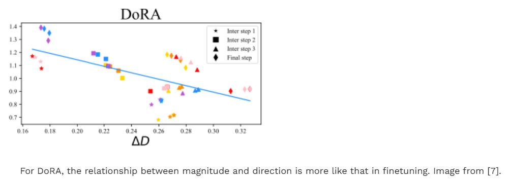

# 8. Delta - LoRA：更新预训练权重，突破性能瓶颈

在 LoRA 中，为了避免高昂的计算成本，预训练矩阵 W 是不被调整的，这就导致了较小的矩阵 A 和 B 在学习下游任务时能力有限，使得 LoRA 训练的模型性能往往低于微调模型。Delta - LoRA 则打破了这个限制，它提出通过 A x B 在连续时间步的梯度来更新矩阵 W 。

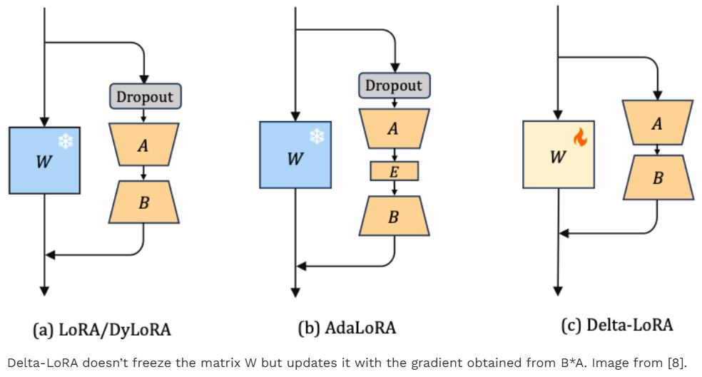

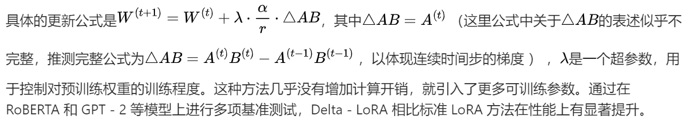

# 9. 总结

LoRA 及其一系列变体从不同维度对大语言模型的训练进行了优化。

- LoRA 通过添加低秩矩阵 A 和 B 开启了高效训练的大门；
- LoRA + 优化学习率提升训练效率；
- VeRA 和 LoRA - FA 减少参数数量；
- LoRA - drop 智能筛选训练层；
- AdaLoRA 动态调整矩阵秩；
- DoRA 分解权重使训练更接近微调；
- Delta - LoRA 更新预训练权重突破性能瓶颈。


[1] LoRA: Hu, E. J., Shen, Y., Wallis, P., Allen-Zhu, Z., Li, Y., Wang, S., … & Chen, W. (2021). Lora: Low-rank adaptation of large language models. arXiv preprint arXiv:2106.09685.
[2] LoRA+: Hayou, S., Ghosh, N., & Yu, B. (2024). LoRA+: Efficient Low Rank Adaptation of Large Models. arXiv preprint arXiv:2402.12354.
[3] VeRA: Kopiczko, D. J., Blankevoort, T., & Asano, Y. M. (2023). Vera: Vector-based random matrix adaptation. arXiv:2310.11454.
[4] LoRA-FA: Zhang, L., Zhang, L., Shi, S., Chu, X., & Li, B. (2023). Lora-fa: Memory-efficient low-rank adaptation for large language models fine-tuning. arXiv preprint arXiv:2308.03303
[5] LoRA-drop: Zhou, H., Lu, X., Xu, W., Zhu, C., & Zhao, T. (2024). LoRA-drop: Efficient LoRA Parameter Pruning based on Output Evaluation. arXiv preprint arXiv:2402.07721
[6] AdaLoRA: Zhang, Q., Chen, M., Bukharin, A., He, P., Cheng, Y., Chen, W., & Zhao, T. (2023). Adaptive budget allocation for parameter-efficient fine-tuning. arXiv preprint arXiv:2303.10512
[7] DoRA: Liu, S. Y., Wang, C. Y., Yin, H., Molchanov, P., Wang, Y. C. F., Cheng, K. T., & Chen, M. H. (2024). DoRA: WeightDecomposed Low-Rank Adaptation. arXiv preprint arXiv:2402.09353.
[8] Delta-LoRA: Zi, B., Qi, X., Wang, L., Wang, J., Wong, K. F., & Zhang, L. (2023). Delta-lora: Fine-tuning high-rank parameters with the delta of low-rank matrices. arXiv preprint arXiv:2309.02411.
[9] 随机投影相关核心思想: Frankle, J., & Carbin, M. (2018). The lottery ticket hypothesis: Finding sparse, trainable neural networks. arXiv:1803.03635.
[10] 关于 LoRA 和 DoRA 更详细的解释:


