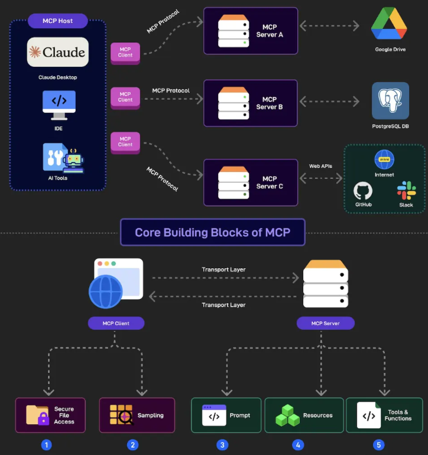

```
github: https://github.com/modelcontextprotocol
```

MCP 全称是 Model Context Protocol，也就是模型上下文协议。可别小瞧它，它可不是 “另一个类似 API 的东西”，要是你这么想，那说明还没真正 get 到它的精髓。



说起传统 API，大家应该不陌生。它就像一套固定的工具套装，通过固定和预定义的端点来提供功能，像常见的 /products（产品相关接口）、/orders（订单接口）、/invoices（发票接口）这些。但这也带来了不少麻烦。比如说，你想给 API 添加新功能，就得新建端点或者修改现有端点。这一改，使用这个 API 的客户端也得跟着改，牵一发而动全身。要是再碰上更改端点所需参数数量这种事，那就更头疼了，不把使用 API 的所有客户端都 “得罪” 一遍，根本改不了。为了解决这个问题，大家引入了 “版本控制”，可搞过版本控制的人都知道，维护起来简直是噩梦，不仅耗时费力，还特别容易出错。

还有文档问题。咱们开发客户端要用 API 的时候，得去找专门的文档。但很多时候，文档要么和 API 是分开的，找起来麻烦，要么干脆就没有，这让开发者们很是抓狂。

MCP 的出现，就像是给这些难题找到了新解法。MCP 服务器把功能公开成一个个具有语义描述的 “工具”，这可太实用了！每个工具都能自我描述，里面详细包含了工具的功能、每个参数的含义、预期输出，还有约束和限制这些关键信息。这意味着什么？意味着咱们再也不用到处找单独的文档了，工具界面本身就是一份详细的文档，是不是超方便！

更厉害的是，MCP 在应对变化方面有着独特的优势。想象一下，你在服务器上改了某个工具所需的参数数量，要是用传统 API，客户端肯定得乱套。但在 MCP 这里，完全不用担心！客户端能动态适应这些变化，就像有智能 “自适应系统” 一样。而且，当你添加新工具时，客户端还能自动发现并在合适的时候用上它，完全不需要手动修改，这对开发者来说，简直是 “减负神器”。

另外，MCP 还能根据不同的上下文来设置工具的可用性。比如说，MCP 服务器可以设置一个工具，只有那些先登录的客户端才能使用，这在提升安全性和用户体验方面都非常实用。

在 AI 飞速发展的当下，AI+API 已经成为很多应用的标配，但 AI+MCP 的组合显然更胜一筹。MCP 的这些特性，让它在灵活度、易用性和适应性上都远超传统 API，能更好地满足 AI 复杂多变的应用场景需求。

```
笔者能力有限欢迎批评指正或者在留言区讨论。
```