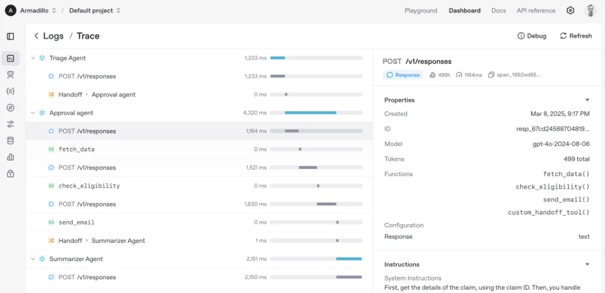

[TOC]

OpenAI 搞了一场面向开发者的超重磅直播，直接甩出 Agent 开发套件，还开源了两个超厉害的 Agent 项目，这波操作直接点燃了整个 AI 领域，“手搓 Manus” 时代真的来啦！

# 1. OpenAI Agent 开发套件都有啥？

## 1.1 内置工具

这次 OpenAI 给开发套件里塞了好多实用的内置工具，像网页搜索、文件搜索，还有超酷炫的电脑使用工具。有了网页搜索，开发的 Agent 能轻松在互联网海量信息里找资料；文件搜索可以让 Agent 快速定位本地文件内容。而电脑使用工具更绝，能让 Agent 操作电脑，像模拟点击、输入文字这些都不在话下。以后开发能自动办公、自动处理电脑任务的 AI，就更方便啦！

## 1.2 Responses API

Responses API 堪称 “融合怪”，它把 Chat Completions API 的简单便捷，和 Assistants API 的强大工具使用功能揉在了一起。开发者用这个 API 构建 Agent 的时候，既能享受简单交互的快乐，又能让 Agent 灵活调用各种工具，处理复杂任务的能力直线飙升。

## 1.3 Agents SDK

Agents SDK 可是个 “幕后英雄”，它是一个轻量级但超有料的框架，专门协调单智能体和多智能体的工作流程。开源之后，全球开发者都能参与进来，大家一起搞创新。而且它还有几个超关键的概念：

- **Agent（智能体）**：简单来说，就是配置了指令的大型语言模型（LLMs）。这些模型不仅能 “听话干活”，还配备了各种工具，有安全防护的 “防护栏”，以及能把任务交给其他智能体的交接功能，就像给 AI 们配上了 “十八般武艺”。
- **Handoffs（交接）**：这功能太实用啦！想象一下，一个智能体遇到不擅长的任务，它能直接把任务控制权移交给更厉害的智能体，大家分工合作，效率瞬间拉满。
- **Guardrails（防护栏）**：它就像 AI 的 “安全卫士”，对输入和输出的数据进行严格验证，保证 AI 生成的内容合规、安全，不会 “乱来”。
- **Tracing（追踪）**：有了这个功能，开发者能像 “开天眼” 一样，看到智能体的运行过程。不管是调试找 Bug，还是优化工作流，都变得轻松加愉快。

## 1.4 监控工具

开发套件里集成了监控工具，这就相当于给 Agent 工作流程装了个 “监控摄像头”。通过它，开发者能实时跟踪、检查 Agent 工作得咋样，一旦出现问题，能马上发现并解决，确保 Agent 稳定、高效地运行。

# 2. 两大开源项目，实力太能打！

## 2.1 Agents SDK 项目：智能体协作的 “魔法盒子”

前面提到 Agents SDK 开源了，它为开发者提供了一个超棒的框架。借助这个框架，开发者可以搭建复杂又高效的多智能体工作流。不管是让多个智能体一起完成大型项目，还是分工处理不同任务，它都能轻松搞定。有了它，开发多智能体系统不再是难事，大家可以尽情发挥创意，打造各种神奇的 AI 应用。

## 2.2 Computer Using Agent 项目：电脑前的 “虚拟小助手”

OpenAI 还开源了 Computer Using Agent（CUA）项目，这就是一个用 OpenAI API 构建的超实用示例应用程序。它的运行模式很有趣，计算机使用工具会不断循环工作，向计算机或浏览器发送操作指令，像 click (x,y) 模拟点击屏幕上的某个坐标，type (text) 输入文字。每次操作完，代码会把操作结果的屏幕截图传回给模型。这样一来，模型就能根据截图了解当前电脑环境状态，然后决定下一步干啥。通过这个循环，很多以前需要人工手动点击、输入、滚动的繁琐任务，现在都能交给它自动完成啦，比如订机票、搜索产品、填表格，简直不要太方便！

