```
论文地址：https://arxiv.org/abs/2501.11551
论文标题：PIKE-RAG: sPecIalized KnowledgE and Rationale Augmented Generation
代码地址：https://github.com/microsoft/PIKE-RAG
```

[TOC]

最近，自然语言处理领域又迎来了一个重磅消息！微软继 GraphRAG 之后，又发布了一款名为 PIKE-RAG（sPecIalized KnowledgE and Rationale Augmented Generation）的强大工具，专门用来攻克复杂企业场景中私域知识的提取、推理和应用难题。这一成果已经在工业制造、采矿、制药等多个领域完成测试，大幅提升了问答准确率，而且报告、代码和 demo 全都开源了，简直太良心！今天咱们就来好好扒一扒，PIKE-RAG 到底有啥神奇之处。

# 1. 传统 RAG 的困境：“一招鲜” 不灵了

在聊 PIKE-RAG 之前，咱们先得知道为啥需要它。如今，检索增强生成（RAG）系统挺火的，它能让大语言模型（LLM）借助外部检索的力量，扩展自身能力。但理想很丰满，现实却很骨感，在实际的工业应用场景里，RAG 系统的短板就暴露出来了。

首先，知识来源那叫一个五花八门。RAG 系统依赖的语料库，包含多年来从各个领域收集的各种文件，像扫描图像、数字文本文件、网页数据，还有专业数据库。这些数据格式多样，结构复杂，和常用的那些经过预处理、简化的数据集完全不一样。就好比你要在一个堆满杂物的仓库里找一件特定的工具，难度可想而知。现有方法很难从这些复杂的来源中，高效地提取专业知识、挖掘背后的逻辑，这就像拿着一把普通钥匙，想打开一把超级复杂的锁，根本行不通。

其次，专业领域知识太 “高冷”。工业应用里，RAG 得利用专业领域的知识和逻辑来解决问题。可这些专业知识，有着独特的术语、专业的逻辑框架，一般的 RAG 系统很难理解和运用。比如说半导体设计领域，研究需要深入理解物理属性，要是让 LLMs 从研究文档里提取和组织相关知识，它们往往会因为自身局限，抓不住关键的物理原理，导致对问题的理解不全面，给出的回答也不准确、不完整。

最后，“一刀切” 行不通。不同的 RAG 应用场景，对知识处理能力的要求差异很大。有的场景侧重于检索事实规则，有的则需要多跳推理。但大多数现有的 RAG 方法却采用 “一招鲜吃遍天” 的策略，不管什么场景都用同样的方式处理，结果就是无法满足实际应用的精度要求，严重限制了 RAG 系统在现实环境中的发展。

# 2. PIKE-RAG：有效解决复杂问题

面对这些困境，微软亚洲研究院的团队提出了 PIKE-RAG。简单来说，它就是聚焦于专业知识的提取、理解和应用，还能构建连贯的推理逻辑，引导 LLMs 给出更准确的答案。这就好比给 RAG 系统请了一位专业的 “导师”，带着它在复杂的知识海洋里找到正确方向。

## 2.1 新范式：给任务和系统 “分分类”

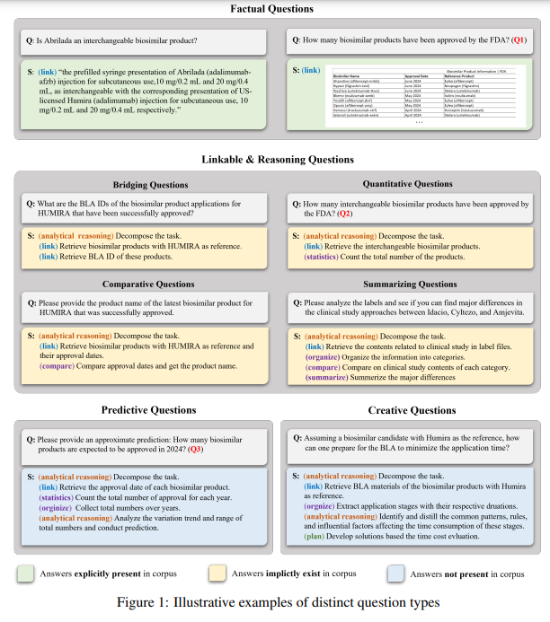

PIKE-RAG 带来了一种全新的范式。它根据知识提取、理解和运用的难度，把任务分成了四类：

- 事实性问题
- 可链接推理问题
- 预测性问题
- 创造性问题。

事实性问题最简单，就是从语料库中直接提取明确的信息。比如 “某药品的批准文号是多少”，只要能找到对应的文本内容，就能轻松回答。

可链接推理问题就复杂一些，需要从多个来源收集信息，还得进行多步推理。像是 “比较两款药品的疗效差异”，这不仅要找到两款药品各自的疗效数据，还得分析对比这些数据，才能得出结论。这类问题又细分为桥梁问题、比较问题、定量问题和总结问题。

预测性问题则要求根据现有事实进行归纳推理和预测。比如 “预测明年某种疾病的发病率”，需要收集整理相关的历史数据，分析趋势，才能做出合理预测。而且预测性问题的答案往往不是唯一的，体现了这类任务的不确定性。

创造性问题难度最高，需要挖掘专业知识库中的逻辑，创新地解决问题。例如 “设计一种全新的药物研发流程”，这需要结合专业知识，突破常规思维，提出新颖的解决方案。

同时，PIKE-RAG 还根据系统解决这四类问题的能力，把 RAG 系统分为四个等级。这种分类方式为系统的设计和评估提供了全新的思路，也方便开发者有针对性地进行系统的分阶段开发，逐步提升系统能力。

## 2.2 强大框架：多模块协同作战

PIKE-RAG 框架包含多个基本模块，各个模块分工明确，又紧密协作。

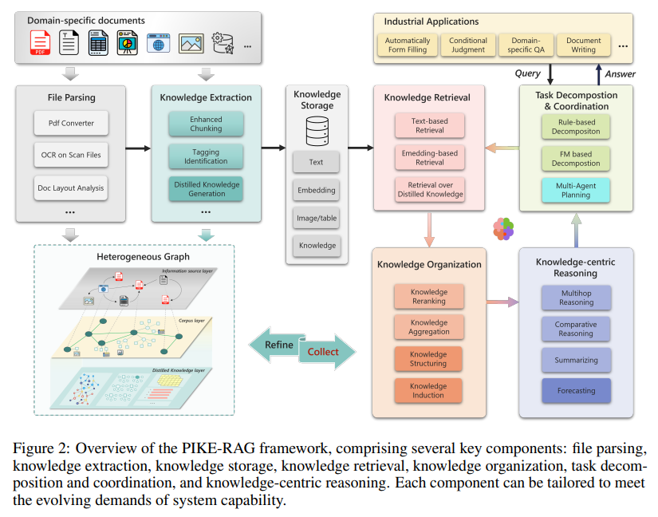

- **文档解析**：这个模块就像是一个勤劳的 “翻译官”。在工业场景中，文件格式多种多样，它能把各种格式的领域特定文档，转化成机器能读懂的格式。遇到扫描文件，它会用 OCR 技术识别文字；面对复杂的文档布局，它会进行分析，还能保留像图表、图片这些多模态元素，为后续的知识提取保留完整的信息。
- **知识提取与存储**：知识提取模块会对文本进行处理，把它 “切” 成合适的块，生成语料和知识单元。而且它还能从文本中提取出像知识图谱、原子知识、表格知识等结构化知识，存到多层异构图的知识库中。这个知识库分为信息资源层、语料层和蒸馏知识层，不同层次的知识相互关联，方便后续的检索和推理。
- **知识检索**：知识检索模块采用混合检索策略。它会根据问题的需求，在多层异构图的知识库中进行多粒度检索。比如，既可以从信息资源层找到相关的文档，也能从语料层定位具体的文本块，还能从蒸馏知识层获取精炼的知识，确保检索到的信息既全面又精准。
- **任务分解与协调**：这是 PIKE-RAG 的 “智慧大脑”。遇到复杂问题时，它会把问题分解成多个小的子任务，规划好检索和推理的步骤。在这个过程中，它还会根据已有的知识和信息，不断调整策略，确保最终能得出准确的答案。
- **知识组织与推理**：知识组织模块会对检索到的知识进行整理和归纳，让这些知识更有条理。以知识为中心的推理模块则会利用这些组织好的知识，结合任务需求进行推理，最终生成准确的回答。

## 2.3 分阶段提升：能力逐步进阶

PIKE-RAG 把系统开发分为不同阶段，从 L0 到 L4，每个阶段都有不同的目标和挑战。

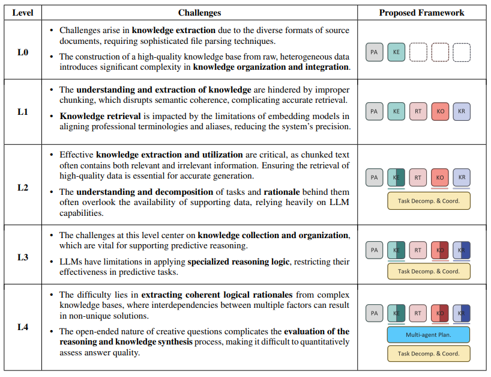

- **L0：打基础，建知识库**：L0 阶段的重点是构建一个强大的知识库。这一阶段要把各种专业文档处理成机器能理解的格式，并组织成多层异构图的形式。就好比是为整个系统打造了一个坚实的 “地基”，只有地基稳固，后续的功能才能顺利实现。

- **L1：聚焦事实性问题**：在 L0 的基础上，L1 系统增加了知识检索和组织功能，主要解决事实性问题。为了提高知识提取和检索的准确性，它采用了增强型文本分割算法，避免知识切分不当影响语义连贯；还引入了自动标签技术，解决专业术语和别名的对齐问题；同时支持多粒度检索，让系统在处理事实性问题时更加高效准确。

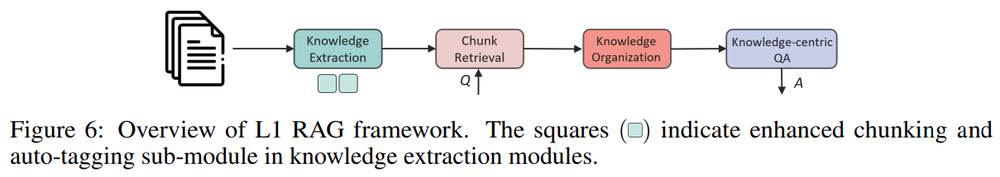

- **L2：攻克推理难题**：L2 系统专注于处理可链接推理问题。它提出了知识原子化和知识感知任务分解的方法。知识原子化就是把文档中的知识进一步细化，用问题作为知识索引，方便更精准地检索和利用知识。知识感知任务分解则会根据知识库的内容，智能选择最合适的任务分解策略，提高解决复杂推理问题的能力。

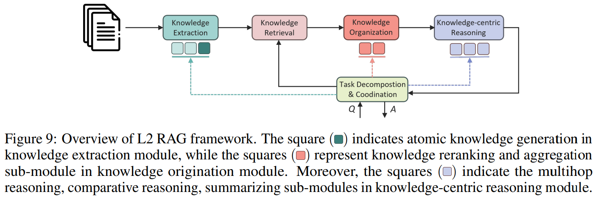

- **L3：提升预测能力**：L3 系统着重增强基于知识的预测能力。它通过任务分解和协调模块，结合组织好的知识构建预测逻辑。同时，知识组织模块增加了知识结构化和归纳的子模块，知识推理模块也加入了预测子模块，让系统能够根据历史知识进行合理预测，应对像预测产品销量趋势这类问题。

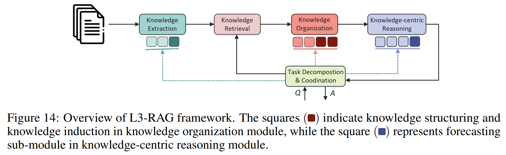

- **L4：激发创新思维**：L4 系统引入多智能体规划模块，专门应对创造性问题。多个智能体从不同角度思考问题，并行处理和整合各种推理路径，模拟多样化的观点，为创造性问题提供创新的解决方案，激发用户的创新思维。

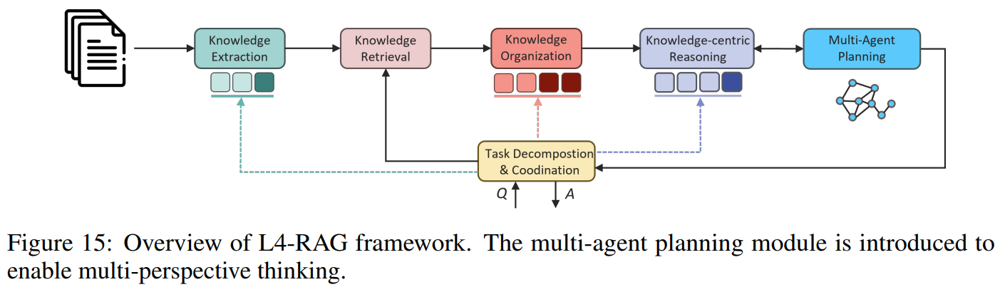

# 3. 实力验证：效果超预期

说了这么多，PIKE-RAG 实际表现到底咋样呢？研究人员进行了大量实验。

**公开基准测试**：在 HotpotQA、2WikiMultiHopQA 和 MuSiQue 这些多跳问答数据集上，PIKE-RAG 和 Zero-Shot CoT、Naive RAG 等多种方法进行了对比。结果令人惊喜，PIKE-RAG 在准确率、F1 分数等指标上表现优异。

- 在 HotpotQA 数据集上，它的准确率达到 87.6%；
- 2WikiMultiHopQA 上准确率为 82.0%；
- 在难度较高的 MuSiQue 数据集上，也有 59.6% 的准确率。
- 随着问题难度增加，PIKE-RAG 的优势愈发明显，充分证明了它在复杂推理场景中的强大能力。

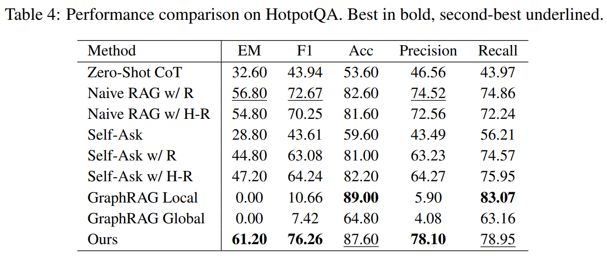

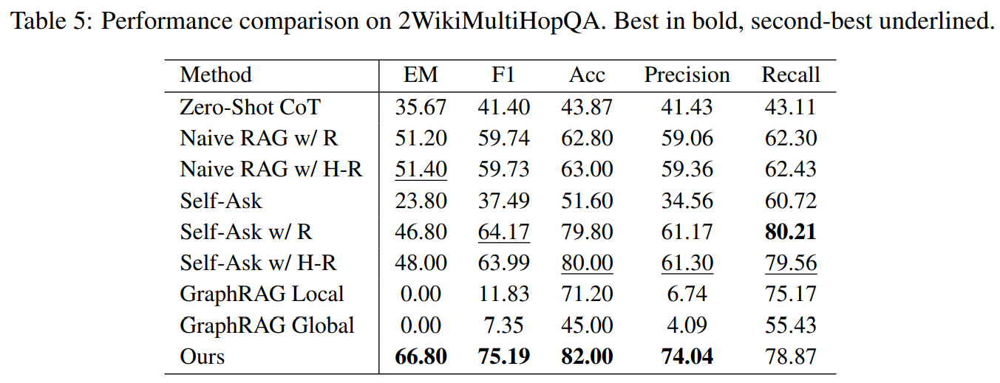

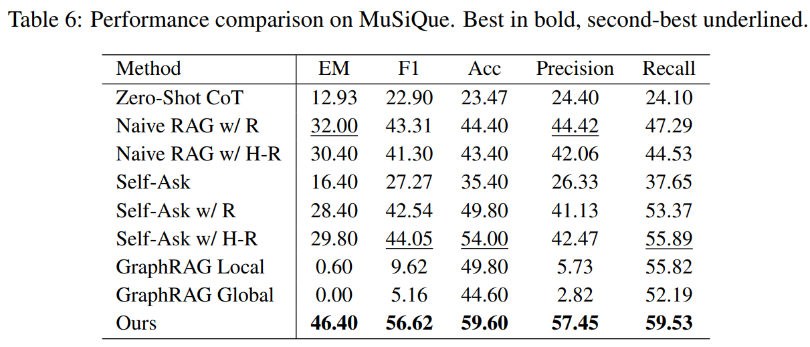

**法律领域测试**：在 LawBench 和 Open Australian Legal QA 这两个法律基准测试中，PIKE-RAG 同样表现出色。在一些法律条文背诵、法律咨询等任务上，它的准确率相比 GraphRAG Local 等方法有了大幅提升。这表明 PIKE-RAG 在专业领域的复杂问题处理上，具有很大的优势。

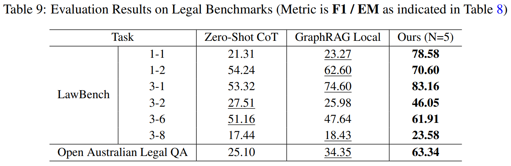

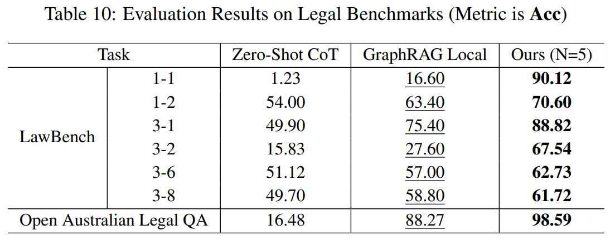

# 4. 小结

微软开源的 PIKE-RAG 为解决 RAG 系统在工业应用中的难题提供了新的思路和方法，在专业知识处理和复杂推理方面展现出了强大的实力。

