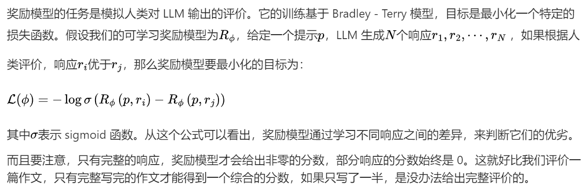
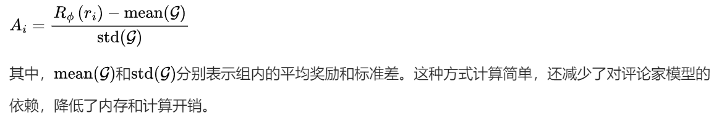

[TOC]

大语言模型（LLM）的发展可谓日新月异。大家都知道，LLM 的训练过程很复杂，其中有两个关键阶段：预训练和后训练。今天咱们就来深入聊聊在这一过程中发挥重要作用的近端策略优化（PPO）算法和组相对策略优化（GRPO）算法。这俩算法不仅在学术圈备受关注，在实际应用中也有着举足轻重的地位，理解它们，能让你更懂 LLM 是如何一步步变得这么 “聪明” 的！

# 1. 从 LLM 训练说起

LLM 的训练如同一场漫长而复杂的旅程，主要分为预训练和后训练两个大阶段。

- **预训练**：这是基础积累阶段，模型就像一个勤奋的学生，在大规模网页数据的知识海洋里学习，通过下一个词预测任务，不断积累背景知识，为后续学习打下基础。这个过程就像是我们学习新知识时，先广泛阅读各种资料，建立起基本的认知框架。
- **后训练**：旨在提升模型的推理能力，又细分为两个阶段。
  - **监督微调（SFT）**：可以理解为老师针对学生的薄弱环节进行专项辅导。它利用少量高质量的专家推理数据，让模型学习如何模仿专家的解题思路和方法，像指令遵循、问答以及思维链等能力都是在这个阶段培养的。
  - **强化学习从人类反馈（RLHF）**：当专家数据有限时，RLHF 就派上用场了。它借助人类的反馈来训练奖励模型，再由奖励模型引导 LLM 学习，使模型的输出更符合人类的偏好。比如学生做完作业后，老师根据作业情况给予反馈，学生根据老师的反馈来改进自己的学习方法。

不过，DeepSeek 的 R1 - zero 模型却走出了一条与众不同的路。它直接跳过 SFT 阶段，将 RL 直接应用到基础模型上。这样做带来了不少好处，计算效率提高了，模型能够通过自主探索实现推理能力的 “自我进化”，还避免了 SFT 数据可能引入的偏差。当然，这一切的前提是要有一个非常出色的基础模型。

不仅如此，DeepSeek 还引入 GRPO 算法替代 PPO 来优化 RLHF 部分。这一改变可不得了，直接减少了对价值函数（也就是 critic 模型，通常和策略模型一样大）的需求，内存和计算开销降低了约 50%，大大提高了训练效率。

# 2. RLHF 的工作流程揭秘

在深入了解 PPO 和 GRPO 之前，我们先来揭开 RLHF 的神秘面纱。RLHF 的工作流程主要分为四步：

1. **采样**：针对每个提示，模型会生成多个响应。就好比老师提出一个问题，学生们会给出各种各样的答案。
2. **排序**：人类根据这些答案的质量进行排序，判断哪个回答得好，哪个还有提升空间。这一步就像是老师批改作业，给学生的答案打分。
3. **训练奖励模型**：由于让人类对模型的所有输出进行打分不太现实，所以采用一种节省成本的方法，让标注人员对 LLM 输出的一小部分进行评分，然后训练一个奖励模型，让它学会预测标注人员的偏好。这个奖励模型就像是一个智能打分器，经过训练后能模拟人类的评价标准。
4. **微调模型**：使用 RL 算法（如 PPO、GRPO）对 LLM 进行微调，让模型在奖励模型的引导下，不断提高自己的得分。这就好比学生根据老师的反馈和打分，不断调整自己的学习方法，努力提高成绩。

在这个过程中，奖励模型和 RL 算法是两个核心组件，接下来咱们就重点讲讲它们。

# 3. 奖励模型：模拟人类评价的 “小能手”



# 4. PPO：复杂而强大的优化算法

PPO（近端策略优化）在 RLHF 中起着至关重要的作用，它包含几个关键组件：

- **策略（Policy）**：就是经过预训练或 SFT 的 LLM，它负责生成对提示的响应，就像学生根据自己学到的知识回答问题一样。
- **奖励模型（Reward model）**：这是一个已经训练好并冻结的网络，根据完整响应给出标量奖励，相当于老师根据学生完整的回答给出一个具体的分数。
- **评论家（Critic，也叫值函数）**：它是一个可学习的网络，根据部分响应预测标量奖励，有点像老师在学生回答问题的过程中，根据学生已经回答的部分，预测最终可能得到的分数。

PPO 的工作流程如下：

1. **生成响应**：LLM 根据提示生成多个响应。
2. **打分**：奖励模型给每个响应分配奖励。
3. **计算优势**：这里用到了通用优势估计（GAE）方法。优势的概念是特定动作（比如生成的某个词）相较于平均动作的优势程度。计算优势有两种常见方法：
   - **蒙特卡洛（MC）方法**：利用完整轨迹的奖励，虽然偏差小，但方差高。这是因为奖励比较稀疏，就像在学习过程中，只有偶尔几次考试成绩能作为评价依据，获取足够样本进行优化的成本高。
   - **时间差分（TD）方法**：用一步轨迹奖励，方差低了，但偏差又高了。这就好比只根据学生某一次的课堂表现来评价他的整体学习情况，难以准确预测部分响应的最终奖励。
   - **GAE**：为了平衡这两者，通过多步 TD 来计算优势。不过，由于不完整响应的奖励为 0，所以需要评论家模型来预测奖励，从而计算 TD 误差。
4. **优化策略**：通过优化总目标来更新 LLM，让模型生成的每个词都能最大化奖励，就像学生努力让自己每次回答问题都能得到更高的分数。
5. **更新评论家**：训练值函数，让它能更准确地预测部分响应的奖励，以便更好地指导策略的优化。

PPO 的目标函数包含几个部分：

1. **裁剪的替代目标**：通过限制策略更新的概率比，让模型在追求高优势动作的同时，避免过度自信，防止策略过于偏向某个动作。比如，在选择答案时，避免模型过于依赖某一种解题思路。
2. **熵奖励**：鼓励模型探索更多的可能性，避免生成过于单一的结果，让模型的回答更加多样化。
3. **KL 惩罚**：防止当前策略偏离原始模型太远，保证训练的稳定性，确保模型在优化过程中不会 “跑偏”。
4. **评论家的 L2 损失**：用于优化评论家模型，使其能更好地预测奖励，提高评价的准确性。

# 5. GRPO：PPO 的精简升级版本

GRPO 是对 PPO 的改进，理解了 PPO，GRPO 就很好懂啦。它和 PPO 的关键区别在于估计优势的方式。GRPO 不再依赖评论家模型，而是通过对同一提示生成的多个响应来计算优势。

GRPO 的工作流程是这样的：

1. **采样**：针对每个提示，从 LLM 策略中采样一组响应。

2. **计算奖励**：用奖励模型给每个响应计算奖励。

3. **计算组归一化优势**：将每个响应的奖励减去组内平均奖励，再除以组内标准差，得到归一化的优势，公式为：

   

GRPO 的目标函数和 PPO 类似，也包含裁剪的替代损失和 KL 惩罚，但没有熵奖励，因为基于组的采样方式本身就鼓励了模型的探索。

# 6. DeepSeek R1 的极简设计理念

DeepSeek R1 在 LLM 训练上展现出一种独特的 “极简主义” 风格，除了前面提到的跳过 SFT 阶段和使用 GRPO 算法，还有很多值得关注的设计：

- **基于规则的确定性奖励**：抛弃了复杂的神经过程奖励模型或结果奖励模型，采用简单的二进制检查，如答案正确性、格式规范、语言一致性等检查。比如，对于数学问题，检查答案是否正确；对于代码问题，检查是否能正确编译。这样既避免了模型 “耍小聪明” 欺骗奖励模型，又节省了奖励模型的训练成本。
- **冷启动数据：最小化人工干预**：不再费力收集大规模的 SFT 数据集，而是通过少量高质量的思维链（CoT）示例，加上简单的人工后处理，为 RL 训练提供一个 “够用” 的起点。这种方式避免了昂贵的 SFT 阶段，同时又能让模型快速启动训练。
- **拒绝采样：严格筛选，强化训练**：RL 训练后，生成大量推理轨迹，只保留正确的响应用于监督微调，简单粗暴但很有效。就像在众多练习中，只挑选做对的题目进行深入分析，提高训练的针对性。
- **蒸馏：复制推理模式**：训练小模型时，直接在大模型生成的大量响应上进行微调，让小模型继承大模型通过暴力 RL 发现的推理模式，避免了小模型进行复杂 RL 训练的成本。

这种设计理念体现了 AI 领域的一个趋势：有时候，简单直接的方法配合大规模的计算资源，比复杂的工程设计更能取得好的效果。

# 7. 小结

PPO 和 GRPO 作为 LLM 训练中的重要算法，各自有着独特的优势和应用场景。

PPO 虽然复杂，但功能强大；

GRPO 则通过简化设计，提高了训练效率。

而 DeepSeek R1 的一系列创新设计，也为 LLM 的发展提供了新的思路。

```
笔者能力有限，欢迎批评指正或者在留言区讨论
```