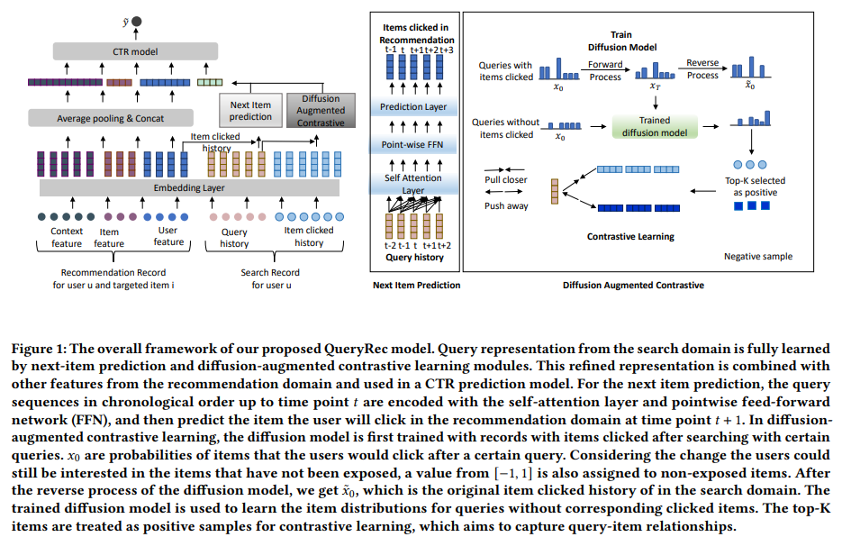
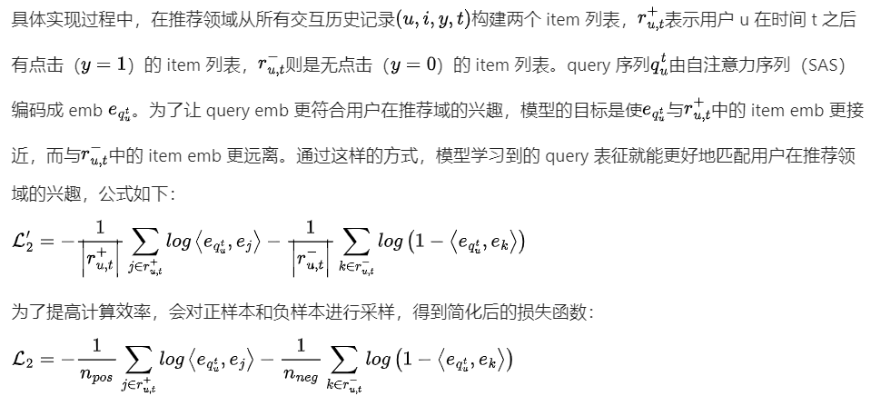
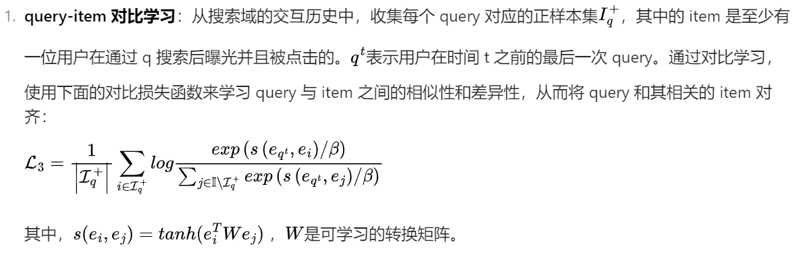
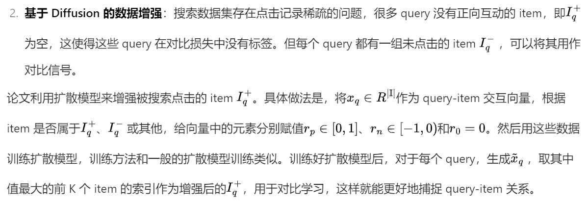
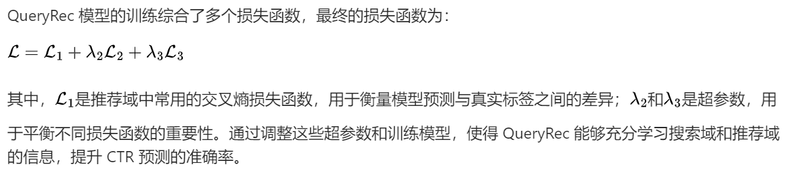
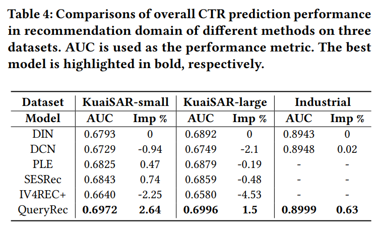
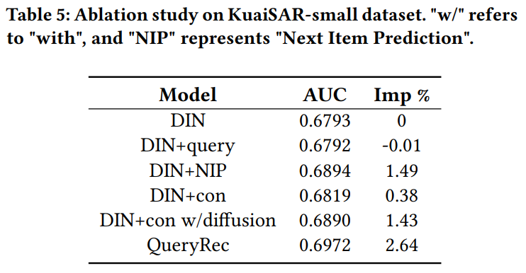
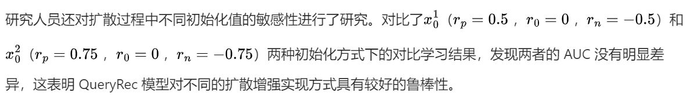

```
论文标题：Enhancing CTR prediction in Recommendation Domain with Search Query Representation
论文链接：https://arxiv.org/abs/2410.21487
机构：华为
发表时间：2024.10
```

[TOC]

在互联网的世界里，我们日常使用的电商平台、视频网站等，往往同时提供搜索和推荐服务。推荐系统会根据用户过往的行为主动推送商品或内容，而搜索服务则让用户能够精准查找自己想要的东西。这两个功能看似独立，实则紧密相连，背后都涉及到如何精准把握用户的兴趣和需求。在这之中，点击率（CTR）预测成为了关键环节，它直接影响着推荐系统的效果和用户体验。今天要探讨的，就是华为诺亚方舟实验室在这一领域的重要研究成果 ——QueryRec 框架，它聚焦于如何利用搜索域的信息来提升推荐域的 CTR 预测准确率。

# 1. 研究背景：挖掘搜索与推荐领域的协同潜力

随着互联网信息的爆炸式增长，推荐系统和搜索引擎成为用户获取信息的重要工具。众多平台为了满足用户多样化的需求，同时提供推荐和搜索服务。比如在电商平台上，推荐系统会根据用户的浏览、购买历史推荐相关商品，而搜索功能则帮助用户快速找到特定商品。这两个领域中存在大量用户和商品的重叠，如何有效利用这些数据提升推荐系统的 CTR 预测准确率，成为了研究的热点。

尽管已有不少研究探索推荐和搜索领域的联合学习，像 IV4REC + 和 SESRec 通过引入搜索数据理解用户行为，USER 和 SRJGraph 将推荐行为视为特殊的搜索行为，但这些方法仍存在一些问题。一方面，它们常常忽略用户在浏览和搜索时意图的差异，默认用户在不同领域的兴趣是统一的。然而，实际情况是，用户在搜索时往往有更明确的目标，而浏览时可能只是随意看看，兴趣更宽泛。例如，用户在浏览电商平台时可能喜欢粉色的各类商品，但在搜索 “雨伞” 时，可能因为急需，更倾向于选择能快速发货的黑色雨伞。

另一方面，现有方法在处理搜索领域的 query（查询词）时存在不足。query 与 item（物品）紧密相关，蕴含着丰富的信息，但很多 query 没有点击记录，现有方法大多直接忽略这些无点击 query，导致无法充分挖掘 query 与 item 之间的关系。因此，如何有效捕捉跨域之间用户偏好的潜在变化，以及处理无点击 query，成为亟待解决的问题。

# 2. 方法概述：QueryRec 框架的创新探索

针对上述问题，论文提出了 QueryRec 框架。这个框架的核心思路是学习搜索域中用户 query 的嵌入表示，并将其融入推荐域的 CTR 预测模型中，实现知识从搜索域到推荐域的转移。具体来说，它利用用户在搜索域的 query 序列来预测其在推荐域下一次可能点击的 item，同时通过对比学习和扩散模型探索 query 与 item 之间的关系，以此解决数据稀疏的问题。

# 3. 研究贡献

## 3.1 聚焦 query 表征学习

QueryRec 框架首次专注于搜索域中 query 的表征学习。通过深入挖掘 query 中的信息，能够更有效地将其蕴含的用户偏好知识转移到推荐域，为推荐系统提供更有价值的参考。

## 3.2 跨域兴趣对齐

引入下一项预测模块，整合搜索和推荐两个领域的信息。该模块通过直接预测用户在推荐域中下次点击的 item，使得 query 的表征更贴合用户在推荐域的兴趣，成功弥合了两个领域之间用户兴趣的差距，让推荐更加精准。

## 3.3 优化 query-item 关系提取

提出对比学习模块，并结合扩散模型生成正样本。这一创新不仅更好地对齐了 query 和 item 的嵌入，还能从无点击记录的 item 列表中提取训练标签，有效解决了数据稀疏和无点击 query 带来的问题，使模型能够更准确地捕捉 query-item 关系。

# 4. 方法详解



## 4.1 Next Item Prediction：跨域兴趣的桥梁

这个模块主要是为了解决跨域兴趣转移的问题。它将时间 t 以前的 query 序列通过自注意力层和 FFN 进行编码，从而预测用户在推荐领域 t+1 时会点击的项目。



## 4.2 Diffusion-augmented Contrastive Learning：解决 query-item 对齐难题





## 4.3 模型训练



# 5. 实验

## 5.1 实验数据集

研究人员使用了 KuaiSAR-large、KuaiSAR-small 这两个公开数据集，以及一个包含搜索和推荐服务数据的工业数据集。KuaiSAR 数据集来自真实平台，涵盖了不同时间段的数据，具有不同程度的用户行为和跨域相关性。工业数据集规模更大，包含超过 2 亿条记录和 1000 万个不同的 queries，能更真实地反映实际应用场景。

## 5.2 实验设置

**数据处理**：按照用户对交互数据进行分组并按时间排序。在推荐域采用 leave-one-out 的方式划分数据集，将每个用户的最新行为用于测试，倒数第二个行为用于验证，其余作为训练集。同时，将用户在推荐域记录时间 t 之前的历史查询作为搜索感知增强特征，并且只保留同时有搜索和推荐历史的记录。

**对比基线**：选择了 DIN、PLE、DCN、SESRec、IV4Rec + 等作为基线模型。DIN 通过注意力模块捕捉用户兴趣；PLE 使用共享专家和特定任务专家进行多任务学习；DCN 利用交叉网络显式建模特征交互；SESRec 通过对比学习分离搜索和推荐行为的相似和不相似表示；IV4Rec + 则使用搜索查询作为工具变量重构用户和物品嵌入。

## 5.3 实验结果

在三个数据集上的实验结果显示，QueryRec 在 KuaiSAR-small 和 KuaiSAR-large 数据集上的表现优于所有基线模型。在工业数据集上，相比常用模型 DCN 和 DIN，也有性能提升。这充分证明了 QueryRec 框架聚焦 query 学习，为捕捉用户偏好带来了有价值的信息，提升了 CTR 预测的准确性。



SESRec 在 KuaiSAR-small 数据集上表现第二，但在 KuaiSAR-large 数据集上表现不佳，这可能意味着更大的数据集在选择可转移和不可转移信息时需要更复杂的处理。IV4REC + 的表现未达预期，主要原因可能是缺乏真实文本嵌入，这也凸显了 QueryRec 受数据形式限制较小的优势。

## 5.4 消融实验

在 KuaiSAR-small 数据集上进行消融实验，分别测试了不同模块对模型性能的影响。结果发现，仅仅将 query 作为额外特征添加到 CTR 模型（DIN+query）并不能提升性能，这进一步证实了用户兴趣跨域转移的假设，即 query 信息需要经过适配才能在推荐域发挥作用。而 Next Item Prediction（DIN+NIP）、对比学习（DIN+con）以及结合扩散模型的对比学习（DIN+con w/diffusion）等模块都对模型性能有积极提升，且 QueryRec 整体框架的 AUC 值最高，有力地证明了框架中各个模块的有效性。



## 5.5 案例分析

在对比学习中，常用的处理无正样本 query 的方法是直接屏蔽，但由于无点击 query 的比例不容忽视，简单屏蔽会导致 query-item 关系学习不充分。因此，论文提出的扩散增强方法通过生成正样本进行对比学习。实验对比了使用屏蔽样本的对比学习（CL with mask）和使用扩散模型生成正样本的对比学习（CL with diffusion），结果显示后者的 AUC 更高，证明了扩散增强方法的优越性。

## 5.6 敏感性分析



# 6. 小结

华为提出的 QueryRec 框架为搜索增强推荐域的 CTR 预测提供了新的解决方案。通过构建有效的 query 表征，并将其融入 CTR 预测模型，实现了知识从搜索域到推荐域的高效转移。下一项预测模块和扩散增强对比学习模块的设计，成功解决了跨域兴趣转移和 query-item 对齐的问题，在多个数据集上展现出了优于现有模型的性能。

这一研究成果不仅为推荐系统领域的学术研究提供了新的思路，也为实际应用中的推荐系统优化提供了有力的技术支持。


