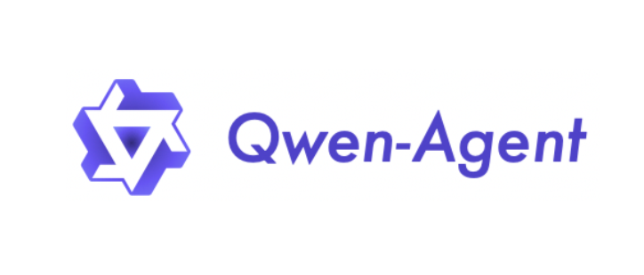

[TOC]

```
github：https://github.com/QwenLM/Qwen-Agent/blob/main/README_CN.md
```

# 1. 什么是Qwen-Agent

Qwen-Agent是一个专门设计用于开发基于大型语言模型（LLM）的应用程序的框架。它不仅支持指令遵循、工具使用、规划和记忆能力，还能够处理从8K到100万tokens的文档，超越了传统长上下文模型的限制。这意味着开发者可以利用Qwen-Agent构建出能够理解和生成自然语言、执行复杂任务的智能代理应用。



# 2. 核心功能与特点

## 2.1 功能调用

功能调用是Qwen-Agent的一项基础能力，它允许AI模型在处理任务时主动调用预定义的函数或工具。这一特性使得Qwen-Agent能够与外部工具和API进行互动，从而扩展了AI应用的范围。例如，开发者可以定义一个用于生成图像的工具，当用户请求生成特定内容的图像时，Qwen-Agent可以调用该工具并返回生成的图像链接。

## 2.2 代码解释器

Qwen-Agent内置了代码解释器工具，能够执行用户提供的代码片段。这为开发者提供了极大的灵活性，使得智能代理不仅能够理解和生成文本，还能够执行实际的操作。例如，在处理图像生成任务时，Qwen-Agent可以先调用图像生成工具生成图像，然后通过代码解释器下载图像并进行进一步的处理，如翻转图像等。

## 2.3 多模态处理

Qwen-Agent支持多模态输入和输出，能够理解和生成文本、图像等多种类型的数据。这使得开发者可以构建更加丰富和交互式的应用。例如，一个图像理解与文本生成的Agent可以先理解用户提供的图像内容，然后生成与图像相关的文本描述或故事。

## 2.4 记忆能力

Qwen-Agent具备记忆能力，能够记住之前的对话内容和执行的操作。这使得智能代理能够更好地理解用户的意图，并提供更加连贯和个性化的服务。例如，在与用户进行多轮对话时，Qwen-Agent可以根据之前的对话内容提供更加准确的回答和建议。

# 3. 应用场景

Qwen-Agent的灵活性和强大功能使其适用于多种应用场景，包括但不限于：

- **客户服务**：作为聊天机器人，提供24/7的客户咨询服务，处理常见问题和查询。
- **个人助理**：帮助用户管理日程、提醒事项、预订服务等日常任务。
- **教育和学习**：作为虚拟助教，提供个性化学习建议，解答学生问题。
- **内容创作**：辅助写作、编辑和内容生成，包括文章、报告和创意写作。
- **技术支持**：提供技术问题的解决方案，帮助用户解决软件或硬件问题。
- **数据分析**：帮助分析和解释复杂的数据集，提供商业洞察。

# 4. 开发与使用

## 4.1 安装

- 从 PyPI 安装稳定版本：

```
pip install -U "qwen-agent[rag,code_interpreter,python_executor,gui]"
# 或者，使用 `pip install -U qwen-agent` 来安装最小依赖。
# 可使用双括号指定如下的可选依赖：
#   [gui] 用于提供基于 Gradio 的 GUI 支持；
#   [rag] 用于支持 RAG；
#   [code_interpreter] 用于提供代码解释器相关支持；
#   [python_executor] 用于支持 Qwen2.5-Math 基于工具的推理。
```

- 也可以从源码安装最新的开发版本：

```
git clone https://github.com/QwenLM/Qwen-Agent.git
cd Qwen-Agent
pip install -e ./"[rag,code_interpreter,python_executor]"
# 或者，使用 `pip install -e ./` 安装最小依赖。
```

如果需要内置 GUI 支持，可选择性地安装可选依赖：

```
pip install -U "qwen-agent[gui,rag,code_interpreter]"
# 或者通过源码安装 `pip install -e ./"[gui,rag,code_interpreter]"`
```

## 4.2 准备模型服务

Qwen-Agent支持接入阿里云[DashScope](https://help.aliyun.com/zh/dashscope/developer-reference/quick-start)服务提供的Qwen模型服务，也支持通过OpenAI API方式接入开源的Qwen模型服务。

- 如果希望接入DashScope提供的模型服务，只需配置相应的环境变量`DASHSCOPE_API_KEY`为您的DashScope API Key。
- 或者，如果您希望部署并使用您自己的模型服务，请按照Qwen2的README中提供的指导进行操作，以部署一个兼容OpenAI接口协议的API服务。 具体来说，请参阅[vLLM](https://github.com/QwenLM/Qwen2?tab=readme-ov-file#vllm)一节了解高并发的GPU部署方式，或者查看[Ollama](https://github.com/QwenLM/Qwen2?tab=readme-ov-file#ollama)一节了解本地CPU（+GPU）部署。

## 4.3 快速开发

框架提供了大模型（LLM，继承自`class BaseChatModel`，并提供了[Function Calling](https://github.com/QwenLM/Qwen-Agent/blob/main/examples/function_calling.py)功能）和工具（Tool，继承自`class BaseTool`）等原子组件，也提供了智能体（Agent）等高级抽象组件（继承自`class Agent`）。

以下示例演示了如何增加自定义工具，并快速开发一个带有设定、知识库和工具使用能力的智能体：

```python
import pprint
import urllib.parse
import json5
from qwen_agent.agents import Assistant
from qwen_agent.tools.base import BaseTool, register_tool


# 步骤 1（可选）：添加一个名为 `my_image_gen` 的自定义工具。
@register_tool('my_image_gen')
class MyImageGen(BaseTool):
    # `description` 用于告诉智能体该工具的功能。
    description = 'AI 绘画（图像生成）服务，输入文本描述，返回基于文本信息绘制的图像 URL。'
    # `parameters` 告诉智能体该工具有哪些输入参数。
    parameters = [{
        'name': 'prompt',
        'type': 'string',
        'description': '期望的图像内容的详细描述',
        'required': True
    }]

    def call(self, params: str, **kwargs) -> str:
        # `params` 是由 LLM 智能体生成的参数。
        prompt = json5.loads(params)['prompt']
        prompt = urllib.parse.quote(prompt)
        return json5.dumps(
            {'image_url': f'https://image.pollinations.ai/prompt/{prompt}'},
            ensure_ascii=False)


# 步骤 2：配置您所使用的 LLM。
llm_cfg = {
    # 使用 DashScope 提供的模型服务：
    'model': 'qwen-max',
    'model_server': 'dashscope',
    # 'api_key': 'YOUR_DASHSCOPE_API_KEY',
    # 如果这里没有设置 'api_key'，它将读取 `DASHSCOPE_API_KEY` 环境变量。

    # 使用与 OpenAI API 兼容的模型服务，例如 vLLM 或 Ollama：
    # 'model': 'Qwen2-7B-Chat',
    # 'model_server': 'http://localhost:8000/v1',  # base_url，也称为 api_base
    # 'api_key': 'EMPTY',

    # （可选） LLM 的超参数：
    'generate_cfg': {
        'top_p': 0.8
    }
}

# 步骤 3：创建一个智能体。这里我们以 `Assistant` 智能体为例，它能够使用工具并读取文件。
system_instruction = '''你是一个乐于助人的AI助手。
在收到用户的请求后，你应该：
- 首先绘制一幅图像，得到图像的url，
- 然后运行代码`request.get`以下载该图像的url，
- 最后从给定的文档中选择一个图像操作进行图像处理。
用 `plt.show()` 展示图像。
你总是用中文回复用户。'''
tools = ['my_image_gen', 'code_interpreter']  # `code_interpreter` 是框架自带的工具，用于执行代码。
files = ['./examples/resource/doc.pdf']  # 给智能体一个 PDF 文件阅读。
bot = Assistant(llm=llm_cfg,
                system_message=system_instruction,
                function_list=tools,
                files=files)

# 步骤 4：作为聊天机器人运行智能体。
messages = []  # 这里储存聊天历史。
while True:
    # 例如，输入请求 "绘制一只狗并将其旋转 90 度"。
    query = input('用户请求: ')
    # 将用户请求添加到聊天历史。
    messages.append({'role': 'user', 'content': query})
    response = []
    for response in bot.run(messages=messages):
        # 流式输出。
        print('机器人回应:')
        pprint.pprint(response, indent=2)
    # 将机器人的回应添加到聊天历史。
    messages.extend(response)
```

除了使用框架自带的智能体实现（如`class Assistant`），您也可以通过继承`class Agent`来自行开发您的智能体实现。

框架还提供了便捷的GUI接口，支持为Agent快速部署Gradio Demo。 例如上面的例子中，可以使用以下代码快速启动Gradio Demo：

```python
from qwen_agent.gui import WebUI
WebUI(bot).run()  # bot is the agent defined in the above code, we do not repeat the definition here for saving space.
```

# 5. 动态

- 2024年12月3日，Qwen-Agent升级了GUI至Gradio 5基于的版本，需要注意的是，GUI要求Python 3.10或更高版本。
- 2024年9月18日，Qwen-Agent添加了Qwen2.5-Math Demo，展示了Qwen2.5-Math的工具集成推理能力。需要注意的是，Python执行器没有沙箱保护，仅用于本地测试，不适合生产使用。

# 6. 小结

Qwen-Agent以其强大的功能和灵活的开发方式，为智能代理应用的开发提供了一个全新的平台。无论是企业还是个人开发者，都可以利用Qwen-Agent构建出满足各种需求的智能应用。

关于Qwen-agent，以下是目前已经在github中提及，但笔者还没探究的技术点，后面会继续完善

- 如何让AI基于超长文档进行问答
- BrowserQwen（一款基于 Qwen-Agent 构建的浏览器助手）是怎么做出来的

笔者能力有限，欢迎批评指正或者在评论区沟通。


