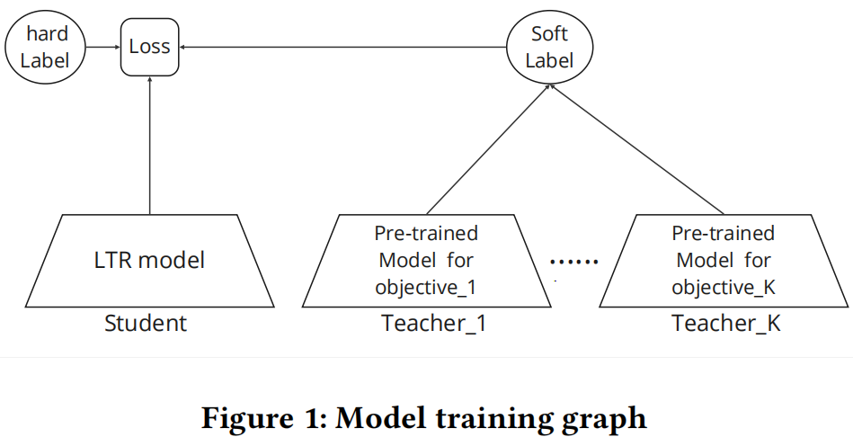
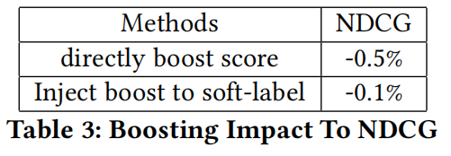

[TOC]

# 1. 现有方法的困境

在多目标优化领域，标量化方法和多目标进化算法是两种重要的解决策略，广泛应用于搜索排序、推荐系统等众多场景，为平衡多个相互冲突的目标提供有效途径。

- **标量化方法**：是业界常用的多目标优化手段，核心思路是将多个目标的损失函数进行线性加权，把复杂的多目标优化问题转化为相对简单的单目标优化问题 。例如在电商搜索排序场景中，为了平衡销售额、转化率、用户满意度等多个目标，会给每个目标的损失函数分配相应权重，再求和得到一个综合的单目标损失函数。常见的标量化方法包含两种：
  - 一种是为每个目标的损失函数分配权重后求和，像在电商推荐中，为平衡 GMV（商品交易总额）和 CTR（点击率），给 GMV 损失函数和 CTR 损失函数分别赋予权重，再相加作为单目标函数进行优化 ；
  - 另一种是*ϵ*−约束方法，将一个目标设定为主要优化目标，把其他次要目标作为约束条件。以在线旅游平台的搜索排序为例，可能将预订转化率作为主目标，把订单取消率、客户投诉率等作为约束，确保在提升预订转化率的同时，其他指标也在可接受范围内 。
  - 虽然标量化方法简单且易于扩展到大规模训练数据，但它也存在不足，比如不同目标的数据往往不平衡，多任务学习时若目标间相关性低，学习效率会降低，得到的可能是次优解 ；而且该方法通常假设目标成本函数可微，难以处理像规定新商品曝光比例这类不可微的业务目标。

- **多目标进化算法（MOEAs）**：属于基于群体搜索的随机优化算法，模拟自然进化过程来处理多目标优化问题。它维护一个种群，种群中的每个个体代表一组决策变量，对应多目标优化问题的一个潜在解 。在每次迭代中，通过选择、交叉和变异等操作产生新的种群，逐渐逼近 Pareto 前沿（Pareto 前沿是指在多目标优化问题中，所有非支配解的集合，即在该集合中，不存在一个解在所有目标上都优于其他解的情况）。在图像识别的特征选择问题中，需要同时考虑识别准确率、计算复杂度、内存占用等多个目标，多目标进化算法可以在解空间中搜索，找到在这些目标之间达到较好平衡的特征子集 。在实际应用中，多目标进化算法在处理复杂多目标问题时，能找到多个非支配解，为决策者提供多种选择。不过，它计算复杂度较高，需要较长的计算时间和较多的计算资源，而且算法参数的设置对结果影响较大，调参过程比较复杂 。

其中，标量化方法因简单高效在业界应用广泛，但它也面临诸多挑战：

- **多任务学习效率低且为次优解**：不同目标的数据存在严重不均衡，例如订单取消数据远少于点击和转化数据。多任务学习虽采用共享底层机制，期望让数据少的任务从数据多的任务中受益，但当目标间相关性低甚至冲突时，学习效率反而降低。即便如此，它仍比简单的模型融合方法表现好一些。
- **推理融合权重搜参难题**：多任务学习需调整两组参数，训练时多个目标的损失权重和推理时在线分数的融合权重。推理融合权重的网格搜索效率低，找到的权重难以保证最优，且权重不稳定，模型更新时往往需重新搜参。
- **可微性限制**：深度学习要求目标损失函数可微，然而实际业务中部分目标只是既定规则，如规定新内容分发占比，这类目标无法直接融入优化目标，只能在模型训练后人工干预，这无疑会降低模型性能。

# 2. Airbnb 的破局之法 —— 模型蒸馏多目标排序

面对这些困境，Airbnb 提出基于模型蒸馏的多目标学习排序方法，该方法基于一系列理论推导，将多目标学习损失函数与模型蒸馏建立起紧密联系。

## 2.1 多目标优化到模型蒸馏的转变

### 2.1.1 问题形式化描述

在 Airbnb 这类双边在线市场，常将一个业务目标（如 CVR）设为主要目标，其他业务目标（如订单取消率）视为约束，这与*ϵ*−约束方法一致，可用公式表示为：

其中，*θ*是可学习的模型参数，*X*是召回后待排序的 Item 特征，Ck(f(θ,X))是第k个目标的损失函数，C1(f(θ,X))是主要目标，ϵk是目标损失的约束上界。

### 2.1.2 推导转换

### 2.1.3 多目标与蒸馏的联系

这个损失函数与模型蒸馏损失函数相似，由两部分组成。

- 一是 hard label 对应的损失，即预测结果与主目标 Ground Truth 之间的损失；
- 二是 soft label 对应的损失，通过聚合*K*个目标独立优化的结果得到 soft label，再通过蒸馏损失推动模型逼近它。这里对各目标独立优化的结果做了模型融合, 实现了模型融合和模型蒸馏的有机统一。

优化多目标排序主要有三步：

## 2.2 多目标排序系统整体框架

下图是基于知识蒸馏的多目标排序系统(multi-objective learning to rank system with model distillation, 论文简称为MO-LTR-MD)的整体框架。

该系统的 Loss 由 hard label 和 soft label 两部分组成，作者用*α*改写 Loss：

## 2.3 深度理解 Soft Label

- **Soft Label 与 Hard Label 对比**
  - Hard Label 源于用户行为数据，反映用户和排序模型偏好，但高度稀疏，只能体现部分排序信息。这就导致Hard Label只能帮助我们获得部分基本事实：预订列表的排名高于用户未预订的列表，但未预定的列表的排序无从得知。
  - Soft Label 则纯粹反映模型偏好，虽缺失用户偏好，但能补充完整的列表排序。这个简单的系统可能不是最优的, 但通过Soft Label可以补充所有列表的排序。
- **Soft Label 的优点**：
  - 它有助于缓解数据不平衡，无需进行上采样或下采样；
  - 可充当正则化项，为多目标 LTR 模型提供先验知识；
  - 能很好地处理不可微目标；
  - 还能将模型知识传递给新版本模型，减少模型的不可再现性和不稳定性。

## 2.4 处理不可微的特定业务目标

实际业务中存在不可微业务目标，如控制新内容曝光占比，比如新内容在推荐中的曝光占比, 这种目标本身就是模糊的，不能从过去的数据中学习优化；再比如，新内容历史行为交互稀疏，一些与目标相关的特征(如CVR)缺失, 这使得传统的多目标排序优化难以处理这种不可微的业务目标。

传统方法难以处理这类目标，通过平均成熟 Item 特征值获取新 Item 特征的方式无法保证学习效率，还可能损害用户体验；直接修改 hard label 也不合理。而在 soft label 上进行调整则更为有效，例如对 soft label 中的新 Item 分数进行提升，能让模型更好地平衡目标，且对业务指标伤害更小。

## 2.5 应对训练开销和不可再现性

多目标排序模型存在不可再现性和不稳定性问题，即相同数据和结构训练出的模型指标可能不同，新数据训练时会加剧这种不稳定。Soft Label 基于预训练模型生成，存在训练开销和不可再现性。

Soft Label是基于预训练模型中得到的, 会存在训练开销的问题, 同时这些预训练模型也定期重新训练，也具有不可再现性。受 Born - Again Neural Networks 启发，Airbnb 提出自蒸馏方法，如下图。

- V0版本的模型, 按前面多目标排序框架里的方式训练, 从多个预训练的模型中得到Soft Label用于模型蒸馏。
- 对于后续版本的模型, Soft Label不再依赖于预训练模型, 而是直接使用前一版本模型的Soft Label

通过这种设计，训练复杂度显着降低：不需要维护和更新预训练模型，而是将这些知识提炼成Soft Label并沿模型训练路径传递。如果有需要这些预训练模型还是可以随时插入。实验证实了这种自蒸馏对业务指标没有负面影响，这种创新方法可以帮助减少模型训练不可再现性和不稳定性。

# 3. 实验

## 3.1 实验设置对比

与基线模型（相同的多任务学习系统）相比，MO-LTR-MD 方法优势明显，使用更少训练数据（360M vs 500M），训练时仅需调整一个蒸馏权重（*α*=0.2），推理时无需额外融合权重。

## 3.2 整体模型性能

- 离线评估中，MO-LTR-MD 的 NDCG 相比基线模型显著提升 1.1%；

- 在线 AB 测试里，CVR 提升 0.37%（显著性p=0.02），次要目标变化不大。

- 训练成本上，虽加载预训练模型生成 soft label，但因数据量少，训练时间与基线持平，且推理时延显著减少 1.6%。

## 3.3 自蒸馏测试

通过特定流程测试自蒸馏稳定性，如下图:

- V0模型是使用多个预训练模型的Soft Label训练的
- V1模型使用V0模型的Soft Label训练
- 对比V0模型，V1模型训练数据时间窗口后移了几个月

结果显示离线 NDCG 几乎相同，线上 AB 测试主次要目标基本持平，表明即使没有预训练模型，仅靠 soft label 传递知识也不会影响模型，新数据也不会削弱 soft label 的作用。

## 3.4 模型不可再生性测试

对比相同训练数据集和不同随机初始权重下的基线模型与 MO-LTR-MD 模型，发现 MO-LTR-MD 模型的 SxS 变化率降低 53%，PD 降低 11%，有效减少了模型不可再现性。

## 3.5 不可微的特定业务目标测试

模拟提高高评论评级 item 的业务目标，直接提升 rank score 会导致 NDCG 损失 0.5%，而在 soft label 上提升仅损失 0.1%，这是因为 soft label 作为正则化器，能引导模型走向与业务目标更契合的局部最小值。

# 4. 总结

Airbnb 的 MO-LTR-MD 系统在优化多目标排序、提升模型稳定性和处理不可微目标方面表现出色。不过，自蒸馏的长期效果还需更多在线测试验证，目前仅测试了两轮自蒸馏模型。未来，Airbnb 计划通过导入 MoE 层将权重学习融入模型训练，进一步优化多目标排序系统。

