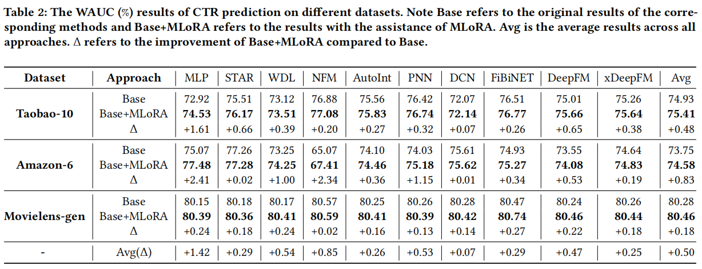

```
论文标题: MLoRA: Multi-Domain Low-Rank Adaptive Network for Click-Through Rate Prediction
论文地址: https://arxiv.org/pdf/2408.08913
发表年份：2024
机构: 阿里
```


[TOC]

在信息爆炸的时代，主流 App 为了满足用户五花八门的需求，往往会设置各种各样的推荐场景。就拿亚马逊来说，大家熟悉的 Banner、Selected for you、Recommend after card 等推荐场景，就是我们常说的 “域”。在这些推荐场景背后，点击率（CTR）预测可是至关重要的任务，它直接影响着网站收入、用户满意度和留存率。但在实际操作中，多域 CTR 预测却困难重重，这也促使着研究者们不断探索新的解决方案，今天我们要聊的就是阿里提出的 MLoRA，看看它是如何破局的。


# 1. 多域 CTR 预测的困境

如果每个推荐场景都独立建模，会出现不少问题。首先是数据稀疏问题，不同场景的数据量差异很大，一些小场景的数据非常稀疏，这就导致单场景模型容易出现欠学习的情况。

- 比如某个小众品类的推荐场景，由于数据量少，模型很难从中学习到足够的规律。
- 其次是场景关联问题，各场景独立建模完全忽视了它们之间的内在联系，使得推荐效果的提升受到限制。
- 最后，训练和维护成本也很高，每个场景都要单独进行训练和维护，新场景接入时的成本更是高得惊人。


为了解决这些问题，业内普遍采用多域 / 跨域建模的方式，像 MMoE、PLE、STAR 等方法被广泛应用。这些方法把参数划分为所有场景共享模块和各场景内部私有模块，在一定程度上缓解了上述问题。但新的麻烦又出现了，这样做会让模型的参数量大幅增加，而且对于数据量不足的场景，依然存在训练不充分的情况。

# 2. MLoRA

面对这些困境，阿里的研究者们借鉴了大语言模型（LLM）高效参数微调的思路，将 LoRA 引入到多域 CTR 预估中，提出了 MLoRA（Multi-Domain Low-Rank Adaptive Network for Click-Through Rate Prediction），为每个域都增加了专门的 LoRA 模块。


## 2.1 LoRA 方法简介


## 2.2 MLoRA 用于多域 CTR 预估

- **整体框架**：MLoRA 的 CTR 模型框架很直观，它将模型的每一层都拆分成公共部分和个性化部分，而不是把模型当作一个整体来处理。这样的设计可以更好地平衡模型的泛化能力和对不同域的适应性。
- 


在训练策略上，MLoRA 采用两阶段训练。预训练阶段，骨干网络使用大规模预训练数据进行训练，学习能泛化到各个领域的信息。微调阶段，添加 MLoRA 网络，同时冻结骨干网络，只关注*A*和*B*的更新，以此来学习每个域的个性化信息。可能有人会疑惑，骨干网络完全冻结不会影响性能吗？其实，CTR 模型的参数分为 Sparse 参数和 Dense 参数，MLoRA 主要处理 Dense 参数，Sparse 参数还是会正常更新。而且 Dense 参数比较稳定，通过更新*A*和*B*，能让 Dense 参数也稳定更新，理论上不会让性能有太大损失。

# 3. MLoRA 的 “实力验证”

## 3.1 整体效果

研究者们在多个数据集上对 MLoRA 进行了测试，包括 Taobao - 10、Amazon - 6、Movielens - gen 等。从实验结果来看，在各种主干网络下，MLoRA 都带来了效果的提升。比如在 Taobao - 10 数据集上，以 MLP 模型为例，Base 模型的 WAUC 为 72.92%，加上 MLoRA 后提升到了 74.53%，提升了 1.61%。多个模型在不同数据集上的平均提升达到了 0.5%，通过配对 T 检验可知，这些提升在统计学上是显著的。这表明 MLoRA 能有效缓解数据稀疏问题，捕捉域间的多样性信息，在各种深度 CTR 预测网络中都能很好地发挥作用。



## 3.2 分场景效果

进一步分析在各个子场景下的效果，发现 MLoRA 在不同子场景中都能实现稳定提升。以 Taobao - 10 数据集为例，在 MLP 模型的各个子场景中，Domain_1 的 AUC 从 58.23% 提升到了 62.24%，提升了 4.02%；Domain_6 的 AUC 从 56.56% 提升到了 60.12%，提升了 3.55%。这说明 MLoRA 对于数据量较小、差异较大的域，提升效果更为明显，有效缓解了数据稀疏和域多样性的问题。


## 3.3 消融实验

- **不同温度系数 α 的影响**：通过改变温度系数*α*来调整*r*值，对 MLP、FiBiNET 和 DeepFM 进行实验。结果发现，这三种方法的性能都随着*α*的增加呈现先上升后下降的趋势，这表明存在一个最优的*α*值。而且不同方法对应的最优*r*值也不同，MLP 在*α*为 128 时达到最优性能，DeepFM 在*α*为 64 时最优，FiBiNET 在*α*为 32 时最优。这意味着更复杂的模型需要更大的*r*值，也就是更小的*α*值。


- **不同场景数量的影响**：利用 Taobao - 10、Taobao - 20 和 Taobao - 30 这三个多域数据集进行实验，分析 MLoRA 在不同数量场景下的性能。结果显示，MLoRA 在这三个数据集上都有性能提升，分别为 0.49%、0.35% 和 0.29%。不过，随着场景数量增加，提升幅度略有下降。这可能是因为场景数量增多时，基础模型受不同域数据的影响更大，导致 MLoRA 性能波动。后续可以考虑同时微调基础模型和 LoRA 网络来解决这个问题。


- **预训练模型不同参数量级的影响**：由于 Amazon - 6 数据集规模较大，研究者假设当前三层全连接神经网络可能不足以学习大规模数据的分布知识。于是采用 MLP + MLoRA 方法，探索改变隐藏层神经元数量对模型性能的影响。结果发现，随着隐藏层神经元数量增加，模型性能持续提升，这说明大规模数据需要更复杂、参数更丰富的网络来充分学习。


## 3.4 线上 AB 实验

MLoRA 已经在阿里巴巴的电商网站上进行了部署，并开展了在线 A/B 测试。在集成 10 个核心推荐域，使用近 90 天（130 亿样本）的数据进行预训练，近 21 天（32 亿样本）的数据进行微调后，MLoRA 在实际应用中表现出色。CTR 相对提升了 1.49%，订单转化率（CVR）相对提升了 3.37%，整个网站的付费用户数提升了 2.71%。而且，MLoRA 对新添加的域很灵活，添加和微调新的 LoRA 适配器非常方便。这充分证明了 MLoRA 在实际生产环境中的优越性和可行性。


# 4. 总结

MLoRA 作为一个与模型无关的框架，为多域 CTR 预测提供了创新的解决方案。它通过为每个域配置 LoRA 适配器，有效缓解了数据稀疏和学习不足的问题，同时使用较少的模型参数，还能方便地应用到各种 CTR 模型中。无论是公开数据集上的实验，还是阿里巴巴电商网站的线上 A/B 测试，都充分展示了 MLoRA 的优势。


