```
题目：Actions Speak Louder than Words: Trillion-Parameter Sequential Transducers
for Generative Recommendations
论文：https://arxiv.org/pdf/2402.17152
机构：Meta
年份：2024
github：https://github.com/facebookresearch/generative-recommenders、https://github.com/glb400/Toy-RecLM、https://github.com/bailuding/rails
```

[TOC]

# 1. 推荐系统的困局

近年来，推荐系统的模型难以取得阶跃性效果提升，主要源于大数据模型规模受限、人工专家特征智能不足以及毫秒级模型效率低下等因素。这些因素相互交织，制约了推荐系统的发展，使其在面对海量数据和复杂用户需求时，难以实现性能的大幅突破。

## 1.1 大数据模型规模受限

从算力需求角度看，以 AlexNet 为标志进入深度学习时代后，模型对算力需求猛增，但推荐系统模型计算量在近几年陷入瓶颈。在现有架构下，即便提升模型规模，效果也未明显提升，出于成本考虑，企业缺乏扩大模型规模的动力。相比之下，CV、NLP 等领域模型计算量快速超越推荐模型，并展现出强大的 “涌现” 能力。

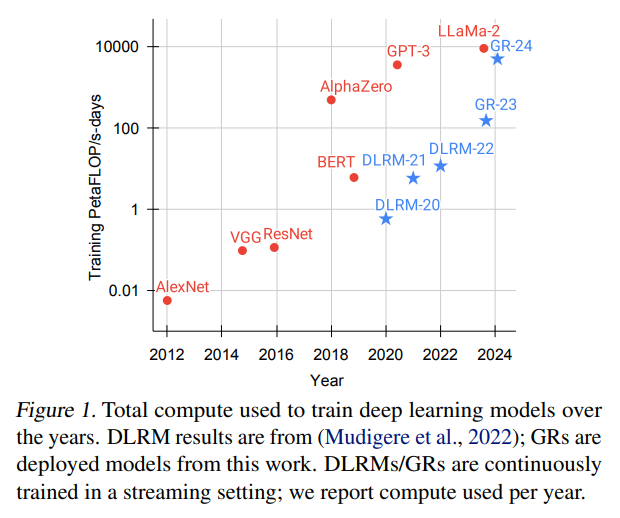

## 1.2 人工专家特征智能不足

推荐系统场景复杂，特征异构，包括用户、物品、上下文等多种类型，难以统一表达。在处理最有价值的用户行为特征时，因数据量过大，通常简化为短期行为特征和统计特征，这导致严重的信息损失。为弥补智能缺失，大量依赖专家知识进行特征工程，如构建人工交叉特征，但随着时间推移，特征挖掘成本上升，新特征收益递减，且模型受限于简化特征的信息缺失，无法充分发挥智能水平，限制了模型规模的扩大。

## 1.3 毫秒级模型效率低下

在推荐系统中，模型需在几百毫秒内从亿级候选中筛选出用户感兴趣的物品，而当前优秀的大模型如 ChatGPT 回答问题需几秒且候选仅十万级别。若将用户所有行为信息加入推荐系统模型，会导致请求超时，影响用户体验。在训练方面，推荐系统需快速响应用户兴趣变化，而直接使用海量原始用户特征训练，会面临内存溢出或训练周期过长的问题，工程效率成为制约推荐系统发展的关键因素。

# 2. 推荐系统中存在scaling law吗

推荐系统中存在 Scaling Law（随着模型计算量的提升，模型效果也会逐步提升），Meta 的相关研究工作证实了这一点，且其对推荐系统的发展产生了重要影响。

## 2.1 Meta 的研究发现

Meta 的论文《Actions Speak Louder than Words: Trillion - Parameter Sequential Transducers for Generative Recommendations》中提出的 GR 模型，在实验中展现出了 Scaling Law 现象。随着模型计算量的提升，模型效果逐步提升。如下图，在与传统推荐模型对比时，普通推荐模型在计算量变大时效果变化微弱，而 GR 模型效果有显著提升。

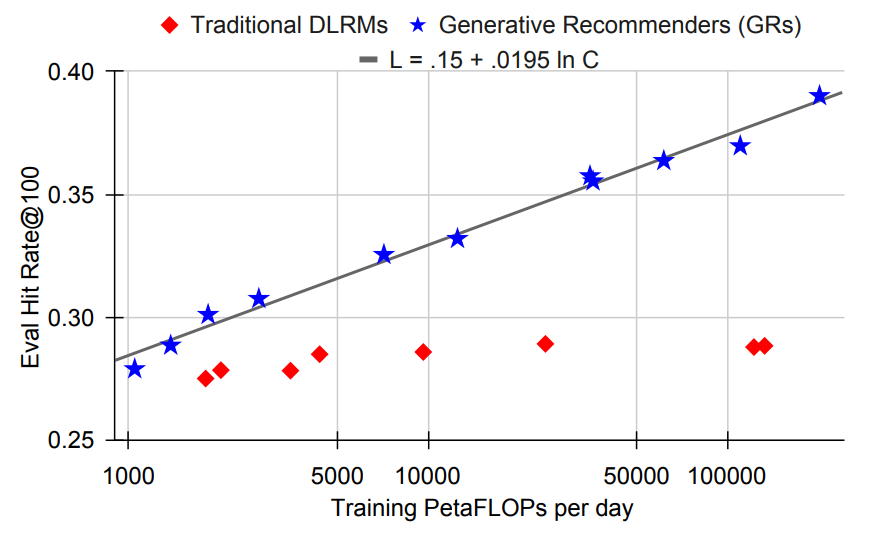

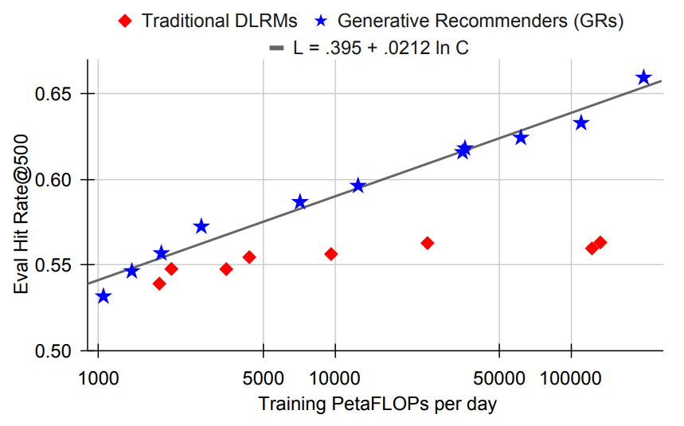

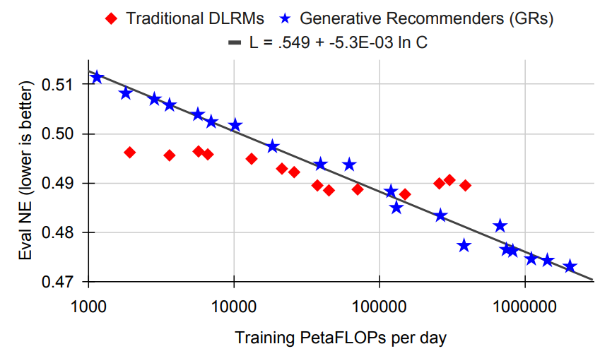

同时在Meta的另一篇论文《Wukong: Towards a Scaling Law for Large-Scale Recommendation》中，探讨了推荐系统中的模型为什么不遵循scaling law，并提出了一种新的模型结构Wukong，使其可以实现scaling law。从下图可以看出，论文提出的Wukong模型随着复杂度的提升，效果持续提升，而其他模型随着复杂度提升，效果提升缓慢或者不再提升。

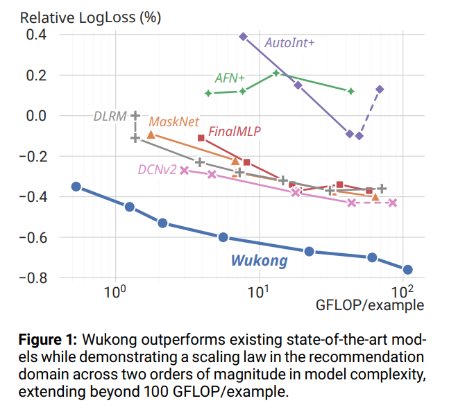

## 2.2 影响与意义

Scaling Law 在推荐系统中的存在为推荐系统的发展提供了新的方向。它意味着可以通过扩大模型规模和增加计算资源来提升推荐系统的性能，就像在语言模型领域中，更大的模型带来更好的效果一样。这可能促使研究人员和企业在推荐系统领域投入更多资源来探索更大规模的模型，也可能改变推荐算法工程师的工作模式，推动新的算法和架构的研发，以更好地利用 Scaling Law 来提升推荐系统的准确性和效率。

# 3. Meta 破局

Meta 通过重新定义推荐任务、特征组织、模型结构优化、训练与推理效率提升等多方面的创新举措实现了破局。

## 3.1 挑战

- 特征架构困境：在推荐系统中，特征体系呈现出明显的结构缺失状况。其中，异构特征，诸如高基数 id、交叉特征等，在工业级别的推荐模型里占据着极为关键的地位，然而却缺乏清晰的架构组织形式。
- 动态词汇难题：推荐系统所运用的词汇规模达十亿级别且处于动态变化之中，这与语言模型的静态词汇有着本质区别，由此引发了训练及推理过程中的诸多挑战。特别是在目标感知的情境下，当需要考量大量候选内容时，推理所需的成本会显著升高。
- 计算成本困局：推荐系统必须应对海量的用户行为数据，这使得计算成本成为大规模顺序模型发展的主要阻碍。尽管 GPT - 3 的训练规模已然十分庞大，但相较于推荐系统而言，其每日处理的用户行为数据量仍处于较低的数量级。

## 3.2 贡献

- 生成式推荐器（GRs）的创新提出：成功地把推荐问题转化为顺序转导任务的全新形式，有效整合了 DLRMs 内原本分散的异构特征空间，让排名与检索任务能够借助生成式训练方法开展，极大地增强了训练效率以及模型的整体性能表现。
- 层次顺序转导单元（HSTU）的精心设计：对传统的注意力机制进行了针对性的改良，使其能够契合大规模且处于动态变化的词汇环境，巧妙地利用推荐数据集自身的独特性质，实现了计算速度的大幅提升。在处理长序列数据时，相比基于 FlashAttention2 的 Transformers，其速度优势可达 5.3 倍至 15.2 倍。
- M - FALCON 算法的创新性提出：借助微批处理技术，有效地分散了计算成本。在维持相同推理预算的前提下，能够将模型的复杂度提升 285 倍之多，同时使吞吐量实现 1.50 倍至 2.99 倍的增长。
- 技术有效性的全面验证：通过在合成数据集、公共数据集以及大型互联网平台上展开一系列严谨的实验，充分证实了 GRs 在离线和在线评估中均显著超越 DLRMs。并且，其模型质量与训练计算量之间呈现出幂律扩展的规律，为推荐系统的后续发展开拓了全新的方向。

## 3.3 新推荐任务定义

所有任务都嵌入到这个序列生成模型中。对于召回任务，利用自回归的方式预测用户下一个点击item的概率分布，选择topK个item；对于排序任务，在最后一个token上接不同的MLP head进行多个预估目标的多任务学习。每个位置的预测，都会利用到上面构建的历史全序列信息。

GRs 的推荐任务定义在借鉴大语言模型思路的基础上，结合推荐系统的特点进行了创新，主要包括输入输出序列的设定以及不同任务的具体处理方式，以下为你详细介绍：

- **输入输出序列构成**：输入序列有三个。一是序列特征，即用户相关的行为等信息序列写作x0,x1,...,xn；二是时间序列，表示上述特征发生的时间，写作t0,t1,...,tn；三是其他 meta 数据，如交互行为写作a0,a1,...,an，当xk不是 item 的时候，ak无意义。输出序列为y0,y1,...,yn，给定x0,x1,...,xn，预测yn，同时还有一个 mask 序列m1,m2,...,mn，当mk=0表示此时yk无意义，当mk=1才是真正需要预测并计算 loss 的序列。这种组织方式可将一次请求 /session 的样本合并成一个序列，减少总样本量且能并行处理多个 item 对用户特征的 attention，降低计算量。
- **召回与排序任务处理**
  - 对于召回任务，文中虽未详细说明，但推测遵循传统范式，即构造负样本 + 双塔模型，通过如 MIP（max inner product）等快速检索手段优化 User 和 Item。
  - 对于排序任务，为体现 target aware，将 Item 提前到特征序列的头部，形如：item1、action1、item2、action、……、其他特征，action 部分对应的 mask 序列中的，且需要一些特殊样本处理手段，传统 auto agressive 只通过 softmax 交叉 target 和 context，而推荐系统中需要提前感知 target，通过这种方式实现对所有交互的目标感知交叉注意力计算。

论文中给出的特征示例

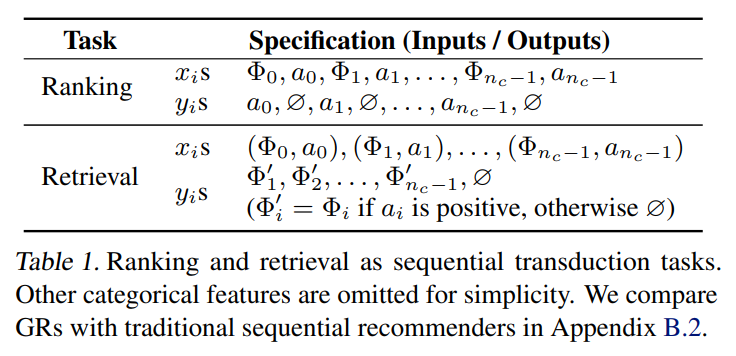

## 3.4 特征组织方式

Meta 通过对稀疏特征和统计特征的独特处理方式，有效地组织特征，具体如下：

- **稀疏特征处理**：选择最长的序列作为主序列，通常是用户交互过的 item 序列，并按照时间顺序进行排列。对于其他非交互类且变化缓慢的序列特征，例如年龄等，仅保留每次值发生改变时的数值与对应的时间，并依据时间将其合并到主序列的相应位置。由于这些非交互类特征普遍变化缓慢，所以最终形成的总序列长度不会大幅增加，从而在保证信息完整性的同时，有效地控制了数据规模，避免了因序列过长而带来的处理难题。
- **统计特征处理**：统计特征如点击率等往往变化极为频繁，每次用户与 Item 交互后都可能改变。若将其做成序列特征，会导致序列过长难以处理。鉴于此，在采用 sequential architecture + target aware 的方式下，当交互行为序列足够长时，依靠 transformer 强大的学习能力来获取这些统计信息，因此在最终的特征集合里，完全删除了统计特征。这种处理方式简化了特征结构，减少了数据冗余，同时也充分发挥了模型的学习能力，确保了关键信息的有效捕捉和利用。

- **序列构建优势**：将输入特征组织成完整序列，如把一次请求 /session 的样本合并，减少总样本量，且多个 item 对用户特征的 attention 可并行处理，降低计算量，提升了数据处理效率和模型训练效果。

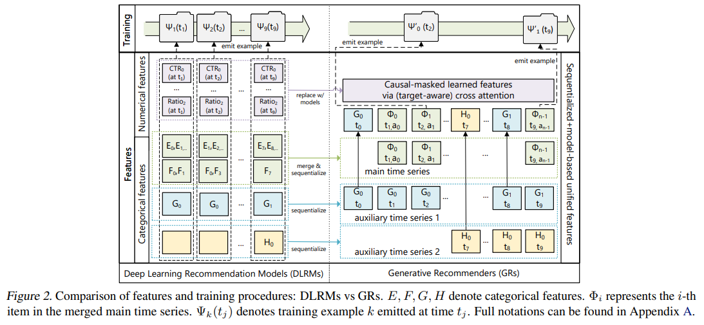

## 3.5 模型结构

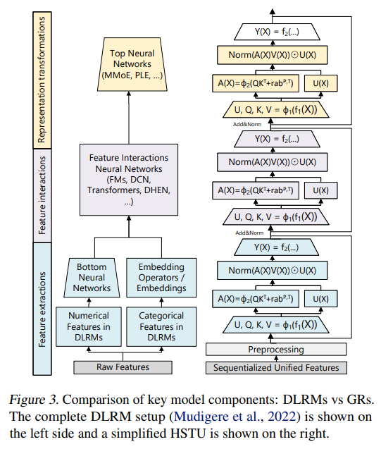

HSTU（Hierarchical Sequential Transduction Units）架构设计是 Meta 在推荐系统领域的重要创新，其独特的结构和机制有效提升了模型性能，主要包括整体架构、子层功能及优势体现等方面。

- **整体架构与堆叠方式**：HSTU 由相同的层通过残差结构（类似 resnet）堆叠而成。这种堆叠方式有助于梯度的稳定传递，避免梯度消失或梯度爆炸问题，使得模型能够训练得更深，从而学习到更复杂的特征表示和模式。通过残差连接，每一层都可以直接将输入信息传递到后续层，增强了模型对信息的利用效率，为处理推荐系统中的复杂数据和任务提供了有力支持。
- **子层构成与功能**：每个层包含 Point-wise Projection、Spatial Aggregation 和 Pointwise Transformation 三种子层。Point-wise Projection 子层主要负责对输入数据进行初步的线性变换，为后续的注意力计算等操作做准备；Spatial Aggregation 子层在注意力机制中发挥关键作用，通过计算点式池化后的归一化因子，实现对数据的空间聚合，更好地捕捉用户偏好强度，在处理非平稳词汇表时表现更优；Pointwise Transformation 子层则对经过注意力机制处理后的结果进行进一步的变换和调整，实现特征的融合与优化，例如通过与其他子层的协作完成显式特征交叉等操作，提升模型对数据的理解和处理能力。可参考如下公式理解
- 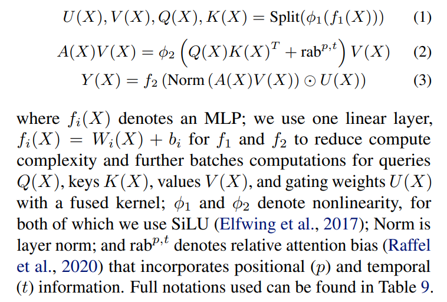
- **优势体现与性能提升**：在与传统模型对比中，HSTU 展现出显著优势。在处理长序列数据时，其通过独特的结构和算法设计，比 FlashAttention2 - based Transformers 快 5.3x 至 15.2x。这得益于其对注意力机制的优化、利用数据稀疏性以及高效的计算方式。在推荐系统任务中，能够更高效地处理用户行为序列等复杂数据，提升推荐的准确性和效率，为推荐系统的性能提升提供了重要保障，推动了推荐系统向更高效、智能的方向发展。

在 attention 机制上，与传统 softmax 注意力机制不同，采用新的点式聚合（归一化）注意力机制，激活函数从 softmax 改为 siLu。siLu 能同时感知输入序列的绝对强度，而 softmax 只感知相对强度，在推荐系统中用户行为强度对推荐有重要指导意义，且 softmax 在动态词表场景易带来波动影响流式训练稳定性。同时，加入了 relative attention bias（rab）表示位置偏差和时间偏差，类似 bert 中的 Positional Embedding，进一步提升了模型对用户行为序列的理解和处理能力。

## 3.6 超长序列处理

在当前的深度学习框架（如 TensorFlow 和 PyTorch）下，训练过程中直接处理长达 8000 以上的超长序列存在极大困难，主要源于内存占用过高易引发内存溢出以及计算效率极为低下这两个关键因素。

### 3.6.1 SL采样策略（随机长度采样）

研究表明，具有长交互序列的用户行为在时间维度上通常呈现出一定的重复规律，这一现象在其他推荐系统的研究中也有所提及，从而为采样策略提供了理论基础。由于用户行为的重复性，通过合理采样能够在确保不损失关键信息的前提下有效处理超长序列。简而言之，对于短序列保持原状不进行采样，而对于长序列则依据特定概率实施降采样操作，以此降低处理难度与资源消耗。

### 3.6.2 性能优化措施

第二步着重于对 Attention 进行性能优化，此过程主要涉及类似于 FlashAttention 的一系列矩阵乘法优化手段。这部分内容具有较强的工程性且已有明确的参考文献，在此便不做详细展开。从相关图表能够清晰地观察到，FlashAttention 在性能方面实现了显著的提升。值得一提的是，在 GR 模型中运用此类优化方法后，其吞吐率也获得了 2 至 5 倍的增长，这充分表明了该优化策略在提升模型处理效率方面的有效性。

## 3.7 训练与推理效率提升

### 3.7.1 生成式训练改进

从传统印象级训练转向生成式训练，按用户采样率调整训练成本，降低计算复杂度，分摊编码器成本，提高训练效率，解决了大规模数据训练的难题。

- 以序列自回归任务作为核心学习目标，即依据给定的序列来推断下一个会引发用户互动的 item 及其互动行为，此过程可视为多任务学习模式。针对各个不同的互动行为类别，分别对下一个 item 的 embedding 进行预测，并且确保正样本的打分高于随机抽取的负样本。在训练期间，广告侧的塔基本不参与参数更新过程，重点在于对用户侧塔的学习训练。而对于 Retrieval 任务，则依旧沿用传统的双塔模式。
- 当前的序列自回归主要聚焦于预测紧邻的下一个 item，即便跨越了 session 的边界，在一定条件下也是被允许的，但两个 session 之间的间隔会受到特定限制。这是由于该顺序在很大程度上是由推荐系统自身所决定的，并非自然形成的顺序。因此，目前也在积极探索是否能够放宽对顺序的严格限制，不过现阶段暂时仍维持对紧挨着的 next item 的严格预测要求。
- 三条序列会先进行融合操作，然后再采用 seq2seq 方式进行处理。在此过程中，并非直接运用 MLP 进行简单融合，而是先对每条序列分别进行 lookup emb 操作，接着各自随机将一些维度设置为 0（即进行 dropout 操作），最后再将处理后的序列相加。这样做的主要目的是防止内容理解序列在整个过程中占据主导地位，从而确保各序列在融合过程中的均衡性。
- 训练模式采用 15 分钟增量训练的方式，数据仅需一次性处理，随后便推送至机器上。无论是从零开始训练，还是进行离线评估以选择超参数，使用 3 天的样本数据便已足够，并且超参数的优选主要通过人工方式来完成。

### 3.7.2 M - FALCON 算法应用

在推荐系统中，除了训练阶段的效率问题亟待解决外，推荐阶段的耗时问题更为关键，毕竟通常整个推荐流程需在 1 秒内完成。针对此，作者创新性地提出了 Microbatched - Fast Attention Leveraging Cacheable OperatioNs（M - FALCON）方法。令人惊叹的是，在相同的在线预算条件下，即便采用复杂度高达 285 倍的模型，该方法仍能使吞吐量提升 1.5 倍。

其原理并不复杂：在精排阶段的推理过程中会涉及多个 item，一般采用 batch 推理模式。此时会发现每个样本仅在 target 相关特征上存在差异，而用户侧序列特征完全一致。若对每个样本单独进行推理，会造成大量 self - attention 运算的重复浪费。因此，作者将多个 item 拼接成一个序列，从而最大程度地复用计算资源。但这需要对 transformer 逻辑进行巧妙改造，以保证多个 target 之间互不干扰。尽管思路清晰明了，但在实际工程实施中却面临着诸多挑战。

从不同候选数量下 GR 和 DLRM 的推理性能对比图中可以明显看出，随着候选数量的不断增加，GR 的性能优势愈发显著，并呈现出持续扩大的趋势。

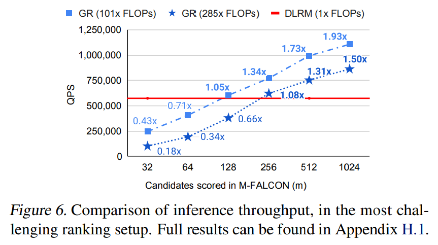

# 4. 实验效果

## 4.1 公开数据表现

直接看图

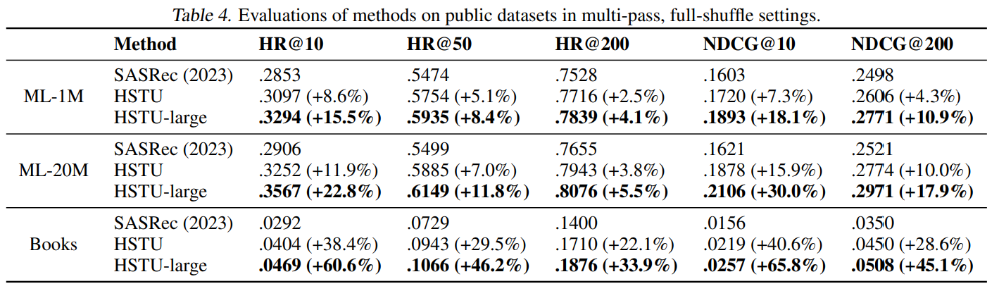

## 4.2 Meta线上表现

线上效果采用下面的指标

- E-Task 作为关键的在线参与度衡量指标，可类比为点赞与转发行为；
- C-Task 类似于视频的完播状况以及播放时长等任务。

就召回任务而言，作者进行了创新性尝试，一方面新增了一条 GRs 召回支路，另一方面采用 GRs 召回支路替换原有的 DLRM 召回支路。经实践检验，这两种方式均取得了极为显著的成效，其 E-Task 指标分别提升了 6.2% 与 5.1%。在精排任务方面，运用 GRs 模型后，E-Task 提升幅度高达 12.4%。在一个已然成熟的推荐系统中，能够达成如此显著的提升幅度，着实令人感到震撼，充分彰显了 GRs 模型在实际应用中的巨大潜力与优势。

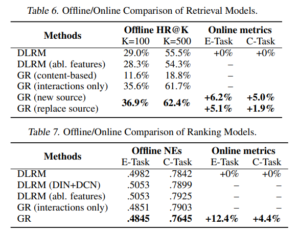

# 5. 评价

## 5.1 作者评价

本文亮点还是比较多的，包括且不限于

- “统一的生成式推荐”(GR) 第一次在核心产品线替换掉了近十年推荐工业界长期使用的分层海量特征的模型范式；
- 新的encoder (HSTU) 通过新架构 + 算法稀疏性加速达到了模型质量超过Transformer + 实际训练侧效率比FlashAttention2 （目前最快的Transformer实现）快15.2倍；
- 我们通过新的推理算法M-FALCON达成了推理侧700倍加速（285倍复杂模型，2.48x推理QPS）；
- 通过新架构HSTU+训练算法GR，我们模型总计算量达到了1000x级的提升，第一次达到GPT-3 175b/LLaMa-2 70b等LLM训练算力，且第一次我们在推荐模态观测到了语言模态的scaling law；
- 传统测试集MovieLens Amazon Reviews等相对经典SASRec提升20.3%-65.8% NDCG@10；
- 实际中多产品界面上线单特定ranking界面提升12.4%；
- ...

## 5.2 其他评价

GRs 在思路创新、工业界落地及业务效果上堪称教科书案例，对推荐系统优化意义重大，召回、排序、工程各环节均可借鉴：

- 召回算法可学其统一序列表达特征及用序列代统计特征快速上线；
- 排序算法能借鉴样本构造、HSTU 结构改进 transformer；
- 工程方面训练用 FlashAttention、精排推理用 M - FALCON 提效率。

GRs 最大贡献是继 SIM 后证明超长序列特征潜力并提供挖掘手段，在当前推荐系统成熟背景下，长序列利用程度影响算法效果。Meta 论文提出的生成式 DLRMs 改变推荐范式，如利用用户历史行为预测未来，性能比 Baseline 最高提升 65.8%，速度超传统 Transformers 模型 5.3 - 15.2 倍，A/B 测试关键指标提升 12.4% 并成功部署多平台，展示了 Scaling Law 应用可能，实现流式信息与个性化推荐，提升用户体验和商业价值。