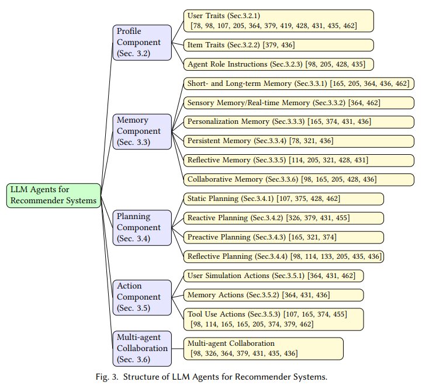

[TOC]

# 1. 背景

大模型智能体时代的推荐系统是在大语言模型（LLMs）和推荐系统（RS）各自发展并相互融合的背景下产生的，这种融合是技术发展和用户需求推动的必然结果。

- **LLMs 与推荐系统的发展现状**：LLMs 近年来取得了显著进展，基于 Transformer 架构的先进模型，通过在大规模无标签文本上进行自监督或半监督学习，拥有了强大的自然语言处理和生成能力，能够处理如文本生成、智能问答、机器翻译等多种复杂任务。推荐系统在互联网领域广泛应用，通过预测用户偏好来提供个性化服务，但传统推荐系统在处理复杂用户需求、适应动态环境变化以及利用外部知识等方面存在局限。
- **二者融合的驱动力**：LLMs 的出现为推荐系统的变革提供了新的契机。LLMs 能够增强推荐系统在理解用户意图、生成多样化推荐、推理用户行为以及解释推荐结果等方面的能力。LLMs 可以更好地处理复杂的用户查询，挖掘用户潜在需求，为推荐系统提供更丰富的语义理解和知识支持。从智能体的角度来看，LLMs 赋予智能体理解、规划、推理、解释和执行等能力，使其成为更强大的问题解决者，能够更好地辅助推荐系统完成个性化推荐任务。
- **融合带来的变革**：LLMs 与推荐系统的融合开启了个性化和智能化用户体验的新时代。这种融合使得推荐系统能够更精准地捕捉用户兴趣，提供更符合用户需求的推荐内容，提升用户满意度。在电商领域，融合后的系统可以根据用户的浏览历史、购买记录以及实时反馈，结合 LLMs 的知识理解能力，为用户推荐更合适的商品；在娱乐领域，能为用户推荐符合其口味的音乐、电影等内容，并且可以解释推荐的依据，增强用户对推荐结果的信任。

# 2. 摘要

本文全面探讨大语言模型（LLMs）与推荐系统（RS）融合的现状、挑战及未来发展。LLMs 赋予智能体强大能力，优化推荐系统各环节，如通过画像、记忆、规划和行动模块提升推荐性能，多智能体协作增强系统处理复杂任务的能力。推荐系统则从记忆、规划、工具和智能体推荐等方面优化 LLM 智能体，还推动了个性化 LLMs 和智能体的发展。然而，二者结合在安全性、可解释性、公平性和隐私性上面临诸多挑战，如 LLM 智能体的安全攻击、推荐系统的偏见与隐私威胁等。未来，LLM 智能体可通过多智能体协作、优化记忆等提升推荐系统，推荐系统可在工具推荐、个性化配置等方面增强 LLM 智能体性能。解决这些问题将推动可扩展、可信智能系统发展，提升用户体验。

# 3. 面向推荐系统的 LLM 智能体技术

推荐系统的大模型智能体融合大语言模型（LLMs）和智能体技术，革新推荐方式。它借助 LLMs 的能力理解用户，经多个模块运作并支持多智能体协作，提升推荐的个性化和精准度，为用户提供更好体验。

## 3.1 定义与核心能力

推荐系统的大模型智能体是基于 LLMs 构建的智能体，具备理解、规划、推理、解释和执行能力。它能处理自然语言，理解用户复杂需求，像理解 “推荐和《盗梦空间》类似的烧脑电影” 这种模糊查询，挖掘用户对复杂叙事和心理悬疑题材的喜好。凭借推理能力，分析用户多方面行为数据推测意图，如从购买、阅读和搜索行为推断旅行计划并推荐相关物品。还能解释推荐依据，增强用户信任。

## 3.2 关键组成模块

- **画像模块**：此模块定义和封装用户与物品关键特征，助力智能体模拟交互行为，实现个性化推荐。用户特征涵盖年龄、性别、兴趣爱好等，物品特征包括类别、品牌等。通过这些特征，智能体可深入了解用户偏好，如分析用户历史行为确定其对电子产品品牌的偏好，从而精准推荐。此外，智能体角色指令能让多智能体协作完成复杂任务，在旅游推荐中，不同智能体分别负责交通、住宿和景点推荐。

- **记忆模块**：记忆模块使智能体存储、检索和利用过往交互信息、用户偏好和环境上下文。长短期记忆结构让智能体兼顾用户近期和长期兴趣，个性化记忆满足个性化需求，持久记忆提供通用知识支持。实时记忆和反思记忆赋予智能体动态调整策略的能力，依据环境变化优化推荐。多智能体系统中的协同记忆促进信息共享与协作，提升整体推荐性能。

- **规划模块**：规划模块将复杂推荐任务分解为小步骤，制定和优化推荐策略。根据场景和需求，规划策略分为静态规划、响应式规划、前瞻式规划和反思式规划。静态规划适用于固定任务场景；响应式规划根据实时反馈调整策略；前瞻式规划提前预测需求优化决策；反思式规划依据经验改进策略，提升推荐效果。

- **行动模块**：行动模块由规划模块决策触发，是智能体与环境交互的接口。它包括用户模拟行动、记忆相关行动和工具执行行动。用户模拟行动模拟用户在系统中的行为，帮助理解需求；记忆相关行动负责记忆的检索、更新和反思；工具执行行动借助外部工具增强推荐能力，如调用搜索引擎获取更多信息。

## 3.3 多智能体协作模式

多智能体协作通过智能体间协同与任务分工提升推荐系统性能。同功能智能体协作增强对复杂用户行为的模拟和理解，不同功能智能体分工协作发挥各自优势，处理更复杂任务。多智能体间的动态交互和知识共享，使系统能适应多样化需求和复杂场景，提供精准高效的推荐服务。在电商推荐中，不同智能体分别负责商品筛选、用户偏好分析和推荐结果整合，共同为用户提供优质推荐。

# 4. 服务于 LLM 智能体的推荐系统技术

服务于 LLM 智能体的推荐系统技术，旨在解决 LLM 智能体在实际应用中的诸多局限，通过一系列针对性的技术手段，提升其性能和适应性，拓展其功能边界，使 LLM 智能体能够更高效地处理复杂任务，为用户提供更优质的服务。

- 记忆推荐技术
  - **动态记忆检索机制**：记忆推荐的核心是动态选择和检索与当前任务紧密相关的记忆，以此扩展 LLM 智能体的上下文能力，提升任务响应和决策效率。在处理用户复杂需求时，智能体可借助该技术迅速从海量记忆中精准筛选出有用信息。当用户询问 “推荐一些适合家庭聚会的餐厅” 时，记忆推荐能快速检索出用户以往对餐厅的评价、家庭聚会的偏好等相关记忆，为推荐提供有力支持。
  - **关键技术实现**：包括基于检索的记忆技术，如最近邻搜索，通过计算记忆向量在高维空间的相似度来检索相关记忆；检索增强生成（RAG），将检索与语言模型生成过程相结合，在生成推荐时引入相关知识，提高推荐的准确性和丰富性 。在神经网络架构优化方面，Transformer 及其变体（如 Transformer-XL、压缩 Transformer）利用自注意力机制有效管理长程依赖，增强记忆能力；Memory-Augmented Neural Networks（MANNs）则允许神经网络动态访问外部记忆，进一步提升记忆处理能力。结构化记忆表示通过将知识图谱融入语言模型，使记忆推荐更具可解释性和准确性。
- 规划推荐技术
  - **结构化规划辅助**：规划推荐致力于为 LLM 智能体提供结构化的步骤和战略提示，帮助其克服多步骤推理和复杂问题解决的困难，提升任务管理能力、逻辑流畅性和一致性。在处理复杂任务时，如制定旅行计划，规划推荐会将任务分解为选择目的地、预订机票酒店、规划行程等有序子步骤，引导智能体逐步完成任务，减少错误和逻辑混乱。
  - **多种规划方法协同**：实现规划推荐的方法主要有内部推理增强和外部计算与交互推理。内部推理增强通过 Chain-of-Thought（CoT）提示，引导智能体生成中间推理步骤，提升推理准确性；自一致性方法通过采样多个推理路径并选择最一致的答案，增强推理的可靠性；zero-shot CoT 则使智能体在无示例的情况下进行推理。外部计算与交互推理借助外部资源，如让模型使用外部记忆存储（如 Scratchpad 方法）来记录中间计算过程，通过 Program-Aided Language Models（PAL）生成程序（如 Python 代码）解决复杂数学和逻辑问题，以及利用 Tree-of-Thought（ToT）提示让模型探索多种推理路径，优化决策过程。
- 工具推荐技术
  - **拓展功能的工具选择**：工具推荐帮助 LLM 智能体在面对自身知识和能力局限时，动态选择和使用专门的工具或 API，借助外部资源实现目标。这一技术极大地拓展了智能体的功能，使其能够处理超越语言理解与生成范围的任务。在客户服务场景中，智能体可通过工具推荐调用知识库、数据分析工具等，快速准确地回答客户问题；在商业分析领域，能调用数据可视化工具对数据进行分析和展示。
  - **多元技术实现工具推荐**：工具推荐的技术包括提示策略、结构化策略和检索策略。提示策略通过向智能体呈现工具信息和查询，让其选择合适工具，如 EasyTool 通过创建简洁的统一工具指令简化选择过程；结构化策略利用图结构（如二分图、树结构、有向图）系统地选择工具，确保任务高效完成；检索策略通过匹配查询和工具文档（如基于 BM25、TFIDF 等方法），找到最适合的工具，并且随着技术发展，新的训练方法（如 Confucius 的多阶段训练）不断涌现，提升智能体对工具的理解和选择能力。
- 智能体推荐技术
  - **精准匹配提升效率**：智能体推荐通过分析用户查询、理解用户意图并匹配智能体功能，确保在特定领域（如代码开发、医疗诊断、法律分析和客户支持等）中，用户能获得最适合的智能体协助，从而提升用户体验和工作效率。在代码开发场景中，智能体推荐系统可根据用户的编程需求和问题类型，精准推荐擅长相应领域（如 Python 编程、算法设计等）的智能体。
  - **初期发展的主要方法**：该领域目前尚处于初步发展阶段，主要方法包括意图理解和自适应推荐。意图理解借助自然语言处理技术解析用户查询，确定用户需求，同时通过创建详细的智能体档案（包括智能体的功能、性能指标、擅长领域等），实现用户与智能体的精准匹配。自适应推荐则支持多智能体协作，根据用户反馈动态调整推荐，如利用强化学习技术，依据用户满意度和参与度优化推荐策略，提供更高效、相关的个性化服务。

# 5. 可信推荐系统和智能体

在大模型智能体与推荐系统融合的背景下，可信性成为二者在现实世界应用部署中的关键挑战，主要涉及安全性、可解释性、公平性和隐私性四个重要方面。

## 5.1 安全性

- **面临的攻击威胁**：LLM 及其智能体的安全性面临多重挑战。在训练阶段，存在训练数据被恶意篡改的风险，攻击者通过精心设计的数据集引入特定漏洞，影响模型的安全性。在推理阶段，攻击者利用对抗性提示诱导有害输出，而无需修改模型的底层权重。这些攻击可能导致模型产生有害内容、强化歧视性偏见、传播错误信息或侵犯用户隐私。推荐系统则容易遭受中毒攻击，攻击者通过注入恶意数据影响推荐结果，还可能面临去匿名化威胁，导致用户隐私泄露。
- **防御机制与挑战**：当前研究重点关注安全对齐、推理引导和输入 / 输出过滤等防御机制。安全对齐通过特定算法使模型输出符合安全准则和道德标准；推理引导在不改变模型参数的情况下，辅助模型生成更安全的响应；输入 / 输出过滤则检测并处理潜在的有害内容。但推荐系统和智能体结合时还面临独特挑战，如用户推荐智能体的核心组件可能受后门触发影响，平台也可能面临来自智能体的大量请求压力。因此，需要不断优化安全评估方法、强化隐私保护，并探索多智能体协作中的安全机制。

## 5.2 可解释性

- **LLM 及其智能体的解释视角**：LLM 及其智能体的可解释性研究涵盖细粒度和整体两个视角。细粒度视角通过特征归因方法，如扰动 - based、prompt-based、gradient-based 和 vector-based 等技术，分析特定输入特征对模型输出的影响，但这些方法各自存在局限性，如计算成本高、无法准确反映模型行为等 。整体视角则通过探测 - based 方法和机械可解释性，深入了解模型的内部机制，包括模型如何封装和表示知识、信息如何在模型中处理和编码等。
- **推荐系统的解释方法与评估**：在推荐系统中，可解释性分为模型固有方法和模型无关方法。模型固有方法通过用户行为分析、神经符号推理等技术直接生成解释，模型无关方法则利用反事实推理等方式提供个性化解释。评估可解释性的方法包括离线测试和在线用户反馈，然而在线用户反馈虽然能提供更真实的用户体验，但成本较高。未来研究可结合检索增强生成（RAG）与知识图谱技术，开发包含记忆机制的全面框架，提高解释的可信度，促进 AI 系统的透明化和高效发展。

## 5.3 公平性

- **LLM 的偏见来源与应对**：算法公平性对于减少社会偏见、促进社会公平至关重要。LLM 面临多种偏见问题，训练数据可能包含固有偏见和有害内容，导致模型在学习过程中继承这些偏见；采样过程中的分布差异会造成采样偏见，影响模型输出的公正性；语义编码时也可能出现语义偏见，使模型在语义理解上产生偏差。为解决这些问题，可采用指令微调和提示工程等方法，减少模型的不公平输出。
- **推荐系统的偏见与改进措施**：推荐系统同样存在多种偏见，如选择偏见、曝光偏见和流行度偏见等，这些偏见会导致推荐结果对某些用户群体不公平。为提高推荐系统的公平性，可在数据预处理阶段通过多目标优化等方法减少数据中的偏见；在训练过程中，通过调整模型的目标函数或采用对抗训练等方式，直接减少偏见；在推荐结果生成后，利用重排序等后处理方法，优化推荐结果的公平性。未来研究应着重关注基于用户特定数据的学习机制、保护弱势用户群体的利益，以及将公平性设计融入系统开发的全生命周期。

## 5.4 隐私性

- **隐私威胁的维度**：LLM 及其智能体以及推荐系统的隐私问题涉及多个维度，包括用户隐私和平台隐私。用户隐私方面，系统收集的用户数据可能被滥用，用于定向广告或欺诈活动。平台隐私方面，攻击者可能获取系统的敏感组件，如模型参数和用户交互日志，或通过伪装成合法用户注入偏见数据，破坏系统的完整性。隐私威胁主要表现为去匿名化、推理攻击和中毒攻击，这些攻击可能导致用户身份泄露、敏感信息被窃取或系统推荐结果被恶意操纵。
- **隐私保护技术与未来方向**：为应对隐私威胁，可采用多种隐私保护技术。匿名化技术，如 k - 匿名、l - 多样性和 t - 接近度等，通过模糊用户身份信息保护隐私；扰动技术，如差分隐私，在数据中引入噪声以保护个体数据；加密技术，如同态加密，确保数据在传输和处理过程中的安全性；对抗性方法则通过优化噪声分布或模拟攻击场景，增强系统对隐私威胁的抵抗力 。未来研究应聚焦于数据清理、隐私过滤、分布式架构优化和用户隐私控制，在保障隐私的同时，平衡系统的功能性能，构建安全可信的生态系统。

# 6. 未来方向、挑战与机遇

## 6.1 LLM 智能体提升推荐系统的方向与挑战

- **多智能体协作处理复杂任务**：利用多智能体协作处理复杂任务是未来的重要方向。通过将不同智能体分配到特定子任务，如分别负责用户画像管理、信息检索、推荐决策等，能显著提升系统对复杂用户查询的处理能力。在推荐旅游产品时，可由一个智能体分析用户历史旅游数据和偏好，另一个智能体搜索相关旅游资源，最后由决策智能体整合信息给出推荐。但这面临智能体间协作协调的挑战，如信息共享不及时、任务分配不合理等问题，需要设计高效的协作机制来解决。
- **增强用户交互**：开发主动互动型智能体，使其能动态预测用户需求，实现更自然的人机对话和个性化推荐，是提升用户体验的关键。智能体可根据用户的历史行为和实时情境，主动推荐符合用户潜在需求的内容。但实现这一目标需要智能体具备强大的自然语言处理和情感理解能力，目前技术在理解用户情感和意图的准确性上还有待提高。
- **优化记忆与知识表示**：采用短期与长期记忆的分段管理机制，并结合反思式记忆更新，有助于提升智能体的上下文感知能力。智能体可以更好地记住用户的长期偏好和短期需求变化，从而提供更精准的推荐。然而，如何有效管理和检索大规模的记忆数据，以及如何让反思式记忆更高效地指导决策，是需要攻克的技术难题。
- **可扩展性与高效性**：随着数据量和用户规模的不断增长，利用并行处理、高效算法和云架构，在大规模数据检索中降低延迟，增强系统的适应性，成为推荐系统发展的必然要求。但在实际应用中，实现高效的并行处理和算法优化并非易事，需要解决数据一致性、任务调度等复杂问题。
- **伦理考量**：在推荐系统中，设计透明、公平的推荐机制至关重要，尤其是在金融、医疗等高风险领域，要确保智能体决策的可信性与合规性。避免推荐系统产生偏见，保证推荐结果对所有用户公平公正，同时要让推荐过程可解释，使用户能够理解推荐的依据。但目前在公平性和可解释性方面的技术还不够成熟，需要进一步研究和探索。

## 6.2 推荐系统优化 LLM 智能体的机遇与方向

- **工具与记忆推荐**：推荐系统可以动态推荐工具、API 或外部知识资源，帮助 LLM 智能体优化任务执行。在智能体处理复杂问题时，推荐系统可根据任务需求推荐合适的工具，如数据分析工具、知识图谱查询接口等。同时，通过筛选相关记忆片段，智能体能够更高效地处理复杂的用户历史数据。但如何精准匹配工具和记忆与具体任务需求，是需要解决的关键问题。
- **个性化智能体**：为用户提供领域定制化建议，如代码辅助、客户服务、健康管理等，能极大提升智能体的适用性与实用性。根据不同用户的需求和使用场景，为智能体配置个性化的参数和功能，使其更符合用户的特定需求。但实现个性化配置需要深入了解用户需求和领域知识，同时要解决个性化与通用性之间的平衡问题。
- **规划推荐**：更自适应地将复杂任务分解为简单步骤，推荐系统可以帮助 LLM 智能体提升推理效率并减少决策错误。通过提供结构化的规划建议，引导智能体更合理地执行任务。但不同任务的分解方式和规划策略差异较大，需要研究通用且灵活的规划推荐方法。
- **信任与可解释性**：通过生成直观解释增强智能体决策透明性，构建可信且可解释的 AI 框架，是提升用户信任的重要途径。让用户清楚了解智能体决策的依据和过程，增加用户对推荐结果的接受度。目前在可解释性技术方面还存在不足，需要进一步研究如何生成简洁易懂且准确反映决策过程的解释。