[TOC]

今天就给大家深度剖析谷歌提出的一种无需训练就能用大语言模型做推荐的框架 ——STAR（Simple Training-free Approach for Recommendation）！

# 1. LLM 在推荐系统的应用现状

LLMs 的出现，给推荐系统带来了新机遇，目前主要有这几种应用方式：

- **当特征编码器**：LLMs 理解内容的能力超强，能从商品元数据和用户画像里挖掘丰富语义信息。像把 LLM 生成的连续向量离散化后训练生成模型；用 LLM 向量初始化序列模型的参数；直接计算商品和用户向量的相关性等。不过，优化这些向量往往要增加训练成本，还会牺牲通用性。
- **做打分和排序工具**：研究发现，LLMs 能通过自然语言提示理解用户偏好来推荐商品。但单纯用 LLMs，效果不如用用户 - 商品交互数据微调的模型。所以现在大家都在研究怎么用交互数据微调模型，可这成本也不低。
- **当信息检索排序器**：在文档检索中，LLMs 能直接当排序器，而且零样本学习的效果甚至超过了传统有监督方法。它的提示方式有三种：
  - 逐点式（point-wise）直接评估相关性，但难以区分文档重要程度；
  - 逐对式（pair-wise）对比商品对的偏好，效果好但调用成本高；
  - 列表式（list-wise）同时对比多个商品，不过性能依赖模型的语义和推理能力。

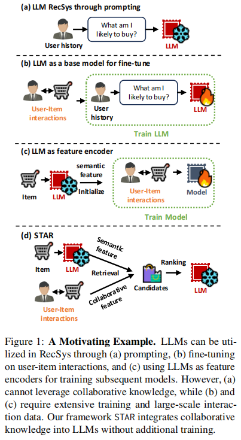

然而，在推荐场景下，排序任务很主观，和文档检索不太一样。而且大部分方法都得用下游任务数据微调 LLMs，又增加了训练成本。这时候，STAR 框架就闪亮登场啦！

# 2. STAR 框架解析

STAR 框架主要由检索和排序两部分组成，不用额外训练，就能在各种推荐任务里表现出色。

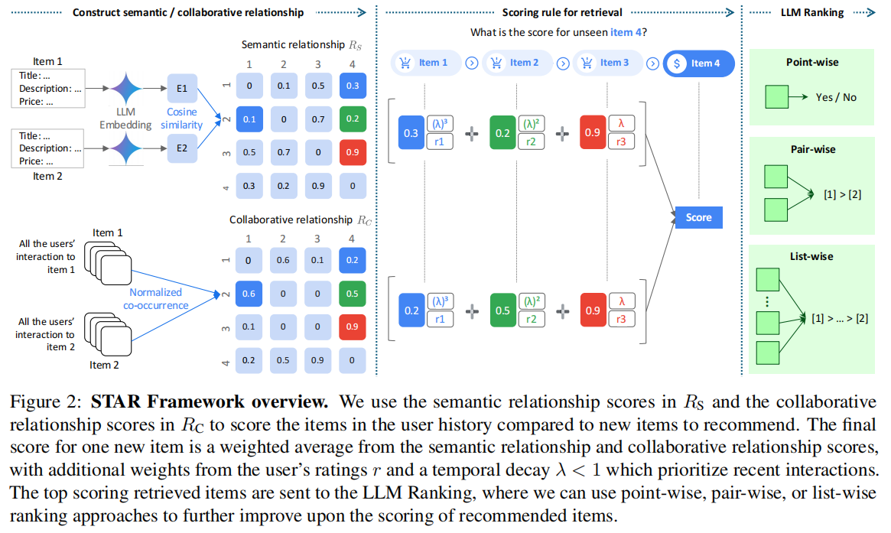

## 2.1 检索阶段

检索阶段就是根据用户的历史行为，给没见过的商品打分。它把语义信息、协同信息、时序信息和评分信息巧妙融合，具体是这么做的：

- **语义关系**：把商品的标题、描述、类别、品牌、销量排名、价格等信息写成提示，输入到 LLM 的 Embedding API 里，就能得到语义向量。用余弦相似度计算用户历史行为里的商品和候选商品的语义相似度得分，这个得分矩阵就是Rs。比如有个商品是假发，把它的各种信息输入后得到向量，再和用户之前买过的商品向量对比，就能知道语义相似度有多高。

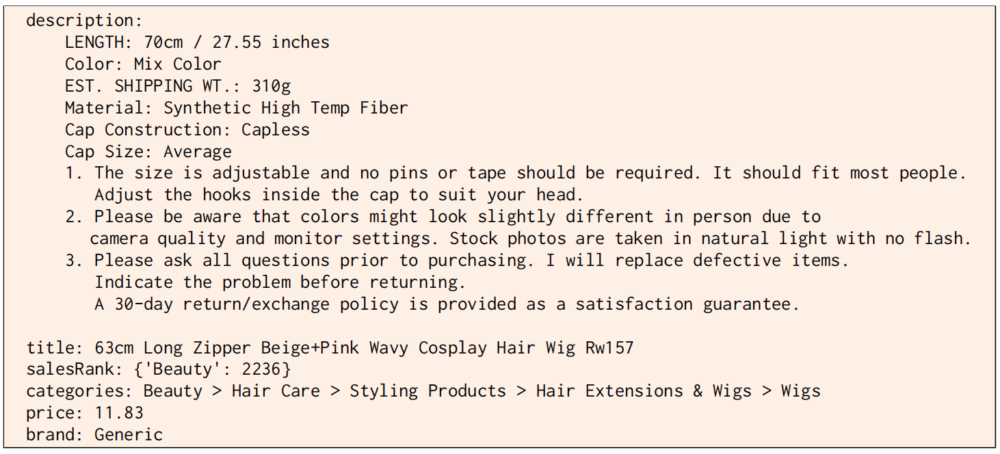

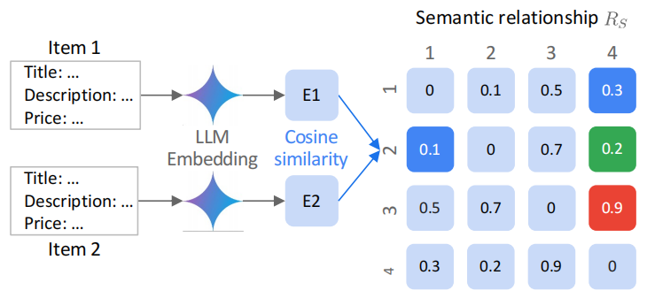

- **协同关系**：协同共现信息可是推荐系统的关键。先统计每个商品的用户交互情况，得到用户 - 商品交互矩阵C，再用余弦相似度算出商品之间的协同共现得分，形成矩阵Rc。假如很多用户同时买了洗发水和护发素，那这两个商品的协同共现得分就会比较高。

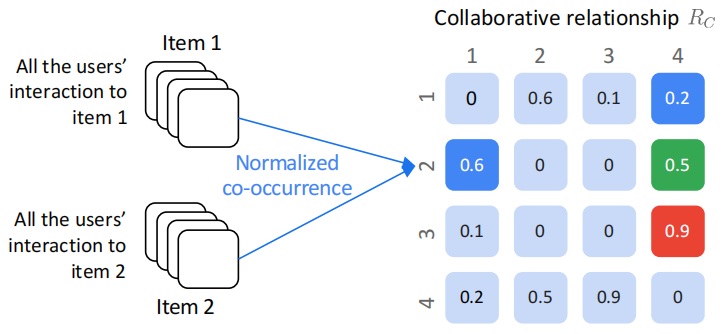

- **打分融合规则**：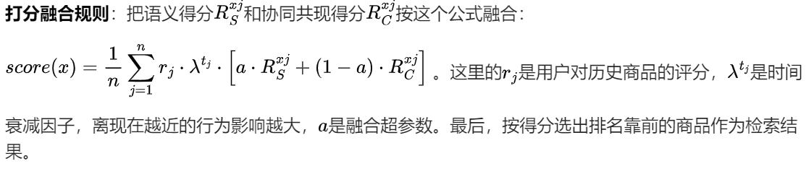

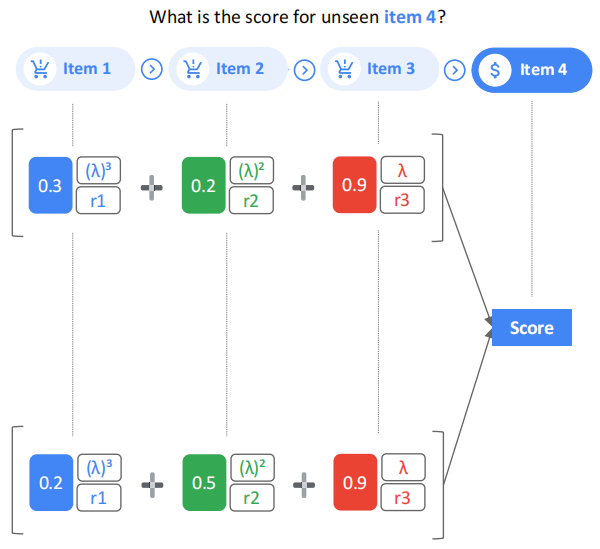

## 2.2 排序阶段

### 2.2.1 排序策略

排序阶段把检索得到的商品按得分排序后作为输入，再用这三种策略进一步排序：

- **point-wise**：基于用户历史序列，单独评估每个商品和用户交互的可能性。要是两个商品得分一样，就按检索阶段的得分排。
- **pair-wise**：用滑动窗口法，从检索得分低的商品开始，比较相邻商品对，根据用户偏好调整顺序。
- **list-wise**：同样用滑动窗口，一次比较窗口里的多个商品，按步幅滑动调整顺序。pair-wise 其实就是窗口大小为 2、步幅为 1 的 list-wise。

### 2.2.2 Item 提示信息

排序时的提示信息除了商品基本信息，还加了流行度和共现信息。流行度就是统计商品在数据集中被交互的次数，共现信息是统计和用户历史商品同时被购买的次数。这些信息能帮助 LLM 更好地理解用户偏好，让排序更精准。

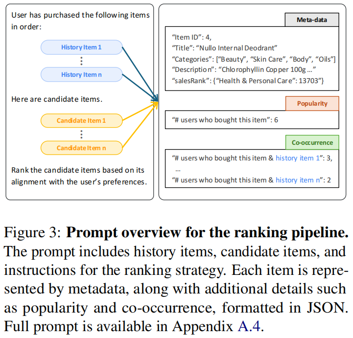

# 3. 实验结果

研究者用 2014 年亚马逊评论数据集，在美妆、玩具游戏、运动户外这几个品类上测试 STAR 框架，和好多传统监督学习模型对比，结果超惊艳：

## 3.1 整体效果

STAR - Retrieval（检索阶段）的表现就很厉害，在玩具游戏和美妆品类上，很多指标都比其他模型好；在运动户外品类上，仅次于 IDGenRec 模型。加上 STAR - Ranking（排序阶段）后，效果更上一层楼，尤其是 pair-wise 排序，在多个品类上都显著提升了指标。

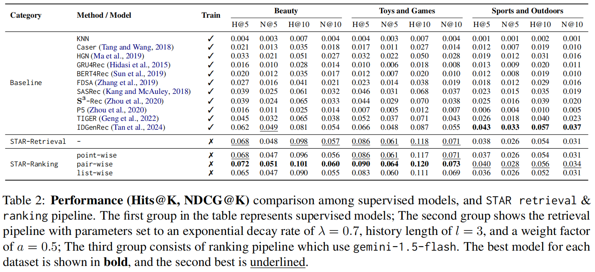

## 3.2 超参分析

研究发现，检索阶段的超参数（语义和协同信息融合权重）在 0.5 - 0.6 之间时效果最好；用户历史行为长度为 3 时性能最佳，再多效果反而下降；时间衰减因子为 0.7 时，能更好地突出近期行为。

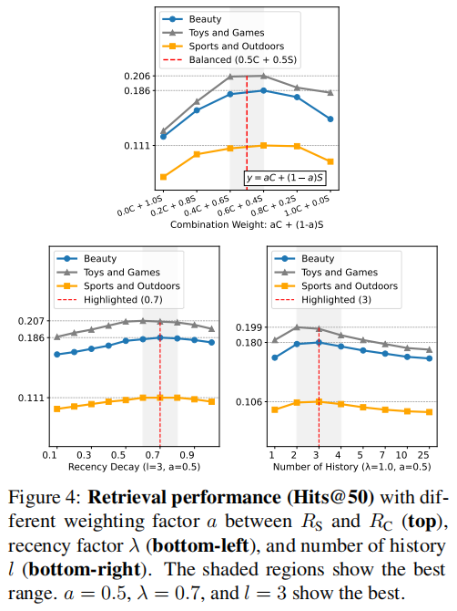

排序阶段，pair-wise 和小窗口的 list-wise 排序效果比其他方式好。

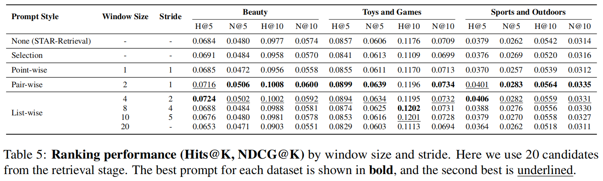

## 3.3 消融实验

去掉检索阶段的用户评分信息，效果反而更好，这是因为任务重点是预测交互，不是评分。

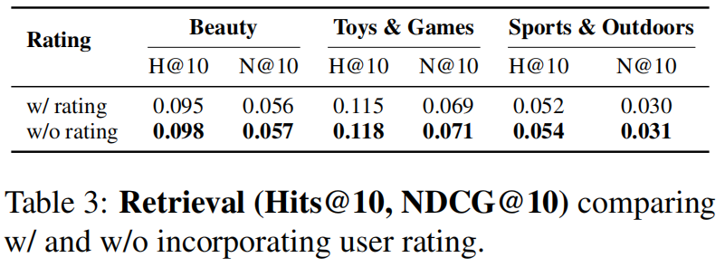

在排序阶段，增加共现信息能提升效果，加流行度信息却没啥用，甚至还会降低性能。

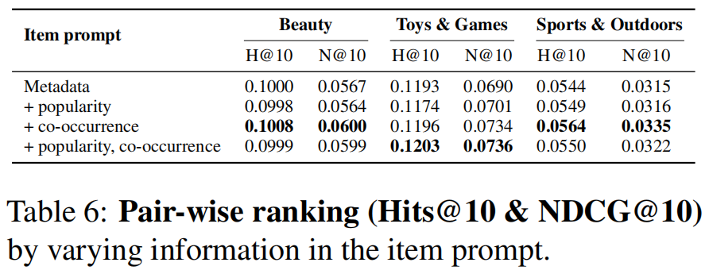

# 4. 总结

STAR 框架把 LLMs 的语义理解能力和用户 - 商品交互的协同信息结合起来，不用额外训练就能达到很高的推荐质量。实验证明，它在多个数据集上都表现出色，给推荐系统开辟了新方向。

不过，STAR 也有一些不足。比如它很依赖商品的文本元数据，如果没有这些数据，语义关系捕捉能力就会变弱。以后可以考虑加入图像、音频等多模态信息。另外，现在的参数选择比较麻烦，计算量也大，大规模应用时成本高。未来研究可以从简化参数选择、提高计算效率这些方面入手，让 STAR 变得更强大！

