在这个信息爆炸的时代，大家每天都会被海量的数字内容包围，像新闻、社交媒体动态、电子书等等。不知道你有没有想过，平台是怎么知道你喜欢什么，然后精准给你推荐内容的呢？这背后就是内容推荐系统在发挥作用。今天，咱们就来聊聊 Meta 在这方面的新成果 ——EmbSum 框架。

# 1. 老方法的 “烦恼”

以前，很多研究把预训练语言模型（PLMs）用到推荐系统里，确实提升了内容推荐的效率。但这些方法存在两个明显的问题。

- 第一个问题是，它们对用户历史行为内容里的兴趣捕获能力比较弱。以前的做法大多是把用户行为的每个内容单独编码，再聚合起来。可这样做没办法很好地捕捉用户历史内容之间的互动关系。打个比方，你昨天看了一篇美食文章，今天看了一篇旅游文章，这两篇文章之间可能存在一些潜在联系，比如你可能是打算去旅游的地方品尝美食，但之前的方法很难发现这种联系。
- 第二个问题是，有些方法为了让用户和候选内容更好地匹配，把候选物品整合到用户序列建模中。这种方法虽然能提高匹配度，可它是在线实时操作的，推荐系统没办法提前进行离线预计算，这就限制了它们在实际场景中的应用，就像在高流量的平台上，实时计算会给服务器带来很大压力，导致推荐不及时。

# 2. EmbSum

为了解决这些问题，研究人员提出了 EmbSum 框架。这个框架很厉害，它既能离线预先计算用户和候选物品的嵌入表示，又能捕捉用户长期参与历史中的互动。

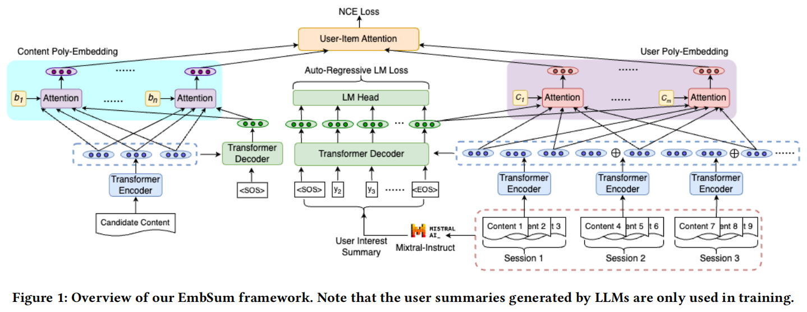

## 2.1 User Session Encoding：给用户行为 “分组”

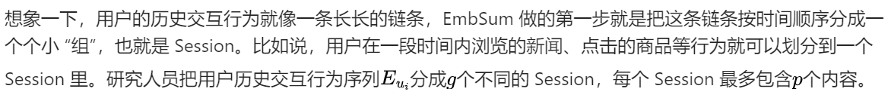

划分好 Session 后，每个 Session 会单独通过 T5 编码器进行编码。这里把每个文本内容开始符号 [SOS] 对应的隐层状态当作该文本内容的表征，这样就能得到k个表征向量。这一步就像是给每个 “小组” 里的内容都贴上了一个独特的 “标签”，方便后续处理。

## 2.2 User Engagement Summarization：借助 LLM “读懂” 用户兴趣

只靠前面得到的k个表征向量，很难完全理解用户的兴趣。所以，EmbSum 借助了大语言模型（LLM）的强大能力。研究人员用 Mixtral - 8x22B - Instruct 这个模型，根据用户的历史交互内容生成用户兴趣摘要。

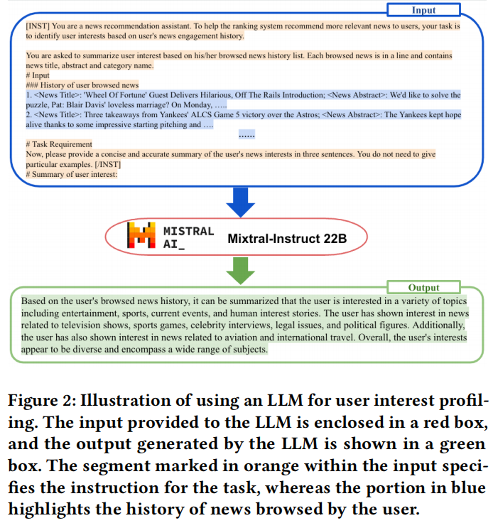

比如说，给 Mixtral - 8x22B - Instruct 输入用户浏览过的新闻标题、摘要和类别等信息，它就能总结出用户对娱乐、体育、时事等多种话题感兴趣。这些摘要包含了丰富的用户偏好信息，然后会和前面用户 Session 编码环节得到的所有 token 隐含状态一起输入到 T5 解码器中。最后，通过自回归训练方式，让模型学习生成用户兴趣摘要，使用的损失函数是：

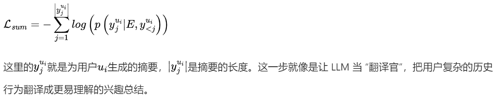

## 2.3 User Poly - Embedding：多维度刻画用户兴趣

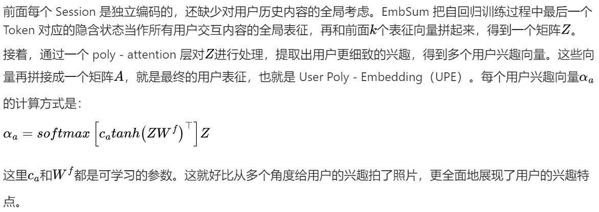

## 2.4 Candidate Content Modeling：给候选内容 “深度画像”

对于候选内容，EmbSum 也有独特的处理方式。不像传统方法只用序列的第一个 token 来表示，EmbSum 把候选 Item 内容经过编码器后的所有隐含状态，像处理 UPE 一样进行操作。

通过一系列计算，得到n个表征向量，再把它们拼接成矩阵B，这就是 Content Poly - Embedding（CPE）。这种多维度的表示能更细致地展现候选内容的特点，让推荐系统在匹配用户和内容时更精准。

## 2.5 CTR 预测与训练：找到用户和内容的 “最佳匹配”

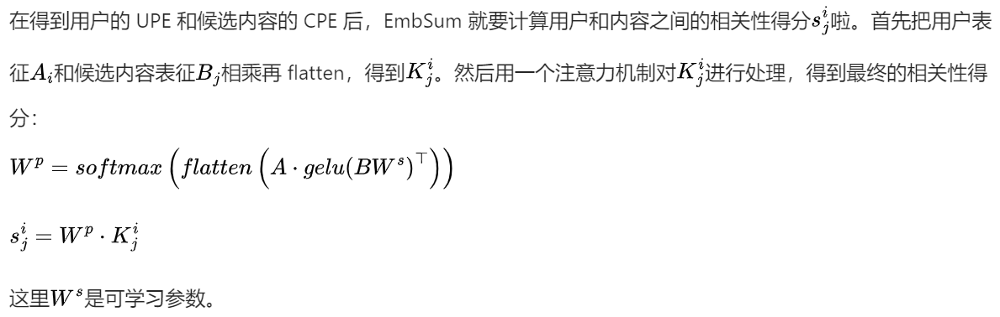

这里作者使用了gelu损失函数，其函数图像如下图。

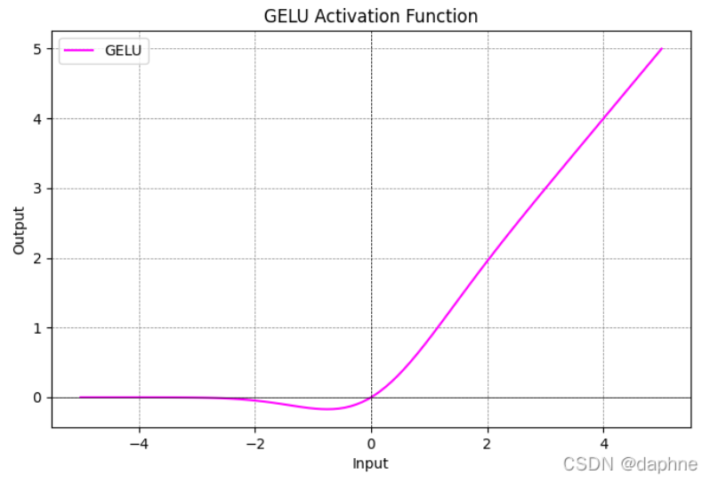

在训练模型时，EmbSum 使用了 NCE 损失函数：

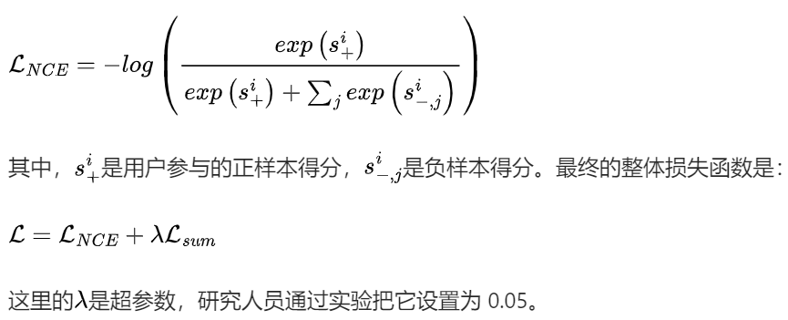

# 3. 实力 “碾压”：EmbSum 的实验表现

## 3.1 数据与评估指标

他们选了两个公开的基准数据集：MIND 数据集，来自微软新闻的用户参与日志，包含 94K 用户和 65K 新闻文章，用户点击新闻文章作为正样本，未点击作为负样本；Goodreads 数据集，专注于书籍推荐，根据用户评分来标注，评分高于 3 是正样本，低于 3 是负样本，有 50K 用户和 330K 本书籍。

评估指标用了 AUC（一种分类指标）、MRR 和 nDCG@topN（排名指标，这里 topN 取 5 和 10）。为了让实验更严谨，还选了很多基线方法进行对比，像 NAML、NRMS、Fastformer 这些从 scratch 训练文本编码器的方法，还有 NAML - PLM、UNBERT、MINER 这些使用 PLMs 的方法。

## 3.2 实验效果

从实验结果来看，EmbSum 的表现相当出色。在 AUC 指标上，EmbSum 在 MIND 数据集上达到了 71.95，在 Goodreads 数据集上是 61.64，都超过了之前的 SOTA 方法 UNBERT。而且 EmbSum 用的是只有 61M 参数的 T5 - small 模型，相比基于 BERT 的方法（像 UNBERT 和 MINER 有 125M 参数），参数少了很多，却能实现更高的准确率。

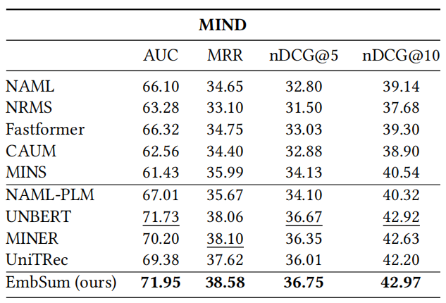

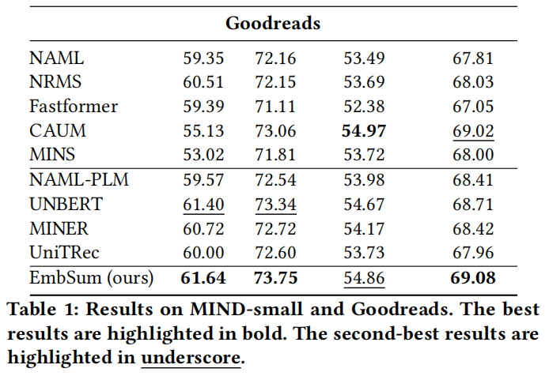

在其他排名指标上，EmbSum 在两个数据集上也取得了很好的成绩，比如在 MRR 和 nDCG@10 指标上都是最优的。这说明 EmbSum 在推荐内容时，能把用户真正感兴趣的内容排在更前面。

## 3.3 深入探究 EmbSum

研究人员还做了消融实验，看看 EmbSum 里各个部分的重要性。去掉 CPE 后，模型在 MIND 和 Goodreads 数据集上的 AUC 得分分别下降了 3.78 和 0.67，这表明用多个嵌入表示候选内容能增强用户和物品的交互，对提升推荐效果很关键。

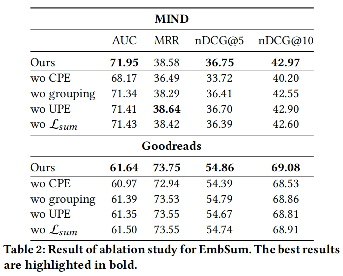

去掉基于会话的分组，直接单独编码每个内容，AUC 也会下降。减少 UPE 层的码本大小，让每个用户只用一个向量表示，同样会导致性能下降。去掉用 LLM 生成用户兴趣摘要这一项（即去掉Lsum），模型性能也会降低。这些实验结果都证明了 EmbSum 各个组件的有效性。

## 3.4 超参数影响：稳定性超强

研究人员还研究了超参数对模型的影响，像总结损失的权重，还有 CPE 和 UPE 的大小。实验发现，EmbSum 对这些超参数不太敏感。比如取 0.05、0.1、0.3 时，模型在验证集上的性能差别不大；CPE 大小从 2 增加到 8，UPE 大小从 16 增加到 48，模型性能也没有明显变化。这说明 EmbSum 很稳定，在不同的超参数设置下都能保持较好的性能。

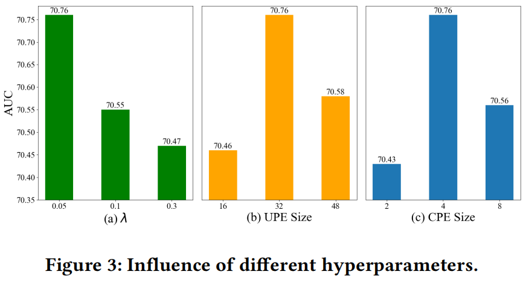

## 3.5 生成摘要：效果超棒

EmbSum 还有一个厉害的地方，就是能生成用户兴趣摘要。研究人员用 ROUGE 指标来评估这些摘要的质量，在 MIND 数据集上 ROUGE - L 得分达到 39.12，在 Goodreads 数据集上是 28.16。从具体例子来看，EmbSum 能准确捕捉用户的多样兴趣，比如根据用户浏览新闻的历史，能总结出用户对娱乐、生活方式、时事等方面的兴趣。而且，用 GPT - 4 评估 LLM 生成的用户兴趣摘要时发现，大部分摘要都能准确抓住用户的兴趣。

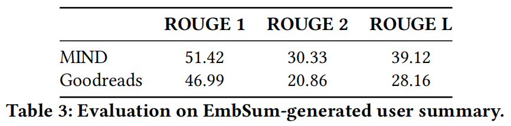

# 4. 小结

EmbSum 这个框架通过独特的设计，在内容推荐方面取得了很好的效果。它用编码器 - 解码器架构和多注意力模块，不仅能学习独立的用户和候选内容嵌入，还能根据用户长期的参与历史生成兴趣摘要。这不仅提升了推荐的准确性，还为推荐的可解释性和透明度提供了帮助。

