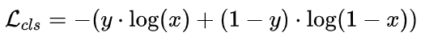

[TOC]

```
论文标题: HLLM: Enhancing Sequential Recommendations via Hierarchical Large Language Models for Item and User Modeling
论文地址: https://arxiv.org/pdf/2409.12740 
机构: 字节 
发表年份：2024
github: https://github.com/bytedance/HLLM
```

# 1. 推荐系统的困境与 LLM 的探索

目前，主流的基于 ID 的推荐系统存在明显短板。一方面，在冷启动场景下表现欠佳，严重依赖 ID 特征使得新物品或新用户加入时，推荐效果大打折扣。比如一个新上架的小众商品，由于缺乏足够的 ID 交互数据，很难精准地推荐给潜在感兴趣的用户。另一方面，相对浅层的网络结构难以捕捉复杂多变的用户兴趣，无法满足用户日益多样化的需求。

随着大语言模型（LLM）的崛起，其强大的知识储备和推理能力吸引了众多研究者探索将其应用于推荐系统。这主要衍生出三种方向：

- 利用 LLM 为推荐系统提供精细化信息，像丰富 Item 的特征；
- 将推荐系统转变为对话驱动形式，以更自然的交互方式理解用户需求；
- 修改 LLM，使其能处理 ID 特征等非文本输入输出。

然而，LLM 在推荐系统中的应用并非一帆风顺。与基于 ID 的方法相比，LLM 处理用户行为序列时需要更长的输入序列，计算复杂度呈二次增长，效率较低。而且，目前基于 LLM 的推荐方法提升效果并不显著，同时还有三个关键问题亟待解决：

- 预训练 LLM 权重在推荐场景中的真正价值尚未明确；
- 对推荐任务进行微调是否必要以及效果如何；
- LLM 在推荐场景中是否像在其他领域一样具有 Scaling Law（即随着模型参数增加，性能相应提升的规律），也有待验证。

# 2. HLLM：User - Item 分层的创新架构

为了攻克上述难题，字节跳动提出了 HLLM 架构，它主要由 Item LLM 和 User LLM 两部分组成。


## 2.1 Item LLM：强大的特征提取器

Item LLM 承担着从 Item 的文本描述中提取丰富特征的重任。它以 Item 的标题、标签、描述等文本信息作为输入，并在文本末尾添加一个特殊 Token——[ITEM]。


最终，模型输出中对应 [ITEM] 的部分就被视作该 Item 的 Embedding。不过，论文中未详细说明 Item LLM 的预训练方式，有研究者推测可能会引入推荐用户行为信号进行微调，就像小红书 NoteLLM 使用共现笔记做 GCL 实现微调一样，通过这种方式让 Item LLM 更好地学习到与推荐相关的语义信息。


## 2.2 User LLM：精准的兴趣预测器

User LLM 的输入是经过 Item LLM 处理后的用户历史交互序列，也就是一系列的 Item Embedding。它的核心任务是进行 Next Item Prediction，预测用户下一个可能感兴趣的 Item Embedding。在训练过程中，User LLM 有生成式推荐和判别式推荐两种训练方式，HLLM 将二者结合使用。


### 2.2.1 生成式推荐训练方式


### 2.2.2 判别式推荐训练方式

分为 Early Fusion 和 Late Fusion 两种。


Early Fusion 是将 Target Item 的 Embedding 拼接到用户行为序列末尾，再输入 User LLM 进行特征交叉和分类预测，Target Item可与用户行为序列在User LLM中进行充分的特征交叉，优点是效果好，但效率低。

Late Fusion 则是先在用户行为序列末尾添加特殊 Token [User]，用 User LLM 提取用户 Embedding，再与 Target Item 的 Embedding 拼接进行预测。这种方式在推理时效率更高，字节跳动在实际落地中采用的就是 Late Fusion。对于预测部分，这是一个二分类问题，使用常见的交叉熵损失函数进行训练，公式如下：



其中y是样本标签， x是预测的 logit。

### 2.2.3 整体训练 Loss

HLLM 将生成式和判别式的损失进行加权融合，得到整体训练损失：


其中 lambda 是生成式辅助 Loss 的权重系数，通过调整这个系数，可以让模型在不同训练目标之间找到最佳平衡。

# 3. 全方位实验验证 HLLM 的实力

## 3.1 LLM 预训练及推荐目标微调的作用

通过一系列实验，研究人员发现：无论是 Item LLM 还是 User LLM，基于预训练并微调的模型在推荐效果上表现更优。


预训练权重的质量也与推荐效果呈正相关，预训练使用的 Token 越多，效果越好，而增加对话场景的 SFT（Supervised Fine - Tuning）对推荐场景并无明显收益。


同时，使用推荐目标对 Item LLM 和 User LLM 进行微调十分必要，只有经过微调，模型才能更好地适应推荐任务，提升推荐性能。


## 3.2 HLLM 是否具有 Scaling Law

为了验证 HLLM 是否具有 Scaling Law，研究人员分别对 Item LLM 和 User LLM 进行了不同参数规模的实验。结果表明，随着 Item LLM 和 User LLM 参数数量的增加，模型在推荐任务上的性能不断提升，这说明 HLLM 确实具有良好的 Scaling Law，为模型的进一步扩展和优化提供了有力依据。


## 3.3 对比基线

在与其他先进模型的对比实验中，HLLM 展现出了显著的优势。在 Pixel8M 和 Amazon Book Reviews 等数据集上，HLLM 在各项指标上都大幅超越了传统的基于 ID 的模型，如 SASRec、HSTU 等，以及文本 - 基于模型 LEARN。与表现最差的基线模型相比，HLLM - 1B 在 Pixel8M 上平均提升了 22.93%，在 Books 数据集上更是高达 108.68%。而且，随着 HLLM 模型参数从 10 亿提升到 70 亿（HLLM - 7B），性能提升更为显著，进一步凸显了 HLLM 架构的优越性。


## 3.4 训练和 Serving 效率

在训练效率方面，HLLM 表现出色，仅需 1/6 - 1/4 的数据量就能达到与 HSTU 同等的性能水平。


在推理阶段，HLLM 采用 Item Cache 方法来提高效率，虽然会导致一定的性能下降，但仍然优于 HSTU。这意味着 HLLM 在实际应用中，既能保证推荐效果，又能兼顾效率，具有很高的实用价值。


## 3.5 线上 AB 测试


HLLM 不仅在离线实验中表现优异，还在实际的线上 A/B 测试中得到了验证。通过采用判别式推荐的 Late Fusion 变体进行优化，HLLM 在关键指标上实现了 0.705% 的显著提升，充分证明了其在真实推荐场景中的有效性和实用性。

# 4. 总结

HLLM 通过创新的分层架构，有效利用 LLM 的强大能力，成功解决了推荐系统面临的诸多问题。它将 LLM 的预训练知识融入推荐模型，在 Item 特征提取和用户兴趣建模方面表现出色，同时证明了推荐目标微调的重要性。HLLM 具有良好的 Scaling Law，随着模型参数和数据量的增加，性能不断提升。在与其他模型的对比中，HLLM 展现出显著优势，并且在训练和 Serving 效率上也能满足实际应用的需求。线上 AB 测试更是验证了其在真实场景中的有效性，为推荐系统的发展开辟了新的道路。未来，我们期待 HLLM 能够在更多场景中得到应用和优化，为用户带来更加个性化、高效的推荐体验。


