```
论文标题: HoME: Hierarchy of Multi-Gate Experts for Multi-Task Learning at Kuaishou
论文地址: https://www.arxiv.org/pdf/2408.05430
发表年份：2024
机构: 快手
```

[TOC]

在当今的互联网时代，短视频平台的火爆程度有目共睹，像快手这样拥有庞大用户群体的平台，如何精准地为用户推荐他们喜欢的视频，成了决定平台兴衰的关键。这背后，推荐系统的多任务学习起着核心作用。今天，咱们就来深入探究一下快手在这方面的重大创新 ——HoME（Hierarchy of Multi - Gate Experts）。

# 1. 多任务学习与 MoE 范式：推荐系统的基石

推荐系统的业务目标丰富多样，时长类的长播、完播、快划，互动类的收藏、评论、转发等都是常见的目标。为了统一建模这些目标，多任务学习应运而生，它也成为了现代推荐系统的核心议题。

在业界，多任务学习广泛采用混合专家范式（MoE）。MoE 通过为每个任务引入共享和特定任务私有的 Expert（专家），再利用门控网络衡量相关 Expert 的贡献。其中，谷歌提出的 MMoE 和腾讯提出的 PLE 是 MoE 范式中比较经典的方法。不过，看似完美的 MoE 范式，在快手的实践中却暴露出了不少问题。

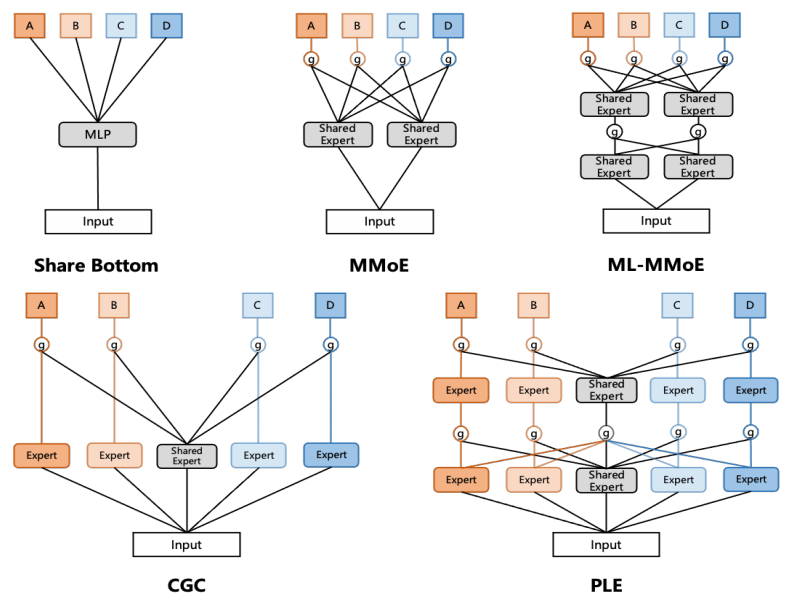

# 2. MoE 范式的 “成长烦恼”：三大问题浮出水面

## 2.1 Expert 崩溃问题：门控网络的 “偏心”

在使用 MMoE 方法时，快手的研究人员发现了一个奇怪的现象。从主要任务使用的 6 个共享 Expert 的门控输出权重得分来看，所有门控网络都给 #6 号共享 Expert 分配了极高的权重，几乎忽视了其他共享 Expert。深入检查 6 个共享 Expert 的输出值分布后，问题的根源逐渐清晰。#6 号 Expert 输出的均值远远小于 #1 - 5 号 Expert，这种输出均值的显著差异，使得门控网络难以公平地为不同 Expert 分配权重，导致不同数值水平的专家相互排斥。而且，#6 号 Expert 超过 90% 的输出是零激活值（使用 ReLU 激活函数的结果），这使得其导数均值小，参数无法得到充分训练，严重影响了模型的性能。

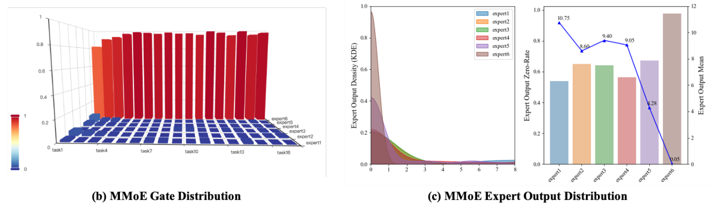

## 2.2 Expert 退化问题：共享 Expert 的 “变味”

在解决了 Expert 崩溃问题后，研究人员将 MMoE 升级到 PLE 里的 CGC 模块，可新的问题又出现了 ——Expert 退化问题。一些共享 Expert 不再为多个任务服务，而是只被一项任务占据，对其他任务几乎没有贡献，原本共享 Expert 的能力退化成了特定 Expert 的能力。就像 #1 号共享 Expert，它的门控权重主要分配给了 #7 号任务，在其他任务中几乎看不到它的身影，这无疑降低了共享 Expert 的利用效率。

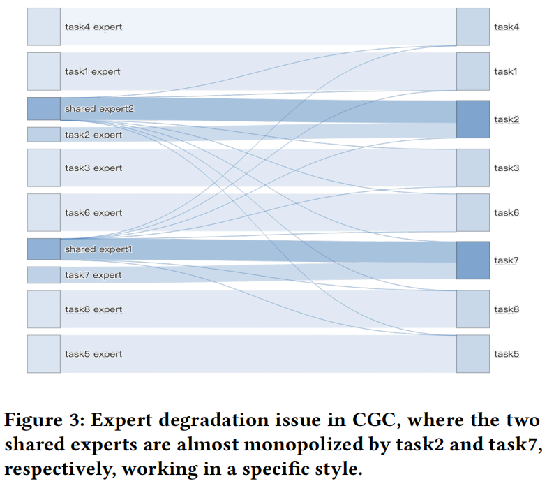

## 2.3 Expert 欠拟合问题：私有 Expert 的 “失宠”

解决了前面两个问题后，Expert 欠拟合问题又接踵而至。研究人员发现，一些私有 Expert 被分配的门控值极小，导致相应的任务过度依赖共享 Expert 的输出，而忽略了私有 Expert 的贡献。以 #6 号任务为例，它给共享 Expert 分配了较大权重，却忽视了自己的特定私有 Expert。这是因为模型需要同时预测数十个不同任务，这些任务的正样本比例差异巨大，比如点击和收藏的正样本比例可能相差 100 倍。对于数据稀疏的预测任务，共享 Expert 能从行为不那么稀疏的任务中获取更多梯度更新和知识，而特定私有 Expert 由于行为稀疏，容易陷入欠拟合状态。

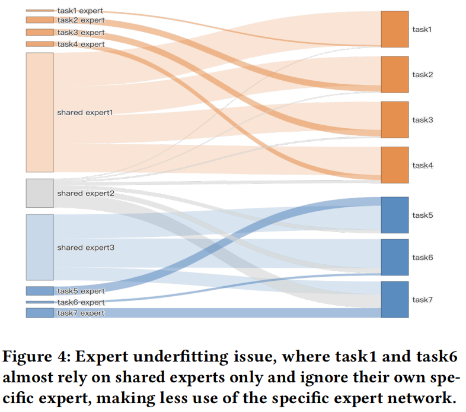

# 3. HoME 来 “救场”：针对性的解决方案

面对 MoE 范式的这些问题，快手的研究人员提出了 HoME（Hierarchy of Multi - Gate Experts）这一创新的解决方案。

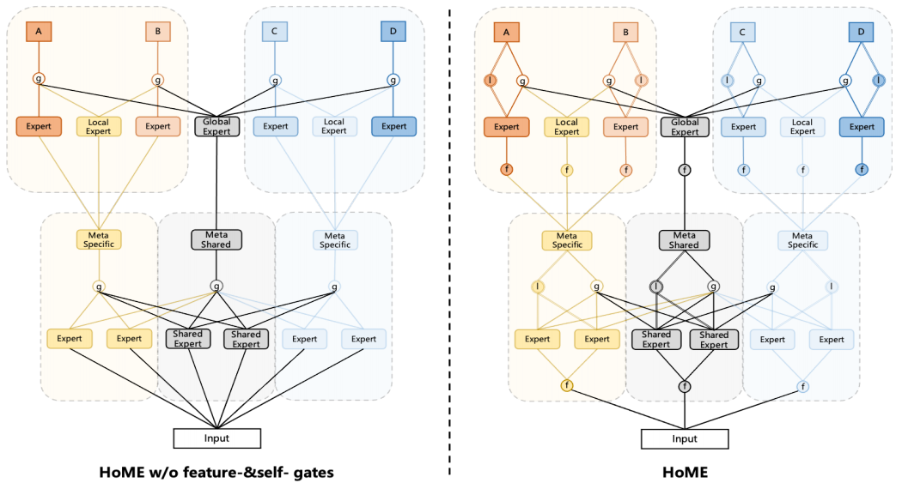

## 3.1 Expert 归一化和 Swish 机制：让 Expert “站在同一起跑线”

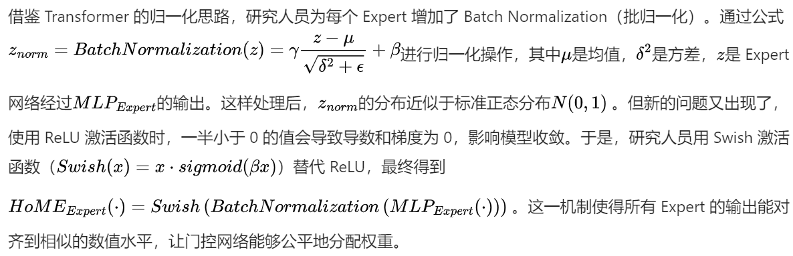

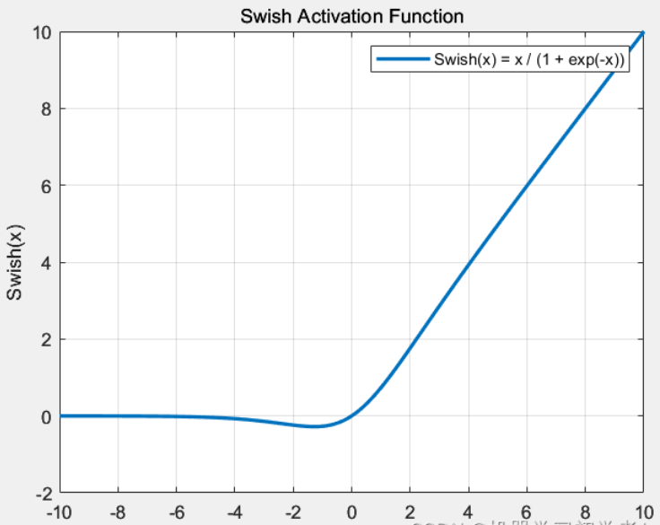

## 3.2 层次掩码机制：给任务 “分类整理”

为了解决共享 Expert 退化的问题，快手研究人员利用任务相关性的先验知识，提出了级联层次掩码机制。以快手短视频推荐为例，预测任务大致可分为被动观看的时长类任务（如完播、长播、快划等）和主动交互的互动类任务（如点赞、评论、收藏等）。

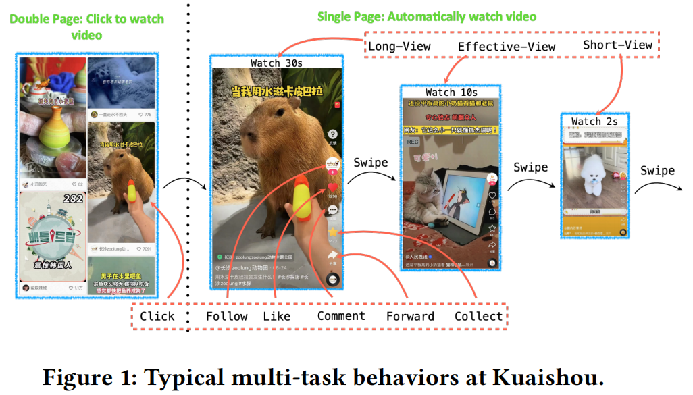

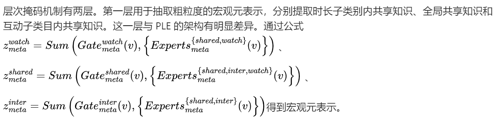

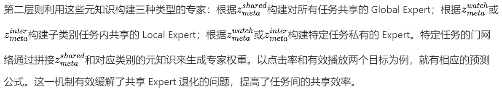

## 3.3 Feature - gate 与 Self - gate 机制：为稀疏任务 “加油助力”

针对数据稀疏任务中 Expert 欠拟合的问题，研究人员提出了 Feature - gate 和 Self - gate 两种机制。

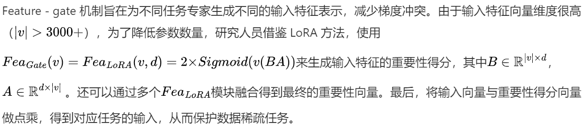

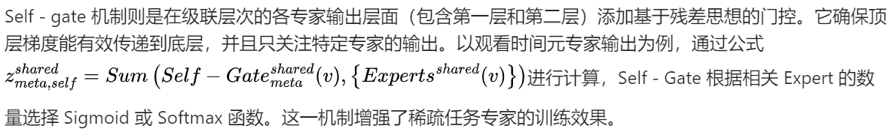

# 4. 实验

## 4.1 整体效果：全面超越基线模型

研究人员将 HoME 与 MMoE、CGC、PLE、AdaTT 等多个广泛使用的多任务学习模型进行对比实验。评估指标采用 AUC 和 GAUC，这两个指标能有效反映模型的预测能力。实验结果令人惊喜，HoME 在所有任务上都实现了显著提升，且引入的参数更少。例如，相比 MMoE，HoME 在有效播放任务上的 GAUC 提升了 0.44%，在点击任务上的 GAUC 提升了 0.60% ，充分证明了 HoME 能增强多任务 MoE 系统的稳定性，提高专家的效率。

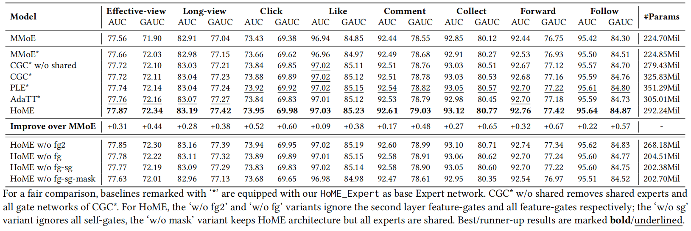

## 4.2 超参分析：探索最佳配置

研究人员还对 HoME 的超参数进行了分析，包括专家数量和 Feature - gate 中 LoRA 的数量。实验发现，增加专家数量时，预测精度会随着参数数量的增加而稳步提高，这表明 HoME 能充分发挥所有专家的能力。对于 LoRA 数量，实验结果显示两个 LoRA 时效果最佳，说明需要在 LoRA 数量和建模能力之间找到平衡，以提供更多的增量信息。

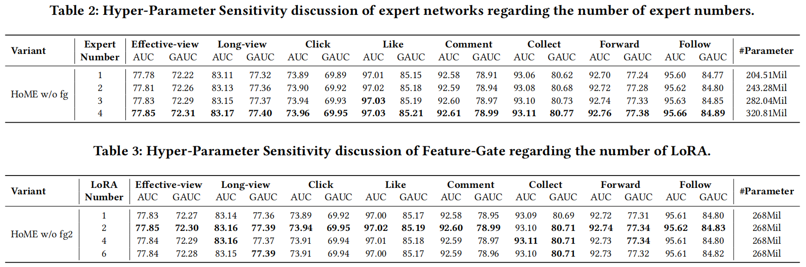

## 4.3 可视化分析：直观展现优势

通过可视化分析，研究人员发现 HoME 实现了平衡的门控权重。从特征门的热图可以看出，它能为每个专家实现灵活的逐元素特征选择。所有共享和特定专家的输出在数值上也达到了相似的水平，并且元共享专家和特定专家的分布不同，表明共享知识和差异知识分别由不同的网络进行编码，所有专家都能发挥预期的作用。

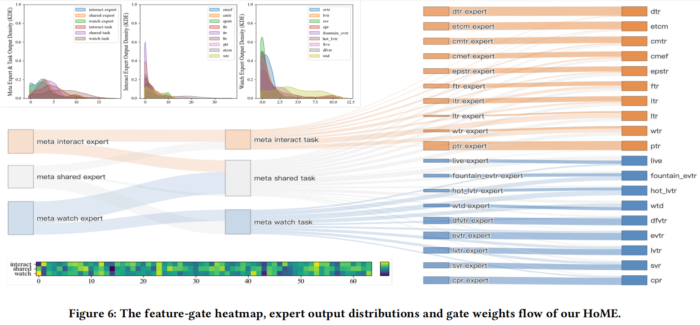

## 4.4 线上 AB 测试：业务指标显著提升

HoME 还进行了线上 AB 测试，应用于快手单页、双页和快手极速版单页三个场景。主要评估指标是观看时间指标（如平均播放时长）和视频观看指标。测试结果显示，HoME 在不同场景下都实现了显著的改进。比如在快手单页，所有用户的平均播放时长提升了 0.311% ；在快手极速版单页，提升了 0.474% 。在互动指标上，如点击、点赞、评论等，HoME 也取得了显著的业务增益，尤其是在稀疏行为任务上的提升更为明显，这进一步证明了 HoME 能让所有专家获得合适的梯度，发挥最大效能。

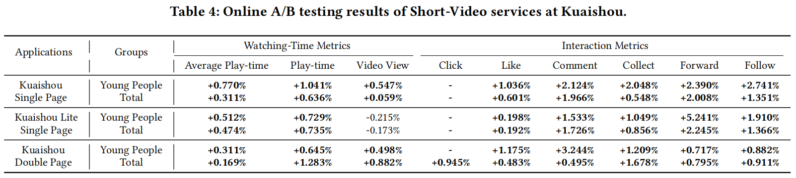

# 5. 总结

快手的 HoME 通过对 MoE 范式的深入分析和创新性改进，成功解决了多任务学习中存在的 Expert 崩溃、退化和欠拟合问题。经过大量实验验证，HoME 在提升模型性能、优化业务指标方面效果显著，已经广泛应用于快手的各种在线模型，为 4 亿活跃用户提供服务。相信在未来，HoME 这种创新的思路和方法，会为推荐系统的发展带来更多的启发和突破，让我们在刷短视频时能看到更符合自己心意的内容。


