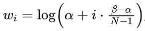

[TOC]

在电商广告推荐领域，一直以来，传统推荐系统大多依赖 ID Embed。这种方式在处理长尾内容和冷启动场景时，就像一位 “偏科生”，表现欠佳，无法精准地为用户推荐商品。不过，随着大语言模型（LLM）的崛起，这个困境迎来了转机。今天咱们就来深入聊聊快手在 AAAI'25 上发表的成果 —— 使用 LLM 做特征增强用于电商广告推荐，看看他们是怎么利用 LLM 的强大能力，给推荐系统 “打补丁” 的。

# 1. 传统方法的困境与新思路

以前，很多研究想把 LLM 和推荐系统结合，采用的是 “Rec-to-LLM” 思路。


简单来说，就是把推荐域的 User-Item 交互数据，变成 LLM 能处理的文本格式，再设计专门的提示，把数据弄成会话格式。但这种方法问题不少：

- 计算效率低，推荐场景里用户行为序列老长了，LLM 处理起来特别费劲，根本赶不上业务落地的性能要求；
- 容易出现灾难性遗忘，推荐系统靠的是 User-Item 协同数据，和 LLM 学的开放世界知识差别太大，用用户行为数据微调 LLM，LLM 就容易把开放世界知识给忘了；
- 而且训练目标不一致，LLM 预训练是为了预测下一个词元，推荐系统却依赖 User-Item 协同，这就导致 LLM 在推荐任务上表现不佳。

快手的团队另辟蹊径，提出了 “LLM-to-Rec” 思路的 LEARN 方法（Llm-driven knowlEdge Adaptive RecommeNdation）。这个方法就是用 LLM 来抽取特征，让抽取的信息能适应推荐系统的训练目标，这样既能和推荐系统 “友好相处”，又能满足实际业务的性能需求。

# 2. LEARN 方法大揭秘

LEARN 方法采用的是双塔结构模型，包括用户塔和 Item 塔。这就好比是两个配合默契的小伙伴，各自承担着不同的任务，共同为推荐系统 “发光发热”。


## 2.1 用户塔

用户塔由内容抽取模块（CEX）和偏好对齐模块（PAL）组成。
CEX 模块负责把用户行为序列里每个 Item 的信息，按照特定的提示模板组织成文本描述，这里面包含了标题、类别、品牌、价格、关键词和属性等信息。举个例子，如果是一款耳环，它的描述可能就是 “Item title is "Envy Versatile Five-Petal Flower Earrings 357". This item belongs to "Earrings" and brand is "Envy". The price is "9.9 yuan". The key words of item are "Earrings, Five-Petal Flower Earrings". This item supports "Returns for Damaged Packages"”。然后把这些描述输入到参数冻结的预训练 LLM（论文用的是 Baichuan2-7B）里，再把最后一层的隐含向量做 AvgPooling，这样就能得到每个 Item 的内容表征 E^c。


PAL 模块则是以 CEX 模块处理后的用户历史行为内容表征序列为输入，先通过内容映射层变换维度，再用类似因果注意力机制的 Transformer 编码器处理，最后通过线性映射降到 64 维，得到 User Embed （论文中是64维）。这一系列操作就像是给用户的喜好做了一次 “深度挖掘”，把用户的偏好精准地提炼出来。

## 2.2 Item 塔

Item 塔以用户的 target 交互序列为输入，也会经过 CEX 模块，不过后面有 3 个不同的 “变身”。

- **变体1:** 采用与User塔相同的架构和权重, 都使用了因果注意力机制, 只是这里不是处理用户历史交互序列, 而是Target交互序列
- **变体2:** 同样也是采用与User塔相同的架构和权重, 只是把因果注意力机制替换成只关注自己的内容本身的自注意力机制
- **变体3:** 使用内容Embed作为Item Embed，直接跳过对齐模块


变体1相当于让User塔与Item塔去做sequence-to-sequence的对齐, 变体2相当于让User塔与Item塔去做sequence-to-item的对齐, 而变体3相当于要让可学习的User塔去匹配冻结LLM输出的Item塔, 属于Rec-to-LLM的模式。

这 3 个变体在训练和推理时的表现还不一样。

训练时，变体 1 会把整个用户 Target 交互序列作为输入，变体 2 和变体 3 则是一个一个地处理 Target 交互序列里的 Item；推理时，它们都只输入单个 Item 来生成 Item Embedding。

实验结果显示，变体 1 的效果最好，变体 2 次之，变体 3 最差。对于这个结果，虽然作者有自己的解释，但也有人认为在现有数据集处理方式下，变体 1 和变体 2 的比较不太公平。

## 2.3 训练目标与采样策略

在训练目标上，LEARN 方法使用了 PinnerFormer 的 dense all action loss。具体做法是，从同一用户的历史交互序列里采样Nh个 Item（默认 10 个），再从 Target 交互序列里采样Nt个 Item（默认 10 个），这样就能构造出Nh × Nt 个正样本 pair。然后，再和同一批次其他用户的 Target Item Embedding 构造出 Nh × (bs − 1)个负样本 pair。最后用对比学习来计算 Loss。


为了让模型更好地学习用户的兴趣，快手团队还设计了两阶段采样策略。

第一阶段，从完整的用户历史 / 目标交互中随机抽样，这样能保证用于建模用户兴趣的数据是没有偏差的；

第二阶段，在构造正负样本 pairs 时，采用样本加权采样方式，提高近期交互 Item 的采样概率，因为这些近期 Item 更能反映用户当下的兴趣，和用户偏好的 Target Item 也更相关。这里每个 Item 的采样概率是：




超参*α*和*β*分别设为 10 和 10000，N是第一阶段采样后的序列长度。

## 2.4 在精排中的应用

前面的双塔框架主要用于召回，而 User Embed 和 Item Embed 还能用于精排模型做特征增强。不过，快手团队没有直接使用，而是用 CVR 任务来辅助学习融合机制。为啥选 CVR 任务呢？因为输入主要是商品详情页的内容信息，这些和转化更相关。但要是输入里有图片这种容易骗点击的模态信息，可能就该用 CTR 任务了。


# 3. 实验

## 3.1 整体效果

在和各种基线模型的对比实验中，LEARN 方法在多个数据集上都表现出色。以 NDCG@10 和 Recall@10 这两个指标为例，在 Scientific 数据集上，LEARN 的 NDCG@10 达到 0.1060，相比 SOTA 方法 RecFormer 提升了 3.21%，Recall@10 为 0.1594，提升了 10.08%；在 Instruments 数据集上，NDCG@10 提升了 5.78%，Recall@10 提升了 17.87%。在不同类型的数据集上，LEARN 都展现出了强大的优势，这说明它的泛化能力很强。


在零样本设置下和只使用文本的 SOTA 方法对比，LEARN 框架也表现良好，可以作为预训练推荐模型在下游子场景中发挥作用。

而且，LLM embedding 在和 ID embedding 以及 bert 生成的 Embedding 对比时，优势明显，H@100 从 0.0504 提升到 0.1060，提升幅度高达 49.01%，相比 BERT - emb 也有 30.38% 的提升。


## 3.2 消融实验

快手团队还做了很多消融实验，来探究模型各个部分的作用。比如，去掉偏好对齐模块，或者只用 Item tower 的某个变体时，模型性能会下降。这就证明了偏好对齐模块和 Item tower 的合理设计对模型性能提升很关键。


在不同对齐策略和采样策略的消融实验中，也能看出 LEARN 采用的策略是最优的，能让模型更好地捕捉用户兴趣。


## 3.3 在线 AB 实验

在实际应用中，快手在拥有 400 多万日活用户的短视频平台上进行了在线 AB 实验。结果显示，使用 LEARN 框架的推荐系统在 AUC 指标上表现更好，UAUC 提升了 0.84 个百分点，WUAUC 提升了 0.76 个百分点。


而且，LEARN 对冷启动和长尾用户、商品的推荐效果提升明显，这对于电商平台来说意义重大，因为这些用户和商品往往是容易被传统推荐系统忽视的 “潜力股”。从收入和 CVR 数据来看，LEARN 框架带来了稳定且显著的增长，在 9 天的实验里，收入和 CVR 都实现了稳步提升。


## 4. 总结

快手提出的 LEARN 框架，把 LLM 的开放世界知识和推荐系统的协同知识巧妙地结合起来，通过 CEX 和 PAL 模块，解决了 LLM 在推荐系统应用中的难题，打破了传统推荐系统的局限。无论是在大规模的行业数据集上，还是在公开的 Amazon Review 数据集上，LEARN 都展现出了卓越的性能。这一成果不仅为电商广告推荐领域带来了新的思路和方法，也为其他相关领域提供了借鉴。

```
笔者能力有限，欢迎批评指正或者在留言区讨论。
```