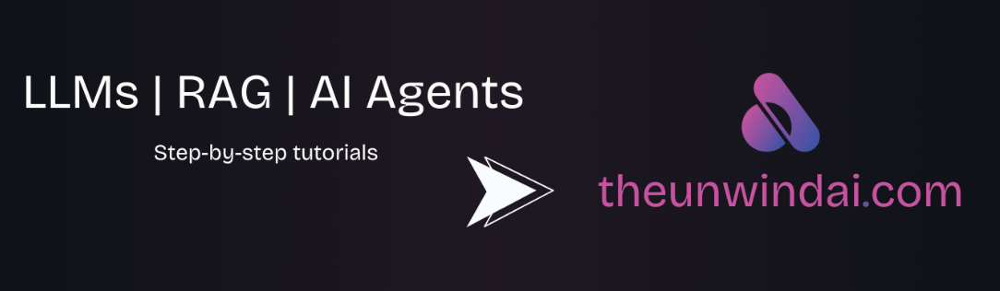

```
github: https://github.com/Shubhamsaboo/awesome-llm-apps
```

[TOC]

大语言模型（LLM）正以前所未有的速度改变着我们的生活和工作方式。“awesome-llm-apps” 这个精心策划的仓库，为开发者和研究者们提供了丰富多样的大语言模型应用示例。



# 1. 仓库概述

“awesome-llm-apps” 是一个汇聚了众多使用检索增强生成（RAG）和人工智能代理构建的大语言模型应用程序的仓库。它涵盖了多种基于不同大语言模型构建的应用，包括 OpenAI、Anthropic、Google 的模型，以及 DeepSeek、Qwen、Llama 等开源模型，并且用户可以在本地计算机上运行这些应用。

# 2. 特色亮点

## 2.1 应用广泛

该仓库展示了大语言模型在各个领域的实际应用，从代码仓库、电子邮件收件箱到金融、医疗、教育等多个领域，为开发者提供了丰富的灵感和实践案例。

## 2.2 技术融合

结合了多种先进的技术，如检索增强生成（RAG）和人工智能代理技术，以及不同的大语言模型，让开发者可以学习和实践如何将这些技术融合在一起，构建出更加智能、高效的应用程序。

## 2.3 学习资源丰富

项目文档完善，每个应用都有详细的介绍和代码示例，适合初学者学习和实践，同时也为有经验的开发者提供了一个交流和分享的平台，有助于推动大语言模型应用生态系统的发展。

# 3. 项目分类及详细介绍

## 3.1 AI 代理（AI Agents）

AI 代理是该仓库中的一大亮点，包含了各种领域的智能代理，以下是一些典型的示例：

- **AI 客户支持代理**：帮助处理客户咨询，参考文件 `awesome-llm-apps/ai_agent_tutorials/ai_customer_support_agent/customer_support_agent.py` 中的 `handle_query` 函数，该函数会搜索相关记忆，构建上下文，并使用 OpenAI 生成回复，为企业提供高效的客户服务解决方案。
- **AI 招聘代理团队**：用于招聘流程，包含角色要求定义、简历分析、邮件发送、面试安排等功能。相关代码在 `awesome-llm-apps/ai_agent_tutorials/ai_recruitment_agent_team/ai_recruitment_agent_team.py` 中，通过智能代理的协作，提高招聘效率和质量。
- **AI 金融代理团队**：具备搜索网络信息和获取金融数据的能力。代码 `awesome-llm-apps/ai_agent_tutorials/ai_finance_agent_team/finance_agent_team.py` 定义了不同的代理和代理团队，如 `web_agent` 负责搜索网络信息，`finance_agent` 负责获取金融数据，通过团队协作，为金融领域提供专业的数据分析和决策支持。

## 3.2 检索增强生成（RAG）

RAG 技术在该仓库中也得到了广泛应用，涵盖了多种相关应用：

- **RAG 数据库路由代理**：实现了文档上传、数据库查询和问题路由等功能。`awesome-llm-apps/rag_tutorials/rag_database_routing/rag_database_routing.py` 包含了初始化模型、处理文档、创建路由代理、查询数据库等多个函数，通过智能路由，提高数据检索和生成的效率。
- **DeepSeek 本地 RAG 推理代理**：创建和初始化向量存储以存储文档。`awesome-llm-apps/rag_tutorials/deepseek_local_rag_agent/deepseek_rag_agent.py` 中的 `create_vector_store` 函数可完成相关操作，通过本地推理，提高数据处理的安全性和效率。

## 3.3 MCP AI 代理

例如 `MCP GitHub 代理`，可对 GitHub 相关内容进行处理，如代码搜索、仓库管理等，为开发者提供更加便捷的 GitHub 操作体验。

## 3.4 带有记忆功能的 LLM 应用

包含如 `AI Arxiv 代理（带记忆）`、`带个性化记忆的 LLM 应用` 等，这些应用能够利用记忆功能提供更智能的交互，根据用户的历史交互记录，提供更加个性化的服务和建议。

## 3.5 与 X 聊天应用

允许用户与不同类型的数据源进行聊天，提供了多样化的交互方式：

- **与 GitHub 仓库聊天**：用户可以输入 GitHub 仓库名称并询问相关内容。`awesome-llm-apps/chat_with_X_tutorials/chat_with_github/chat_github_llama3.py` 中的 `get_loader` 和 `load_repo` 函数用于加载和添加仓库到知识库，通过与 GitHub 仓库的交互，帮助开发者更好地理解和使用代码。
- **与 Gmail 聊天**、**与 PDF 聊天** 等，为用户提供了更加便捷的信息获取方式，让用户可以通过自然语言与不同类型的数据源进行交互。

## 3.6 LLM 微调

例如 `Llama3.2 微调`，提供了关于大语言模型微调的相关示例，帮助开发者学习如何对预训练模型进行微调，以适应特定的任务和领域。

## 3.7 高级工具和框架

包含 `Gemini 多模态聊天机器人`、`混合代理` 等，展示了更高级的技术应用，如多模态交互、智能代理协作等，为未来的人工智能应用发展提供了方向。

# 4. 总结

“awesome-llm-apps” 仓库为开发者和研究者提供了一个全面、深入的大语言模型应用学习和实践平台。通过丰富的应用示例和详细的文档，我们可以学习到如何将不同的大语言模型和技术融合在一起，构建出更加智能、高效的应用程序。无论是初学者还是有经验的开发者，都能从这个仓库中获得宝贵的经验和灵感，为推动大语言模型应用的发展贡献自己的力量。

```
笔者能力有限，欢迎批评指正或者在留言区讨论。
```


