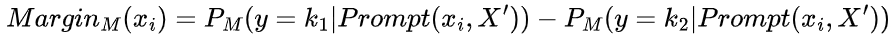

# 背景

检索增强生成（RAG）系统是大型语言模型（LLM）的重要补充，但文本分块这一关键环节在 RAG 流程中常被忽视。传统的文本分段方法主要基于规则或语义相似性，存在诸多弊端。这些方法难以捕捉句子间深层的语言逻辑联系，如因果、过渡、并行和渐进关系等，这在知识密集型任务（如开放域问答）中会严重影响性能。同时，现有方法在资源和时间效率、细粒度和粗粒度分段平衡、长文本处理以及跨语言适应性等方面也存在不足，无法满足日益增长的文本处理需求，在此背景下 Meta - Chunking 技术应运而生，旨在解决这些问题并提升文本分块的效果和效率。

# Meta-Chunking解决了什么问题

Meta-Chunking 主要解决了以下几方面的关键问题：

- **逻辑连贯性问题**：传统基于规则或语义相似性的文本分段方法难以捕捉句子间深层逻辑联系，而 Meta-Chunking 利用 LLMs 的强大理解和推理能力，通过边际采样分段和困惑度分段策略，精确识别文本分段边界，确保分段后的文本块具有逻辑连贯性，包含因果、过渡、并行和渐进等关系。
- **资源和时间效率问题**：现有的一些文本分段方法（如 LumberChunker）依赖高性能的 LLMs，导致资源和时间成本显著增加。边际采样分段减少了对模型大小的依赖，使小型语言模型也能胜任该任务，困惑度分段进一步提高了处理效率，实现了资源和时间的节省。
- **细粒度和粗粒度分段的平衡问题**：仅依靠调整阈值控制块大小的传统方式易导致块大小不均匀，难以满足用户多样化分段需求。Meta-Chunking 提出结合自身与动态合并的策略，能灵活应对不同分段要求，有效平衡细粒度和粗粒度文本分段。
- **长文本处理问题**：传统分段方法在处理长文本时，可能出现上下文连贯性丧失或 GPU 内存溢出的情况。在困惑度分段中引入的键值（KV）缓存机制，可在保持句子间逻辑连贯性的前提下计算困惑度，优化 GPU 内存和计算准确性，从而妥善处理长文本。
- **跨语言适应性问题**：小模型在跨语言适应性方面存在局限，难以直接应用于多语言文本分段。实验表明中等规模的模型（如 1.5B 参数级别）在处理不同长度的文本分段时，能在性能和效率之间保持出色平衡，一定程度上缓解了跨语言适应性问题。

# Meta-chunking要点概述

Meta-Chunking 是一种创新的文本分割技术，在句子和段落之间定义了新的粒度，由具有深层语言逻辑联系的句子集合组成，旨在解决传统文本分块方法的不足，主要要点如下：

- 核心概念
  - 其关键在于引入 Meta-Chunking，整合传统优势并增强逻辑连贯性，允许块大小动态调整，确保每个分段块包含完整独立表达，避免逻辑链断裂，提升文档检索相关性与内容清晰度。
- 分块策略
  - **边际采样分块**：将文本先分割成句子，利用 LLM 对句子进行二元分类，通过比较模型输出的分割与不分割概率差值（Margin）与设定阈值来决定是否分段，阈值可根据历史数据调整。
  - **困惑度分块**：同样先把文本分为句子，计算每个句子基于前文的困惑度（PPL），分析困惑度分布特征，将满足特定条件的点视为潜在块边界；长文本超出处理范围时，采用 KV 缓存机制保障计算准确性与上下文连贯。
- 实验成果
  - 在 11 个数据集上的实验表明，Meta-Chunking 能有效提升基于 RAG 的单跳和多跳问答性能，如在 2WikiMultihopQA 数据集上相比相似性分块性能提升 1.32 倍且耗时仅为 45.8%。还探讨了模型大小影响，发现中等规模模型（如 1.5B 参数级别）在性能和效率间平衡较好。同时研究了重叠分块策略、不同 PPL 分块策略及分块与重排序方法组合等，均验证了其有效性和优势。

# Meta-chunking详解

Meta-Chunking 作为一项极具创新性的文本分段技术，充分借助大型语言模型（LLMs）的强大能力，巧妙地将文档分割为逻辑紧密相连且相互独立的块。其核心原则在于赋予块大小灵活多变的特性，以此更精准地捕捉并牢牢保持内容的逻辑完整性。通过对粒度的动态优化调整，使得每个分段块都能完整且独立地表达意义，有效防止了在分段操作中逻辑链出现断裂的情况，进而大幅提升了文档检索的相关性，并显著提高了内容的清晰度。

从图示中可以清晰地看到，该方法成功融合了传统文本分段策略的诸多优势，例如严格遵循预设的块长度限制以及切实确保句子结构的完整性等，同时，在分段过程中，其保障逻辑连贯性的能力得到了极大增强。其中的关键创新点在于引入了一种全新的概念 ——Meta-Chunking，其粒度介于句子级和段落级之间。一个元块实际上是由段落中按顺序排列的句子所组成的集合，这些句子之间不仅存在语义上的关联，更重要的是蕴含着深层的语言逻辑联系，涵盖了因果、过渡、并行以及渐进等多种关系，而这些关系显然已经超越了单纯的语义相似性范畴。为达成这一目标，在论文中精心设计并成功实现了以下两种策略。

## 边缘采样分块

边缘采样分块是 Meta-Chunking 中的重要策略之一。其运作流程如下：

- 首先，将输入文本分割成一系列句子，记为(x1,x2,...,xn)，最终目标是把这些句子进一步细分成若干逻辑连贯的块，形成新集合(X1,X2,...,Xk)。
- 对于每个句子xi，使用大型语言模型（LLMs）进行二元分类判断。具体通过下面的公式来实现，其中(k1,k2)表示二分类决策，Prompt(xi,X')是在xi和X'（X'可包含单个句子或多个句子）之间形成的关于是否合并的指令。通过模型M获得的概率P_{M}，得出两个选项之间的概率差异。

- 然后，将Margin_{M}(xi)与设定的阈值进行比较。最初阈值可赋值为0，后续通过记录历史的Margin_{M}(xi)并计算其平均值来动态调整阈值，从而确定两个句子是否应分段。

该策略有效减少了文本分段对模型大小的依赖，使推理能力相对较弱的小型语言模型也有机会胜任文本分段任务，在 Meta-Chunking 体系中发挥着关键作用，有助于提升基于 RAG 的问答性能，并在一定程度上平衡了资源和时间效率。

## 困惑度分块

困惑度分段是 Meta-Chunking 中的关键策略之一，在文本分块过程中发挥着重要作用。

具体操作上，首先将文本分割成句子序列，接着使用模型计算每个句子xi基于前面句子的困惑度，公式如下，这里的K表示xi中的总 token 数，t_{k}^{i}表示xi中的第k个 token，t_{<i}表示所有在xi之前的 token。

# 实验结果

1. 背景；2. meta-chunking要点概述；3. 文本分块面临的问题；4. meta分块策略；4.1 边缘采样分块；4.2 困惑度分块； 4.3 困惑度分段的理论分析；5. 实验；5.1 数据集与指标； 5.2 base；5.3 实验设置；5.4 实验结果；5.5 重叠分块策略的影响；5.6 两种PPL分块策略的比较分析；5.7 重排序性能的分块方法探讨；6. 小结

