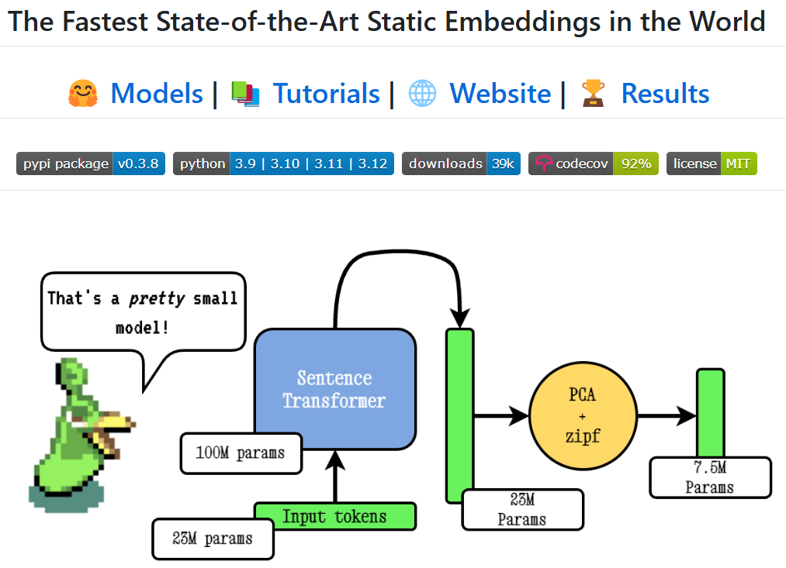

[TOC]

```
paper：Model2Vec: The Fastest State-of-the-Art Static Embeddings in the World
github：https://github.com/MinishLab/model2vec
```

嵌入（Embedding）技术作为基石，广泛应用于自然语言处理（NLP）、搜索引擎、推荐系统等多个关键领域，发挥着不可或缺的作用。尽管嵌入技术历经持续发展并取得诸多显著成果，但传统嵌入方法始终受困于模型规模庞大、计算资源消耗严重、推理速度迟缓等难题，这些问题犹如枷锁，限制了其进一步的拓展与应用。

在此背景下，Model2Vec 的全新嵌入技术为行业带来了突破性的解决方案。它凭借创新性的设计，成功实现了嵌入模型规模缩小 15 倍、速度提升 500 倍（在CPU上）的惊人跨越，同时还能维持出色的性能表现，堪称嵌入技术领域的一次重大飞跃。



# 1. Model2Vec：静态嵌入的革新者

Model2Vec 是一种致力于提供高效、轻便且快速的静态嵌入解决方案的创新模型，它与传统的动态嵌入模型（如 Sentence Transformers）存在本质区别。传统动态嵌入模型在处理每一个句子时，都需要实时计算新的嵌入向量，这使得其在运行过程中对计算资源有着极高的需求。而 Model2Vec 另辟蹊径，采用静态嵌入方式，提前对单词或短语的嵌入向量进行计算并存储。这种预计算的方式避免了重复计算带来的资源浪费，大大提高了系统的整体运行效率。

Model2Vec 的优势十分显著。

- 从模型体积来看，在同等计算能力的前提下，它的嵌入模型相较于传统模型缩小了 15 倍，这意味着可以节省大量的存储空间，在资源有限的环境中也能轻松部署；
- 在速度方面，受益于预计算的静态嵌入技术，其推理速度比传统动态嵌入模型快 500 倍，几乎能够实现即时响应，为用户带来更为流畅的体验；
- 此外，Model2Vec 无需进行复杂的预索引操作，支持直接对文档进行向量搜索，这一特性极大地简化了使用流程，降低了技术门槛。

# 2. 强大功能：重塑嵌入技术新格局

## 2.1 即时向量搜索

在处理大规模数据时，向量搜索的效率至关重要。Model2Vec 具备卓越的即时向量搜索能力，无论是面对数百万文档的海量数据集，还是复杂的搜索需求，它都能在秒级时间内给出响应，精准地完成向量搜索任务，这一特性为许多依赖大规模数据检索的应用提供了强大支持。

## 2.2 模型压缩与加速

Model2Vec 在模型压缩和加速方面成绩斐然。它成功将模型体积压缩至原来的 1/15，同时实现了 500 倍的速度提升，且在这一过程中，性能几乎没有损失，依然保持着高精度和高效能，在保证结果准确性的同时，显著提高了运行效率。

## 2.3 简便易用的蒸馏

模型蒸馏是 Model2Vec 的又一亮点功能。通过简单的操作，只需短短几秒钟，就能将复杂的 Sentence Transformers 模型转化为静态嵌入模型。这一过程无需大量的训练数据，也不需要繁琐的配置，极大地简化了开发者的工作流程，让更多开发者能够轻松利用这一技术。

## 2.4 丰富的预训练模型

为了进一步降低开发成本，Model2Vec 在 HuggingFace 平台上提供了一系列预训练的最先进的静态嵌入模型。开发者无需从头开始进行复杂的训练过程，可直接调用这些预训练模型，快速将其应用于自己的项目中，有效节省了时间和资源。

# 3. Model2Vec 与 RAG：珠联璧合的高效组合

在 RAG（Retrieval-Augmented Generation，检索增强生成） 模型中，检索模块是影响生成质量和效率的核心环节。Model2Vec 通过优化静态嵌入技术，完美契合了 RAG 模型的需求，为其带来了显著的性能提升。

## 3.1 超高效的向量检索

Model2Vec 强大的即时向量检索能力，使其能够对数百万篇文档进行快速检索，而且无需复杂的预索引过程。这种高效的检索速度直接加快了 RAG 模型中检索模块的响应速度，让模型能够更快地获取相关信息，为后续的生成任务提供有力支持。

## 3.2 大幅度压缩与加速

如前文所述，Model2Vec 将嵌入模型体积缩小 15 倍、速度提升 500 倍的特性，使得 RAG 模型在执行过程中的计算开销大幅降低。这一优势让 RAG 模型在需要快速响应的大规模应用场景中表现更为出色，能够更好地满足用户的需求。

## 3.3 与现有 RAG 架构无缝集成

Model2Vec 具备良好的兼容性，可以轻松与像 LangChain 等常见的 RAG 工具集成。通过这种集成，开发者能够优化现有的 RAG 工作流，进一步提升数据检索和生成的速度，实现更高效的应用开发。

# 4. 快速上手 Model2Vec

## 4.1 快速入门

对于想要尝试 Model2Vec 的开发者来说，从 HuggingFace 中心加载其旗舰模型是最简单的入门方式。这些模型已经过预先训练，可直接投入使用。

安装

```
pip install model2vec

# 安装蒸馏附加功能
pip install model2vec[distill]
```

以下是加载模型并进行嵌入操作的示例代码：

```python
from model2vec import StaticModel
# 从HuggingFace中心加载模型（这里以potion-base-8M模型为例）
model = StaticModel.from_pretrained("minishlab/potion-base-8M")
# 进行嵌入操作
embeddings = model.encode(["It's dangerous to go alone!", "It's a secret to everybody."])
# 生成词元嵌入序列
token_embeddings = model.encode_as_sequence(["It's dangerous to go alone!", "It's a secret to everybody."])
```

如果不想用官方提供的模型，可以采用下面的方法蒸馏自己的 Model2Vec 模型。蒸馏速度非常快，在 CPU 上只需要 30 秒。最重要的是，蒸馏不需要训练数据。

```python
from model2vec.distill import distill

# Distill a Sentence Transformer model, in this case the BAAI/bge-base-en-v1.5 model
m2v_model = distill(model_name="BAAI/bge-base-en-v1.5", pca_dims=256)

# Save the model
m2v_model.save_pretrained("m2v_model")
```

## 4.2 推理

### 4.2.1 用预训练模型推理

```python
from model2vec import StaticModel

# Load a model from the Hub. You can optionally pass a token when loading a private model
model = StaticModel.from_pretrained(model_name="minishlab/potion-base-8M", token=None)

# Make embeddings
embeddings = model.encode(["It's dangerous to go alone!", "It's a secret to everybody."])

# Make sequences of token embeddings
token_embeddings = model.encode_as_sequence(["It's dangerous to go alone!", "It's a secret to everybody."])
```

### 4.2.2 用Sentence Transformers库推理

```python
from sentence_transformers import SentenceTransformer
from sentence_transformers.models import StaticEmbedding

# Initialize a StaticEmbedding module
static_embedding = StaticEmbedding.from_model2vec("minishlab/potion-base-8M")
model = SentenceTransformer(modules=[static_embedding])
embeddings = model.encode(["It's dangerous to go alone!", "It's a secret to everybody."])
```

## 4.3 蒸馏

### 4.3.1 从Sentence Transformer模型蒸馏

```python
from model2vec.distill import distill

# Distill a Sentence Transformer model
m2v_model = distill(model_name="BAAI/bge-base-en-v1.5", pca_dims=256)

# Save the model
m2v_model.save_pretrained("m2v_model")
```

### 4.3.2 从加载的模型蒸馏

```python
from transformers import AutoModel, AutoTokenizer

from model2vec.distill import distill_from_model

# Assuming a loaded model and tokenizer
model_name = "baai/bge-base-en-v1.5"
model = AutoModel.from_pretrained(model_name)
tokenizer = AutoTokenizer.from_pretrained(model_name)

m2v_model = distill_from_model(model=model, tokenizer=tokenizer, pca_dims=256)

m2v_model.save_pretrained("m2v_model")
```

### 4.3.3 从Sentence Transformers库蒸馏

```python
from sentence_transformers import SentenceTransformer
from sentence_transformers.models import StaticEmbedding

static_embedding = StaticEmbedding.from_distillation("BAAI/bge-base-en-v1.5", device="cpu", pca_dims=256)
model = SentenceTransformer(modules=[static_embedding])
embeddings = model.encode(["It's dangerous to go alone!", "It's a secret to everybody."])
```

### 4.3.4 带自定义词典蒸馏

```python
from model2vec.distill import distill

# Load a vocabulary as a list of strings
vocabulary = ["word1", "word2", "word3"]

# Distill a Sentence Transformer model with the custom vocabulary
m2v_model = distill(model_name="BAAI/bge-base-en-v1.5", vocabulary=vocabulary)

# Save the model
m2v_model.save_pretrained("m2v_model")

# Or push it to the hub
m2v_model.push_to_hub("my_organization/my_model", token="<it's a secret to everybody>")
```

默认情况下，这将使用子词分词器来蒸馏模型，把模型（子词）的词汇表和新词汇表合并起来。如果你希望得到一个词级分词器（仅包含传入的词汇表），可以将`use_subword`参数设置为`False`，例如：

```python
m2v_model = distill(model_name=model_name, vocabulary=vocabulary, use_subword=False)
```

## 4.4 评估

安装

```
pip install git+https://github.com/MinishLab/evaluation.git@main
```

下面的代码片段展示了如何评估一个 Model2Vec 模型：

```python
from model2vec import StaticModel

from evaluation import CustomMTEB, get_tasks, parse_mteb_results, make_leaderboard, summarize_results
from mteb import ModelMeta

# Get all available tasks
tasks = get_tasks()
# Define the CustomMTEB object with the specified tasks
evaluation = CustomMTEB(tasks=tasks)

# Load the model
model_name = "m2v_model"
model = StaticModel.from_pretrained(model_name)

# Optionally, add model metadata in MTEB format
model.mteb_model_meta = ModelMeta(
            name=model_name, revision="no_revision_available", release_date=None, languages=None
        )

# Run the evaluation
results = evaluation.run(model, eval_splits=["test"], output_folder=f"results")

# Parse the results and summarize them
parsed_results = parse_mteb_results(mteb_results=results, model_name=model_name)
task_scores = summarize_results(parsed_results)

# Print the results in a leaderboard format
print(make_leaderboard(task_scores))
```

## 4.5 集成

### 4.5.1 与Sentence Transformers集成

Model2Vec 可以通过`StaticEmbedding`模块直接在 Sentence Transformers 中使用。

以下代码片段展示了如何将 Model2Vec 模型加载到 Sentence Transformer 模型中：

```python
from sentence_transformers import SentenceTransformer
from sentence_transformers.models import StaticEmbedding

# Initialize a StaticEmbedding module
static_embedding = StaticEmbedding.from_model2vec("minishlab/potion-base-8M")
model = SentenceTransformer(modules=[static_embedding])
embeddings = model.encode(["It's dangerous to go alone!", "It's a secret to everybody."])
```

以下代码片段展示了如何将模型直接蒸馏为 Sentence Transformer 模型：

```python
from sentence_transformers import SentenceTransformer
from sentence_transformers.models import StaticEmbedding

static_embedding = StaticEmbedding.from_distillation("BAAI/bge-base-en-v1.5", device="cpu", pca_dims=256)
model = SentenceTransformer(modules=[static_embedding])
embeddings = model.encode(["It's dangerous to go alone!", "It's a secret to everybody."])
```

### 4.5.2 与LangChain集成

Model2Vec 可以通过`langchain-community`包在 LangChain 中使用。在使用`pip install langchain-community`安装`langchain-community`包后，以下代码片段展示了如何在 LangChain 中使用 Model2Vec：

```python
from langchain_community.embeddings import Model2vecEmbeddings
from langchain_community.vectorstores import FAISS
from langchain.schema import Document

# Initialize a Model2Vec embedder
embedder = Model2vecEmbeddings("minishlab/potion-base-8M")

# Create some example texts
texts = [
    "Enduring Stew",
    "Hearty Elixir",
    "Mighty Mushroom Risotto",
    "Spicy Meat Skewer",
    "Fruit Salad",
]

# Embed the texts
embeddings = embedder.embed_documents(texts)

# Or, create a vector store and query it
documents = [Document(page_content=text) for text in texts]
vector_store = FAISS.from_documents(documents, embedder)
query = "Risotto"
query_vector = embedder.embed_query(query)
retrieved_docs = vector_store.similarity_search_by_vector(query_vector, k=1)
```

### 4.5.3 与Txtai集成

Model2Vec 可在 txtai 中用于文本嵌入、最近邻搜索，以及 txtai 提供的任何其他功能。在使用`pip install txtai[vectors]`安装 txtai 包（包括向量相关依赖项）后，以下代码片段展示了如何在 txtai 中使用 Model2Vec：

```python
from txtai import Embeddings

# Load a model2vec model
embeddings = Embeddings(path="minishlab/potion-base-8M", method="model2vec", backend="numpy")

# Create some example texts
texts = ["Enduring Stew", "Hearty Elixir", "Mighty Mushroom Risotto", "Spicy Meat Skewer", "Chilly Fruit Salad"]

# Create embeddings for downstream tasks
vectors = embeddings.batchtransform(texts)

# Or create a nearest-neighbors index and search it
embeddings.index(texts)
result = embeddings.search("Risotto", 1)
```

### 4.5.4 与 Transformers.js 集成

要在 transformers.js 中使用 Model2Vec 模型，可将以下代码片段作为起点：

```python
import { AutoModel, AutoTokenizer, Tensor } from '@huggingface/transformers';

const modelName = 'minishlab/potion-base-8M';

const modelConfig = {
    config: { model_type: 'model2vec' },
    dtype: 'fp32',
    revision: 'refs/pr/1'
};
const tokenizerConfig = {
    revision: 'refs/pr/2'
};

const model = await AutoModel.from_pretrained(modelName, modelConfig);
const tokenizer = await AutoTokenizer.from_pretrained(modelName, tokenizerConfig);

const texts = ['hello', 'hello world'];
const { input_ids } = await tokenizer(texts, { add_special_tokens: false, return_tensor: false });

const cumsum = arr => arr.reduce((acc, num, i) => [...acc, num + (acc[i - 1] || 0)], []);
const offsets = [0, ...cumsum(input_ids.slice(0, -1).map(x => x.length))];

const flattened_input_ids = input_ids.flat();
const modelInputs = {
    input_ids: new Tensor('int64', flattened_input_ids, [flattened_input_ids.length]),
    offsets: new Tensor('int64', offsets, [offsets.length])
};

const { embeddings } = await model(modelInputs);
console.log(embeddings.tolist()); // output matches python version
```

