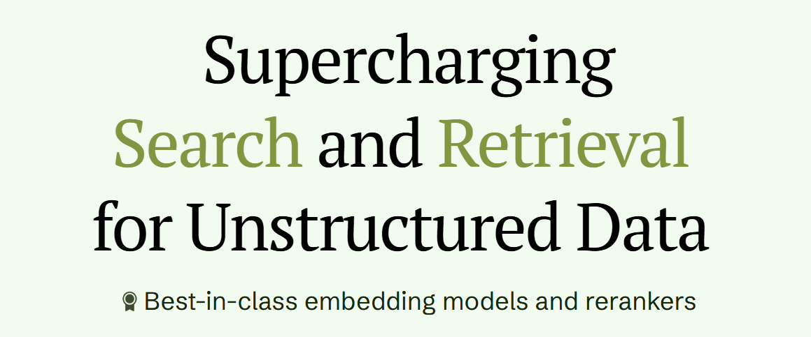
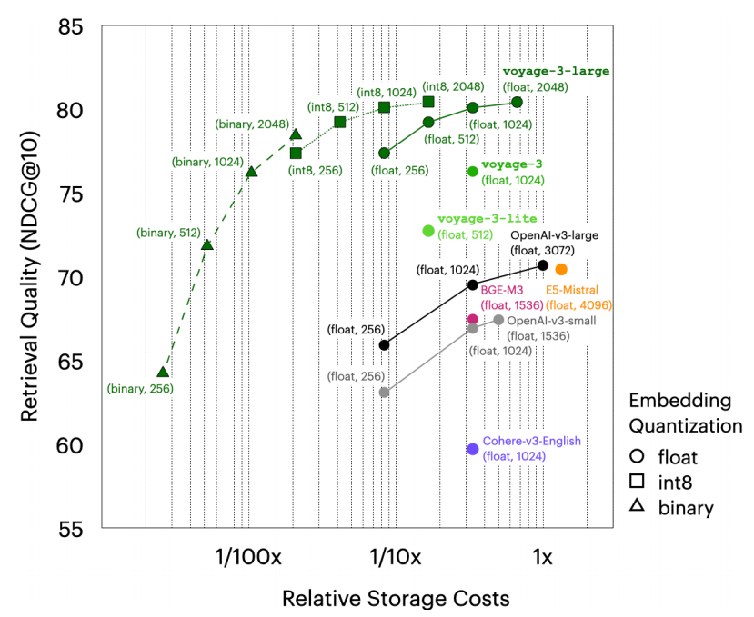
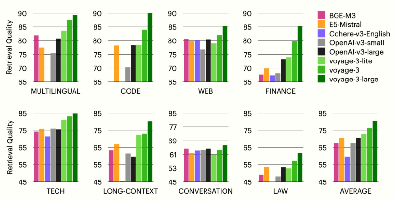

# 1. voyage-3-large介绍

“voyage-3-large”作为最新SOTA的Embedding模型，在涵盖法律、金融、代码等领域的100个数据集的八个评估领域中均排名第一。该模型平均性能分别超出OpenAI-v3-large和Cohere-v3-English 9.74%和20.71%。借助套娃学习（MRL，https://arxiv.org/abs/2205.13147?_kx=TdpXFbbY158jONPIc5tqSw.VU3S4W）和量化感知训练（https://arxiv.org/abs/1702.00758?_kx=TdpXFbbY158jONPIc5tqSw.VU3S4W），voyage-3-large支持更小维度以及int8和二进制量化，这能在几乎不影响检索质量的情况下，大幅降低向量数据库成本。

具有以下显著特点：

- 在涵盖八个不同领域（包括法律、金融和代码）的100个数据集中，该模型平均性能分别超出OpenAI-v3-large和Cohere-v3-English 9.74%和20.71%。
- 借助套娃学习（MRL），它支持2048、1024、512和256维的嵌入。
- 该模型提供多种嵌入量化选项，包括32位浮点、有符号和无符号8位整数以及二进制精度，同时将质量损失降至最低。
- 与OpenAI（8K）和Cohere（512）相比，它支持32K标记的上下文长度。

下图展示了检索质量和存储成本（与每个向量的位数成正比）之间的权衡关系。可以看到，采用 int8 精度和 1024 维度的 voyage-3-large，尽管存储量仅为采用浮点精度和 2048 维度的 voyage-3-large 的八分之一，但检索质量仅比后者低 0.31%。此外，与采用浮点精度和 3072 维度的 OpenAI-v3-large 相比，它的存储量仅为其十二分之一，检索质量却仍高出 9.44%。即使是采用 512 维二进制嵌入的 voyage-3-large，也比采用 3072 维浮点嵌入的 OpenAI-v3-large 性能高出 1.16%，而存储成本仅为其二百分之一 —— 例如，每月 2 万美元的存储成本将降至 100 美元！



精度和维度方面的灵活性是通过套娃（Matryoshka）和量化感知训练实现的。更多详细信息，可查看博客文章（https://blog.voyageai.com/2024/12/04/voyage-code-3/#Matryoshka-Embeddings-and-Quantization）。

值得注意的是，虽然 voyage-3-large 提升了精度并降低了成本，但 voyage-3 和 voyage-3-lite 仍然提供了更好的检索质量 —— 在更低的推理成本和延迟下，它们分别比 OpenAI-v3-large 平均高出 5.60% 和 2.06%。

# 2. 评估

## 2.1 数据集

评估了 100 个数据集，跨越八个领域、技术文档、代码、法律、财务、网络评论、多语言、长文档和对话。每个数据集都由语料库（例如，技术文档、法院意见）和查询（例如，问题、摘要）组成。下表列出了除多语言外的八个类别的数据集，其中包括涵盖 26 种语言的 62 个数据集。[此电子表格](https://docs.google.com/spreadsheets/d/1Su4k9pfLgKfLQCLlqz-SlW9aErEJXOPYZyhZ_XbViFI)中提供了所有评估数据集的列表。

## 2.2 模型

将 `voyage-3-large` 与几种替代方案一起评估，包括：text-embedding-3-small、text-embedding-3-large、E5-Mistral、intfloat/e5-mistral-7b-instruct、[BGE-M3](https://huggingface.co/BAAI/bge-m3) （`BAAI/bge-m3`）、Cohere-v3-English （`embed-english-v3.0`）、`voyage-3` 和 `voyage-3-lite`。对于特定于域的评估，还包括 `voyage-law-2`、`voyage-finance-2`、`voyage-code-2` 和 `voyage-code-3`。

## 2.3 指标

给定一个查询，根据余弦相似性检索前 10 个文档，并报告[标准化折扣累积增益](http://www.evidentlyai.com/ranking-metrics/ndcg-metric#:~:text=Normalized Discounted Cumulative Gain (NDCG) is a ranking quality metric,DCG representing a perfect ranking.) （NDCG@10），这是检索质量的标准指标和召回率的变体。

## 2.4 评估结果

平均而言，`voyage-3-large` 的性能优于 OpenAI-v3-large：

- 在 1024 和 256 个维度上分别为 10.58% 和 11.47%
- int8 512维 与 OpenAI-v3-large 3072 维对比，提升8.56%，存储成本为 1/24
- 二进制 512维 与 float型 3072 维对比，提升1.16%，存储成本为 1/200

## 2.5 特定域的质量

下图说明了 `voyage-3-large` 的平均检索质量，具有全精度和 2048 个维度，包括总体和每个域。总体而言，`voyage-3-large` 是表现最好的模型，平均分别比 `voyage-3`、`voyage-3-lite` 和 OpenAI-v3-large 高出 4.14%、7.68% 和 9.74%。



# 3. 如何使用

## 3.1 Python API 使用详解

Voyage 文本嵌入模型在 Python 中可通过 voyageai 包进行访问，使用 voyageai.Client.embed () 函数实现文本向量化。

**参数说明**

- **texts**：是一个字符串列表，代表要嵌入的文本内容。例如`["I like cats", "I also like dogs"]`。需要注意的是，当前列表有两个限制条件：一是列表最大长度为 128；二是不同模型对列表中 tokens 总数有不同的上限，如 voyage-3-lite 最多 1M，voyage-3 和 voyage-2 最多 320K，voyage-3-large、voyage-code-3 等最多 120K。
- **model**：指定要使用的模型名称，推荐从 voyage-3-large、voyage-3、voyage-3-lite、voyage-code-3、voyage-finance-2、voyage-law-2 等中选择。
- **input_type**：可选参数，用于指定输入文本的类型，有 None、query、document 三个选项。当设为 None 时，模型直接转换输入文本为数值向量；若为 retrieval/search 任务，设置为 query 或 document 可使模型在向量化前添加更适合检索的提示，分别对应查询和文档类型的输入。例如，query 类型的提示为 "Represent the query for retrieving supporting documents:"，document 类型的提示为 "Represent the document for retrieval:"。并且，无论是否设置该参数，生成的嵌入向量都是兼容的。
- **truncation**：可选布尔参数，默认值为 True。若设为 True，当输入文本超过模型上下文长度时会自动截断；若为 False，遇到超长度文本则会报错。
- **output_dimension**：可选参数，用于指定输出嵌入的维度。大多数模型仅支持默认维度，但 voyage-3-large 和 voyage-code-3 支持 2048、1024（默认）、512 和 256 等维度设置。
- **output_dtype**：可选参数，指定返回嵌入的的数据类型，默认是 "float"。还支持 "int8"、"uint8"、"binary"、"ubinary" 等类型，但不同模型对这些类型的支持有所不同。其中，float 类型的嵌入向量是由 32 位（4 字节）单精度浮点数组成的列表，提供最高精度和检索准确性；int8 和 uint8 类型的嵌入向量分别是由 8 位（1 字节）的 -128 到 127 和 0 到 255 的整数组成的列表；binary 和 ubinary 类型的嵌入向量则是由 8 位整数表示的位压缩、量化的单比特嵌入值，其返回的整数列表长度为 output_dimension 的 1/8，binary 类型采用偏移二进制方法。

**返回结果**：函数返回一个 EmbeddingsObject，包含两个重要属性。一是 embeddings，它是一个列表，其中每个元素是对应输入文本的嵌入向量。当 output_dtype 为 "float" 时，嵌入向量是浮点数列表；否则是整数列表。二是 total_tokens，记录输入文本的总 tokens 数。

以下是一个简单的 Python 示例代码：

```python
import voyageai

vo = voyageai.Client()  # 自动使用环境变量 VOYAGE_API_KEY，也可手动指定 api_key
texts = [
    "The Mediterranean diet emphasizes fish, olive oil, and vegetables, believed",
    "Photosynthesis in plants converts light energy into glucose and produces es",
    "20th-century innovations, from radios to smartphones, centered on electron ",
    "Rivers provide water, irrigation, and habitat for aquatic species, vital fo",
    "Apple’s conference call to discuss fourth fiscal quarter results and busine",
    "Shakespeare's works, like 'Hamlet' and 'A Midsummer Night's Dream,' endure "
]
# 以 voyage-3 模型嵌入文档
result = vo.embed(texts, model="voyage-3", input_type="document")
print(result.embeddings)
```

## 3.2 其他访问方式

除了 Python API，Voyage 文本嵌入模型还提供了 REST API 和 TypeScript Library 两种访问方式。

- **REST API**：通过调用端点 `POST https://api.voyageai.com/v1/embeddings` 即可访问，具体的规范可参考 Text Embeddings API Reference。例如，使用 curl 命令嵌入单个字符串或字符串列表的示例如下：

```bash
# 嵌入单个字符串
curl https://api.voyageai.com/v1/embeddings \
-H "Content-Type: application/json" \
-H "Authorization: Bearer $VOYAGE_API_KEY" \
-d '{ "input": "Sample text", "model": "voyage-3", "input_type": "document" }'

# 嵌入列表字符串
curl https://api.voyageai.com/v1/embeddings \
-H "Content-Type: application/json" \
-H "Authorization: Bearer $VOYAGE_API_KEY" \
-d '{ "input": ["text1", "text2"], "model": "voyage-3", "input_type": "document" }'
```

- **TypeScript Library**：在 TypeScript 中可通过 Voyage TypeScript Library （[voyageai - npm](https://www.npmjs.com/package/voyageai)）访问文本嵌入功能，该库暴露了文本嵌入端点的所有功能，详细信息可查阅 Text Embeddings API Reference（[Text embedding models](https://docs.voyageai.com/reference/embeddings-api)）。


原文链接：https://blog.voyageai.com/2025/01/07/voyage-3-large/ 侵删


