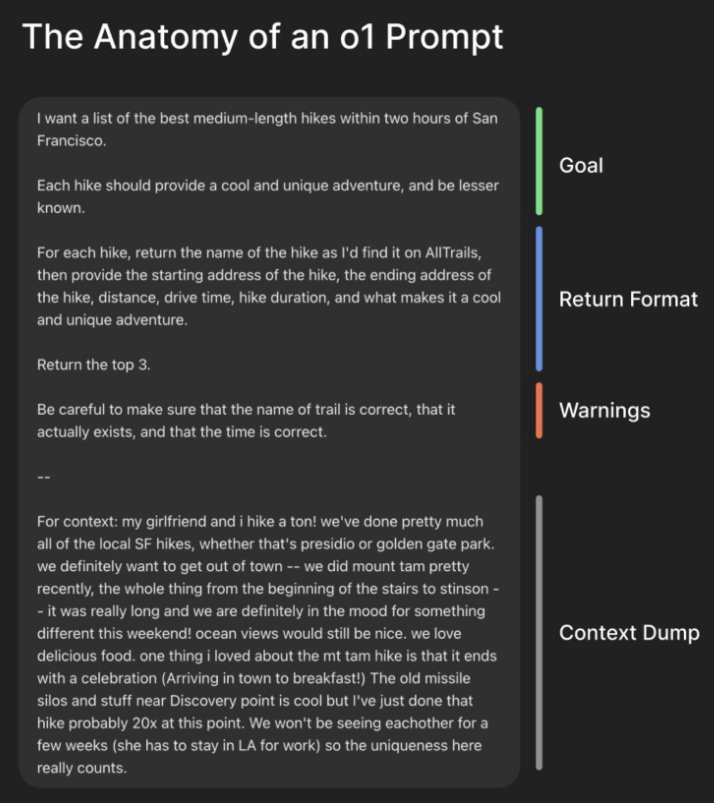
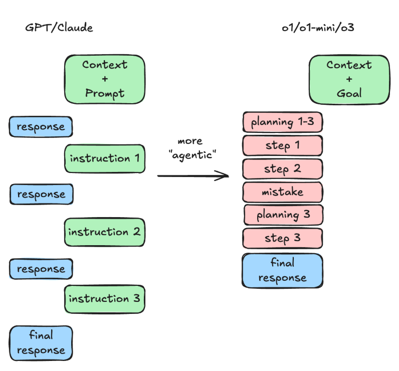

```
原文链接：https://www.latent.space/p/o1-skill-issue
```

[TOC]

最近，OpenAI 的 o1 和 o1 pro/o3 在 AI 圈可太火了，大家对它们的评价褒贬不一。不少人都在纠结，这 o1 到底好不好用？今天，咱们就跟着苹果和 SpaceX 前工程师 Ben Hylak 的经历，一起来揭开 o1 的神秘面纱，看看它的正确打开方式。

# 1. 初遇 o1：满心期待却大失所望

o1 pro 刚推出时，Ben Hylak 满心期待地订阅了，毕竟每月 200 美元，要是能顶上 1 - 2 个工程师的工作量，那可太划算了。可实际使用体验却让他大失所望。每次提问，都得苦等 5 分钟，得到的回答不仅自相矛盾，像一堆看不懂的官样文章，还会莫名其妙附上架构图和优缺点列表。他忍不住发推文吐槽，好多人都表示感同身受，但也有一些人坚称 o1 好用到超乎想象。这就让 Ben Hylak 纳闷了，同样的 o1，为啥大家的体验差别这么大呢？

# 2. o1 不是聊天模型，而是 “报告生成器”

经过和那些觉得 o1 好用的人交流，Ben Hylak 终于发现了问题所在 —— 他一直把 o1 当成普通聊天模型用了，可 o1 根本不是这类型的产品，它更像是一个 “报告生成器”。OpenAI CEO 山姆・奥特曼也转发表示，o1 不是聊天模型。普通聊天模型，比如 Claude 3.5 Sonnet 或 4o，会在信息不够时主动追问，和用户一来一往完善答案。但 o1 不会主动要信息，需要用户主动把大量背景信息一股脑都提供给它。



# 3. 用好 o1 的关键技巧

## 3.1 别写提示，写详细简介

使用 o1 时，别像对聊天模型那样简单写提示，而要写详细的简报。提供的上下文信息要尽可能多，比你认为的 “大量” 还要多 10 倍。就拿找旧金山周边徒步路线来说，不能只简单问 “旧金山附近哪适合徒步”，而要像这样详细描述：“我想找旧金山周边两小时车程内最好的中等距离徒步路线，每条路线都要有独特有趣的体验，还得比较小众。要告诉我在 AllTrails 上的路线名、起始和结束地址、距离、开车时长、徒步时长，以及这条路线独特在哪，只要排名前三的。我和女朋友经常徒步，旧金山本地像普雷西迪奥、金门公园的路线都去过了，最近刚去了塔姆山，这次想换点不一样的。我们喜欢美食，要是能看到海景就更好啦。之前塔姆山徒步结束后在镇上吃早餐的体验很棒，不过发现点附近的老导弹发射井那条路线我都去过 20 多次了，不想再去。接下来几周女朋友要去 LA 工作，我们没法见面，所以这次路线的独特性对我们来说很重要。” 同时，为了更方便地给 o1 提供上下文信息，大家可以用 mac / 手机上的语音备忘录，描述 1 - 2 分钟后粘贴转录内容；要是用 Supabase 这类有 AI 助手的产品，还能让助手帮忙提取相关信息。

## 3.2 聚焦目标，少管过程

以往用其他模型，我们习惯告诉模型怎么回答，比如 “你是专家软件工程师，思考要慢且仔细”。但用 o1 时，应该只告诉它你想要的结果，比如让它实现某个架构、创建测试应用，还是分析方案利弊，然后让 o1 自己去规划和解决问题。o1 的自主推理能力很强，这样做比手动一步步指导效率高得多。另外，要是能给 o1 设定判断结果好坏的标准，它就能更好地评估自己的输出，发现错误并修正。比如写文章时，先让 o1 写一版，自己再写一版，让 o1 对比差异给出评价，然后把评价融入下次提问，不断优化结果。



# 4. o1 的优势与不足

## 4.1 擅长的领域

o1 的能力十分强大，在多个方面表现出色。

- 它能一次性完美生成整个或多个文件，将大量代码和项目背景信息给它，它就能按代码库现有模式生成几乎无错的文件。
- 在处理特定查询语言时，o1 也很出色，像 ClickHouse 和 New Relic 这类语言，Claude 经常混淆语法，但 o1 很少出错。
- 在医疗诊断方面，o1 也能发挥作用，Ben Hylak 的女朋友是皮肤科医生，家里有人有皮肤问题时，o1 给出的答案有 3/5 的概率和专业诊断接近，对医疗专业人士来说，它提供的鉴别诊断非常准确。
- o1 解释复杂工程概念的能力也很强，还会搭配例子，就像生成一篇专业文章。
- 在做复杂架构决策时，让 o1 生成多个方案并对比利弊，能为决策者提供很大帮助。
- 此外，在评估方面，o1 也很有潜力，能用很少的信息判断生成内容是否正确。

## 4.2 有待提升的方面

o1 也并非十全十美。它不太擅长按特定风格写作，写出来的东西总是带着浓浓的学术、企业报告风格。虽然 o1 生成单个功能的能力很强，但目前还没办法直接帮你搭建一整个 SaaS 应用，即便多次调整也很难实现。

# 5. o1 产品设计的思考与建议

从产品设计角度看，o1 的延迟问题影响了用户体验，它更像电子邮件，和即时通讯工具的体验差别较大。目前 o1 的产品设计还没很好地体现出 “报告生成器” 的特点。如果是基于 o1 开发产品的团队，可以从这些方面优化：让 o1 回答内容的层级结构更清晰，比如加个迷你目录；让用户浏览更方便，像 Perplexity 那样，给每个问答页面分区，在答案里设置粘性标题、可折叠标题；优化用户输入背景信息的管理和展示，Claude 在这方面做得不错，粘贴长文本时会显示成小附件，而 ChatGPT 在处理 o1 相关内容时问题很多，经常生成失败，在手机端也不好用。

现在模型越来越贵，实验成本也水涨船高，一不小心就可能花掉上千美元。o1 目前还不支持流式输出，o1 - preview 和 o1 - mini 虽支持流式输出，但不支持结构化生成和系统提示功能。考虑到 o1 回答时间较长，未来流式输出估计会成为标配。

# 6. 小结

o1 虽然存在一些不足，但潜力巨大。2025 年，相信开发者们能挖掘出 o1 更多的可能性，创造出更多有趣的应用。大家要是正在用 o1 搭建智能体，或者管理 AI 工程师团队，别忘了关注相关活动，提升自己在 AI 领域的能力。掌握了 o1 的正确用法，相信它能在工作和生活中为你带来不少便利！

