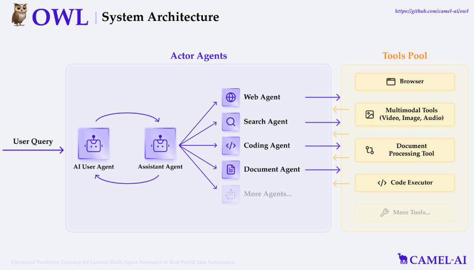

[TOC]

最近 AI 圈可是被一个叫 Manus 的项目彻底点燃啦！从抖音到央媒，从知乎到微博，全平台都在热议，热度高到券商研究员不惜砸 5 万现金求调研，闲鱼上一个邀请码更是炒到 5 万天价。这股热潮背后，一大批 open manus 项目如雨后春笋般涌现。今天，就带大家了解一下这些超有意思的开源项目和相关学习资料。

# 1. 特工宇宙 OpenManus

```
github：https://github.com/mannaandpoem/OpenManus
```

几个超厉害的 00 后，仅用三小时就完成了 OpenManus 初版项目开发。和原版 Manus 不同，原版有自己的云端电脑，还运用了复杂工具和自训练模型；而 OpenManus 直接让 AI 智能体操作你自己的电脑，让咱普通人也能轻松体验 AI 操控电脑的神奇。

从技术层面看，OpenManus 采用传统的 ReAct 模式，基于当前状态做决策，上下文和记忆管理都很方便。它主要依赖四个核心工具：PythonExecute 用来执行 Python 代码与电脑系统交互；FileSaver 能把文件保存到本地；BrowserUseTool 可以控制浏览器；GoogleSearch 负责进行网络信息检索。如果想让这个项目达到最佳效果，推荐使用 Claude-3.5-Sonnet 或 Claude-3.7-Sonnet 模型。

# 2. OWL 项目

```
github：https://github.com/camel-ai/owl
```

CAMEL AI 团队对 Manus 视频进行了细致分析，还逆向工程了它的技术路线，启动了深度复刻计划。他们把 Manus 的核心工作流拆解成六个关键步骤：首先启动 Ubuntu 容器，给 AI 智能体打造远程工作环境；接着进行知识召回，调用之前学过的内容；然后连接数据源，像数据库、网盘、云存储这些都能覆盖；再把数据挂载到 Ubuntu；之后自动生成 todo.md，规划任务和待办清单；最后使用 Ubuntu 工具链和外接工具执行全流程任务。



OWL 项目可不满足于简单复刻，他们还打算融合之前开发的 CRAB 技术，实现跨平台、多设备、全场景远程操作，目标是打造一个全能版的开源 “Manus Pro Max”。要是你想关注项目进展，可以看看这些 GitHub Issue：

- Workflow 复刻计划（https://github.com/camel-ai/camel/issues/1723 ）
- Ubuntu Toolkit 复刻计划（https://github.com/camel-ai/camel/issues/1724 ）
- Memory Toolkit 复刻计划（https://github.com/camel-ai/camel/issues/1725 ）。

# 3. manus 教程项目

有位贴心的开发者专门创建了 manus 指南仓库（https://github.com/hodorwang/manus-guide ），里面有超全面的使用文档。不管你是想了解 Manus 的基本情况，还是寻找详细的使用指南、探索各种应用场景，又或是想对比 Manus 和其他 AI 智能体的差异，甚至深入解析 Manus 的 Replay 功能，这个仓库都能满足你。而且，文档支持英文和中文两种语言，对新手超友好。不过话说回来，Manus 这么火，说不定过段时间这份文档就会被复制到闲鱼、拼多多上贩卖了，大家抓紧时间去看看。

# 4. 另一个 OpenManus 项目

```
github: https://github.com/mannaandpoem/OpenManus
```

有个和前面提到的 OpenManus 同名但不同团队的开源项目，他们也在构建强大的智能体生态系统。这个项目能利用 MCP 工具库和网页浏览等功能，实现复杂的推理和执行。项目路线图规划得很清晰，包括：

- 网页环境支持
- 高级推理模型集成
- 智能体基准测试
- RL 微调模型范式

目前项目正在积极开发中，它的 readme 相比其他同类项目更全面，估计很快就会上传代码，大家可以持续关注。

# 5. claude computer use demo

```
github：https://github.com/anthropics/anthropicquickstarts/tree/main/computer-use-demo
```

大家别只盯着 Manus，Claude 官方提供的 Computer Use 官方示例程序也超好玩。它能创建一个完全由 AI 控制的虚拟操作系统，咱们用户在浏览器里就能和 AI 交互，还能实时看到 AI 的系统界面。

这个示例程序仓库支持直接 docker 运行，里面内置了一套轻量的虚拟环境，像浏览器、操作系统、本地文件这些都有。

```
笔者能力有限，欢迎批评指正。
```