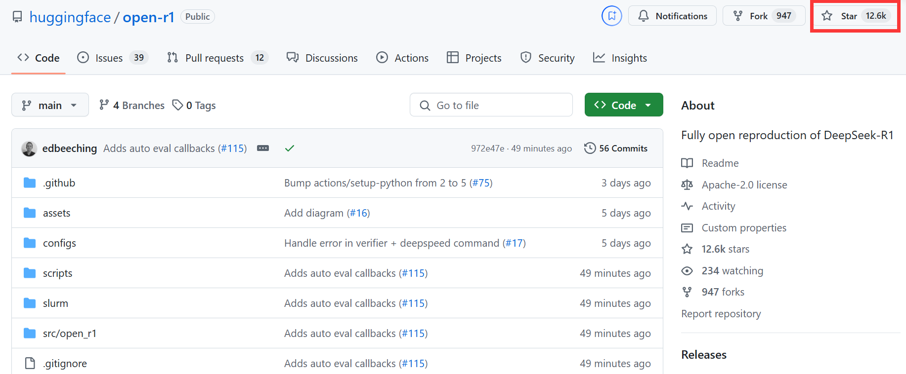
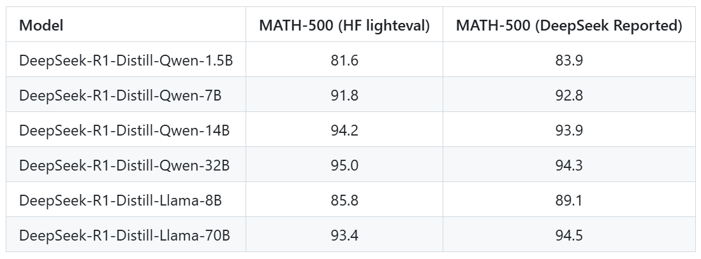

[TOC]

```
github: https://github.com/huggingface/open-r1
```

在人工智能的蓬勃发展进程中，模型的创新与迭代令人目不暇接。近期，DeepSeek-R1 以其出色的性能和较低的成本在 AI 领域掀起波澜，而 huggingface 推出的 Open-R1 项目，则致力于对 DeepSeek-R1 进行全开源复现，为 AI 社区带来了新的活力与探索方向。



# 1. Open-R1 项目概述

Open-R1 由 huggingface 打造，旨在构建 DeepSeek-R1 流程中缺失的部分，让开发者能够复现并基于其进行二次开发。项目结构简洁明了，核心部分主要包括：

- **src/open_r1 文件夹**：包含用于训练和评估模型以及生成合成数据的脚本。
  - `grpo.py`负责运用 GRPO 算法在特定数据集上训练模型；
  - `sft.py`用于执行模型的监督微调（SFT）；
  - `evaluate.py`对模型进行 R1 基准测试评估；
  - `generate.py`借助 Distilabel 从模型生成合成数据 。
- **Makefile**：整合了 R1 流程各步骤的便捷运行命令，这些命令依托上述脚本，极大地简化了开发流程。

项目以 DeepSeek-R1 技术报告为指引，规划了清晰的实施路径：

- 第一步：**复现 R1-Distill 模型**：从 DeepSeek-R1 中提取高质量语料库，以此复现 R1-Distill 模型。
- 第二步：**复现纯 RL 流程**：重现 DeepSeek 创建 R1-Zero 的纯强化学习（RL）流程，这可能需要为数学、推理和代码领域构建新的大规模数据集。
- 第三步：**多阶段训练验证**：展示通过多阶段训练，能将基础模型转化为经过 RL 调整的模型。

# 2. 环境搭建与依赖安装

Open-R1 项目依赖 CUDA 12.1，在安装前务必确认系统符合要求，以免出现段错误。

**创建虚拟环境并升级 pip**：可使用`uv`工具创建 Python 虚拟环境，安装`uv`后执行如下命令（uv安装文档 https://docs.astral.sh/uv/getting-started/installation/）

```
uv venv openr1 --python 3.11 && source openr1/bin/activate && uv pip install --upgrade pip
```

**安装 vLLM**：CUDA 12.1 环境下，运行下面的命令

```
uv pip install vllm==0.6.6.post1

# For CUDA 12.1
pip install vllm==0.6.6.post1 --extra-index-url https://download.pytorch.org/whl/cu121
export LD_LIBRARY_PATH=$(python -c "import site; print(site.getsitepackages()[0] + '/nvidia/nvjitlink/lib')"):$LD_LIBRARY_PATH
```

vLLM 的安装会连带安装 PyTorch v2.5.1，此版本务必保持一致。

**安装其余依赖**：根据具体使用场景，执行`pip install -e.[LIST OF MODES]` ，对于多数开发者，建议使用`pip install -e ".[dev]"`。

**登录账号与检查 Git LFS**：登录 Hugging Face 和 Weights and Biases 账号，分别执行

```
huggingface-cli login
wandb login
```

检查系统是否安装 Git LFS，若未安装，使用`sudo apt-get install git-lfs`进行安装。

# 3. 模型训练、评估与数据生成

## 3.1 模型训练

Open-R1 支持 DDP 和 DeepSpeed（ZeRO-2、ZeRO-3）两种训练方式，切换时只需调整`configs`文件夹中加速器 YAML 配置文件路径。以配备 8 块 H100（80GB）显卡的节点为例，训练命令如下：

- **SFT 阶段**：使用`accelerate launch --config_file=configs/zero3.yaml src/open_r1/sft.py`启动，配置模型、数据集、学习率等参数，如针对`Qwen/Qwen2.5-Math-1.5B-Instruct`模型在`HuggingFaceH4/Bespoke-Stratos-17k`数据集上训练。

```
accelerate launch --config_file=configs/zero3.yaml src/open_r1/sft.py \
    --model_name_or_path Qwen/Qwen2.5-Math-1.5B-Instruct \
    --dataset_name HuggingFaceH4/Bespoke-Stratos-17k \
    --learning_rate 2.0e-5 \
    --num_train_epochs 1 \
    --packing \
    --max_seq_length 4096 \
    --per_device_train_batch_size 4 \
    --per_device_eval_batch_size 4 \
    --gradient_accumulation_steps 4 \
    --gradient_checkpointing \
    --bf16 \
    --logging_steps 5 \
    --eval_strategy steps \
    --eval_steps 100 \
    --output_dir data/Qwen2.5-1.5B-Open-R1-Distill
```

- 若使用 Slurm 调度系统，可运行

```
sbatch --output=/path/to/logs/%x-%j.out --err=/path/to/logs/%x-%j.err slurm/sft.slurm {model} {dataset} {accelerator}
```

- **GRPO 阶段**：利用`accelerate launch --config_file configs/zero3.yaml src/open_r1/grpo.py`，设置输出目录、模型、数据集等参数，如对`deepseek-ai/DeepSeek-R1-Distill-Qwen-7B`模型在`AI-MO/NuminaMath-TIR`数据集上训练。

```
accelerate launch --config_file configs/zero3.yaml src/open_r1/grpo.py \
    --output_dir DeepSeek-R1-Distill-Qwen-7B-GRPO \
    --model_name_or_path deepseek-ai/DeepSeek-R1-Distill-Qwen-7B \
    --dataset_name AI-MO/NuminaMath-TIR \
    --max_prompt_length 256 \
    --per_device_train_batch_size 1 \
    --gradient_accumulation_steps 16 \
    --logging_steps 10 \
    --bf16
```

## 3.2 模型评估

项目使用`lighteval`评估模型，在`src/open_r1/evaluate.py`中定义了自定义任务。评估时，根据模型规模和 GPU 资源选择不同策略：

- **单 GPU 评估**：针对小型模型，设置模型、任务等参数后运行`lighteval vllm`命令，也可使用`make evaluate MODEL=deepseek-ai/DeepSeek-R1-Distill-Qwen-32B TASK=aime24`简化操作。

```
MODEL=deepseek-ai/DeepSeek-R1-Distill-Qwen-1.5B
MODEL_ARGS="pretrained=$MODEL,dtype=float16,max_model_length=32768,gpu_memory_utilisation=0.8"
TASK=aime24
OUTPUT_DIR=data/evals/$MODEL

lighteval vllm $MODEL_ARGS "custom|$TASK|0|0" \
    --custom-tasks src/open_r1/evaluate.py \
    --use-chat-template \
    --system-prompt="Please reason step by step, and put your final answer within \boxed{}." \
    --output-dir $OUTPUT_DIR 
```

```
# 或者使用
make evaluate MODEL=deepseek-ai/DeepSeek-R1-Distill-Qwen-32B TASK=aime24
```

- **多 GPU 数据并行评估**：通过增加`data_parallel_size`参数实现，如

```
NUM_GPUS=8
MODEL=deepseek-ai/DeepSeek-R1-Distill-Qwen-1.5B
MODEL_ARGS="pretrained=$MODEL,dtype=float16,data_parallel_size=$NUM_GPUS,max_model_length=32768,gpu_memory_utilisation=0.8"
TASK=aime24
OUTPUT_DIR=data/evals/$MODEL

lighteval vllm $MODEL_ARGS "custom|$TASK|0|0" \
    --custom-tasks src/open_r1/evaluate.py \
    --use-chat-template \
    --system-prompt="Please reason step by step, and put your final answer within \boxed{}." \
    --output-dir $OUTPUT_DIR 
```

```
# 或者使用
make evaluate MODEL=deepseek-ai/DeepSeek-R1-Distill-Qwen-32B TASK=aime24 PARALLEL=data NUM_GPUS=8
```

- **多 GPU 张量并行评估**：针对大型模型，设置`tensor_parallel_size`参数，如

```
NUM_GPUS=8
MODEL=deepseek-ai/DeepSeek-R1-Distill-Qwen-32B
MODEL_ARGS="pretrained=$MODEL,dtype=float16,tensor_parallel_size=$NUM_GPUS,max_model_length=32768,gpu_memory_utilisation=0.8"
TASK=aime24
OUTPUT_DIR=data/evals/$MODEL

export VLLM_WORKER_MULTIPROC_METHOD=spawn
lighteval vllm $MODEL_ARGS "custom|$TASK|0|0" \
    --custom-tasks src/open_r1/evaluate.py \
    --use-chat-template \
    --system-prompt="Please reason step by step, and put your final answer within \boxed{}." \
    --output-dir $OUTPUT_DIR 
```

```
# 或者使用
make evaluate MODEL=deepseek-ai/DeepSeek-R1-Distill-Qwen-32B TASK=aime24 PARALLEL=tensor NUM_GPUS=8
```

## 3.3 数据生成

数据生成可从不同规模模型进行：

- **从smol蒸馏的R1模型生成数据**：在 1 块 H100 显卡环境下，安装命令

```
uv pip install "distilabel[vllm]>=1.5.2"
```

- 编写 Python 脚本调用相关库，从`deepseek-ai/DeepSeek-R1-Distill-Qwen-7B`模型生成数据，生成数据可推送至 Hugging Face Hub。示例代码如下

```python
from datasets import load_dataset
from distilabel.models import vLLM
from distilabel.pipeline import Pipeline
from distilabel.steps.tasks import TextGeneration


prompt_template = """\
You will be given a problem. Please reason step by step, and put your final answer within \boxed{}:
{{ instruction }}"""

dataset = load_dataset("AI-MO/NuminaMath-TIR", split="train").select(range(10))

model_id = "deepseek-ai/DeepSeek-R1-Distill-Qwen-7B"  # Exchange with another smol distilled r1

with Pipeline(
    name="distill-qwen-7b-r1",
    description="A pipeline to generate data from a distilled r1 model",
) as pipeline:

    llm = vLLM(
        model=model_id,
        tokenizer=model_id,
        extra_kwargs={
            "tensor_parallel_size": 1,
            "max_model_len": 8192,
        },
        generation_kwargs={
            "temperature": 0.6,
            "max_new_tokens": 8192,
        },
    )
    prompt_column = "problem"
    text_generation = TextGeneration(
        llm=llm, 
        template=prompt_template,
        num_generations=4,
        input_mappings={"instruction": prompt_column} if prompt_column is not None else {}
    )


if __name__ == "__main__":
    distiset = pipeline.run(dataset=dataset)
    distiset.push_to_hub(repo_id="username/numina-deepseek-r1-qwen-7b")
```

- **从DeepSeek-R1 模型生成数据**：使用 2 个节点，每个节点配备 8 块 H100 显卡，安装特定依赖后，运行`sbatch slurm/generate.slurm`脚本，按需求设置数据集、温度、提示列、模型及输出数据集等参数。安装命令

```
pip install https://wheels.vllm.ai/221d388cc5a836fa189305785ed7e887cea8b510/vllm-1.0.0.dev-cp38-abi3-manylinux1_x86_64.whl --extra-index-url https://download.pytorch.org/whl/cu121

uv pip install "distilabel[vllm,ray,openai]>=1.5.2"
```

生成数据命令

```
sbatch slurm/generate.slurm \
    --hf-dataset AI-MO/NuminaMath-TIR \
    --temperature 0.6 \
    --prompt-column problem \
    --model deepseek-ai/DeepSeek-R1 \
    --hf-output-dataset username/r1-dataset
```

# 4. 项目成果与展望

Open-R1 项目在短时间内获得了大量关注，收获了众多开发者的 Star。目前，项目已成功复现 Deepseek 在 MATH-500 Benchmark 上的评估结果，不同模型的评估成绩与 DeepSeek 报告中的数据相近，这为项目的进一步发展奠定了坚实基础。



复现命令

```
sbatch slurm/evaluate.slurm deepseek-ai/DeepSeek-R1-Distill-Qwen-1.5B math_500
sbatch slurm/evaluate.slurm deepseek-ai/DeepSeek-R1-Distill-Qwen-7B math_500
sbatch slurm/evaluate.slurm deepseek-ai/DeepSeek-R1-Distill-Qwen-14B math_500
sbatch slurm/evaluate.slurm deepseek-ai/DeepSeek-R1-Distill-Qwen-32B math_500 tp
sbatch slurm/evaluate.slurm deepseek-ai/DeepSeek-R1-Distill-Llama-8B math_500
sbatch slurm/evaluate.slurm deepseek-ai/DeepSeek-R1-Distill-Llama-70B math_500 tp
```

Open-R1 项目的开源复现意义重大，它促进了 AI 技术的交流与共享，让更多开发者能够深入研究 DeepSeek-R1 背后的技术原理，激发新的创新灵感。


