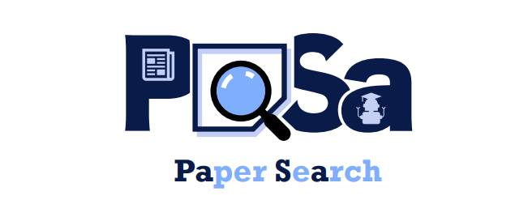
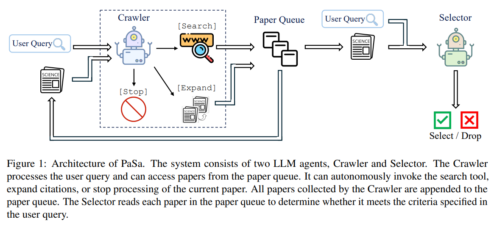
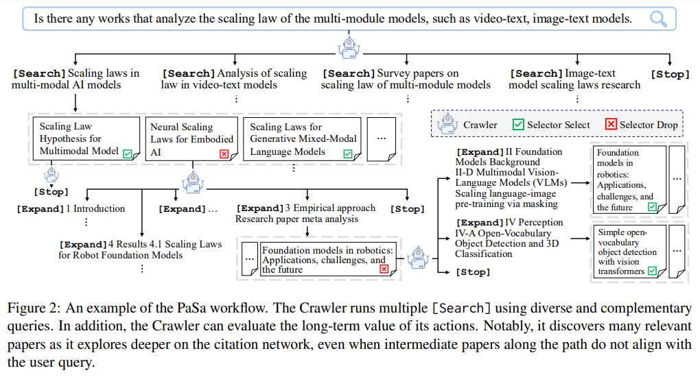
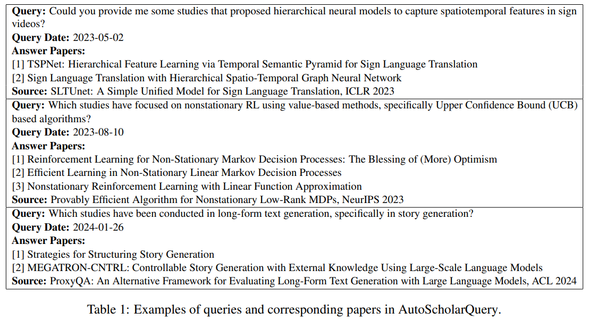
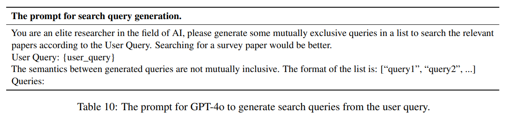
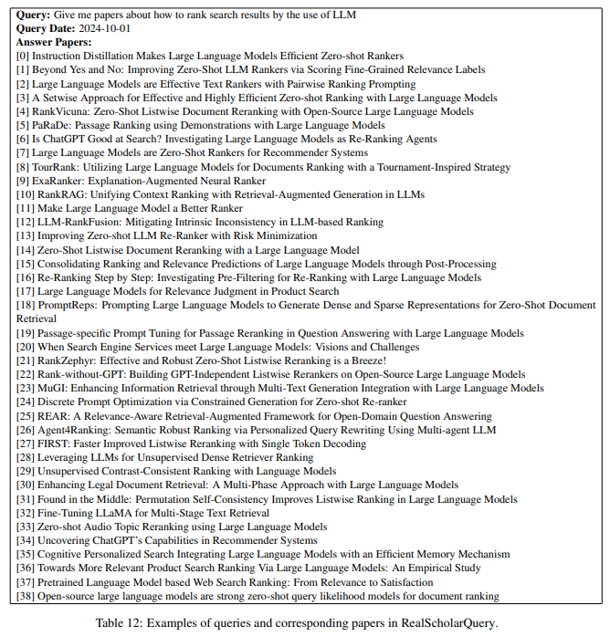
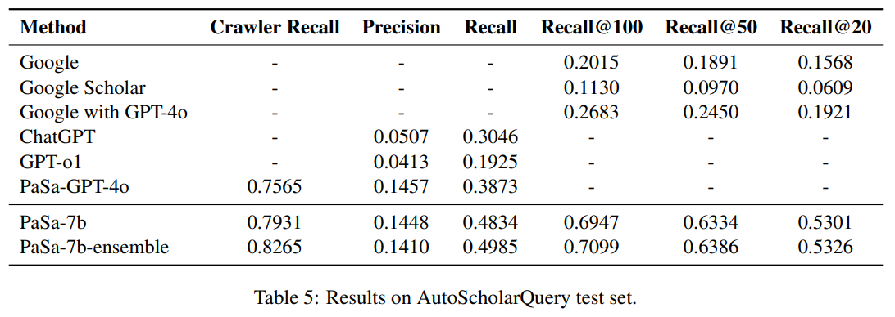
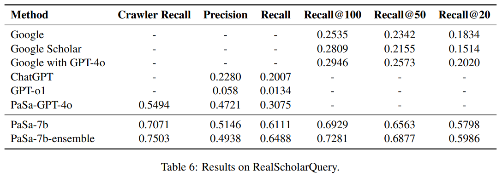
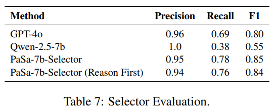

[TOC]

```
机构：字节
标题：PaSa: An LLM Agent for Comprehensive Academic Paper Search
链接：https://arxiv.org/pdf/2501.10120v1
github：https://github.com/bytedance/pasa
官网：https://pasa-agent.ai/
huggingface：https://huggingface.co/papers/2501.10120
```

在学术研究的领域中，高效准确地搜索论文是科研人员开展工作的重要基础。然而，传统的学术搜索工具在面对复杂查询时往往力不从心。字节跳动和北大的研究团队推出的 PaSa（Paper Search Agent），为这一难题带来了创新性的解决方案。



# 1. 研究背景与意义

学术论文搜索是研究的关键环节，但它极具挑战性。像 “哪些研究聚焦于基于价值的方法，尤其是基于 UCB 算法的非平稳强化学习？” 这类复杂查询，常用的学术搜索系统，如 Google Scholar，难以给出全面准确的答案。这使得研究人员不得不花费大量时间进行文献综述。

随着大语言模型（LLMs）的发展，其在信息检索领域得到了广泛应用。但在学术搜索场景中，仅靠简单的检索并不够，还需要像人类研究者一样，阅读相关论文、查看引用等，进行全面深入的文献调研。

PaSa 的出现正是为了满足这一需求。它旨在通过模拟人类研究行为，利用 LLMs 的强大能力，实现自动化、全面且准确的学术文献搜索，提升学术搜索的效率和质量，帮助研究人员更高效地获取所需文献。

# 2. 方法与创新点

## 2.1 双代理架构设计

PaSa 系统由 Crawler 和 Selector 两个 LLM 代理组成。Crawler 负责处理用户查询，它能自主调用搜索工具，从论文队列中获取论文，还能扩展引用或停止当前论文的处理，并将收集到的论文添加到队列中。Selector 则对队列中的每篇论文进行评估，依据论文的标题和摘要，判断其是否符合用户查询的要求。

## 2.2 高质量数据集构建

为了训练和评估 PaSa，研究团队构建了两个高质量数据集。AutoScholarQuery 是一个合成的高质量数据集，包含 35k 细粒度学术查询和相应论文，这些数据来源于顶级 AI 会议出版物。通过让 GPT-4o 根据论文的相关工作部分生成查询，并筛选在 arXiv 上可检索的论文来构建该数据集。RealScholarQuery 则是一个包含 50 个真实世界学术查询的测试数据集，由 AI 研究人员提出，经专业注释者通过多种检索方法确定相关论文。

## 2.3 强化学习优化策略

PaSa 在 AGILE 这个强化学习框架内进行优化。针对论文搜索任务的独特挑战，如稀疏奖励（AutoScholarQuery 中的论文通过引用收集，只是实际合格论文集的一小部分）和长轨迹（Crawler 的完整轨迹可能涉及数百篇论文，太长而无法直接输入到 LLM 上下文），设计了新的奖励机制和会话级近端策略优化（PPO）训练方法。在 Crawler 的奖励设计中，不仅考虑论文是否匹配查询，还引入 Selector 作为辅助奖励模型，以缓解稀疏奖励问题。

# 3. 方法论详解

PaSa（Paper Search Agent）是一款由字节跳动和北大的研究团队开发的学术论文搜索工具，通过模拟人类研究行为实现自动化、全面且准确的学术文献搜索。它的实现涉及架构设计、数据集构建和模型训练优化等多个方面。

## 3.1 架构设计

PaSa 系统由 Crawler 和 Selector 两个 LLM 代理构成。Crawler 负责处理用户查询，它能调用搜索工具，从论文队列获取论文，还可扩展引用或停止当前论文处理，并将收集的论文加入队列。Selector 读取队列中的论文，依据标题和摘要判断其是否符合用户查询要求。用户输入查询后，Crawler 会生成搜索查询，调用搜索工具获取论文，若生成 [Expand] 动作，会从当前论文特定部分提取引用论文加入队列，完成处理后发信号给 Selector ，Selector 评估论文相关性，决定是否保留。





## 3.2 数据集构建

- **AutoScholarQuery**：这是为训练 PaSa 构建的合成高质量数据集。构建时，先收集顶级 AI 会议出版物论文，让 GPT-4o 根据论文相关工作部分生成学术查询，筛选在 arXiv 上可检索的论文，以源论文发表日期为查询日期，最终得到包含 33,551、1,000 和 1,000 个实例的训练、开发和测试集。





- **RealScholarQuery**：用于在现实场景评估 PaSa 性能。收集 AI 研究人员使用系统时提出的查询，经人工筛选得到 50 个细粒度现实查询。为每个查询手动收集相关论文，用多种方法检索更多论文，由专业注释者审核筛选出最终相关论文集，所有实例查询日期设为 2024-10-01 。



## 3.3 模型训练与优化

- **Selector 训练**：基于 Qwen2.5-7b 模型，使用 AutoScholarQuery 训练集数据，进行监督微调。从训练集中采样用户查询和对应论文，用 GPT-4o 生成决策令牌和理由，去除决策令牌为 “False” 的数据，再模拟部分论文搜索添加负例，得到最终训练数据集，在 8 个 NVIDIA-H100 GPU 上训练 1 个 epoch，学习率 1e-5 ，批次大小 4。
- **Crawler 训练**：分模仿学习和 PPO 训练两个阶段。模仿学习阶段，生成搜索和扩展两种会话轨迹数据。搜索会话从训练集采样用户查询，用 GPT-4o 生成搜索查询构建轨迹；扩展会话用 Google 搜索生成的查询，采样论文构建初始状态，根据论文部分引用情况选择部分构建轨迹。PPO 训练阶段，每个设备每次处理 4 个用户查询生成搜索会话，从搜索结果采样论文生成扩展会话，重复该过程。定义会话为子轨迹，设计奖励函数，考虑论文匹配情况和动作成本，用 Selector 辅助判断。训练时用蒙特卡罗采样估计回报，计算优势函数，得到策略和价值目标，合并为统一 RL 损失进行训练 。

# 4. 实验设计与结果

## 4.1 实验设置

PaSa-7b 基于 Qwen2.5-7b 模型，先对 Selector 进行监督微调，再对 Crawler 进行两阶段训练，包括模仿学习和 PPO 训练。在训练过程中，使用 Google Search API 和 arxiv/ar5iv 搜索 API 来获取论文信息，并开发了数据库来管理论文。

## 4.2 对比基线

为了评估 PaSa 的性能，将其与多个基线进行比较，包括 Google、Google Scholar、Google with GPT-4o、ChatGPT、GPT-o1 和 PaSa-GPT-4o。针对不同基线设计了相应的提示，如让 GPT-4o 为 Google with GPT-4o 改写查询，为 ChatGPT 设置特定的输出格式要求等。

## 4.3 实验结果

在 AutoScholarQuery 测试集上，PaSa-7b 表现出色。与最强基线 PaSa-GPT-4o 相比，召回率提高了 9.64%，精度相当，且 Crawler 的召回率比 PaSa-GPT-4o 高 3.66%。与基于 Google 的最佳基线 Google with GPT-4o 相比，在 Recall@20、Recall@50 和 Recall@100 上分别提高了 33.80%、38.83% 和 42.64%。在推理时使用多个 Crawler 集合，可使 Crawler 召回率提高 3.34%，最终召回率提高 1.51%，精度保持相似。



在 RealScholarQuery 测试集中，PaSa-7b 优势更为明显。与 PaSa-GPT-4o 相比，召回率提高了 30.36%，准确率提高了 4.25%。与基于 Google 的最佳基线相比，在 recall@20、recall@50 和 recall@100 方面分别比 Google 好 37.78%、39.90% 和 39.83%。PaSa-7b-ensemble 进一步将爬虫召回率提高了 4.32%，使整个代理系统的召回率整体提高了 3.52%。



此外，对 Selector 的评估显示，其 F1 得分达到 85%，优于 GPT-4o 和 Qwen-2.5-7b，且精度达到 95%，证明了其作为 Crawler 强化学习训练辅助奖励模型的有效性。



# 5. 总结与展望

PaSa 通过创新的架构设计、高质量数据集构建和强化学习优化，在学术论文搜索任务中展现出卓越的性能，显著超越了包括 Google、ChatGPT 等在内的多种基线方法。这一成果表明 PaSa 能有效提高学术搜索的效率和准确性，为研究人员提供了强大的文献检索工具。


