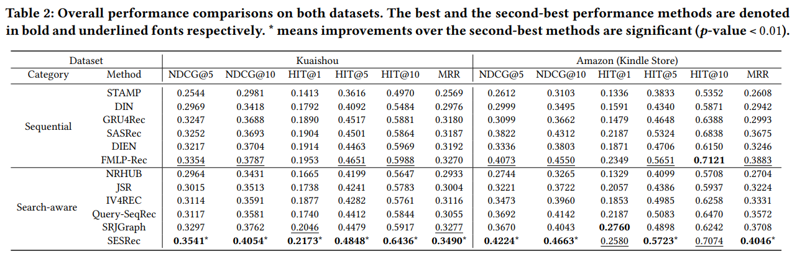

```
论文标题：When Search Meets Recommendation: Learning Disentangled Search Representation for Recommendation
论文链接：arxiv.org/abs/2305.10822
github：github.com/Ethan00Si/SESREC-SIGIR-2023
发表时间：2023
```

[TOC]

在当今的数字时代，在线平台为了满足用户多样化的需求，纷纷提供搜索和推荐服务。推荐系统通过分析用户的历史行为和偏好，为用户提供个性化的推荐；而搜索功能则让用户能够直接获取自己想要的信息。然而，如何有效地将这两种服务结合起来，提高推荐的准确性和效果，一直是研究的热点问题。今天，我们就来深入探讨两篇关于搜索与推荐融合的论文，看看它们为我们带来了哪些新的思路和方法。

# 1. 研究背景：搜索与推荐融合的必要性

随着互联网数据的爆炸式增长，用户在信息获取过程中面临着严重的信息过载问题。推荐系统和搜索引擎作为帮助用户筛选和发现感兴趣内容的工具，各自发挥着重要作用。推荐系统能够根据用户的长期和短期行为，为用户提供个性化的推荐；而搜索引擎则能够让用户快速找到自己想要的具体信息。

然而，单独使用推荐系统或搜索引擎都无法完全满足用户的需求。在许多情况下，用户可能对某个领域或主题感兴趣，但并不清楚具体的产品或信息。这时，搜索功能可以帮助用户快速定位到相关的内容；而在用户浏览推荐结果时，也可能会发现一些自己之前没有想到的感兴趣的内容，从而触发搜索行为。因此，将搜索和推荐服务结合起来，能够为用户提供更加全面和个性化的服务，提高用户的满意度和忠诚度。

# 2. 方法概述

## 2.1 整体框架

这篇论文提出了搜索增强的序列推荐框架，旨在通过利用用户的搜索兴趣来提升推荐系统的性能。具体来说，这个框架通过将用户的搜索行为和推荐行为进行整合，解耦相似和不相似的兴趣表示，从而更好地捕捉用户的真实兴趣。

## 2.2 关键技术

- 查询 - 物品对齐
  - **特征转换**：将用户的查询和物品的特征进行转换，使其能够在同一向量空间中进行比较和计算。
  - **对比学习**：利用对比学习损失函数，如 InfoNCE 损失，来对齐查询和物品的向量表征，从而学习到它们之间的相似性和差异性。

- 行为序列建模
  - **独立编码器**：使用两个独立的编码器分别对搜索行为和推荐行为进行建模，从而捕捉到它们各自的特征和模式。
  - **兴趣解耦**：将每个历史行为序列分解为两个子序列，分别表示相似和不相似的兴趣，以便更好地提取用户的兴趣。

- 自监督学习
  - **协同注意机制**：利用协同注意机制来学习搜索和推荐表征之间的相关性，从而更好地理解用户的兴趣。
  - **三元组损失**：定义三元组损失来引导模型学习相似和不相似的兴趣，通过将锚点与正样本之间的距离拉近，将锚点和负样本之间的距离推远，从而实现兴趣的解耦。

# 3. 研究贡献

## 3.1 创新的研究思路

这篇论文首次将搜索和推荐行为进行联合建模，通过解耦相似和不相似的兴趣表示，为推荐系统提供了更加准确和个性化的推荐。这种思路打破了传统推荐系统中只考虑用户历史行为的局限性，充分利用了用户的搜索行为来丰富用户兴趣的表示，为推荐系统的发展开辟了新的方向。

## 3.2 有效的技术方法

- 特征提取与对齐
  - 通过对查询和物品的特征进行转换和对齐，能够更好地捕捉到它们之间的语义关系，为后续的兴趣解耦和推荐提供了基础。
  - 利用协同注意机制和三元组损失等自监督学习方法，能够有效地学习到搜索和推荐行为之间的相关性和差异性，提高了模型的性能。

- 模型优化与创新
  - 提出了使用两个独立的编码器对搜索和推荐行为进行建模，这种方式能够更好地捕捉到不同行为之间的特征和模式，提高了模型的表达能力。
  - 通过将历史行为序列分解为相似和不相似的兴趣子序列，能够从多个方面提取用户的兴趣，为推荐提供了更加全面的信息。

## 3.3 显著的实验效果

在多个数据集上的实验结果表明，这些搜索增强的序列推荐框架能够显著提高推荐系统的性能，超过了以往的序列推荐模型和引入搜索数据的模型。这些实验结果证明了该方法的有效性和优越性，为推荐系统的实际应用提供了有力的支持。

# 4. 方法详解

## 4.1 任务设置：融合搜索与推荐的建模挑战

传统的序列推荐模型主要关注用户的历史交互物品序列来建模用户兴趣，但在实际应用中，用户的搜索行为同样蕴含着丰富的兴趣信息。因此，搜索增强的序列推荐模型需要同时考虑用户的历史搜索行为（包括提出的查询和点击的物品序列）和推荐行为，来更准确地建模用户兴趣并预测下一次的交互。

这种融合的建模方式面临着诸多挑战，其中最关键的是如何有效地处理搜索和推荐行为之间的关系，以及如何解耦用户在这两种行为中相似和不相似的兴趣。因为用户在搜索和推荐过程中可能会表现出不同的兴趣偏好，有些兴趣是相似的，反映了用户的长期稳定偏好；而有些兴趣则是不相似的，可能是用户在特定情境下产生的新偏好。

## 4.2 SESRec 框架

为了解决上述问题，作者提出了一种搜索增强的序列推荐框架 ——SESRec，该框架旨在学习推荐中解耦开的搜索表示，具体设计如下：


### 4.2.1 整体架构

SESRec 框架的整体架构如图所示，它通过将搜索和推荐序列分别进行建模，并且将每个历史序列分解为两个子序列，分别表示相似和不相似的兴趣，从而可以从多个方面提取用户的兴趣。这种多维度的兴趣提取方式能够更全面地了解用户的兴趣偏好，为推荐提供更加准确的依据。

### 4.2.2 关键技术

- **自监督兴趣解耦**
  - **查询 - 物品对齐**：通过基于用户的查询 - 物品交互的 InfoNCE 损失函数来对齐查询和物品的向量表征，这是后续兴趣解耦的基础。具体来说，使用用户的搜索数据，将 query-item 交互 pair 分别进行 item2query 和 query2item 的对齐，即将查询与物品的特征进行匹配和对比，通过两个 loss 求和作为最终的对齐损失。这样可以确保查询和物品在向量空间中具有相似的语义表示，为后续的兴趣分析提供了前提条件。
  - **兴趣对比学习**
    - **协同注意机制**：利用协同注意机制来学习搜索和推荐表征之间的相关性。协同注意机制能够捕捉到搜索和推荐行为之间的相互关系，通过对两个序列表示的协同处理，发现它们之间的相似性和差异性。
    - **三元组损失**：基于协同注意得分，对于两个序列表示，不仅将它们聚合起来生成锚点，以保持搜索和推荐之间的共同兴趣，还将它们分割成两个子序列，分别表示搜索和推荐之间的相似和不相似兴趣（分别称为正样本和负样本）。接着，定义一个 triplet loss，将锚点与正样本之间的距离拉近，将锚点和负样本之间的距离推远。这种三元组损失的设计能够有效地引导模型学习相似和不相似的兴趣，提高兴趣解耦的准确性。

- **多兴趣提取**：基于原始行为以及包含相似和不相似兴趣的解耦开的行为，从聚合的、相似的和不相似的兴趣三个方面提取用户兴趣。给定候选物品 v，利用注意机制重新分配与候选物品相关的用户兴趣。通过这种多维度的兴趣提取方式，能够为推荐系统提供更加丰富和全面的用户兴趣信息，从而提高推荐的准确性。

- **模型训练**
  - **多任务学习**：模型的主任务是推荐任务，使用 BCE loss 作为主任务的损失函数。同时，考虑到还有额外引入的两个自监督任务的 loss，即查询 - 物品对齐损失和兴趣对比损失，使用了多任务学习的范式进行模型训练。这种多任务学习的方式能够充分利用各个任务之间的信息，提高模型的性能和泛化能力。
  - 

# 5. 实验

为了验证 SESRec 框架的有效性，作者在一个工业数据集 Kuaishou 和一个开源的模拟数据集 Amazon 上进行了广泛的实验。实验结果表明，SESRec 框架在多个指标上都取得了显著的优于以往模型的成绩，具体表现如下：

## 5.1 总体性能优势

在两个数据集上的实验结果显示，SESRec 框架在准确率、召回率、NDCG、HIT@1、HIT@5、HIT@10、MRR 等指标上都超过了以往的序列推荐模型和引入搜索数据的模型，取得了 SOTA（State - of - the - Art）的效果。这表明 SESRec 框架能够更好地捕捉用户的兴趣偏好，提供更加准确和个性化的推荐。



## 5.2 详细指标分析

- **不同数据集表现**
  - **Kuaishou 数据集**：在 Kuaishou 数据集上，SESRec 框架在各项指标上都表现出色，尤其是在 HIT@1、HIT@5、HIT@10 和 MRR 等指标上，优势明显。这说明 SESRec 框架能够更好地理解用户在快手平台上的搜索和推荐行为，为用户提供更加符合其兴趣的推荐内容。
  - **Amazon 数据集**：在 Amazon 数据集上，SESRec 框架虽然相对其他模型的提升幅度不如在 Kuaishou 数据集上那么显著，但仍然取得了较好的效果。这表明 SESRec 框架在处理不同类型的数据集时具有较好的适应性和泛化能力。

- **与其他模型对比**
  - **优势对比**：与传统的序列推荐模型（如 STAMP、DIN、GRU4Rec、SASRec、DIEN、FMLP - Rec）和引入搜索数据的模型（如 NRHUB、JSR、IV4REC、Query - SeqRec、SRJGraph）相比，SESRec 框架在处理搜索和推荐行为的融合、兴趣解耦、特征提取等方面具有明显的优势。它能够更好地捕捉用户的兴趣，将搜索和推荐行为中相似和不相似的兴趣表示进行有效的分离，为推荐提供更加全面的信息。
  - **优势原因**：SESRec 框架的优势主要得益于其创新的设计理念和有效的技术方法。通过将搜索和推荐序列分别建模，并且利用自监督学习和多任务学习等技术，能够更好地学习用户的兴趣偏好，提高推荐系统的性能。

# 6. 小结

这篇论文的研究成果为搜索与推荐融合提供了一种新的解决方案，通过提出搜索增强的序列推荐框架，有效地将用户的搜索兴趣融入到推荐系统中，提高了推荐系统的性能和准确性。

