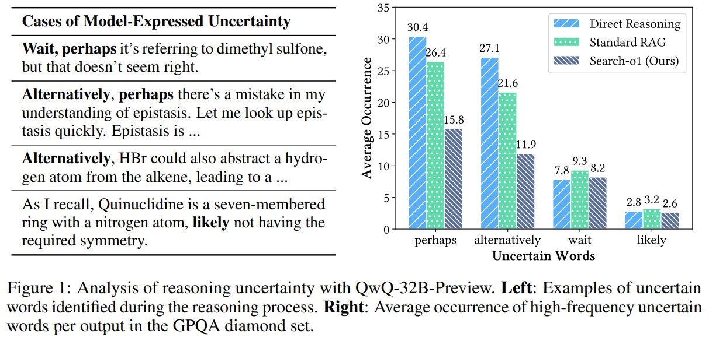
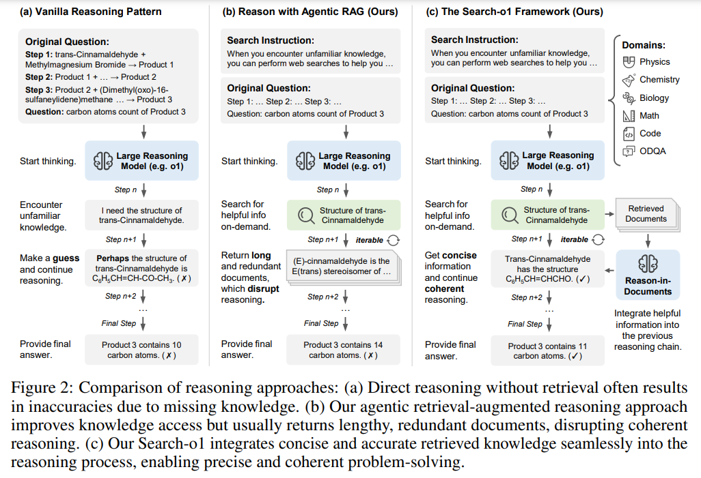
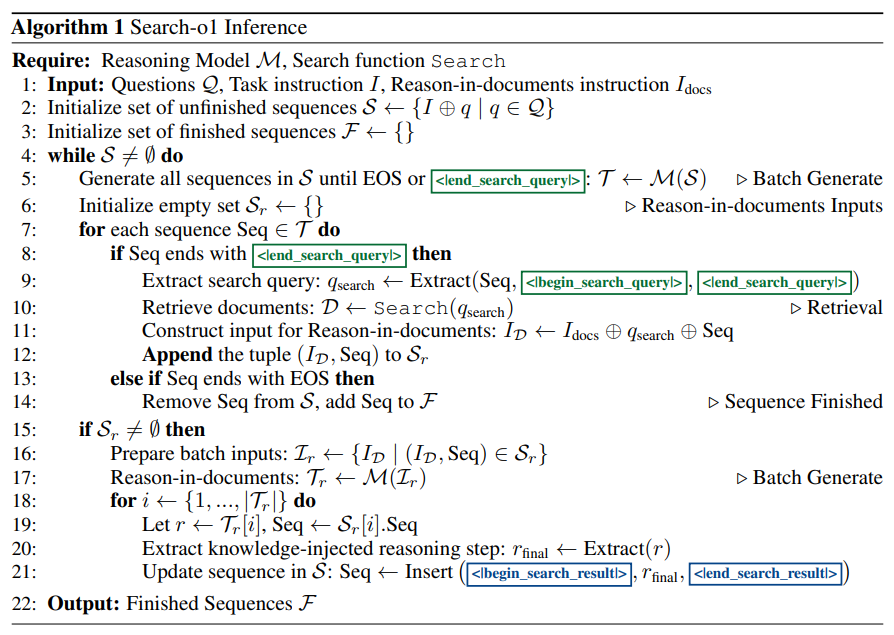
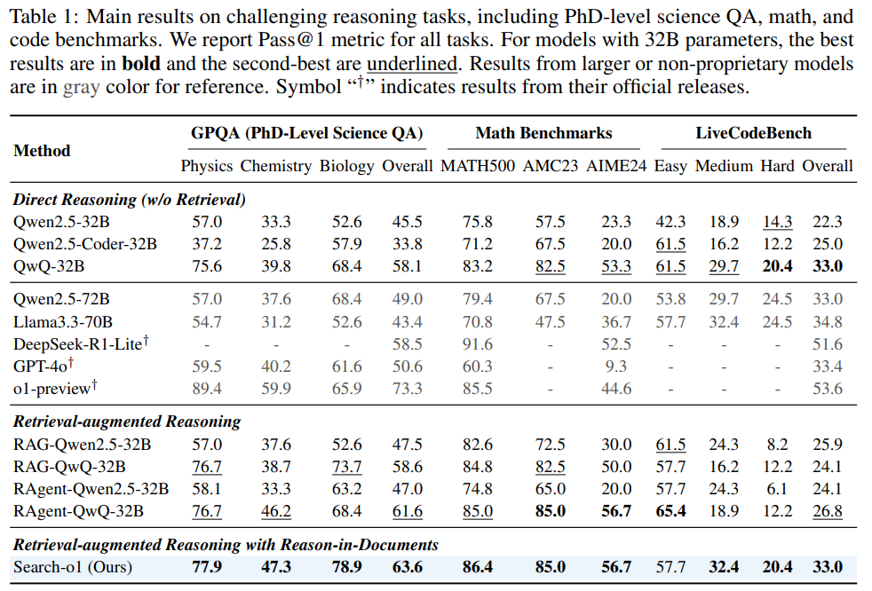
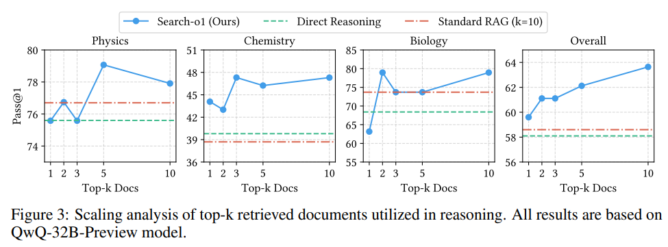
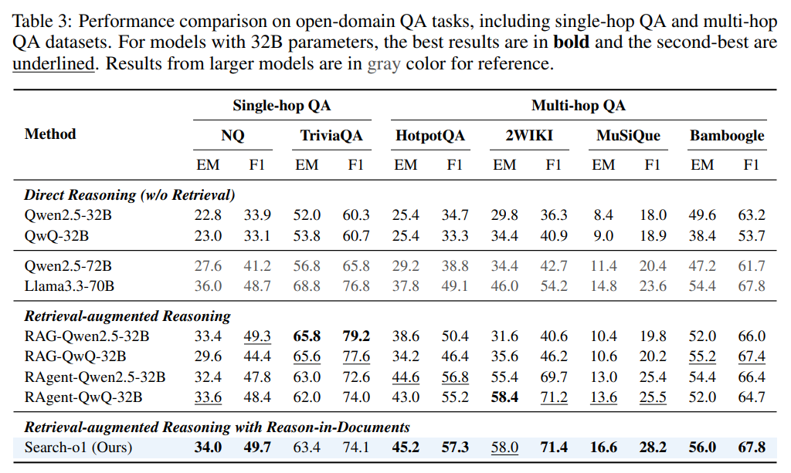

```
机构：清华大学 & 中国人民大学
paper：Search-o1: Agentic Search-Enhanced Large Reasoning Models
paper链接：https://arxiv.org/pdf/2501.05366
github：https://github.com/sunnynexus/Search-o1
project链接：https://search-o1.github.io/
```

[TOC]

# 1. 背景

大型推理模型如 OpenAI - o1、Qwen - QwQ 等通过大规模强化学习，在科学、数学、编码等复杂领域展现出了强大的逐步推理能力。它们以 “慢思考” 模式生成长思维链条，有效解决复杂问题，增强了推理的逻辑性和可解释性。然而，这也带来了显著弊端，在长链式推理过程中，模型常常遭遇知识不足的困境。这使得推理链条容易出现错误传播，严重影响最终答案的质量。例如，在处理一些复杂的科学问题时，模型可能会因为对某些关键知识点的缺失而得出错误结论。

# 2. 研究动机

初步实验发现，类似 OpenAI - o1 的推理模型在处理复杂问题时，平均每个推理过程中会出现超过 30 次如 “或许”“可能” 等不确定词汇。这不仅大幅增加了推理的复杂性，还使得手动验证推理过程变得极为困难。因此，如何在推理过程中自动补充所需知识，成为提升大型推理模型可信度的关键所在，这也是 Search - o1 出现的原因。



# 3. Search - o1 框架

## 3.1 Search-o1框架概述

Search - o1 是自主知识检索增强的推理框架，这个框架是为解决大型推理模型在长链式推理时知识不足问题而设计的创新架构，主要由自主检索增强生成机制和文档内推理模块构成。通过这一设计，模型能够在推理过程中动态获取并整合外部知识，确保推理的连贯性和准确性。



- **自主检索增强生成机制**：在推理中，模型能自主判断并生成检索查询，如遇到不熟悉的知识，会用特殊符号包围查询。检测到查询后，推理暂停，通过 Search 函数从外部知识库检索相关文档，再将文档注入推理链继续推理，实现动态知识获取。
- **文档内推理模块**：因检索文档可能冗长冗余，此模块对其精炼。它依据当前搜索查询、已有推理步骤和文档内容，经独立生成过程提取关键信息，确保信息与推理链紧密相关且逻辑连贯，有效避免干扰。

在推理流程上，Search - o1 采用批量推理机制。初始化时为每个问题创建推理序列，模型生成推理链时，若产生检索查询则提取并检索文档，随后文档内推理模块精炼知识并插入推理链，不断循环直至得出最终答案，有力保障推理过程的高效与准确。

## 3.2 自主检索增强生成机制

在推理进程中，模型具备自主生成检索查询的能力，这些查询被特殊符号包围。一旦检测到检索查询，模型会暂停当前推理，利用查询从外部知识库检索相关文档。例如，在解决化学物质反应问题时，如果模型对某种反应物的性质不确定，就会生成相应的检索查询。检索到的文档随后会被注入推理链条，供模型继续推理，从而有效弥补内部知识的不足，使模型能够灵活应对知识缺口。

## 3.3 文档内推理模块

由于直接插入检索文档可能引入冗余信息，扰乱推理连贯性，文档内推理模块应运而生。它通过独立的生成过程，依据当前搜索查询、之前的推理步骤和检索文档内容，对检索到的文档进行深度分析。该模块会提炼出与当前推理紧密相关的关键信息，确保这些精炼后的信息能够无缝整合到推理链条中，维持推理过程的逻辑性和连贯性，避免因信息冗余而导致的推理混乱。

## 3.4 推理过程

Search-o1 采用批量推理机制，高效处理多个问题。对于每个问题，首先用任务指令和具体问题初始化推理序列，随后模型生成推理链。在这个过程中，若生成检索查询，则触发检索和信息整合流程。具体而言，检测到检索查询后，提取查询并检索相关文档，再通过文档内推理模块精炼信息，最后将精炼后的知识插入推理链条继续推理，如此循环直至生成最终答案，确保模型在整个推理过程中都能获得充足的外部知识支持。



# 4. 实验结果

Search - o1 的实验设计精心且全面，涵盖了丰富的任务与数据集，并选取了具有代表性的基线方法进行对比，有力地验证了其在推理领域的卓越性能。

## 4.1 任务与数据集

- **复杂推理任务**
  - GPQA 是由物理、化学和生物学领域专家精心编制的 PhD 级科学多选问答数据集，其钻石集包含 198 道高质量题目，扩展集则有 546 道题目，为评估模型在专业科学领域的推理能力提供了严格的测试环境。
  - 数学基准测试包含 MATH500、AMC2023 和 AIME2024，MATH500 从 MATH 测试集中精选 500 道题目，AMC2023 和 AIME2024 分别是涵盖算术、代数、几何等多方面知识的中学数学竞赛题集，其中 MATH500 和 AMC 相对基础，AIME 难度较高，全方位考查模型的数学推理水平。
  - LiveCodeBench 则专注于评估模型的编程能力，精心收集了 2024 年 8 月至 11 月来自竞赛平台的不同难度编程问题，共计 112 道，严格检验模型在代码生成和理解方面的能力。
- **开放领域问答任务**
  - 在单跳问答方面，Natural Questions（NQ）以真实谷歌搜索查询为问题来源，答案取自维基百科文章，TriviaQA 则来自琐事网站和竞赛，问题涉及复杂的实体关系，两者从不同角度测试模型对简单知识的直接获取和回答能力。
  - 多跳问答中，HotpotQA 是首个要求跨多个维基百科段落推理的大规模数据集，2WikiMultihopQA（2WIKI）为多跳问题提供明确推理路径，MuSiQue 构建了 2 - 4 跳问题，Bamboogle 收集谷歌答错的复杂问题，这些数据集着重考查模型在复杂知识关联和多步推理方面的能力。

## 4.2 基线方法

- **直接推理**
  - 此方法完全依赖模型内部已有的知识进行推理，不借助任何外部检索。在实验中采用了多种开源和闭源非专有模型，开源模型如 Qwen2.5-32B-Instruct、Qwen2.5-Coder-32B-Instruct、QwQ-32B-Preview、Qwen2.5-72B-Instruct 和 Llama3.3-70B-Instruct 等，闭源非专有模型包括 DeepSeek-R1-Lite-Preview、OpenAI GPT-4o 和 o1-preview 等。对于开源模型，实验基于自行实现的版本进行测试，而闭源模型的结果则直接引用其官方发布的数据，通过这些模型在无检索辅助下的表现，为评估 Search-o1 的性能提供了基础参照。
- **检索增强推理**：包含标准 RAG 和 RAgent 两种方式。
  - 标准 RAG 针对原始问题检索前 10 篇文档，并将这些文档与问题一同输入模型进行推理和答案生成，其特点是检索方式相对固定。
  - RAgent 则允许模型自主决定何时生成检索查询，在推理过程中，受 ReAct 启发，先检索前 10 个片段，模型根据需要进一步获取完整文档的 URL，这种动态检索方式更具灵活性，通过与这两种检索增强推理方法的对比，能够凸显 Search-o1 在知识获取和利用方面的优势。

## 4.3 实验效果

- **复杂推理任务**：在包括 PhD 级科学问答（GPQA）、数学基准（如 MATH500、AMC2023、AIME2024）和编码能力（LiveCodeBench）等复杂推理任务中，Search - o1 表现优异。
  - QwQ - 32B 在无检索的直接推理中就优于一些更大规模模型，展示了 o1-like 长链思维的有效性；
  - RAgent - QwQ - 32B 凭借自主检索机制超越了标准 RAG 和直接推理方法；
  - Search - o1 进一步通过文档内推理模块提升性能，在多数任务上取得最佳表现，尤其在 GPQA、数学和编码任务上性能提升显著。



同时，增加检索文档数量可进一步增强 Search - o1 的性能，体现了其动态检索和精炼机制的高效性。如下图



- **开放域问答任务**：在开放域问答任务中，直接推理的 LRMs 表现与非推理模型相近，凸显了知识不足的问题。检索增强方法显著提升了模型在多跳问答任务上的表现，其中 RAgent - QwQ - 32B 表现优于标准 RAG。Search - o1 在多跳问答任务上更是超越所有基线方法，有力证明了文档内推理模块在复杂问答中的关键作用和有效性。



# 5. 小结

Search - o1 框架为大型推理模型在长时间推理中面临的知识不足难题提供解决方案。它通过自主知识检索和精炼整合，显著提升了推理的准确性和连贯性，在多种复杂推理任务和开放域问答基准测试中表现卓越，部分领域甚至超越人类专家。

笔者能力有限，欢迎批评指正也可以在留言区讨论


