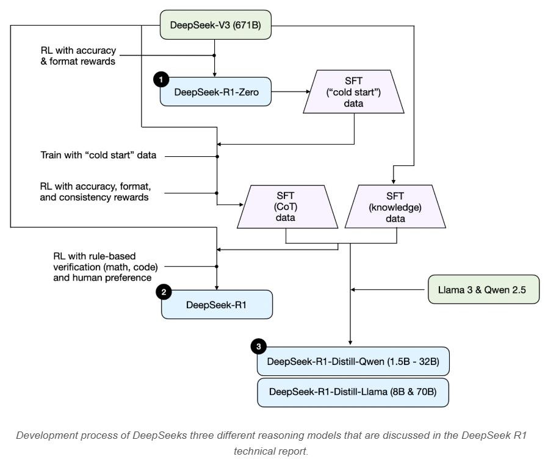

[TOC]

在人工智能飞速发展的当下，大语言模型（LLM）的世界日新月异。从最初的基础模型搭建，到如今百花齐放的各种专业化应用，LLM 的进化速度令人惊叹。今天，咱们就深入探讨其中一个关键领域 —— 推理模型，看看这些模型是如何让 AI 变得更 “聪明”，能处理复杂任务的。

# 1. 推理模型究竟是什么？

在 AI 领域，很多概念的定义都模糊且充满争议，“推理模型” 也不例外。简单来说，推理就是回答那些需要复杂、多步推导才能得出答案的问题。像 “法国的首都是哪里？” 这种能直接给出答案的问题，不涉及推理。但 “火车以每小时 60 英里的速度行驶 3 小时，它行驶了多远？” 就需要推理，得先明白距离、速度和时间的关系，才能算出答案。

普通 LLM 可能只给出简短答案，而推理模型通常会展示中间推理步骤，把思考过程呈现出来。如今所说的推理模型，一般指那些擅长解决谜题、数学证明等复杂推理任务的 LLM，而且很多还会在回答中融入 “思考” 过程。

推理模型的中间步骤呈现方式有两种：一种是像解题步骤一样，直接在回答里展示；另一种是像 OpenAI 的 o1 模型，在内部多次迭代推理，但不把中间步骤给用户看。

# 2. 何时该用推理模型？

推理模型擅长处理复杂任务，比如解谜题、做高等数学题和攻克有挑战性的编程任务。不过，要是任务比较简单，像文本总结、翻译或者基于知识的问答，用推理模型就有点 “杀鸡用牛刀” 了，不仅效率低、成本高，还可能因为 “过度思考” 而出错。所以，选 LLM 就像选工具，得根据任务来。下面这个表格清楚地列出了推理模型的优缺点：

| 擅长方面                           | 不擅长方面                   |
| ---------------------------------- | ---------------------------- |
| 演绎或归纳推理（如解谜、数学证明） | 快速廉价响应（推理时间长）   |
| 思维链推理（分解多步骤问题）       | 基于知识的任务（易产生幻觉） |
| 复杂决策任务                       | 简单任务（易过度思考）       |
| 对新问题的泛化能力更好             | -                            |

# 3. 探秘 DeepSeek 训练流程

在正式了解构建推理模型的方法前，先看看 DeepSeek R1 的训练流程，它可是推理 LLM 发展的典型案例。DeepSeek 推出了三个不同版本的 R1 模型：DeepSeek - R1 - Zero、DeepSeek - R1 和 DeepSeek - R1 - Distill。

下图是根据技术报告中的描述总结的模型开发过程。

DeepSeek - R1 - Zero 基于 2024 年 12 月发布的 6710 亿参数的 DeepSeek - V3 预训练基础模型。它没用常见的监督微调（SFT），而是直接用强化学习（RL），通过准确率奖励和格式奖励，让模型训练。结果很神奇，模型居然自己就有了基本推理能力，开始生成推理过程，这表明纯 RL 也能训练出推理模型。

DeepSeek - R1 在 DeepSeek - R1 - Zero 基础上进一步优化，加入了更多 SFT 阶段和 RL 训练。它先用 DeepSeek - R1 - Zero 生成 “冷启动” SFT 数据，再进行指令微调，接着 RL 训练，还增加了一致性奖励。经过多轮训练，DeepSeek - R1 比 DeepSeek - R1 - Zero 性能提升明显。

DeepSeek - R1 - Distill 则是用大模型生成的 SFT 数据集，对 Llama 和 Qwen 等小模型进行指令微调。这么做一是因为小模型运行效率高、成本低；二是能看看纯 SFT 能把模型提升到什么程度。从实验结果看，蒸馏模型比 DeepSeek - R1 弱，但比 DeepSeek - R1 - Zero 强不少。

# 4. 构建推理模型的四大方法

## 4.1 推理时扩展

推理时扩展，就是在推理时增加计算资源来提高输出质量。就像人思考复杂问题，时间充裕点，答案可能就更靠谱。

推理时间扩展的一种简单方法是巧妙的提示工程。比如思维链（CoT）提示法，在输入提示里加上 “一步一步思考” 这类话，模型就会生成中间推理步骤，复杂问题的回答准确率也会提高。当然，简单问题就没必要用这方法，例如“法国的首都是什么”，这又是一个很好的经验法则，可以找出推理模型对给定的输入查询是否有意义。

除了 CoT 提示法，还能采用投票和搜索策略，像让模型生成多个答案，然后选出现次数最多的；或者用束搜索等算法，选出最佳答案。虽然 DeepSeek R1 技术报告说模型没用推理时扩展，但应用层可能会用，OpenAI 的 o1 和 o3 模型很可能就用了这技术，所以成本相对较高。

## 4.2 纯强化学习（RL）

DeepSeek R1 研究的一大亮点，就是发现推理能通过纯 RL 产生。DeepSeek - R1 - Zero 跳过 SFT 阶段，只用 RL 训练，用准确率奖励和格式奖励，模型就学会了基本推理，还出现了 “顿悟时刻”，自己生成推理痕迹。这证明纯 RL 能训练出推理模型，不过实际应用中，RL + SFT 的组合效果更好。

如前所述，DeepSeek 开发了三种类型的 R1 模型。第一个 DeepSeek-R1-Zero 建立在 DeepSeek-V3 基础模型之上，这是他们于 2024 年 12 月发布的标准预训练 LLM。与典型的 RL 管道不同，在 RL 之前应用监督微调 （SFT），而 DeepSeek-R1-Zero 完全使用强化学习进行训练，没有初始 SFT 阶段，如下图所示。

尽管如此，这种 RL 过程类似于常用的 RLHF 方法，该方法通常应用于偏好调整的 LLM。然而，如上所述，DeepSeek-R1-Zero 的主要区别在于它们跳过了指令优化的监督微调 （SFT） 阶段。这就是为什么将其称为“纯”RL。虽然，LLM 上下文中的 RL 与传统 RL 有很大不同。

对于奖励，没有使用根据人类偏好训练的奖励模型，而是采用了两种类型的奖励：准确性奖励和格式奖励。

- 准确性奖励使用 LeetCode 编译器来验证编码答案，并使用确定性系统来评估数学响应。
- 格式奖励依赖于 LLM 裁判来确保回答遵循预期的格式，例如在标签内放置推理步骤。

令人惊讶的是，这种方法足以让 LLM 培养基本的推理技能。研究人员观察到一个“啊哈”时刻，尽管没有经过明确的训练，但模型开始生成推理轨迹作为其响应的一部分，如下图所示。

虽然 R1-Zero 不是一个性能最好的推理模型，但它确实通过生成中间的 “思考” 步骤来展示推理能力，如上图所示。这证实了使用纯 RL 开发推理模型是可能的，并且 DeepSeek 团队是第一个演示这种方法的人。

## 4.3 监督微调与强化学习（SFT + RL）

DeepSeek - R1 就是 SFT + RL 的成功范例。它用 DeepSeek - R1 - Zero 生成 “冷启动” SFT 数据，经过多轮 SFT 和 RL 训练，加入一致性奖励，还用规则验证和人类偏好进行评估。最终，DeepSeek - R1 性能大幅提升，比 DeepSeek - R1 - Zero 强很多，这也是构建高性能推理模型的关键方法。

在 RL 之前包含一个 SFT 阶段实际上很常见，如标准 RLHF 管道中所示。OpenAI 的 o1 可能是使用类似的方法开发的。

如上图所示，DeepSeek 团队使用 DeepSeek-R1-Zero 生成了他们所谓的“冷启动”SFT 数据。术语“冷启动”是指这些数据是由 DeepSeek-R1-Zero 生成的，而 DeepSeek-R1-Zero 本身没有接受过任何监督微调 （SFT） 数据的训练。

然后，DeepSeek 使用这些冷启动 SFT 数据，通过指令微调来训练模型，然后是另一个强化学习 （RL） 阶段。这个 RL 阶段保留了 DeepSeek-R1-Zero 的 RL 流程中使用的相同准确性和格式奖励。但是，他们添加了一致性奖励以防止语言混合，当模型在响应中的多种语言之间切换时，就会发生这种情况。

RL 阶段之后是另一轮 SFT 数据收集。在此阶段，使用最新的模型检查点生成 600K 思维链 （CoT） SFT 示例，同时使用 DeepSeek-V3 基本模型创建另外 200K 基于知识的 SFT 示例。

然后，这些 600K + 200K SFT 样本用于指令微调 DeepSeek-V3 基础，然后进行最后一轮 RL。在这个阶段，他们再次使用基于规则的方法对数学和编码问题进行准确性奖励，而人类偏好标签则用于其他问题类型。总而言之，这与常规 RLHF 非常相似，只是 SFT 数据包含（更多）CoT 示例。除了基于人类偏好的奖励外，RL 还具有可验证的奖励。

最终模型 DeepSeek-R1 的性能明显优于 DeepSeek-R1-Zero，这要归功于额外的 SFT 和 RL 阶段，如下表所示。

## 4.4 纯监督微调（SFT）与蒸馏

DeepSeek 的蒸馏模型，是用大模型生成的 SFT 数据，微调小模型。虽然和传统知识蒸馏不太一样，但能让小模型有不错的推理能力。蒸馏模型效率高，能在低端硬件上运行，不过它依赖大模型生成数据，很难推动推理模型的创新发展。研究还发现，对于小模型，蒸馏比纯 RL 更有效。

这里的蒸馏是指在由较大的 LLM 生成的 SFT 数据集上对较小的 LLM 进行指令微调，例如 Llama 8B 和 70B 以及 Qwen 2.5 模型（0.5B 到 32B）。具体来说，这些较大的 LLM 是 DeepSeek-V3 和 DeepSeek-R1 的中间检查点。事实上，用于此蒸馏过程的 SFT 数据与用于训练 DeepSeek-R1 的数据集相同，如上一节所述。

下图中突出显示了蒸馏部分

为什么要开发这些蒸馏模型？在我看来，有两个关键原因：

- 模型越小，效率越高。这意味着它们的运行成本更低，但它们也可以在低端硬件上运行，这使得它们对许多研究人员和修补匠特别有趣。
- 纯 SFT 的案例研究。这些提炼的模型是一个有趣的基准，展示了纯监督微调 （SFT） 可以在没有强化学习的情况下使模型走多远。

下表将这些蒸馏模型的性能与其他流行的模型以及 DeepSeek-R1-Zero 和 DeepSeek-R1 进行了比较。

正如我们所看到的，蒸馏的模型明显弱于 DeepSeek-R1，但相对于 DeepSeek-R1-Zero 来说，它们却出奇地强，尽管它们小了几个数量级。与 o1 mini 相比，这些型号的性能也很有趣（我怀疑 o1-mini 本身可能是 o1 的类似蒸馏版本）。

还有一个有趣的比较值得一提。DeepSeek 团队测试了 DeepSeek-R1-Zero 中看到的紧急推理行为是否也可以出现在较小的模型中。为了研究这个问题，他们将 DeepSeek-R1-Zero 的相同纯 RL 方法直接应用于 Qwen-32B。

该实验的结果总结如下表所示，其中 QwQ-32B-Preview 作为基于 Qwen 团队开发的 Qwen 2.5 32B 的参考推理模型。这种比较提供了一些额外的见解，即纯 RL 是否可以单独在比 DeepSeek-R1-Zero 小得多的模型中诱导推理能力。

结果表明，对于较小的模型，蒸馏比纯 RL 有效得多。这与以下观点一致：仅靠 RL 可能不足以在这种规模的模型中诱导强大的推理能力，而在处理小型模型时，基于高质量推理数据的 SFT 可能是一种更有效的策略。

- Qwen-32B 使用 SFT + RL 进行训练，类似于 DeepSeek-R1 的开发方式。这将有助于确定当 RL 与 SFT 联合使用时，与纯 RL 和纯 SFT 相比，可以进行多少改善。
- DeepSeek-V3 使用纯 SFT 进行训练，类似于创建蒸馏模型的方式。这将允许直接比较以了解 RL + SFT 与纯 SFT 相比的有效性。

## 4.5 小结

- 推理时扩展不需要额外的训练，但会增加推理成本，随着用户数量或查询量的增长，大规模部署的成本会更高。尽管如此，它仍然是提高已经很强大的模型的性能的不费吹灰之力。我强烈怀疑 o1 利用了推理时间扩展，这有助于解释为什么与 DeepSeek-R1 相比，它在每个token上的成本更高。
- 纯 RL 对于研究目的很有趣，因为它提供了将推理作为一种紧急行为的见解。然而，在实际模型开发中，RL + SFT 是首选方法，因为它会导致更强大的推理模型。我强烈怀疑 o1 也是使用 RL + SFT 训练的。更准确地说，我相信 o1 从比 DeepSeek-R1 更弱、更小的基础模型开始，但通过 RL + SFT 和推理时间缩放进行补偿。
- 如前所述，RL + SFT 是构建高性能推理模型的关键方法。DeepSeek-R1 是一个很好的蓝图，展示了如何做到这一点。
- 蒸馏是一种有吸引力的方法，尤其是对于创建更小、更高效的模型。然而，限制在于蒸馏不会推动创新或产生下一代推理模型。例如，蒸馏始终依赖于现有的、更强大的模型来生成监督微调 （SFT） 数据。

预计接下来会看到的一个有趣的方面是将 RL + SFT（方法 3）与推理时间缩放（方法 1）相结合。这可能是 OpenAI o1 正在做的事情，只是它可能基于比 DeepSeek-R1 更弱的基础模型，这解释了为什么 DeepSeek-R1 性能如此出色，同时在推理时保持相对便宜。

# 5. DeepSeek R1 与其他模型的对比

不少人都好奇 DeepSeek R1 和 OpenAI 的 o1 谁更厉害。其实两者水平差不多，但 DeepSeek R1 推理时效率更高。OpenAI 没公开 o1 太多细节，像是不是混合专家模型、参数规模多大等都不清楚，所以直接对比两者有点难。而且，DeepSeek R1 训练成本也没公开，之前说的 600 万美元可能是 DeepSeek - V3 的训练成本，不是 R1 的。

# 6. 低预算下的推理模型开发

开发像 DeepSeek R1 这样的推理模型，成本很高，动不动就要几十万甚至上百万美元，这让预算有限的研究人员很头疼。但别灰心，模型蒸馏提供了更经济的选择。DeepSeek 的蒸馏模型就证明了小模型也能有不错的推理性能。还有 Sky - T1 项目，用 1.7 万个 SFT 样本就训练出一个 320 亿参数的模型，成本只要 450 美元，性能还和 o1 差不多。

在纯 RL 领域，TinyZero 项目也很亮眼。它是一个 30 亿参数的模型，模仿 DeepSeek - R1 - Zero 的方法，训练成本不到 30 美元，还展现出自我验证能力，说明小模型用纯 RL 也能有推理能力。

另外，“Journey Learning” 这个新方法也值得关注。它和传统的 “Shortcut learning” 不同，在监督微调数据里加入错误的解题路径，让模型从错误中学习，增强自我纠错能力，这对低预算开发推理模型来说，是个很有潜力的方向。

如今，推理模型领域发展迅速，新研究、新成果不断涌现。无论是构建方法的创新，还是在低预算下的探索，都让我们看到这个领域的无限可能。

