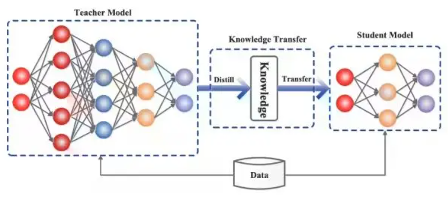
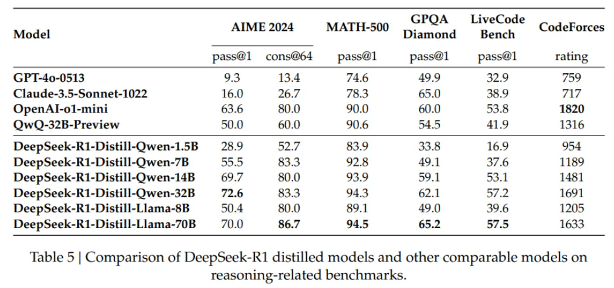

[TOC]

## 1. 什么是 LLM 蒸馏？

LLM 蒸馏是一种能让大语言模型 “轻装上阵” 的训练技术。打个比方，就像一位知识渊博的老教授（教师模型）把毕生所学倾囊相授给年轻学生（学生模型）。在 AI 世界里，就是把大而复杂的模型（像 GPT-4o）的行为和知识，传递给小而高效的模型（比如 GPT-4o mini）。这样一来，小模型既能保留大模型的核心能力，还能更灵活地 “工作”，减少计算资源的消耗，在各种设备上都能快速运行。

## 2. 为什么选择 LLM 蒸馏？

现在的 LLM 越来越庞大，计算需求也水涨船高。运行这些模型需要高性能硬件，能耗也大得惊人，这就导致它们在一些资源受限的地方，比如手机、边缘计算设备上很难施展拳脚。而 LLM 蒸馏技术生成的小模型，推理速度快，存储需求小，计算成本低，不仅能在更多设备上运行，还让先进的 AI 技术走进了更多人的生活，像聊天机器人、实时翻译这些应用，都离不开它。

## 3. LLM 蒸馏工作原理？

### 3.1 教师 - 学生范式

这是 LLM 蒸馏的核心。教师模型通常是经过大量训练、性能超强的先进模型，是知识的 “富矿”。学生模型则努力模仿教师模型的行为，学习它处理各种输入时的预测、调整和响应方式，在这个过程中不断优化自己，虽然身材小巧，但能力可不弱，能在资源有限的环境中出色完成任务。

### 3.2 蒸馏技术

- **知识蒸馏（KD）**：这是 LLM 蒸馏的 “明星” 技术。在训练学生模型时，除了使用真实标签（硬目标），还会用到教师模型的输出概率（软目标）。软目标就像是教师给出的详细解题思路，展示了各种可能结果的概率分布，让学生模型能捕捉到教师模型回答里隐藏的微妙信息，训练过程更高效，效果也更好。
- **数据增强**：利用教师模型生成更多训练数据，丰富学生模型的 “学习素材”，让它接触到更多场景和例子，这样学生模型的泛化能力就更强了，遇到新问题也能应对自如。
- **中间层蒸馏**：不只是关注教师模型的最终输出，还把中间层的知识传递给学生模型。就好比学习不只要知道答案，还要了解解题的中间步骤，学生模型通过学习这些中间表示，能获取更详细、更结构化的信息，整体性能也就提升了。
- **多教师蒸馏**：让学生模型向多个教师模型学习，就像跟不同风格的老师学习，能吸收各方的优点，获得更全面的知识，鲁棒性也更强。

## 4. LLM 蒸馏的优点

- **减少模型大小**：蒸馏后的模型体积大幅减小，推理速度就像装上了小马达，更快了；占用的存储空间也少了，在存储资源紧张的情况下，管理起来更轻松。
- **提高推理速度**：小模型的优势在实时应用中体现得淋漓尽致，像聊天机器人、虚拟助手，能快速响应用户的问题，给用户带来流畅的体验。在资源受限的设备上也能稳定运行，不卡顿。
- **降低计算成本**：无论是在云环境中，还是本地部署，小模型对硬件要求没那么高，能耗和维护费用都能省不少钱。
- **更广泛的可访问性和部署**：蒸馏后的 LLM 可以在移动设备、边缘设备上部署，让 AI 功能无处不在。在医疗、金融、教育等众多行业，都能看到它的身影，推动了各行业的智能化发展。

## 5. 如何实现 LLM 蒸馏

### 5.1 备选框架

- **Hugging Face transformers**：它里面的 Distiller 类，能简化知识从教师模型到学生模型的转移过程，是很多开发者的首选。
- **TensorFlow 模型优化**：提供多种工具，模型修剪、量化和蒸馏都不在话下，功能超强大。
- **PyTorch distiller**：专为深度学习模型压缩设计，对蒸馏过程的管理和模型效率提升很有一套。
- **DeepSpeed**：微软开发的这个库，在大型模型训练和部署方面表现出色，也支持模型蒸馏。

### 5.2 步骤

- **数据准备**：准备好有代表性的数据集，这是学生模型学习的基础，能帮助它更好地泛化。
- **教师模型选择**：选一个在目标任务上表现优秀的预训练模型当教师，它的质量直接影响学生模型的 “成长”。
- **蒸馏过程**：初始化学生模型，配置好训练环境，用教师模型生成软标签，和硬标签一起训练学生模型。

### 5.3 常用评估指标

- **准确度**：衡量学生模型预测的准确程度。
- **推理速度**：看模型处理输入和生成输出有多快。
- **模型大小**：对比蒸馏前后模型大小，评估存储和计算效率的提升。
- **资源利用率**：监控模型推理时的资源消耗，确保符合部署环境的要求。

## 6. LLM 蒸馏：挑战与最佳实践

### 6.1 知识损失

蒸馏时，学生模型可能无法完全学到教师模型的所有知识，在一些对专业知识要求高的任务中，就会影响性能。可以通过中间层蒸馏、数据增强、迭代蒸馏这些方法，尽量减少知识损失。

### 6.2 超参调优

像温度和学习率这些超参数，对学生模型的学习效果影响很大。温度控制概率分布的平滑度，温度高，学生模型能学到更全面的知识；学习率要调整好，才能让模型训练又快又稳，不出现过拟合或欠拟合的情况。

### 6.3 评估效果

要对比学生模型和教师模型、其他基准模型的性能，从准确性、推理速度、模型大小、资源利用率等方面评估，看看蒸馏后的模型到底有没有达到预期。

### 6.4 最佳实践

- **实验**：多尝试不同的蒸馏技术和超参数设置，找到最适合自己任务的方案。
- **持续评估**：定期用相关基准和数据集测试学生模型，不断优化。
- **平衡训练**：合理结合软标签和硬标签训练，让学生模型既准确又能学到细节知识。
- **定期更新**：关注 LLM 蒸馏领域的最新研究成果，及时应用新技术。

## 7. DeepSeek - R1 的蒸馏模型

DeepSeek 用 Qwen 和 Llama 架构创建了一系列蒸馏模型。基于 Qwen 的模型在性能和计算需求之间取得了平衡，处理数学任务表现不错，但编程能力还有提升空间；基于 Llama 的模型在数学和事实推理任务中表现优异，大尺寸的 Llama - 70B 在编程任务上也有很强的竞争力。

