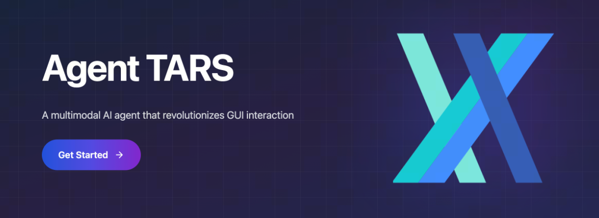

```
https://agent-tars.com/
github: https://github.com/bytedance/UI-TARS-desktop/tree/main
```

[TOC]

在科技飞速发展的今天，人机交互方式不断革新。你是否幻想过，只需用自然语言就能轻松控制电脑，完成各种复杂操作？今天要给大家介绍的 UI-TARS Desktop，就为我们带来了这样的新体验！



# 1. UI-TARS Desktop 闪亮登场

UI-TARS Desktop 是一款基于 [UI-TARS (Vision-Language Model)](https://github.com/bytedance/UI-TARS) 的 GUI 代理应用程序。它就像一个聪明的小助手，能让你用自然语言来控制电脑，仿佛在和一位贴心的朋友交流，而不是面对冷冰冰的机器。

2025 年 3 月 18 日，团队发布了一款新桌面应用程序 Agent TARS 的技术预览版。这是一个多模态人工智能代理，它可以通过视觉解释网页，并与命令行和文件系统无缝集成，进一步拓展了 UI-TARS Desktop 的应用场景。

# 2. 超炫的展示案例

为了让大家更直观地感受 UI-TARS Desktop 的强大，这里有几个精彩的展示案例：

- **获取旧金山当前天气**：只需告诉它 “获取旧金山当前天气”，它就能自动打开网页浏览器，帮你获取相关信息。就像变魔术一样，轻松又便捷。
- **发送推特**：当你说 “发送一条内容为‘hello world’的推特”，它会迅速在推特平台上完成内容输入和发送操作，一切都那么自然流畅。

# 3. 强大功能大揭秘

- **自然语言控制**：借助视觉语言模型，你可以像和人聊天一样对电脑下达指令，无需复杂的代码或操作步骤。
- **截图与视觉识别**：它能识别屏幕上的内容，为精准操作提供依据。比如在处理图片、文档等内容时，能快速定位关键信息。
- **精准的鼠标和键盘控制**：无论是点击、输入还是滚动等操作，都能准确执行，就像你亲自操作一样。
- **跨平台支持**：无论是 Windows 还是 MacOS 系统，它都能完美适配，让不同系统的用户都能享受到便捷的操作体验。
- **实时反馈与状态显示**：在操作过程中，它会及时反馈操作结果和当前状态，让你随时了解任务进展。
- **安全私密**：所有处理都在本地进行，不用担心信息泄露问题，让你的数据安全无忧。

# 4. 轻松上手与部署

如果你想体验 UI-TARS Desktop 的魅力，操作也非常简单。

- **快速开始**：详细的 快速开始指南 会一步步引导你完成安装和基本设置，让你迅速开启新的操作体验。
- **部署方法**：如果你有更深入的使用需求，部署指南 会为你提供详细的部署方案，无论是本地部署还是云部署，都能找到适合自己的方式。


