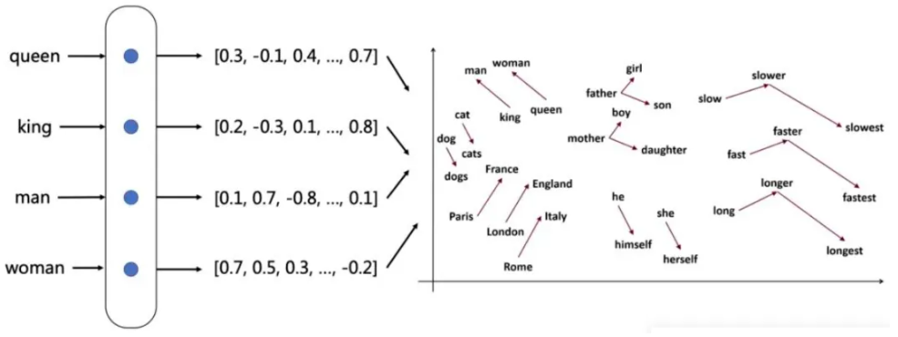
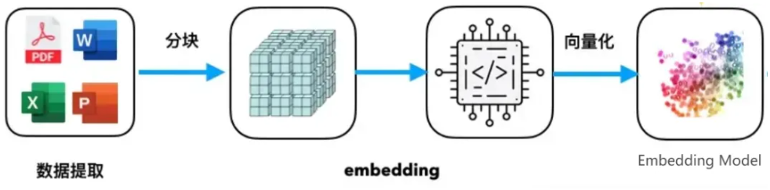
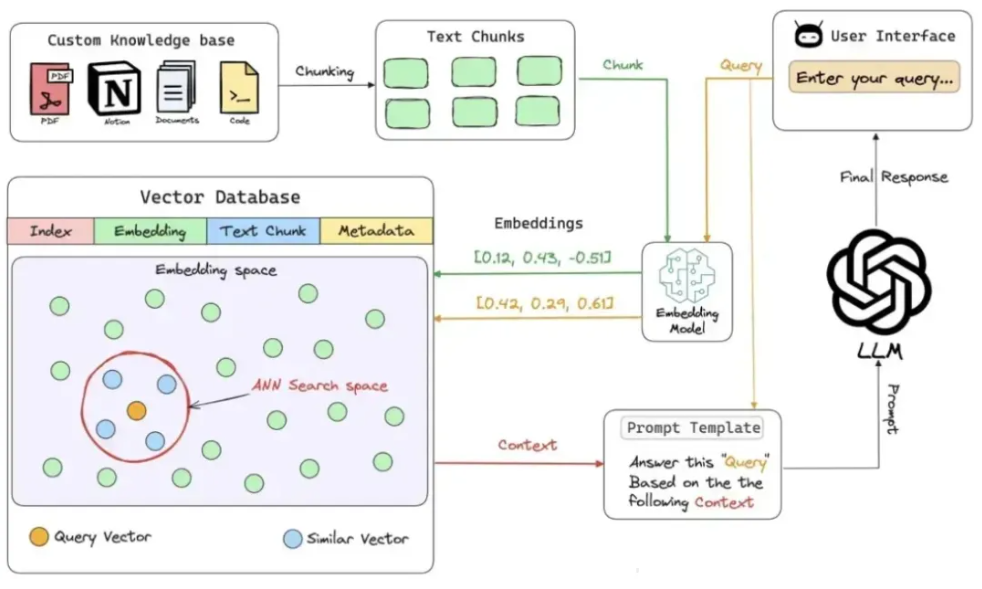

[TOC]

在当今人工智能的浪潮中，RAG（检索增强生成）技术大放异彩，像是 RAGFlow、Qanything、Dify、FastGPT 等 RAG 引擎，逐渐走进大家的视野。在这些强大的 RAG 引擎背后，有一个关键组件起着不可或缺的作用，它就是嵌入模型（Embedding Model）。今天，就让我们一起深入了解一下这个神秘的嵌入模型吧！

# 1. Embedding 究竟是什么？

在了解嵌入模型之前，得先搞清楚 Embedding 的概念。简单来说，Embedding 是一种 “神奇魔法”，能把离散的非结构化数据，比如文本里的单词、句子或者整篇文档，转化成连续向量。

在自然语言处理（NLP）领域，它的作用尤为突出。计算机 “看不懂” 文本内容，而 Embedding 就负责把文本变成固定长度的实数向量，让计算机能够理解和处理。

比如说 “人骑自行车” 这句话，计算机面对 “人”“骑”“自行车” 这些文字时一脸茫然，但经过 Embedding 的 “加工”，“人” 可以表示为 [0.2, 0.3, 0.4] ，“骑” 表示为 [0.5, 0.6, 0.7] ，“自行车” 表示为 [0.8, 0.9, 1.0] 。有了这些向量，计算机就能大显身手了，它可以分析 “人” 和 “自行车” 之间的关系，判断 “骑” 这个动作和它们的关联性。

而且，Embedding 还能帮助计算机处理自然语言里复杂的关系。像 “人” 和 “骑手” 这种相似的词，在向量空间里就离得很近；而 “人” 和 “汽车” 不相似，在向量空间里就离得很远。这是为什么呢？因为计算机只认识数字，把文本转化成向量，就相当于给数据在数学空间里找了个 “地址”，计算机处理起来就更高效啦。

# 2. Embedding Model 揭秘

在自然语言处理中，嵌入模型（Embedding Model）是将词语、句子或文档转换成数字向量的技术。它就像一个 “指纹生成器”，给每个词或句子分配一个独特的 “指纹”，这个 “指纹” 就是在数学空间里表示它们含义的固定长度数字向量。

借助这个模型，计算机能对文本进行各种数学计算。比如计算两个词语向量之间的距离（像余弦相似度），就能知道它们在语义上有多相似；把句子里所有词语向量聚合起来（求平均值或者加权和），就能得到整个句子的向量表示，进而分析句子的语义信息。

嵌入模型在很多 NLP 任务中都有重要应用：

- **语义搜索**：输入 “如何制作披萨？”，系统通过计算查询向量和文档库中各文档向量的相似度，就能找到最相关的烹饪指南。
- **情感分析**：面对 “这款手机性能出色，但电池续航一般” 这样的产品评论，系统能分析出整体是正面评价，但也有负面因素。
- **机器翻译**：输入 “我喜欢猫”，系统能把它翻译成英文 “I like cats”。
- **问答系统**：提问 “太阳有多大？”，系统借助嵌入模型找到相关天文学文档，给出详细回答。
- **文本分类**：根据内容向量表示，把新闻文章自动分类成政治、体育、科技等类别。
- **命名实体识别（NER）**：在 “李华在北京大学学习” 这句话里，能识别出 “李华” 是人名，“北京大学” 是组织名。

# 3. 嵌入模型在 RAG 引擎中的关键作用

在 RAG 引擎里，嵌入模型可是 “顶梁柱”，主要有以下这些作用：

- **文本向量化**：把用户的问题和大规模文档库中的文本都转化为向量。比如用户问 “如何制作意大利面？”，嵌入模型就把这个问题变成高维向量。
- **信息检索**：用用户的查询向量在文档库的向量表示里找最相似的文档。RAG 引擎计算问题向量和文档库中每个文档向量的相似度，返回和制作意大利面步骤相关的文档。
- **上下文融合**：把检索到的文档和用户问题结合，形成新的上下文，用于生成回答。关于意大利面的文档被嵌入模型转成向量后，和问题向量一起作为上下文，输入到生成模型里。
- **生成回答**：生成模型利用融合后的上下文，生成连贯、准确的回答。RAG 引擎结合问题和检索到的文档，生成详细的意大利面制作指南。
- **优化检索质量**：通过微调嵌入模型，提升检索的相关性和准确性。在医学或法律这些特定领域使用 RAG 引擎时，可以用领域特定数据微调嵌入模型，让检索结果更靠谱。
- **多语言支持**：在多语言环境下，嵌入模型能处理不同语言的文本。用户用中文提问，文档库是英文内容，嵌入模型要把两种语言的文本都转化到统一的向量空间，方便检索。
- **处理长文本**：把长文本分割成多个片段，给每个片段生成 Embedding，提高检索效率。长篇文章或报告可以被分成多个部分，每个部分都生成向量，还不会损失太多语义信息。

从 RAG 引擎的工作流（查询嵌入化、向量数据库查询、检索相关上下文、上下文融合、生成回答）中也能看出，嵌入模型处于核心位置，它就像一座桥梁，连接着用户查询和大量文本数据，让信息检索和文本生成得以实现。

