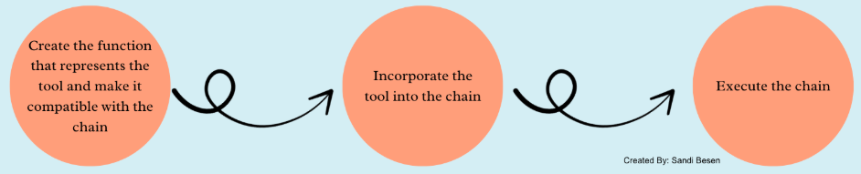
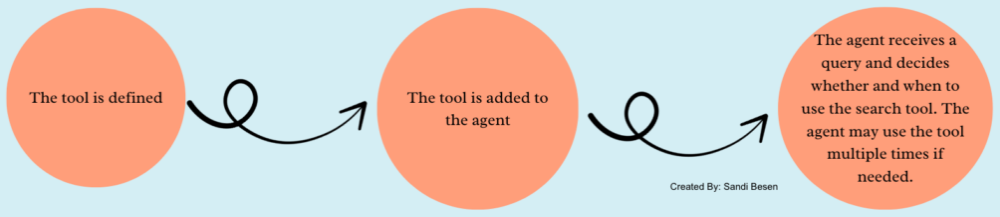
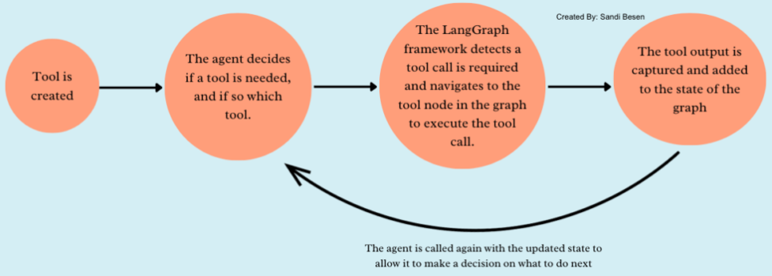
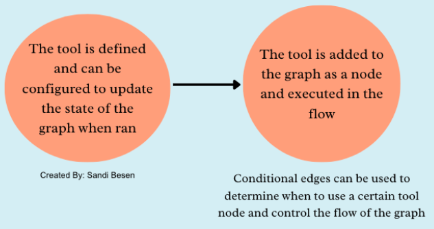

```
原文链接：https://towardsdatascience.com/ai-agent-workflows-a-complete-guide-on-whether-to-build-with-langgraph-or-langchain-117025509fa0/
```

[TOC]

无论是个人开发者还是企业团队，在借助大语言模型（LLM）开发有趣又有价值的应用时，“用什么工具” 往往是最先面临的技术难题。今天，咱们就深入探讨两款构建 LLM 应用的热门框架 ——LangChain 和 LangGraph，帮你拨开迷雾，做出最适合的选择！

当下，生成式 AI 领域发展迅猛，新框架、新技术层出不穷。所以大家阅读本文时要注意，文中信息可能会随着时间推移而变化哦！


# 1. LangChain 和 LangGraph 基础组件大揭秘

想要深入了解这两款框架的差异，先得熟悉它们的基础组件。下面的介绍虽然不是全部组件，但足以帮你把握二者的核心区别。

## 1.1 LangChain：线性与灵活并存

- **Chain（链）**：它就像是一条生产线，把调用 LLM、Agent、工具、外部数据源、过程式代码等步骤按顺序组合起来。而且，链还能像树枝一样分支，根据逻辑条件走向不同路径，处理复杂任务也不在话下。
- **Agent 或 LLM**：LLM 负责生成自然语言回复。而 Agent 更厉害，它以 LLM 为基础，增添了推理、调用工具的能力，工具调用失败时还会自动重试，就像给 LLM 配上了智能助手。
- **Tool（工具）**：工具是能在链中调用或由 Agent 触发的代码函数，专门用来和外部系统交互，比如访问数据库、调用 API 等。
- **Prompt（提示词）**：提示词包含系统提示词、外部数据源注入信息、用户输入任务。系统提示词指导模型工作并告知可用工具；外部信息提供更多上下文；用户任务则明确模型的目标。

## 1.2 LangGraph：以图为核心的强大架构

- **Graph（图）**：从名字就能看出，LangGraph 用图来组织工作流。它可以调用 LLM、工具等各种组件，还支持循环图，能创建循环和反馈机制，多次访问某些节点，应对复杂场景超给力。
- **Node（节点）**：节点代表工作流中的一个个具体步骤，比如发起 LLM 查询、调用 API、执行工具等。
- **Edge（边）和 Conditional Edge（条件边）**：边负责连接节点，让信息从一个节点流向另一个节点。条件边更智能，只有满足特定条件时，信息才会流动，开发者还能自定义这些条件。
- **State（状态）**：State 是应用程序的实时 “状态监视器”，随着信息在图中流动而更新。它是开发者定义的可变对象，包含对话历史、任务步骤、模型输出等重要信息，而且能在节点间传递。
- **Agent 或 LLM**：图中的 LLM 专注于生成文本响应。Agent 则由多个节点协作，负责推理、选择工具、执行工具等，还能决定工作流走向、更新状态，功能十分强大。

# 2. 核心功能处理差异大比拼

## 2.1 工具调用：方式各有千秋

- **LangChain**：调用方式取决于使用场景。在链中，工具是预定义步骤，不一定由 Agent 调用；不在链中的 Agent 自主性强，能按需选择工具。
- **LangGraph**：工具一般是图上的节点。有 Agent 时，Agent 根据推理选工具，工作流跳转到对应节点执行，节点间的边还能加条件逻辑；没有 Agent 时，类似 LangChain 链中的工具调用方式。

链方式的流程示例：



Agent 方式的流程示例：



包含 Agent 的图流程示例：



没有 Agent 的图的流程示例：



## 2.2 对话历史和记忆：存储各有高招

- **LangChain**：内置多种记忆管理方式，能选择完整会话历史、摘要版本或自定义记忆，还支持自定义长期记忆系统，把对话历史存到外部数据库。
- **LangGraph**：靠 State 记录变量来管理记忆，信息在节点间传递。但它本身没有跨会话长期记忆功能，需要开发者添加特定节点来实现。

## 2.3 开箱即用的 RAG 能力：LangChain 更胜一筹？

- **LangChain**：对 RAG 工作流的支持很成熟，提供文档加载、文本解析、Embedding 生成、向量存储、检索等功能，使用相关 API 就能轻松集成。
- **LangGraph**：RAG 功能需要开发者自己设计，在图结构里添加相应节点，用边连接并传递信息来实现。

## 2.4 并行处理：都有独特优势

- **LangChain**：用 RunnableParallel 类实现基本并行处理，高级的并行计算和异步工具调用得借助 Python 库自己实现。
- **LangGraph**：只要节点间没依赖关系，就能并行执行，多个 Agent 也能同时运行。还能用 RunnableParallel 运行多个 Graph，借助 asyncio 库并行调用工具。

## 2.5 重试逻辑和错误处理：LangGraph 别出心裁

- **LangChain**：错误处理由开发者明确设置，在链或 Agent 里添加重试逻辑。
- **LangGraph**：把错误处理设计成独立节点，任务失败时，可跳转到其他节点或当前节点重试，只重试失败节点，不用重启整个工作流。

# 3. 何时选择 LangChain、LangGraph？

看完上面的对比，大家肯定迫不及待想知道该怎么选了吧？虽然没有绝对标准，但可以参考下面的建议：

- **只用 LangChain 的情况**：当你需要快速搭建线性任务的 AI 工作流，比如文档检索、文本生成、摘要等，或者想利用 AI Agent 动态决策，但不需要精细控制复杂流程时，LangChain 就是你的好帮手。它学习成本低，预定义配置多，能让你快速上手。
- **只用 LangGraph 的情况**：如果应用场景涉及非线性工作流，多个组件需要动态交互，还需要条件判断、复杂分支逻辑、错误处理或并行执行，而且你愿意自己实现一些功能，那么 LangGraph 更适合你。它能灵活定制工作流，满足复杂需求。
- **LangChain 和 LangGraph 一起用的情况**：要是你既想利用 LangChain 现成的 RAG 组件、对话记忆等功能，又想用 LangGraph 的非线性编排能力管理复杂任务流，二者结合就能发挥最大优势，打造出超强大的 AI 工作流。

LangChain 和 LangGraph 各有所长，具体怎么选，关键看项目的实际需求。


