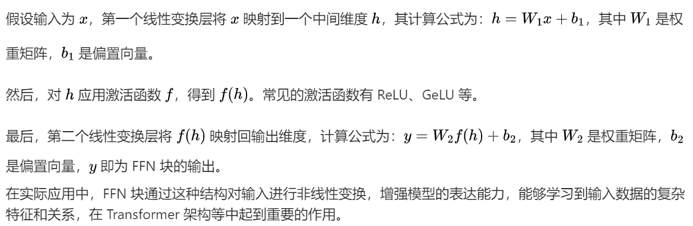

### 1. ReAct 有什么优点？

ReAct 是一种将推理（Reasoning）和行动（Action）相结合的框架，用于增强语言模型在复杂任务中的表现。

优点：

- **结合推理与行动**：通过让模型生成推理步骤和相应的行动（如调用外部工具），能够更好地解决需要多步推理和与外部环境交互的任务，提高问题解决的准确性和效率。
- **增强可解释性**：推理步骤的生成使得模型的决策过程更加透明，有助于用户理解模型是如何得出最终答案的，相比传统的黑盒模型，在一定程度上提升了可解释性。
- **提高泛化能力**：能够利用外部工具和知识，使模型在面对新领域或复杂任务时，借助外部资源进行处理，减少对大规模预训练数据中特定知识的依赖，从而增强泛化能力。

### 2. 解释一下 langchain Agent 的概念

langchain Agent 是 langchain 框架中的一个重要组件。它可以被看作是一个能够自主决策和执行任务的智能体。

具体来说，Agent 能够根据给定的任务和输入，利用 langchain 提供的各种工具（如搜索引擎、数据库查询工具等）以及语言模型的能力，通过一系列的决策步骤来完成任务。例如，在回答一个需要查询最新新闻资讯的问题时，Agent 可以决定调用搜索引擎工具来获取相关信息，然后对获取到的信息进行分析和总结，最终生成回答。它能够在不同的工具和语言模型之间进行协调和交互，以实现复杂任务的自动化处理，为用户提供更智能、高效的解决方案。

### 3. langchain 有哪些替代方案？

一些 langchain 的替代方案包括：

- **Hugging Face Transformers**：提供了丰富的预训练模型和工具，用于自然语言处理任务，如文本分类、生成等。它具有简单易用的 API，支持多种深度学习架构，并且在模型训练和微调方面有强大的功能。
- **AllenNLP**：是一个用于自然语言处理的深度学习框架，提供了一系列的工具和模型，用于处理各种 NLP 任务，如命名实体识别、语义角色标注等。它具有高度的可定制性和扩展性，适合进行深入的研究和开发。
- **PyTorch Lightning**：虽然不是专门针对自然语言处理的 langchain 替代方案，但它是一个用于简化 PyTorch 模型训练和部署的框架。在自然语言处理任务中，可以利用它来构建和训练模型，提高开发效率，尤其是在处理大规模数据集和复杂模型架构时具有优势。

### 4. langchain token 计数有什么问题？如何解决？

问题：

- **不同模型和工具的不一致性**：不同的语言模型和工具对 token 的定义和计数方式可能存在差异，这导致在使用 langchain 进行多模型或多工具集成时，难以准确统一地计算 token 数量。
- **复杂任务中的计数困难**：在涉及多个步骤和不同类型输入输出的复杂任务中，准确跟踪和计算 token 的使用情况变得复杂，例如在生成文本并对其进行后续处理的任务中，难以精确统计每个环节的 token 消耗。

解决方法：

- **统一标准和工具**：使用一些通用的 token 化工具，如 Hugging Face 的 tokenizers，确保在整个 langchain 工作流程中采用一致的 token 化方法和计数规则。
- **自定义计数逻辑**：根据具体的任务和模型组合，开发自定义的函数来精确计算 token 数量。在复杂任务中，可以在每个关键步骤后记录和累加 token 使用量，通过对任务流程的深入分析和代码层面的精细控制，实现更准确的 token 计数。

### 5. LLM 预训练阶段有哪几个关键步骤？

LLM 预训练阶段的关键步骤包括：

- **数据收集与预处理**：收集大规模的文本数据，来源广泛，如互联网文本、书籍、新闻文章等。然后对数据进行清洗、分词、标记化等预处理操作，使其符合模型输入的要求。例如，去除噪声数据、将文本分割成单词或子词单元，并为每个单元分配唯一的标识符。
- **模型架构选择**：确定适合的神经网络架构，如 Transformer 架构及其变体。这些架构通常包含多个层，如多头注意力层、前馈神经网络层等，用于对输入文本进行特征提取和建模。
- **参数初始化**：对模型的参数进行初始化，通常采用随机初始化或基于特定分布的初始化方法，为模型的训练提供一个初始的起点。
- **训练过程**：使用大规模的计算资源，通过优化算法（如随机梯度下降及其变体）最小化预定义的损失函数。在训练过程中，模型不断学习输入文本中的语言模式和语义信息，调整参数以提高对文本的理解和生成能力。例如，在预测下一个单词的任务中，通过最小化预测误差来更新参数。

### 6. RLHF 模型为什么会表现比 SFT 更好？

RLHF（Reinforcement Learning from Human Feedback）比 SFT（Supervised Fine-Tuning）表现更好的原因主要有以下几点：

- **利用人类反馈进行优化**：RLHF 能够整合人类的偏好和反馈信息，通过奖励模型引导语言模型的训练，使其生成更符合人类期望的文本。相比之下，SFT 主要依赖于有监督的微调数据，可能无法充分捕捉人类的主观偏好和复杂的语言使用场景。
- **增强泛化能力**：RLHF 中的强化学习过程促使模型在不同的任务和情境下进行探索和学习，有助于提高模型的泛化能力，使其能够更好地应对未见过的输入和任务，而 SFT 可能在新场景下的适应性相对较弱。
- **动态调整策略**：RLHF 可以根据奖励信号动态调整模型的生成策略，不断优化生成结果，而 SFT 的调整相对较为固定，基于给定的标注数据进行有限的参数更新。

### 7. 参数高效的微调（PEFT）有哪些方法？

常见的参数高效的微调方法包括：

- **LoRA（Low-Rank Adaptation）**：通过在原始模型的基础上添加低秩矩阵来调整模型参数，只需要训练这些低秩矩阵，大大减少了可训练参数的数量，同时在一定程度上保持了模型的性能。例如，在 Transformer 模型中，可以在注意力层或前馈层添加低秩适配模块。
- **Adapter Tuning**：在模型的特定层插入小型的适配器模块，这些适配器模块在微调过程中进行训练，而原始模型的大部分参数保持固定。不同的适配器可以针对不同的任务或领域进行设计和训练，实现高效的参数利用和任务特定的优化。
- **Prefix Tuning**：在模型输入的前面添加可学习的前缀向量，通过调整这些前缀向量来影响模型的输出，在不改变原始模型结构的情况下实现微调，减少了对大量模型参数的调整需求。

### 8. LORA 微调相比于微调适配器或前缀微调有什么优势？

LORA 微调的优势如下：

- **低秩矩阵的高效性**：LORA 使用低秩矩阵来捕捉模型的变化，相比其他方法在参数数量上具有更大的优势。它可以在保持模型性能的同时，显著减少可训练参数的数量，降低了计算资源和存储需求。例如，在大规模语言模型中，LORA 可以在不占用过多 GPU 内存的情况下进行有效的微调。
- **灵活性和兼容性**：LORA 可以方便地应用于不同的模型架构和层，具有较好的灵活性和兼容性。它可以在不改变原始模型结构的基础上进行添加和训练，易于与现有的模型训练和部署流程相结合。
- **相对简单的实现**：LORA 的实现相对较为简单，不需要对模型结构进行复杂的修改或添加大量的额外模块，降低了开发和调试的难度，使得研究人员和开发者能够更快速地应用和实验。

### 9. 什么是稀疏微调？

稀疏微调是一种在模型微调过程中，只对模型参数的一个子集进行更新的方法。

具体来说，通过某种策略（如基于参数的重要性、梯度信息或特定的稀疏化算法）选择一部分参数进行调整，而将其他参数固定。这样可以减少微调过程中的计算量和内存需求，同时在一定程度上保持模型的性能。例如，可以利用稀疏矩阵技术来表示和处理被选择的参数，避免对整个参数矩阵进行操作。在一些研究中，通过分析模型在预训练阶段的参数敏感度或梯度分布，确定对模型性能影响较大的参数进行稀疏微调，从而在资源有限的情况下实现有效的模型优化。

### 10. 训练后量化（PTQ）和量化感知训练（QAT）有什么区别？

区别如下：

- 时机和方式：
  - **训练后量化（PTQ）**：是在模型训练完成后对模型的权重进行量化操作。它主要基于已训练好的模型参数，通过一些统计方法（如计算权重的最小值、最大值或直方图信息）来确定量化参数（如量化范围和量化步长），然后将权重转换为较低精度的数据表示形式（如 int8）。
  - **量化感知训练（QAT）**：在模型训练过程中就考虑量化的影响。通过在训练过程中模拟量化操作，将量化误差反向传播到模型参数中，使得模型在训练过程中逐渐适应量化带来的精度损失，从而在最终量化后的模型中获得更好的性能。
- 性能和精度：
  - 一般情况下，QAT 能够在量化后获得比 PTQ 更高的精度，因为它在训练过程中对量化进行了优化。但 QAT 需要在训练过程中增加额外的计算和时间成本来处理量化模拟和误差反向传播。
  - PTQ 相对简单快速，但可能会导致一定程度的精度损失，尤其是在对精度要求较高的任务中。不过，对于一些对精度要求不是特别苛刻的应用场景，PTQ 可以作为一种有效的模型压缩和加速方法。

### 11. LLMs 中，量化权重和量化激活的区别是什么？

在 LLMs 中：

- **量化权重**：是指对模型的权重参数进行量化操作。权重是模型在训练过程中学习到的固定参数，量化权重的目的是减少模型存储所需的空间和计算过程中的内存占用。例如，将 32 位的浮点数权重转换为 8 位的整数表示，通过合适的量化算法和映射关系，在尽量保持模型性能的前提下降低权重数据的精度和存储空间。
- **量化激活**：是对模型在推理或训练过程中的激活值进行量化。激活值是模型在处理输入数据时动态产生的中间结果，量化激活主要是为了减少计算过程中的内存带宽需求和加速计算。与量化权重不同，激活值在每次输入数据时都会发生变化，因此量化激活需要考虑在不影响模型计算流程和性能的情况下，如何有效地对这些动态变化的值进行量化处理，通常需要结合特定的硬件和算法进行优化。

### 12. AWQ 量化的步骤是什么？

AWQ（Activation-aware Weight Quantization）量化的主要步骤如下：

- **权重分析与分组**：首先对模型的权重进行分析，根据权重的分布和重要性等因素将其划分为不同的组。这一步骤有助于确定哪些权重可以进行更激进的量化，哪些需要相对保守的处理，以平衡量化后的模型性能和精度。
- **激活感知量化**：考虑模型在运行过程中的激活值分布情况，结合权重分组信息，为每个权重组确定合适的量化参数（如量化范围和量化步长）。通过分析激活值与权重之间的相互作用，使得量化后的权重在与激活值进行计算时能够尽量减少精度损失，提高量化模型的整体性能。
- **量化与微调（可选）**：根据确定的量化参数对权重进行量化操作，将其转换为较低精度的表示形式。在某些情况下，为了进一步恢复因量化导致的性能损失，可能会对量化后的模型进行少量的微调，通过在量化后的模型上进行少量的训练迭代，调整量化后的权重，使其更好地适应量化后的计算环境。

### 13. 介绍一下 GPipe 推理框架

GPipe 是一种用于加速深度学习模型推理的框架。

它的主要原理是将模型划分为多个阶段，并在多个设备（如 GPU）上并行执行这些阶段。在推理过程中，输入数据被分割成多个微批次，每个微批次在不同的阶段上依次进行处理。当一个微批次在某个阶段处理完成后，它可以立即传递到下一个阶段，而不需要等待整个批次的处理完成，从而实现了流水线式的并行计算。通过这种方式，GPipe 能够充分利用多个设备的计算资源，减少模型推理的延迟，提高推理速度。例如，在一个大型的语言模型推理中，将模型的不同层分配到不同的 GPU 上，每个 GPU 负责处理一部分层的计算，微批次数据在这些 GPU 之间快速流动，实现高效的推理过程。

### 14. 矩阵乘法如何做数量并行？

矩阵乘法的数量并行可以通过以下方式实现：

- **数据并行**：将输入矩阵划分为多个子矩阵，在多个计算单元（如 GPU 核心或 CPU 线程）上同时对这些子矩阵进行乘法运算。例如，在 GPU 上，可以利用其大规模的并行计算能力，将矩阵的行或列分割成多个块，每个块在不同的线程或核心上进行计算，最后将结果进行合并。这种方式可以充分利用硬件的并行性，加速矩阵乘法的计算过程。
- **模型并行**：对于非常大的矩阵乘法，当单个计算单元无法容纳整个矩阵时，可以将矩阵乘法的计算过程在多个计算单元之间进行分割。例如，将一个大型矩阵乘法分解为多个较小的矩阵乘法操作，每个操作在不同的计算单元上执行，然后通过通信机制（如 MPI 或 GPU 间的高速通信链路）协调和合并结果。这种方法在分布式计算环境或多 GPU 系统中非常有效，可以处理超出单个设备内存和计算能力的大规模矩阵乘法任务。

### 15. 请简述 TPPO 算法流程，它跟 TRPO 区别是什么？

TPPO（Trust Region Policy Optimization）算法流程如下：

- **策略网络和价值网络初始化**：首先初始化策略网络（用于生成行动）和价值网络（用于评估状态价值）的参数。
- **收集样本**：利用当前的策略网络在环境中进行交互，收集一系列的样本数据，包括状态、行动、奖励、下一个状态等信息。
- **计算优势函数**：根据收集到的样本和价值网络的输出，计算优势函数，该函数用于衡量每个行动相对于平均行动的优势程度，为策略更新提供指导。
- **策略更新**：在信任区域内，通过优化目标函数来更新策略网络的参数，使得策略朝着能够获得更高奖励的方向改进，同时确保策略的更新不会过大，以保持策略的稳定性。
- **价值网络更新**：使用收集到的样本和计算出的目标价值，通过最小化价值网络的预测误差来更新价值网络的参数，提高价值评估的准确性。

TPPO 与 TRPO（Trust Region Policy Optimization）的区别：

- **优化算法**：TRPO 使用了复杂的二阶优化方法（如共轭梯度法）来在信任区域内进行策略优化，计算成本较高。而 TPPO 通常采用一阶优化算法（如 Adam 等），在保证一定性能的前提下，大大降低了计算复杂度，提高了训练效率。
- **实现难度**：TRPO 的实现相对复杂，需要对二阶导数等数学概念有深入的理解和处理。TPPO 由于采用了更简单的优化算法，其实现相对容易，更易于在实际应用中进行部署和调整。

### 16. 什么是检索增强生成（RAG）？

检索增强生成（RAG）是一种将信息检索与语言生成相结合的技术。

在 RAG 框架中，当语言模型需要生成回答时，它首先会根据输入的问题从外部的知识库或文档库中检索相关的信息。然后，将检索到的信息与原始问题一起作为输入提供给语言模型，语言模型利用这些信息进行生成回答。通过这种方式，RAG 能够利用外部的知识资源，增强语言模型的知识储备，提高其生成回答的准确性和可靠性，尤其是在处理需要特定领域知识或最新信息的问题时，能够避免语言模型因预训练知识的局限性而产生错误或不完整的回答。例如，在回答一个关于医学研究最新进展的问题时，RAG 可以从医学数据库中检索相关的研究论文和报告，然后将这些信息与问题一起提供给语言模型进行生成回答。

### 17. 目前主流的中文向量模型有哪些？

目前主流的中文向量模型包括：

- **BERT 中文模型**：如哈工大讯飞联合实验室发布的 BERT-wwm 等版本，在中文自然语言处理任务中表现出色。它通过大规模的中文文本预训练，学习到了丰富的中文语言知识和语义表示，能够用于文本分类、命名实体识别、情感分析等多种任务。
- **ERNIE 系列**：百度开发的 ERNIE 模型，包括 ERNIE 1.0、ERNIE 2.0 等版本。ERNIE 模型在预训练过程中采用了多种知识增强策略，如实体掩码等，使得模型能够更好地捕捉中文文本中的语义和知识信息，在语言理解和生成任务上有较好的性能。
- **GPT 中文变体**：一些基于 GPT 架构的中文模型，如悟道・文渊等。这些模型在大规模中文语料上进行训练，能够生成高质量的中文文本，在文本生成、对话系统等领域有应用

### 18. 为什么LLM的知识更新很困难？

LLM 知识更新困难主要有以下原因：

- 预训练成本与架构限制：
  - LLM 预训练计算资源消耗极大，如 GPT-3 训练成本高昂。重新预训练需海量文本和强大算力，成本高昂且耗时久，企业难以频繁进行。
  - 现有架构针对大规模文本通用学习设计，缺乏高效知识更新机制。模型结构和训练方式固定，难以灵活适应动态知识变化。
- 数据处理与灾难性遗忘问题：
  - 新数据整合难度大，需筛选、清洗和预处理，且要与已有知识有机结合，但目前缺乏成熟方法。
  - 模型在学习新知识时易出现灾难性遗忘，新数据优化参数会破坏旧知识结构，导致旧任务性能下降。
- **缺乏有效更新策略**：现有的简单微调或复杂更新方法都存在问题。微调可能无法充分获取新知识，复杂方法易面临过拟合或资源过度消耗，难以平衡性能与效率找到合适更新途径。

### 19. RAG 和微调的区别是什么？

- 知识获取方式：
  - **RAG**：通过从外部知识库或文档库中检索相关信息，并将其与原始问题一起作为输入提供给语言模型来增强知识。例如在回答专业领域问题时，可从专业数据库检索资料辅助回答。
  - **微调**：是在预训练模型的基础上，使用特定任务的有监督数据对模型参数进行调整，使模型适应特定任务，其知识更新主要依赖于微调数据中的信息。
- 模型结构改变：
  - **RAG**：通常不需要改变语言模型的基本结构，重点在于构建有效的检索系统和将检索信息与模型输入相结合的机制。
  - **微调**：可能会在模型的某些层（如添加适配层或对特定层的参数进行调整）进行修改，以优化模型在目标任务上的性能。
- 数据利用效率：
  - **RAG**：能够利用大量的外部知识资源，在面对新领域或不断更新的知识时具有优势，但检索过程可能会引入额外的计算开销和延迟。
  - **微调**：如果微调数据有限，可能会出现过拟合问题；但在数据充足且任务相对固定的情况下，可以有效地提升模型性能，且推理速度通常比 RAG 快。

### 20. 大模型一般评测方法及其准是什么？

- 自动评测指标：
  - **BLEU（Bilingual Evaluation Understudy）**：主要用于评估生成文本与参考文本之间的 n-gram 重叠程度，常用于机器翻译等任务。例如在翻译任务中，比较生成的译文与人工翻译的参考译文的 n-gram 重合比例。但它可能无法很好地捕捉语义相似性，对词汇的多样性和流畅性评估不足。
  - **ROUGE（Recall-Oriented Understudy for Gisting Evaluation）**：通过计算生成文本与参考文本之间的召回率来评估摘要任务等的性能，关注生成文本对参考文本中重要信息的覆盖程度。然而，它也存在类似 BLEU 的局限性，对语义理解和语言表达的评估不够全面。
  - **Perplexity**：衡量语言模型对文本的预测能力，值越低表示模型对文本的理解和生成能力越强。但它在实际应用中的可解释性相对较弱，不能直接反映模型在具体任务上的表现。
- 人工评测：
  - **准确性**：评估模型生成的答案是否正确回答了问题，例如在问答任务中，判断答案是否符合事实和逻辑。
  - **相关性**：考查生成内容与问题的关联程度，确保模型没有偏离主题。
  - **流畅性**：检查生成文本的语言是否自然流畅，符合语法规则和表达习惯。
  - **多样性**：观察模型在多次回答同一问题或类似问题时的答案多样性，避免重复和单调的输出。

### 21. 什么是 Kv cache 技术，它具体是如何实现的？

Kv cache 技术（Key-Value Cache）主要用于在生成式语言模型推理过程中加速计算。

在模型推理时，对于每个输入的 token，模型需要计算其对应的键（Key）和值（Value），这些键值对在后续的注意力计算等过程中会被频繁使用。Kv cache 会存储已经计算过的键值对，当处理后续的 tokens 时，模型可以直接从缓存中获取相应的键值，而无需重新计算，从而大大减少了计算量和推理时间。

具体实现上，在模型的注意力机制模块中，设置专门的缓存存储结构。当处理新的输入 token 时，首先检查缓存中是否存在对应的键值，如果存在则直接读取使用；如果不存在，则进行计算并将新生成的键值对存储到缓存中，以便后续使用。缓存的管理需要考虑缓存的大小和替换策略，以平衡存储开销和加速效果，通常会采用先进先出（FIFO）或基于使用频率的替换策略等。

### 22. DeepSpeed 推理对算子融合做了哪些优化？

DeepSpeed 推理在算子融合方面进行了多方面优化：

- **层内算子融合**：将 Transformer 层内的多个基本算子（如多头注意力机制中的 Q、K、V 矩阵乘法、注意力加权求和以及前馈神经网络中的线性变换等）进行融合。通过将这些连续的计算操作合并为一个或几个更复杂但计算效率更高的融合算子，减少了数据在不同算子之间的传输和存储开销，提高了 GPU 等硬件的计算利用率。例如，将注意力计算和后续的层归一化操作融合为一个单一的计算单元，减少了中间结果的存储和数据移动。
- **跨层算子融合**：针对连续的 Transformer 层之间的计算，进行跨层算子融合。它可以识别并合并相邻层之间具有相似计算模式的部分，进一步减少计算冗余。比如，相邻层的前馈神经网络部分可能具有相似的结构和计算流程，DeepSpeed 可以将它们融合为一个更大的计算模块，实现更高效的计算和数据流动，降低了整体的推理延迟。

### 23. 简述一下 FlashAttention 的原理

FlashAttention 是一种用于加速注意力机制计算的方法。

传统的注意力机制计算需要对输入序列的每个位置进行全局的注意力计算，涉及大量的矩阵乘法和 softmax 运算，计算复杂度较高且内存访问频繁。FlashAttention 采用了一种基于平铺（tiling）和分块（blocking）的策略来优化计算过程。

它将输入序列和权重矩阵划分为较小的块（tiles 或 blocks），在计算注意力时，以块为单位进行局部计算，减少了不必要的全局数据访问和计算。通过巧妙地安排计算顺序和利用硬件的缓存机制，使得在计算每个块的注意力时，可以高效地重用已经计算过的数据，避免了重复的计算和内存读写。同时，在计算过程中，对于 softmax 函数的计算也进行了优化，采用了数值稳定的算法来减少计算误差和提高计算速度。

### 24. MHA、GQA、MQA 三种注意力机制的区别是什么？

- MHA（Multi-Head Attention）：
  - 包含多个头（heads）的注意力机制，每个头可以学习不同的注意力表示。通过并行计算多个头的注意力权重和输出，然后将它们拼接或加权求和得到最终的输出。这种结构能够从不同的表示子空间中捕捉信息，有助于模型学习更丰富的语义和语法特征。例如在 Transformer 架构中，多个头可以关注输入文本的不同位置和语义方面，提高模型的表达能力。
- GQA（Grouped Query Attention）：
  - 是对 MHA 的一种改进，它将查询（Query）向量分组，每组共享一组键（Key）和值（Value）向量。与 MHA 相比，减少了计算量和内存需求，因为不需要为每个头单独计算键值对。在一些大规模模型中，GQA 可以在保持一定性能的情况下，提高计算效率和降低资源消耗。
- MQA（Multi-Query Attention）：
  - 进一步简化了注意力机制，所有头共享同一组键值对，仅查询向量不同。这种方式在保证一定效果的同时，极大地减少了计算复杂度和内存占用，尤其适用于资源受限的场景或对计算效率要求极高的应用，但可能会在一定程度上牺牲模型的表达能力，相比于 MHA 可能捕捉的信息多样性稍弱。

### 25. 请介绍一下微软的 ZeRO 优化器

ZeRO（Zero Redundancy Optimizer）是微软开发的一种优化器技术，主要用于大规模深度学习模型的训练。

- **参数分区**：ZeRO 将模型的参数进行分区，不同的计算设备（如 GPU）只存储和更新部分参数，而不是像传统方式那样在每个设备上都存储完整的模型参数。例如，在分布式训练中，每个 GPU 只负责更新一部分层的参数，减少了每个设备的内存占用。
- **优化器状态分区**：除了参数分区，ZeRO 还对优化器的状态（如梯度、动量等）进行分区。在计算梯度和更新参数时，通过高效的通信机制在设备之间同步和交换必要的信息，确保模型的正确训练。这种方式进一步降低了内存需求，使得可以在有限的资源下训练更大规模的模型。
- **计算和通信优化**：ZeRO 优化了计算和通信的流程，减少了不必要的计算和数据传输开销。例如，通过智能的调度算法，合理安排参数更新和通信的顺序，提高了训练效率。

### 26. Paged Attention 的原理是什么，解决了 LLM 中的什么问题？

Paged Attention 主要原理是基于分页（paging）的思想来管理注意力计算中的键值对（K-V pairs）。

在大型语言模型的注意力计算中，随着输入序列长度的增加，键值对的存储和管理成为一个关键问题。传统的方法可能会面临内存不足或计算效率低下的情况。Paged Attention 将键值对划分为固定大小的页（pages），并采用类似于操作系统中分页内存管理的方式进行存储和检索。

当需要进行注意力计算时，根据当前的计算需求动态地加载和卸载这些页，避免一次性将所有键值对都存储在内存中，从而有效地减少了内存峰值需求。同时，通过合理的分页和缓存策略，提高了键值对的访问效率，加速了注意力计算过程。它解决了 LLM 在处理长序列输入时的内存瓶颈问题，使得模型能够更好地处理长文本，提高了模型在实际应用中的适用性和性能。

### 27. 什么是投机采样技术，请举例说明？

投机采样技术是一种在语言模型生成过程中提高效率的方法。

它基于对语言模型输出的概率分布进行预测和采样的思想。例如，在生成文本时，模型首先会对下一个可能的单词或 token 进行初步的、低成本的预测，得到一个相对较大的候选集合。然后，根据这些候选的概率分布，采用一种更高效的采样策略（如分层采样或基于阈值的采样）从候选集中选择一部分进行更深入的评估和最终的采样确定。

假设在一个文本生成任务中，模型最初预测下一个单词可能有 100 个候选，通过投机采样技术，可能会根据初步的概率估计筛选出 10 个最有可能的候选单词，然后对这 10 个候选进行更精确的计算和比较，最终确定要生成的单词。这样可以避免对所有可能的输出都进行高成本的计算和评估，提高了生成过程的效率，尤其是在处理大规模词汇表和复杂语言模型时效果更为明显。

### 28. 简述 GPT 和 BERT 的区别

- 模型架构：
  - **GPT**：采用了 decoder-only 的架构，主要基于自回归的方式进行文本生成。在训练过程中，通过预测下一个单词来学习语言的概率分布，其结构相对简单直接，适合生成连贯的文本。
  - **BERT**：是基于 encoder 的架构，采用了双向的掩码语言模型（Masked Language Modeling）进行训练。它能够同时利用上下文信息来学习文本的表示，在自然语言理解任务（如文本分类、命名实体识别等）上表现出色，但本身不直接用于文本生成。
- 训练任务和应用场景：
  - **GPT**：由于其生成能力，在文本生成任务（如写作故事、对话生成等）、摘要生成等方面应用广泛。并且在少样本或零样本学习场景下也有一定的表现能力，通过给定提示让模型生成相应的文本。
  - **BERT**：主要应用于自然语言理解任务，通过对文本的编码和特征提取，为下游任务提供高质量的文本表示。例如在情感分析中，BERT 可以对输入文本进行编码，然后通过添加一个简单的分类层来判断文本的情感倾向。
- 输入输出特点：
  - **GPT**：输入通常是一个文本序列，在生成过程中逐步输出下一个单词，输出具有顺序性和生成性。
  - **BERT**：输入文本会经过掩码处理和添加特殊标记等操作，输出是文本的编码表示，一般是一个固定维度的向量，用于后续任务的输入或进一步处理。

### 29. GPT 系列模型的是如何演进的？

- **GPT-1**：是 OpenAI 推出的初代模型，基于 Transformer 架构的 decoder 部分，在大规模文本数据上进行无监督预训练，学习文本的语言表示和生成能力。它开启了利用大规模预训练模型处理自然语言任务的先河，展示了预训练模型在少量任务特定微调后在多种自然语言处理任务上的潜力，但相对后续版本规模较小，能力也有一定局限。
- **GPT-2**：在 GPT-1 的基础上，进一步扩大了模型规模和训练数据量。它能够生成更连贯、流畅和高质量的文本，并且在多任务处理上表现出更强的能力，如文本生成、问答、翻译等。同时，GPT-2 强调了模型的通用性，减少了对特定任务微调的依赖，通过在输入中添加合适的提示，模型可以直接处理不同类型的任务。
- **GPT-3**：模型规模大幅增长，拥有 1750 亿参数，训练数据更加丰富多样。其在语言生成能力上有了显著提升，能够生成非常接近人类写作水平的文本，在少样本和零样本学习场景下表现突出。通过改变输入提示的形式和内容，GPT-3 可以适应各种复杂的任务，无需大量的特定任务训练数据，推动了语言模型在实际应用中的广泛使用和研究热潮。
- **GPT-3.5** 及后续版本：在 GPT-3 的基础上进行了优化和改进，可能包括对训练算法的调整、数据的进一步筛选和处理等。例如，ChatGPT 基于 GPT-3.5 架构，通过引入人类反馈强化学习（RLHF）技术，使模型在对话生成等任务中能够更好地遵循人类的偏好和指令，生成更符合人类交流习惯和需求的回答，提高了模型在实际交互场景中的实用性和可靠性。

### 30. 为什么现在的大模型大多是 decoder-only 的架构？

- **生成能力优势**：decoder-only 架构天然适合自回归的文本生成任务。在生成文本时，模型可以根据之前生成的单词或标记，依次预测下一个单词，能够生成连贯、流畅的文本序列。这种方式在自然语言生成应用（如写作、对话等）中具有重要优势，能够直接满足用户对文本生成的需求。
- **训练和推理效率**：与包含 encoder 和 decoder 的架构相比，decoder-only 架构在训练和推理过程中相对简单。它不需要像 encoder-decoder 架构那样进行复杂的编码和解码操作以及中间表示的转换，减少了计算量和内存需求。在大规模模型训练和部署中，这有助于降低成本和提高效率，使得在有限的资源条件下能够训练和运行更大规模的模型。
- **泛化能力和少样本学习**：在少样本学习场景下，decoder-only 架构通过合适的提示设计，可以更好地利用预训练过程中学习到的语言知识和模式。模型能够根据输入的提示信息，快速调整生成策略，表现出较好的泛化能力，在不同任务和领域中进行有效的文本生成，而无需针对每个任务进行大量的特定训练。

### 31. 讲一下生成式语言模型的工作机理

生成式语言模型主要基于概率分布来生成文本。在训练阶段，模型通过对大规模文本数据的学习，捕捉语言的统计规律和语义信息，构建单词或标记之间的概率关系。例如，对于一个给定的文本序列，模型学习到每个位置上出现不同单词的概率。

在生成文本时，模型通常从一个起始标记（如 <s>）开始，根据学习到的概率分布随机采样或选择下一个单词。然后将新生成的单词添加到当前序列中，继续预测下一个单词，重复这个过程直到达到预定的停止条件（如生成了一定长度的文本或遇到结束标记 </s>）。常见的生成方式有贪心搜索（每次选择概率最高的单词）、束搜索（在每一步考虑多个概率较高的候选单词，并综合后续路径的概率进行选择）等。在生成过程中，模型利用其学习到的语言知识和语义表示，尝试生成符合语法规则和语义逻辑的文本，以尽可能地模仿人类的语言生成过程。

### 32. 哪些因素会导致 LLM 中的偏见？

- **训练数据**：如果训练数据本身存在偏见，例如某些特定群体的观点或信息过度或不足代表，那么模型在学习过程中会吸收这些偏见。例如，在一个数据集中，如果关于男性职业的描述远远多于女性职业的描述，模型可能会在生成文本时表现出对男性职业的偏向。数据来源的局限性、数据收集过程中的偏差以及社会文化中固有的偏见都可能导致训练数据的不平衡和偏见。
- **模型架构和训练算法**：某些模型架构可能更容易捕捉和放大数据中的偏见。例如，在一些基于注意力机制的模型中，如果注意力权重分配不合理，可能会导致对某些信息的过度关注或忽视，从而产生偏见。此外，训练算法的优化目标和过程也可能对偏见的产生有影响。如果优化过程只关注模型的准确性而忽略了公平性，可能会导致模型在生成结果中表现出偏见。
- **人类反馈和标注**：在一些基于人类反馈强化学习（RLHF）或有监督微调的过程中，人类标注者的偏见可能会传递给模型。如果标注者在标注数据或提供反馈时存在主观偏见，模型会根据这些有偏的反馈进行调整，从而产生偏见。例如，在情感分析任务中，如果标注者对不同性别作者的文本有不同的情感倾向判断标准，模型在学习过程中会受到这种偏差的影响。

### 33. LLM 中的因果语言建模与掩码语言建模有什么区别？

- 建模目标：
  - **因果语言建模**：主要目标是预测文本序列中的下一个单词，基于前面已经出现的单词来学习语言的生成规律。例如，在给定句子 “我喜欢吃苹果，因为它很___” 中，模型要根据前面的内容预测 “甜” 这个单词。它是一种自回归的建模方式，反映了文本生成的顺序性和因果关系。
  - **掩码语言建模**：如在 BERT 中使用的方式，是随机掩码输入文本中的一些单词，然后让模型预测这些被掩码的单词。例如，将句子 “我 [掩码] 吃苹果” 中的 “喜欢” 进行掩码，模型需要根据上下文 “我” 和 “吃苹果” 来预测 “喜欢” 这个单词。其目的是学习文本的双向语义表示，使模型能够利用前后文信息进行预测。
- 模型架构适用性：
  - **因果语言建模**：通常适用于 decoder-only 架构的模型，如 GPT 系列。这种架构能够自然地按照顺序依次生成单词，符合因果语言建模的自回归过程。
  - **掩码语言建模**：主要应用于基于 encoder 架构的模型，如 BERT。通过在 encoder 中对输入文本进行掩码处理，模型可以在编码阶段学习到文本的双向信息，而不需要像 decoder 那样进行顺序生成。
- 对模型能力的影响：
  - **因果语言建模**：有助于模型生成连贯、流畅的文本，但在利用双向上下文信息方面相对较弱。它更侧重于文本生成能力的培养。
  - **掩码语言建模**：能够使模型学习到更丰富的语义表示，在自然语言理解任务（如文本分类、命名实体识别等）上表现较好，但本身并不直接用于文本生成。

### 34. 如何减轻 LLM 中的 “幻觉” 现象？

- 数据层面：
  - 对训练数据进行严格筛选和清洗，确保数据的准确性和可靠性。去除来源不明、可能存在错误或虚假信息的数据，降低模型学习到错误知识的概率。例如在收集新闻类文本数据时，要对新闻来源进行甄别，避免纳入谣言或不实报道。
  - 增加数据的多样性和覆盖面，引入多领域、多视角的文本，使模型能够全面了解不同主题的信息，减少因知识局限而产生的幻觉。比如除了通用的网络文本，还可以纳入专业书籍、学术论文等高质量数据。
- 模型训练与优化：
  - 采用对比学习等技术，让模型学习区分真实信息和虚假信息，增强其对正确知识的辨别能力。例如在训练过程中，同时提供正确和错误的文本示例，让模型学习两者的差异。
  - 利用强化学习，结合外部知识源或人类反馈，对模型的输出进行验证和纠正。当模型生成可能存在幻觉的内容时，通过奖励机制引导模型调整输出，使其更符合事实。
- 推理与后处理：
  - 在推理阶段，设置可信度阈值，对模型生成的结果进行筛选。如果生成的内容可信度较低（低于设定阈值），则提示用户或进一步验证。例如在回答一些专业性较强的问题时，对答案的合理性进行评估，若存在疑问则不直接输出。
  - 结合外部知识库或事实核查工具，对模型的输出进行交叉验证和补充。在生成答案后，查询权威的知识图谱或数据库，确保答案的准确性，并补充缺失的关键信息。

### 35. 解释 ChatGPT 的 “零样本” 和 “少样本” 学习的概念

- 零样本学习：
  - ChatGPT 能够在没有针对特定任务进行专门训练的情况下，仅基于其预训练过程中学习到的通用语言知识和语义理解能力，尝试处理新的任务或问题。例如，当给定一个从未见过的任务描述或问题类型时，ChatGPT 可以利用其对语言结构和语义的广泛理解，生成看似合理的回答。它通过理解输入文本的语义和潜在意图，将其与预训练中学习到的语言模式和知识进行关联，从而在没有特定任务示例学习的基础上进行响应。
- 少样本学习：
  - 相对于零样本学习，少样本学习是指 ChatGPT 在仅有少量特定任务示例（通常为几个到几十个）的情况下，快速适应并提高在该任务上的表现能力。通过这些少量的示例，模型能够学习到任务的特定模式和要求，调整其生成策略。例如，在情感分析任务中，提供给 ChatGPT 几个带有情感标签的文本示例后，它可以利用这些示例中的情感关键词、语言表达方式等信息，对新的文本进行情感判断，并且随着示例数量的增加，其在该任务上的准确性可能会进一步提高。

### 36. 你了解大型语言模型中的哪些分词技术？

- WordPiece：
  - 它是一种基于贪心算法的分词方法。首先将文本中的单词分割成单个字符，然后逐步合并字符以形成子词单元。合并的依据是子词单元在语料库中的出现频率和对语言模型性能的影响。例如，对于单词 “unexpected”，可能会被分割为 “un”、“ex”、“pec”、“ted” 等子词单元。这种方法能够有效地处理未登录词，将其分解为已知的子词组合，并且在一定程度上减少了词表的大小，提高了模型的泛化能力。
- Byte Pair Encoding（BPE）：
  - BPE 也是一种常用的子词分词技术。它通过统计文本中相邻字节对的出现频率，不断合并最频繁的字节对，直到达到预设的词表大小或其他停止条件。例如，在处理英文文本时，可能会将常见的字母组合如 “th”、“er” 等合并为一个子词单元。与 WordPiece 类似，BPE 可以将单词分解为更小的有意义的子词，降低了词表的稀疏性，使得模型能够更好地处理罕见词和新出现的词汇。
- SentencePiece：
  - 这是一种对多种语言都适用的无监督文本分词工具。它可以将文本分割为子词单元或字符，并且能够学习到不同语言的词汇和语法特点。SentencePiece 采用了一种基于最大似然估计的方法来学习最优的分词方式，在处理多语言混合文本或不同语言的文本时具有优势，能够统一地对不同语言的文本进行分词处理，为多语言模型的训练提供了便利。

### 37. 如何评估大语言模型（LLMs）的性能？

- 自动评估指标：
  - **BLEU（Bilingual Evaluation Understudy）**：主要用于评估生成文本与参考文本之间的 n-gram 重叠程度，常用于机器翻译等任务。通过计算生成文本与一个或多个参考文本中共同出现的 n-gram 比例来衡量模型的准确性。例如在翻译任务中，比较模型生成的译文与人工翻译的参考译文的 n-gram 重合情况，值越高表示与参考译文越相似，但它可能无法很好地捕捉语义相似性和语言的流畅性。
  - **ROUGE（Recall-Oriented Understudy for Gisting Evaluation）**：通过计算生成文本与参考文本之间的召回率来评估摘要任务等的性能，关注生成文本对参考文本中重要信息的覆盖程度。它主要衡量模型是否能够准确地提取和概括文本中的关键内容，但同样存在对语义理解和语言表达的评估不够全面的问题。
  - **Perplexity**：衡量语言模型对文本的预测能力，值越低表示模型对文本的理解和生成能力越强。它基于模型对下一个单词的预测概率分布计算得出，但在实际应用中的可解释性相对较弱，不能直接反映模型在具体任务上的表现。
- 人工评估：
  - **准确性**：评估模型生成的答案是否正确回答了问题，例如在问答任务中，判断答案是否符合事实和逻辑。由人工标注者根据专业知识或已知的正确答案来检查模型的输出。
  - **相关性**：考查生成内容与问题的关联程度，确保模型没有偏离主题。标注者需要判断模型的回答是否紧密围绕问题展开，是否提供了有用的信息。
  - **流畅性**：检查生成文本的语言是否自然流畅，符合语法规则和表达习惯。评估文本的可读性和语言质量，看是否存在语法错误、用词不当或句子结构混乱等问题。
  - **多样性**：观察模型在多次回答同一问题或类似问题时的答案多样性，避免重复和单调的输出。丰富多样的回答表明模型具有更强的灵活性和创造力，能够从不同角度思考和回应问题。

### 38. 如何缓解 LLMs 复读机问题？

- 训练数据调整：
  - 增加训练数据的多样性，引入不同来源、风格和主题的文本，避免数据集中存在过多相似或重复的内容。例如，除了常见的网络文章，还可以纳入学术论文、小说、社交媒体等多种类型的文本，使模型接触到更广泛的语言表达方式和知识领域，减少因数据局限而导致的复读现象。
  - 对训练数据进行去重处理，确保数据集中的每个样本都具有独特的信息和价值。通过使用哈希算法或其他数据去重技术，识别并删除重复或高度相似的文本片段，防止模型过度学习相同的内容。
- 模型训练优化：
  - 采用对比学习或对抗训练等技术，鼓励模型学习不同的文本表示和生成策略。在对比学习中，让模型区分相似但不完全相同的文本对，增强其对文本差异的感知能力；在对抗训练中，引入对抗网络来干扰模型的训练，促使模型学习更鲁棒的生成方式，避免陷入固定的模式。
  - 调整模型的训练目标和损失函数，增加对生成多样性的奖励机制。例如，在损失函数中加入一个鼓励模型生成新颖内容的项，当模型生成与之前不同的文本时给予一定的奖励，引导模型探索更多样化的输出。
- 推理阶段控制：
  - 在推理过程中，设置温度参数或采样策略来调整模型的生成行为。较高的温度参数可以使模型在生成时更加随机，增加输出的多样性，但可能会降低准确性；而采用 top-k 或 top-p 等采样策略，可以限制模型在生成时只考虑概率最高的前 k 个或累积概率达到 p 的单词，在一定程度上平衡准确性和多样性，避免模型总是生成最常见的答案。

### 39. 请简述下 Transformer 基本原理

Transformer 主要由编码器（Encoder）和解码器（Decoder）组成（在一些应用中可能仅使用编码器或解码器）。

在编码器部分，输入文本首先经过词嵌入（Word Embedding）层将单词转换为向量表示，然后添加位置编码（Position Encoding）来表示单词在序列中的位置信息。接着，通过多个堆叠的编码器层进行处理。每个编码器层包含多头注意力机制（Multi-Head Attention）和前馈神经网络（Feed-Forward Neural Network）。多头注意力机制可以从不同的表示子空间中关注输入文本的不同部分，学习文本的语义和语法关系，然后将结果进行拼接或加权求和。前馈神经网络进一步对注意力机制的输出进行非线性变换，增强模型的表达能力。

解码器部分与编码器类似，但在多头注意力机制上有所不同。它包含一个掩码多头注意力机制（Masked Multi-Head Attention），用于在生成文本时防止模型看到未来的信息，保证生成的顺序性。同时，解码器还会接收编码器的输出作为上下文信息，通过另一个多头注意力机制与编码器进行交互，结合上下文生成目标文本。在训练过程中，通过最小化预测文本与真实文本之间的损失函数（如交叉熵损失）来调整模型的参数，使模型学习到语言的生成和理解能力。

### 40. 为什么 Transformer 的架构需要多头注意力机制？

- 捕捉多维度信息：
  - 不同的头可以关注输入文本的不同方面或语义维度。例如，一个头可能侧重于捕捉单词之间的语法关系，另一个头可能更关注语义相似性或文本的主题信息。通过多个头的并行计算和组合，模型能够学习到更丰富、全面的文本表示，而不是局限于单一的注意力模式。
  - 每个头可以在不同的表示子空间中进行学习，相当于从多个角度对文本进行分析。这种多视角的学习方式有助于模型更好地理解文本的复杂性，提高对语言的建模能力，例如在处理具有歧义或隐喻的文本时，多头注意力机制可以更有效地捕捉不同的语义理解。
- 提高模型的灵活性和表达能力：
  - 多头注意力机制增加了模型的参数数量和可调整的维度，使得模型能够适应不同的任务和数据特点。在不同的自然语言处理任务中，文本的结构和语义重点可能有所不同，多头注意力可以根据任务需求动态地调整注意力的分配和学习策略，提高模型在各种场景下的性能。
  - 它可以缓解单个注意力机制可能出现的过拟合问题。由于多个头的存在，模型的学习过程更加分散和多样化，降低了对特定数据模式的过度依赖，增强了模型的泛化能力。

### 41. 为什么 transformers 需要位置编码？

- 处理序列顺序信息：
  - 在自然语言中，单词的顺序对于语义理解至关重要。Transformer 架构中的自注意力机制本身并不直接对单词的顺序进行建模，它主要关注单词之间的语义关系。位置编码的引入是为了弥补这一缺陷，将单词在序列中的位置信息以某种方式融入到模型的输入表示中，使模型能够区分不同位置的单词，从而正确理解文本的顺序和语义。
  - 例如，在句子 “我喜欢苹果，苹果是红色的” 中，“我” 和 “苹果” 的位置不同，其语义角色也不同。位置编码可以帮助模型识别这种位置差异，确保在处理文本时能够按照正确的顺序和逻辑进行分析和生成。
- 保持模型对位置信息的敏感性：
  - 在模型的训练和推理过程中，随着文本序列长度的变化，位置编码能够使模型始终保持对位置信息的感知能力。如果没有位置编码，模型可能会在处理长序列时丢失位置信息，导致生成的文本顺序混乱或对文本的理解出现偏差。通过添加位置编码，无论输入文本的长度如何，模型都能够有效地利用位置信息来辅助语言处理。

### 42. transformer 中，同一个词可以有不同的注意力权重吗？

在 Transformer 中，同一个词可以有不同的注意力权重。

在多头注意力机制中，每个头都可以独立地计算对输入文本中各个单词的注意力权重。由于不同的头关注的语义维度或信息不同，对于同一个词，在不同的头中可能会根据其在不同语义关系或文本结构中的作用而被分配不同的注意力权重。例如，在一个文本中，某个单词可能在语法结构上与相邻的单词有紧密联系，在一个头中会得到较高的语法相关注意力权重；同时，它可能在语义主题上与文本中的其他部分有重要关联，在另一个头中会获得不同的语义相关注意力权重。这种多维度的注意力权重分配使得模型能够更全面、细致地理解和处理文本中的每个单词，充分挖掘其在不同语义和语法层面的作用。

### 43. Wordpiece 与 BPE 之间的区别是什么？

- 合并策略：
  - **WordPiece**：基于贪心算法，先将单词拆分为单个字符，然后逐步合并字符形成子词单元。合并的依据是子词单元在语料库中的出现频率和对模型性能的影响，优先合并那些能提高模型效果且出现频率较高的字符组合。例如，对于单词 “running”，可能会先拆分为 “r”、“u”、“n”、“n”、“i”、“n”、“g”，然后根据算法合并为 “run”、“ning” 等子词单元。
  - **BPE**：通过统计文本中相邻字节对的出现频率，不断合并最频繁的字节对，直到达到预设的词表大小或其他停止条件。例如在处理英文文本时，常见的字母组合如 “th”、“er” 等可能会较早被合并为一个子词单元。它更侧重于从字节对的频率角度进行合并，而不是像 WordPiece 那样从字符和模型性能综合考虑。
- 词表生成结果：
  - **WordPiece**：生成的子词单元可能相对更具语义性，因为它在合并过程中会考虑对模型性能的影响，更倾向于形成有意义的子词组合。例如，对于一些复合词或派生词，可能会得到比较合理的子词划分，有助于模型理解单词的内部结构和语义关系。
  - **BPE**：由于主要基于字节对频率合并，生成的子词单元可能在某些情况下更侧重于常见的字母组合，词表可能相对更偏向于字符的频繁共现模式，语义性可能相对较弱一些，但在处理罕见词和新出现的词汇时也有较好的效果，能够将其分解为已知的字节对组合。

### 44. 有哪些常见的优化 LLMs 输出的技术？

- 采样策略调整：
  - **温度调整**：通过改变温度参数来控制模型生成的随机性。较低的温度（如接近 0）使模型更倾向于选择概率最高的单词，生成的文本更保守、确定性更高，但可能缺乏多样性；较高的温度（如大于 1）则增加了模型的随机性，使生成的文本更加多样化，但可能会引入一些不合理的输出。在实际应用中，可以根据任务需求和对准确性与多样性的权衡来选择合适的温度值。
  - **Top-k 和 Top-p 采样**：Top-k 采样是在生成过程中只考虑概率最高的前 k 个单词，然后从这 k 个单词中进行采样或选择。Top-p 采样则是选择累积概率达到 p 的单词集合，然后从中采样。这些方法可以限制模型的选择范围，在保证一定准确性的同时增加输出的多样性，避免模型总是生成最常见的、可能过于单调的答案。
- 后处理与过滤：
  - **语法和语义检查**：利用自然语言处理工具对生成的文本进行语法分析和语义合理性检查。例如，通过语法解析器检查句子的语法结构是否正确，利用语义知识库或预训练的语义模型判断文本的语义是否连贯和合理。对于存在语法错误或语义不通的输出进行修正或重新生成。
  - **重复内容过滤**：检测生成文本中的重复片段或句子，去除冗余信息。可以采用字符串匹配算法或基于语义相似性的检测方法，确保输出的文本简洁、流畅，避免重复啰嗦的表达。
- 模型融合与集成：
  - **多模型融合**：将多个不同的语言模型或同一模型的不同变体进行融合。例如，可以将基于不同架构或训练数据的模型的输出进行加权求和或拼接，综合利用它们的优势。通过这种方式，模型可以整合不同的语言知识和生成策略，提高输出的质量和稳定性。
  - **集成学习**：采用集成学习的方法，如 bagging 或 boosting，对多个模型的预测结果进行组合和优化。在训练过程中，生成多个不同的模型（例如通过对训练数据进行不同的采样或调整模型的初始化参数），然后在推理阶段综合这些模型的输出，通常可以提高模型在复杂任务上的性能和可靠性。

### 45. GPT-3 拥有的 1750 亿参数，是怎么算出来的？

GPT-3 的参数数量是通过对模型结构中所有可学习的权重和偏差等变量的数量进行统计得出的。在其基于 Transformer 的架构中，包括多个层（如多层的多头注意力层和前馈神经网络层等），每个层都有大量的权重矩阵和偏置向量。例如，在一个标准的 Transformer 层中，多头注意力机制的计算涉及到查询（Q）、键（K）、值（V）矩阵的权重以及后续的线性变换权重等，前馈神经网络层也有相应的权重和偏置。对模型中所有这些层的权重和偏置参数进行累加，最终得到了 1750 亿这个庞大的参数数量。这些参数在训练过程中通过大量文本数据的学习不断调整，以实现对语言的强大建模能力。

### 46. 温度系数和 top-p、top-k 参数有什么区别？

- **温度系数**：温度系数主要用于调整语言模型生成文本时的概率分布。当温度趋近于 0 时，模型会以近乎确定性的方式选择概率最高的单词，生成的文本较为保守和确定；随着温度升高，概率分布变得更加平坦，模型在生成时会更倾向于探索低概率但可能更具多样性的单词，从而增加生成文本的随机性和多样性。例如，在生成一篇文章时，低温下可能会生成较为常见和常规的语句，而高温下可能会出现一些新颖但可能不太常见的词汇和表达方式。
- **top-p 参数**：top-p 采样是根据概率累计值来选择单词。它会选择一个概率累计和达到 p 值的单词集合，然后从这个集合中进行采样。这样可以确保生成的单词在一定概率范围内，避免模型选择过于罕见或不合理的单词，同时又能在这个相对合理的范围内提供一定的多样性。比如在生成文本描述时，不会出现与上下文极不相关的词汇，但也能在合理的候选集中选择不同的表达方式。
- **top-k 参数**：top-k 采样则是直接选择概率最高的前 k 个单词，然后在这 k 个单词中进行采样或选择。它限制了模型的选择范围，使得生成的单词始终在最有可能的 k 个选项中，相比温度系数的全局调整和 top-p 的概率累计选择，top-k 更加简单直接地控制了模型的选择空间，在保证一定准确性的同时增加了生成的可控性。

### 47. 为什么 transformer 块使用 LayerNorm 而不是 BatchNorm？

- **数据依赖差异**：BatchNorm 是基于批次维度进行归一化操作，它要求批次内的数据具有一定的相似性和独立性假设。在自然语言处理中，文本序列的长度可能不同，且不同序列之间的语义和语法结构差异较大，难以满足 BatchNorm 的假设。例如，在一个批次的文本中，有的句子较短，有的句子较长，对它们进行基于批次的归一化可能会导致信息丢失或错误的归一化结果。而 LayerNorm 是在每个样本（即每个文本序列）内部进行归一化，不依赖于批次内其他样本的信息，更适合处理自然语言这种变长序列数据。
- **对序列长度的适应性**：在处理变长的文本序列时，LayerNorm 能够更好地保持每个位置的信息相对稳定。它对每个时间步（即文本中的每个单词位置）分别进行归一化，使得模型在处理不同长度的序列时，能够更有效地利用位置信息和序列的语义结构，避免因序列长度变化而引起的归一化偏差。相比之下，BatchNorm 在处理变长序列时可能会因为批次内序列长度的差异而产生不稳定的归一化效果，影响模型的性能和训练稳定性。

### 48. 介绍一下 post layer norm 和 pre layer norm 的区别

- 归一化位置：
  - **Pre layer norm**：在层的输入之前进行归一化操作。例如在 Transformer 层中，在输入经过多头注意力机制或前馈神经网络之前，先对输入数据进行归一化处理。这种方式可以使输入数据的分布更加稳定，有助于后续层的学习和训练，尤其是在深度神经网络中，可以缓解梯度消失或梯度爆炸问题，使得梯度在反向传播过程中更加稳定。
  - **Post layer norm**：在层的输出之后进行归一化操作。即当输入数据经过多头注意力机制或前馈神经网络等层的计算后，对输出结果进行归一化。它主要用于调整层输出的分布，使得输出结果在一定范围内，便于后续层的处理或与其他层的输出进行组合，保证模型的整体稳定性和性能。
- 对模型训练和性能的影响：
  - **Pre layer norm**：在训练初期可能有助于模型更快地收敛，因为它能够稳定输入数据的分布，使得模型在学习过程中更容易找到合适的参数更新方向。但在某些情况下，可能会对模型的表达能力产生一定的限制，因为归一化后的输入可能会丢失一些原始数据的特征信息。
  - **Post layer norm**：相对来说对模型的表达能力影响较小，因为它是在层的输出已经经过一定的计算和变换后进行归一化，保留了更多的原始信息。然而，它在缓解梯度问题方面的效果可能不如 Pre layer norm，在训练过程中可能需要更精细的超参数调整和训练策略来保证模型的稳定性和收敛性。

### 49. 什么是思维链（CoT）提示？

思维链提示是一种在语言模型中引导推理过程的技术。它通过在输入中提供一系列的中间推理步骤或逻辑线索，帮助模型更好地理解问题并生成更准确、合理的回答。例如，在回答一个数学问题时，不是直接要求模型给出答案，而是在提示中详细说明解题的步骤和思路，如 “首先，我们需要分析题目中的已知条件，然后根据相关的数学公式进行计算，在计算过程中要注意单位的换算……”。这样，模型可以沿着这些提示的思维链进行推理和计算，而不是仅仅依靠预训练中学习到的知识进行简单的猜测或直接回答。思维链提示可以显著提高模型在复杂问题解决和需要逻辑推理任务上的表现能力，使模型的回答更具可解释性和可靠性。

### 50. 你觉得什么样的任务或领域适合用思维链提示？

- **数学和科学问题求解**：在数学运算、物理、化学等科学领域的问题回答中非常适用。例如，在解决复杂的数学应用题、物理公式推导或化学方程式计算等任务时，通过思维链提示可以引导模型按照科学的解题步骤和逻辑进行思考和计算，提高答案的准确性。因为这些任务通常需要严格的逻辑推理和逐步的计算过程，思维链提示能够帮助模型更好地组织思路和运用相关知识。
- **逻辑推理和编程任务**：在逻辑推理谜题、算法设计、代码编写等方面也有很好的应用效果。对于逻辑推理问题，思维链提示可以帮助模型梳理推理的逻辑关系和步骤；在编程任务中，可以引导模型按照编程的逻辑和语法规则逐步生成代码。例如，在编写一个排序算法时，思维链提示可以详细说明排序的基本思想、比较和交换的步骤等，帮助模型生成正确的代码结构和逻辑。
- **复杂文本分析和问答**：在分析文学作品的主题、情节发展，以及回答一些需要深入理解和推理的历史、哲学等领域的问题时也很有帮助。这些任务往往需要对文本中的信息进行整合、分析和推理，思维链提示可以促使模型更深入地挖掘文本的内涵和逻辑关系，生成更有深度和洞察力的回答。

### 51. 目前主流的开源模型体系有哪些？

- **Hugging Face Transformers**：它提供了丰富的预训练模型和工具，涵盖了多种自然语言处理任务和架构。例如，包括 BERT、GPT-2 等模型的开源版本，以及针对不同任务的微调工具和应用示例。其特点是具有高度的灵活性和易用性，支持多种深度学习框架，方便研究人员和开发者进行模型的训练、微调与应用开发，在自然语言处理领域应用广泛。
- **AllenNLP**：是一个专注于自然语言处理的深度学习框架，提供了一系列的模型组件和工具，用于构建和训练自然语言处理模型。它具有良好的模块化设计，便于开发者根据具体任务进行定制和扩展。例如，在命名实体识别、语义角色标注等任务上有成熟的模型和解决方案，并且支持多种语言，在学术研究和工业应用中都有一定的影响力。
- **Stable Diffusion**：虽然主要以生成图像而闻名，但它也在一定程度上与自然语言处理相关联，特别是在文本到图像的生成任务中。它通过学习大量的文本和图像数据之间的关系，能够根据输入的文本描述生成相应的图像。在多模态领域，它为跨模态的研究和应用提供了新的思路和方法，并且其开源的特性也促进了相关领域的发展和创新。

### 52. prefix LM 和 causal LM 区别是什么？

- 建模方式：
  - **Prefix LM**：在预测文本时，模型会根据输入文本的前缀部分来生成后续内容。它不仅仅依赖于前面已经生成的单词，还可以利用输入文本的整体前缀信息进行预测。例如，在一个句子填空任务中，模型可以根据给定的句子开头部分（前缀）来生成合适的结尾，并且在生成过程中可以同时参考前缀中的语义和语法信息，而不仅仅是顺序生成。
  - **Causal LM**：是一种基于因果关系的自回归语言模型，如 GPT 系列所采用的方式。它严格按照文本的顺序，根据前面已经生成的单词来预测下一个单词。在生成过程中，模型只能利用已经生成的历史信息，不能提前看到未来的信息，体现了一种顺序的因果生成关系。
- 应用场景：
  - **Prefix LM**：在一些需要根据给定上下文或提示进行文本生成的任务中表现较好，例如文本补全、根据特定主题或关键词生成短文等任务。因为它可以充分利用输入的前缀信息，生成更符合要求和上下文逻辑的文本。
  - **Causal LM**：由于其顺序生成的特点，在自然语言生成任务如写作故事、对话生成等方面应用广泛，能够生成连贯、流畅的文本序列，并且在少样本和零样本学习场景下也有一定的优势，通过给定合适的提示，模型可以基于之前的生成经验和预训练知识进行文本创作。

### 53. 涌现能力是啥原因？

目前关于大模型涌现能力的原因尚未完全明确，但有以下一些可能的因素：

- **模型规模和复杂度**：随着模型参数数量的急剧增加和结构的复杂化，模型可能会出现一些在小规模模型中未观察到的能力。当模型达到一定的规模阈值时，可能会自动学习到更高级的语言模式、语义理解和推理能力。例如，大规模的神经网络能够捕捉到更细微的语言特征和语义关系，从而实现对复杂任务的处理，就像从量变到质变的过程，当参数足够多时，模型的能力会有一个显著的提升。
- **数据多样性和丰富度**：大量且多样化的训练数据为模型提供了广泛的知识和语言示例。模型在学习过程中接触到各种领域、体裁、风格的文本，能够从中总结出普遍的语言规律和语义模式，并将其应用到新的任务中。例如，涵盖了科学、文学、历史、技术等多领域的训练数据可以使模型在面对不同类型的问题时，有更多的知识储备和参考依据，从而表现出更强的适应性和解决问题的能力。
- **训练算法和优化过程**：先进的训练算法和优化策略在模型能力的涌现中也起到了重要作用。例如，随机梯度下降的改进版本、自适应学习率调整方法等能够更有效地训练大规模模型，使模型在训练过程中更好地收敛和学习。这些算法可以帮助模型在复杂的参数空间中找到更优的解，从而激发模型的潜在能力，使一些原本不明显的能力在训练过程中逐渐显现出来。

### 54. 大模型 LLM 的架构介绍

大模型 LLM 通常基于 Transformer 架构或其变体。主要由多个堆叠的编码器（Encoder）和解码器（Decoder）层组成，部分模型可能仅采用其中一种。

在编码器部分，输入文本首先经过词嵌入（Word Embedding）层转换为向量表示，同时添加位置编码（Position Encoding）以融入位置信息。接着通过多头注意力机制（Multi-Head Attention），从不同角度关注输入文本的不同部分，学习语义和语法关系，之后经过前馈神经网络（Feed-Forward Neural Network）进行非线性变换，增强表达能力。

解码器层在结构上与编码器类似，但在多头注意力机制上有差异。包含掩码多头注意力机制（Masked Multi-Head Attention）用于在生成文本时防止看到未来信息，保证顺序性，并且会接收编码器的输出作为上下文信息，通过另一个多头注意力机制与编码器交互，结合上下文生成目标文本。这种架构通过大规模的参数学习和复杂的计算过程，实现对自然语言的强大理解和生成能力。

### 55. 什么是 LLMs 复读机问题

LLMs 复读机问题是指模型在生成文本时，倾向于重复输出之前已经生成过的内容或相似的表述，缺乏多样性和创新性，就像一个只会重复固定语句的复读机。例如，在回答一系列相关问题时，模型可能会给出几乎相同的答案，或者在生成文本描述时，多次使用相同的词汇和句子结构，使得输出显得单调和缺乏深度。

### 56. 为什么会出现 LLMs 复读机问题

- **训练数据因素**：如果训练数据存在大量相似或重复的文本片段，模型在学习过程中会过度适应这些重复模式，从而在生成时倾向于重复输出类似的内容。例如，在某些特定领域的数据集中，如果存在大量格式固定的报告或文档，模型可能会学习到这种固定的表达方式并在生成时重复使用。
- **模型训练机制**：在训练过程中，如果模型的优化目标和损失函数没有充分考虑生成多样性，模型可能会收敛到一些局部最优解，导致生成的文本缺乏变化。例如，当损失函数只关注生成文本的准确性而忽略了多样性时，模型可能会为了降低损失而选择最常见、最保险的输出方式，从而产生复读现象。
- **模型结构限制**：部分模型结构可能在设计上不利于生成多样化的内容。例如，某些简单的语言模型架构可能缺乏足够的机制来探索不同的语义和语法组合，使得模型在生成时容易陷入固定的模式。

### 57. 如何缓解 LLMs 复读机问题

- **数据层面**：增加训练数据的多样性，引入不同来源、风格和主题的文本，避免数据集中存在过多相似或重复的内容。同时对训练数据进行去重处理，确保每个样本都具有独特的信息。例如，除了常见的网络文章，还可以纳入学术论文、小说、社交媒体等多种类型的文本。
- **训练优化**：调整模型的训练目标和损失函数，增加对生成多样性的奖励机制。例如，在损失函数中加入一个鼓励模型生成新颖内容的项，当模型生成与之前不同的文本时给予一定的奖励。还可以采用对比学习或对抗训练等技术，鼓励模型学习不同的文本表示和生成策略。
- **推理控制**：在推理过程中，设置温度参数或采样策略来调整模型的生成行为。较高的温度参数可以使模型在生成时更加随机，增加输出的多样性，但可能会降低准确性；而采用 top-k 或 top-p 等采样策略，可以限制模型在生成时只考虑概率最高的前 k 个或累积概率达到 p 的单词，在一定程度上平衡准确性和多样性。

### 58. llama 输入句子长度理论上可以无限长吗

理论上，llama 输入句子长度不是无限长的。虽然在设计上可能会尽量考虑处理长文本的能力，但受到模型结构、计算资源和内存限制等因素的影响，存在实际的长度限制。在实际应用中，随着输入句子长度的不断增加，计算量会呈指数级增长，可能会导致内存溢出或计算时间过长，使得模型无法正常处理。而且，过长的输入可能会使模型在捕捉语义和语法关系时出现困难，影响生成质量。

### 59. 什么情况下用 Bert 模型，什么情况下用 LLama、ChatGLM 类大模型，咋选

- **Bert 模型适用场景**：主要适用于自然语言理解任务，如文本分类、命名实体识别、情感分析等。因为 Bert 是基于编码器的架构，通过双向掩码语言建模学习到的文本表示在理解文本语义和提取特征方面表现出色。例如，在判断一篇新闻文章的情感倾向时，Bert 可以对文本进行编码，然后通过简单的分类层得出结果。
- **LLama、ChatGLM 类大模型适用场景**：这些模型在生成任务上有优势，如文本创作、对话生成等。它们基于 decoder 或 encoder-decoder 架构，能够根据输入生成连贯、流畅的文本。例如，在写作故事、回答开放性问题或进行人机对话时，LLama、ChatGLM 类大模型可以利用其强大的生成能力提供丰富多样的回答。在选择时，需要根据具体的任务需求来确定，如果任务侧重于理解文本含义和提取特征，Bert 可能是更好的选择；如果需要生成高质量的文本内容，则应考虑 LLama、ChatGLM 类大模型。

### 60. 各个专长领域是否需要各自的大模型来服务

在一定程度上，各个专长领域可能需要各自的大模型来服务。不同专长领域有其独特的术语、知识体系和语义逻辑。例如，医学领域的专业术语和诊断逻辑与金融领域的金融术语和分析方法截然不同。通用的大模型可能在某些方面无法深入理解和处理这些专业领域的特殊需求，而专门针对特定领域训练的大模型可以更好地捕捉领域内的知识和规律，提供更准确和专业的服务。但同时，开发和维护多个领域的大模型也面临着成本和资源的挑战，因此需要在通用性和专业性之间进行权衡。

### 61. 如何让大模型处理更长的文本

- **模型架构改进**：研究人员可以设计更适合处理长文本的模型架构，如采用分层结构或引入专门的长序列处理机制。例如，一些模型通过将文本划分为多个层次或块，分别进行处理和信息融合，减少长序列带来的计算负担和信息丢失。
- **注意力机制优化**：对注意力机制进行优化，如采用稀疏注意力或局部注意力等方法。稀疏注意力可以只关注文本中的关键部分，减少不必要的计算；局部注意力则聚焦于文本的局部区域，在保证一定语义理解的同时降低计算复杂度。
- **数据处理和分块**：在数据输入阶段，将长文本进行合理分块处理，然后逐步输入模型进行处理，并在模型内部进行适当的信息整合和传递。例如，将一篇长篇小说分成若干章节或段落分别输入模型，在模型中通过特定的机制将各个部分的信息关联起来，实现对长文本的整体处理。

### 62. 为什么大模型推理时显存涨的那么多还一直占着

- **参数存储需求**：大模型具有庞大的参数数量，在推理过程中需要将这些参数加载到显存中。即使在进行简单的推理任务时，也需要占用大量的显存空间来存储模型的权重和中间结果。例如，一个拥有数十亿参数的模型，其参数本身就会占用数 GB 甚至更多的显存。
- **中间结果缓存**：在推理过程中，模型会产生大量的中间结果，如注意力机制计算过程中的键值对（K-V pairs）等，这些中间结果需要暂存在显存中以便后续计算使用。随着推理的进行，这些中间结果不断积累，进一步增加了显存的占用量。而且，一些优化技术（如缓存机制）虽然可以提高推理效率，但也会导致显存持续被占用，直到推理任务完成或缓存被清理。

### 63. 大模型在 gpu 和 cpu 上推理速度如何

- **GPU 上的推理速度**：GPU 由于其强大的并行计算能力，在处理大模型推理时通常具有较高的速度。它能够同时处理大量的数据和计算任务，适合于大规模矩阵运算等在大模型中常见的计算。例如，在进行基于 Transformer 的大模型推理时，GPU 可以快速地计算多头注意力机制和前馈神经网络中的矩阵乘法等操作，大大缩短推理时间。但 GPU 的性能也受到其硬件规格（如显存容量、计算核心数量等）的限制。
- **CPU 上的推理速度**：相比之下，CPU 的计算核心数量较少，并行计算能力相对较弱。在处理大模型推理时，速度通常比 GPU 慢很多。但 CPU 在处理一些逻辑控制和小规模数据运算方面具有优势，在某些简单的推理任务或对实时性要求不高的场景下，也可以承担大模型的推理工作。不过，随着模型规模的不断增大和计算复杂度的提高，CPU 可能会因为计算能力不足而导致推理延迟过长。

### 64. 推理速度上，int8 和 fp16 比起来怎么样

在推理速度上，一般情况下 int8 比 fp16 更快。int8 是 8 位整数数据类型，相比 16 位的 fp16 数据类型，其数据量更小，在数据传输和存储方面具有优势。在硬件支持 int8 运算的情况下，计算过程中可以更快地处理数据，减少计算时间。例如，一些专门为深度学习设计的硬件加速器（如某些 GPU 型号）在处理 int8 数据时能够实现更高的吞吐量和更低的延迟。但 int8 也存在精度损失的问题，在对精度要求较高的任务中，可能需要谨慎使用，而 fp16 虽然速度相对较慢，但在精度上能够提供更好的保证，适用于一些对精度敏感的应用场景。

### 65. 大模型有推理能力吗

大模型具有一定的推理能力。通过在大规模文本数据上的预训练和学习，它们能够学习到语言中的逻辑关系、语义规则和知识模式。例如，在回答一些需要逻辑推理的问题时，如数学应用题或基于常识的推理问题，大模型可以根据预训练中积累的知识和对问题的理解，通过分析和推理得出答案。但这种推理能力与人类的推理能力仍存在一定差异，大模型的推理主要基于数据驱动和统计学习，在某些复杂的、需要深入理解和创造性思维的推理任务上可能表现有限。

### 66. 大模型生成时的参数怎么设置

- **温度参数**：温度参数用于控制生成的随机性。较低的温度（如接近 0）使模型更倾向于选择概率最高的单词，生成的文本更保守、确定性更高，但可能缺乏多样性；较高的温度（如大于 1）则增加了模型的随机性，使生成的文本更加多样化，但可能会引入一些不合理的输出。需要根据任务需求和对准确性与多样性的权衡来选择合适的温度值。
- **top-k 和 top-p 参数**：top-k 采样是在生成过程中只考虑概率最高的前 k 个单词，然后从这 k 个单词中进行采样或选择。top-p 采样则是选择累积概率达到 p 的单词集合，然后从中采样。这些方法可以限制模型的选择范围，在保证一定准确性的同时增加输出的多样性，避免模型总是生成最常见的、可能过于单调的答案。在设置时，需要根据具体任务和数据特点来确定 k 和 p 的值。例如，在生成一些开放性问题的答案时，可以适当增大 k 或 p 的值以获得更多样化的回答；而在生成一些要求准确性较高的文本时，则可以适当减小 k 或 p 的值。

### 67. 有哪些省内存的大语言模型训练 / 微调 / 推理方法？

- 参数高效微调方法：
  - **LoRA（Low-Rank Adaptation）**：通过在原始模型基础上添加低秩矩阵来调整模型参数，只需训练这些低秩矩阵，大大减少了可训练参数数量，降低内存需求。例如在 Transformer 模型的特定层添加低秩适配模块，在不改变整体模型结构的情况下实现高效微调。
  - **Adapter Tuning**：在模型的特定层插入小型适配器模块进行训练，保持原始模型大部分参数固定。不同任务或领域可使用不同的适配器，实现针对性优化且节省内存。
- 量化技术：
  - **训练后量化（PTQ）**：在模型训练完成后对权重进行量化，如将 32 位浮点数权重转换为 8 位整数表示。通过统计权重的分布信息确定量化参数，减少模型存储所需空间和计算时的内存占用，但可能会有一定精度损失。
  - **量化感知训练（QAT）**：在训练过程中考虑量化影响，模拟量化操作并将量化误差反向传播到模型参数中，使模型适应量化带来的精度损失，能在量化后获得相对较高精度，但增加了训练复杂度和时间成本。
- 模型架构优化：
  - 采用稀疏架构，如稀疏注意力机制，只关注输入文本的关键部分，减少不必要的计算和内存占用。例如在处理长文本时，通过设计合理的稀疏模式，避免对所有位置进行同等程度的注意力计算。
  - 对模型进行层融合，将多个连续的层（如 Transformer 中的多头注意力层和前馈神经网络层）合并为一个更复杂但计算效率更高的层，减少中间结果的存储和传递，降低内存开销。

### 68. 如何让大模型输出规范化

- **设计合适的提示**：在输入中提供明确的指令和格式要求，引导模型按照规范生成输出。例如，要求模型以特定的格式（如列表、段落等）回答问题，或者在问题中明确说明需要遵循的语法规则和语言风格。
- **后处理和过滤**：对模型的输出进行后处理，检查语法错误、语义合理性和格式规范。可以使用自然语言处理工具（如语法检查器、语义分析器等）进行自动处理，对于不符合要求的输出进行修正或重新生成。同时，设置过滤规则，去除冗余、重复或不适当的内容，确保输出的简洁性和规范性。
- **基于规则的约束训练**：在训练过程中引入基于规则的约束条件，将规范要求融入到损失函数或训练目标中。例如，对违反语法规则或格式规范的生成结果给予更高的惩罚，促使模型学习到正确的输出方式。通过在训练数据中提供大量符合规范的示例，并强化模型对这些示例的学习，提高模型输出的规范性。

### 69. 应用模式变更

随着技术的发展和应用需求的变化，大模型的应用模式发生了多种变更：

- **从单一任务到多任务**：最初大模型主要针对特定的自然语言处理任务进行训练和应用，如文本分类或生成。现在，通过设计合适的提示和调整模型架构，大模型能够在同一框架下处理多种不同类型的任务，如 GPT 系列模型可以通过改变输入提示，实现从文本生成到问答、翻译等任务的切换，提高了模型的通用性和应用范围。
- **从通用到领域特定**：虽然通用大模型在很多方面表现出色，但在一些专业领域，如医学、法律、金融等，领域特定的大模型逐渐兴起。这些模型在特定领域的训练数据上进行微调或重新训练，能够更好地理解和处理领域内的专业术语、知识和逻辑，为用户提供更准确和专业的服务。例如，在医学领域的大模型可以辅助医生进行疾病诊断、病历分析等工作。
- **从离线到在线服务**：大模型的应用从传统的离线训练和部署逐渐向在线服务模式转变。通过云计算和 API 接口等技术，用户可以实时地向远程的大模型服务器发送请求并获取结果，无需在本地拥有强大的计算资源和存储设备。这种模式使得大模型的应用更加便捷和广泛，促进了其在各种场景下的快速应用和迭代。

### 70. 大模型怎么评测？

- 自动评测指标：
  - **BLEU（Bilingual Evaluation Understudy）**：常用于评估生成文本与参考文本之间的 n-gram 重叠程度，主要应用于机器翻译等任务。通过计算生成文本与一个或多个参考文本中共同出现的 n-gram 比例来衡量模型的准确性，但对语义相似性和语言流畅性评估不足。
  - **ROUGE（Recall-Oriented Understudy for Gisting Evaluation）**：通过计算生成文本与参考文本之间的召回率来评估摘要任务等的性能，关注生成文本对参考文本中重要信息的覆盖程度，但同样存在对语义理解和语言表达评估不够全面的问题。
  - **Perplexity**：衡量语言模型对文本的预测能力，值越低表示模型对文本的理解和生成能力越强，但在实际应用中的可解释性相对较弱，不能直接反映模型在具体任务上的表现。
- 人工评测：
  - **准确性**：评估模型生成的答案是否正确回答了问题，例如在问答任务中，由人工标注者根据专业知识或已知的正确答案来检查模型的输出是否符合事实和逻辑。
  - **相关性**：考查生成内容与问题的关联程度，确保模型没有偏离主题。标注者需要判断模型的回答是否紧密围绕问题展开，是否提供了有用的信息。
  - **流畅性**：检查生成文本的语言是否自然流畅，符合语法规则和表达习惯。评估文本的可读性和语言质量，看是否存在语法错误、用词不当或句子结构混乱等问题。
  - **多样性**：观察模型在多次回答同一问题或类似问题时的答案多样性，避免重复和单调的输出。丰富多样的回答表明模型具有更强的灵活性和创造力，能够从不同角度思考和回应问题。

### 71. 大模型的 honest 原则是如何实现的？

- **训练数据筛选**：确保训练数据来源可靠、真实且无偏见。对数据进行严格的审核和筛选，去除虚假信息、谣言和有明显倾向性的内容。例如，在收集新闻类数据时，选择权威媒体的报道，避免纳入不可信的来源。通过提供高质量的训练数据，使模型学习到正确的知识和价值观，减少产生不实或误导性回答的可能性。
- **模型架构和训练机制设计**：在模型架构中引入一些机制来鼓励诚实回答。例如，在训练过程中，对能够提供准确、客观和详细信息的生成结果给予奖励，而对模糊、回避或错误的回答进行惩罚。可以通过设计合适的损失函数或奖励机制，引导模型朝着诚实和准确的方向学习。同时，采用多模态信息融合等技术，让模型能够综合更多的信息源来验证和完善回答，提高回答的可信度。
- **外部验证和监督**：利用外部知识源和人工监督来验证模型的回答。在推理阶段，将模型的输出与权威的知识库、数据库或专家意见进行对比和验证。如果发现模型的回答存在疑问或不一致，及时进行修正或提示用户进一步核实。此外，建立用户反馈机制，收集用户对模型回答的意见和建议，不断改进模型的性能和可靠性，确保其遵循 honest 原则。

### 72. 模型如何判断回答的知识是训练过的已知的知识，怎么训练这种能力？

- **基于概率分布的判断**：模型在训练过程中学习到了文本中单词和语义的概率分布。当生成回答时，它会根据输入文本和已学习的概率模型，计算每个可能的回答在其知识体系中的概率。如果某个回答的概率较高，且与训练数据中的常见模式和语义关系相匹配，模型会认为该知识是已知的。例如，在回答一个关于常见动物习性的问题时，如果模型生成的答案与训练数据中关于该动物的大量描述相符，且在语言模型的概率分布中具有较高的可能性，那么模型会判断该知识是已知的。
- **注意力机制分析**：在模型的注意力机制中，通过观察对输入文本不同部分的注意力权重分配，可以了解模型对知识的关注和提取情况。如果模型在生成回答时，对与问题相关的训练数据中的关键信息给予了较高的注意力权重，说明它正在利用已知的知识进行回答。在训练过程中，可以通过调整注意力机制的参数，强化模型对重要知识的关注和提取能力，使其更好地判断和利用已知知识。例如，在一个文本分类任务中，模型通过注意力机制关注到文本中的特定关键词或短语，并根据这些信息进行分类，这表明它能够识别和利用训练过的知识。
- **对比学习训练**：采用对比学习的方法，将已知的正确知识和错误知识或未知知识进行对比训练。在训练数据中提供成对的示例，其中一个是正确的知识示例，另一个是类似但错误或未知的示例。模型通过学习区分这些示例之间的差异，提高对已知知识的识别能力。例如，在一个知识问答任务中，提供一个正确的历史事件描述和一个经过修改的错误描述，让模型学习区分它们，从而增强其判断知识是否已知的能力。

### 73. 奖励模型需要和基础模型一致吗？

奖励模型不一定需要和基础模型完全一致。在一些情况下，奖励模型可以基于基础模型构建，但在结构和功能上可能会有所不同。例如，奖励模型可能会在基础模型的输出上进行进一步的处理和评估，以确定奖励信号。它可以关注基础模型生成结果的某些特定方面，如准确性、相关性、流畅性等，而基础模型则主要负责生成文本。

然而，在某些简单的应用场景或早期的研究中，也可能会使用与基础模型结构相似的奖励模型，以便于实现和训练。但总体而言，奖励模型的设计主要取决于其在强化学习过程中的作用和需要评估的指标，只要能够有效地提供合适的奖励信号来引导基础模型的训练，其结构和基础模型之间可以有一定的差异。

### 74. RLHF 在实践过程中存在哪些不足？

- **奖励信号的主观性和不稳定性**：RLHF 依赖于人类反馈来构建奖励模型，但人类的判断可能具有主观性和不一致性。不同的人对模型生成结果的评价标准可能不同，导致奖励信号不稳定。例如，在评估一篇文章的质量时，一些人可能更注重语法和逻辑，而另一些人可能更看重创意和情感表达，这种差异会影响奖励模型的准确性和可靠性，进而影响基础模型的训练效果。
- **计算资源和时间成本高**：RLHF 过程涉及多个模型（如基础模型、奖励模型等）的训练和交互，需要大量的计算资源和较长的训练时间。尤其是在处理大规模模型和大量训练数据时，对硬件设备的要求很高，可能会导致训练成本大幅增加，限制了其在一些资源有限的环境中的应用。
- **过拟合和泛化能力问题**：由于 RLHF 主要关注如何根据人类反馈优化模型在特定任务或数据集上的表现，可能会导致模型在训练数据上过度拟合，而在新的、未见过的任务或数据上泛化能力不足。模型可能会过于依赖奖励信号，而忽略了对语言的一般规律和语义关系的学习，使得在实际应用中，当遇到与训练场景略有不同的情况时，性能会显著下降。

### 75. 如何解决人工产生的偏好数据集成本较高，很难量产问题？

- **自动化数据生成技术**：利用自然语言生成技术或基于规则的方法自动生成偏好数据集的部分内容。例如，通过设计特定的模板或规则，让模型自动生成一些符合特定偏好的文本示例，然后对这些示例进行筛选和验证。虽然生成的示例可能需要进一步人工审核，但可以大大减少人工从头创建数据的工作量。
- **数据增强和迁移学习**：采用数据增强技术，对现有的少量偏好数据进行变换和扩展，如随机替换、插入或删除单词，改变句子结构等，增加数据的多样性。同时，利用迁移学习，将在其他相关任务或领域上学习到的知识迁移到当前的偏好数据集构建中。例如，如果已经有一个大规模的通用语言数据集，可以从中提取与偏好相关的信息和模式，应用到新的偏好数据集的生成中，减少对全新数据的依赖。
- **众包和协作平台**：利用众包平台，邀请大量的志愿者参与偏好数据的标注和收集工作。通过合理的任务设计和激励机制，吸引不同背景的用户提供他们的判断和意见，扩大数据收集的范围和效率。此外，建立数据协作平台，促进不同研究机构和企业之间的数据共享和合作，整合各方的资源，共同构建大规模的偏好数据集。

### 76. 如何解决三个阶段的训练（SFT->RM->PPO）过程较长，更新迭代较慢问题？

- **并行计算和分布式训练**：在每个训练阶段（SFT、RM、PPO）采用并行计算技术，利用多 GPU 或多节点的计算资源，同时处理多个批次的数据或模型实例。例如，在 SFT 阶段，可以将训练数据分割成多个子集，在不同的 GPU 上同时进行微调训练，加快训练速度。在分布式训练环境中，不同的计算节点可以协同工作，分担计算任务和数据存储，提高整体的训练效率。
- **模型压缩和优化**：在训练前对模型进行压缩，如采用参数高效的微调方法（如 LoRA、Adapter Tuning 等），减少可训练参数的数量，降低训练的计算复杂度。同时，对模型的架构和训练算法进行优化，去除不必要的计算和冗余操作，提高模型的训练速度。例如，优化注意力机制的计算过程，减少内存访问和计算量，使得模型在每个训练阶段都能更快地收敛。
- **增量学习和在线更新**：采用增量学习的方法，在已有训练模型的基础上，只对新的数据或任务进行针对性的学习和更新，而不是重新进行整个训练过程。例如，当有新的偏好数据或任务需求出现时，利用增量学习算法，将新信息融入到现有模型中，避免从头开始训练。同时，探索在线学习机制，让模型在实际应用过程中不断接收新的反馈和数据，实时更新模型参数，提高更新迭代的速度。

### 77. 如何解决 PPO 的训练过程中同时存在 4 个模型（2 训练，2 推理），对计算资源的要求较高问题？

- **模型压缩与参数共享**：对参与 PPO 训练的模型进行压缩，可采用如量化技术减少模型参数的存储和计算量。例如将模型权重从 32 位浮点量化到 8 位整数。同时，探索在不同模型间共享部分参数或结构，如共享底层的特征提取层，在不影响性能的前提下降低整体的计算资源需求。
- **硬件优化与分布式训练**：升级硬件设备，采用具有更高计算能力和更大内存的 GPU 或 TPU，并优化硬件配置，如调整内存分配策略、启用硬件加速功能等。利用分布式训练框架，将模型训练任务分配到多个计算节点上，实现并行计算，提高计算效率。例如，在大规模集群上部署 PPO 训练，每个节点负责一部分计算和数据处理工作，协同完成训练过程。
- **算法改进与自适应训练**：研究和采用更高效的 PPO 算法变体，减少不必要的计算和存储开销。例如，一些改进算法通过优化梯度计算和更新过程，降低了计算复杂度。同时，根据计算资源的实时情况，动态调整训练参数和策略，如在资源紧张时降低训练批次大小或减少模型更新频率，确保训练过程的稳定性和可持续性。

### 78. 如何给 LLM 注入领域知识？

- **领域特定数据微调**：收集与目标领域相关的高质量文本数据，如医学领域的学术论文、病例报告等。利用这些数据对预训练的 LLM 进行微调，使模型学习到领域内的专业术语、语义关系和知识模式。在微调过程中，根据领域特点设计合适的训练任务和损失函数，例如在医学问答任务中，以正确回答医学问题为目标优化模型参数。
- **知识图谱融合**：将领域知识图谱与 LLM 相结合。首先将知识图谱中的实体、关系和属性等信息转换为适合模型输入的格式，然后通过在模型输入中添加知识图谱的相关信息或设计专门的融合层，使模型能够利用知识图谱中的结构化知识。例如，在处理历史事件相关问题时，将历史知识图谱中的事件关联信息融入模型的输入和推理过程，增强模型对历史领域知识的理解和应用能力。
- **基于提示的学习**：设计包含领域知识的提示模板，引导模型在生成回答时利用这些知识。例如，在法律领域，给出 “根据 [具体法律条款]，分析以下案例……” 的提示，促使模型调用相关法律知识进行回答。通过提供大量这样的提示示例和相应的正确回答，让模型学习如何在不同的问题场景下运用领域知识，提高模型在特定领域的表现。

### 79. 如果想要快速检验各种模型，该怎么办？

- **基准测试数据集评估**：利用已有的标准基准测试数据集，如 GLUE（General Language Understanding Evaluation）、SuperGLUE 等，对不同模型进行评估。这些数据集涵盖了多种自然语言处理任务，如文本分类、情感分析、自然语言推理等。通过在相同的数据集上测试不同模型，并比较它们在各项任务上的指标（如准确率、F1 值等），可以快速了解模型的性能优劣和能力特点。
- **小型自定义数据集测试**：根据具体的应用场景和需求，创建小型的自定义数据集。该数据集应包含与实际应用紧密相关的样本，且具有代表性。例如，如果关注模型在特定领域（如科技新闻分类）的表现，收集该领域的新闻文章并标注分类标签，用此数据集测试模型。这样可以更有针对性地评估模型在特定任务或领域上的能力，快速判断模型是否符合应用要求。
- **快速原型和迭代测试**：构建简单的应用原型，将不同模型集成到原型中，观察它们在实际交互和应用中的表现。通过快速迭代和调整模型参数、输入提示等，实时评估模型的效果。例如，在开发一个智能客服应用时，将多个候选模型接入系统，通过模拟用户咨询，观察模型的回答质量、响应速度和用户满意度等指标，快速筛选出表现较好的模型进行进一步优化。

### 80. 预训练数据 Token 重复是否影响模型性能？

预训练数据 Token 重复可能会影响模型性能。如果存在大量重复的 Token，模型可能会过度学习这些重复的模式，导致在处理新的、未见过的文本时泛化能力下降。例如，在一个数据集中，如果某个常见短语或单词的 Token 重复出现次数过多，模型可能会对其产生过度依赖，在遇到该短语或单词的变体或在不同语境下的使用时，无法准确理解和处理。

然而，在一定程度上的 Token 重复也可能有助于模型强化对某些重要语言模式的学习。但总体而言，过多的重复通常是不利的，在数据预处理阶段通常需要对数据进行去重或采取一些策略来减少重复 Token 的影响，如通过采样或数据增强技术来丰富数据的多样性，确保模型能够学习到更广泛的语言知识和语义关系，提高其性能和泛化能力。

### 81. 什么是位置编码？

位置编码是在自然语言处理模型（如 Transformer 架构）中用于表示单词在文本序列中的位置信息的一种技术。由于 Transformer 中的自注意力机制本身对位置信息不敏感，位置编码的引入可以弥补这一缺陷，使模型能够区分不同位置的单词，从而更好地理解文本的顺序和语义。

位置编码通常以向量的形式添加到单词的词嵌入向量中。常见的位置编码方式有绝对位置编码和相对位置编码。通过将位置信息融入模型的输入表示，位置编码在模型处理文本序列时起到了关键作用，有助于保持文本的顺序性和语义完整性，提高模型对自然语言的处理能力。

### 82. 什么是绝对位置编码？

绝对位置编码是一种直接为每个位置分配一个唯一的、固定的编码向量的方法。在这种编码方式中，无论文本序列的长度如何变化，每个位置都有其预先定义好的、不依赖于其他位置的编码向量。

例如，在一个长度为 n 的文本序列中，位置 i 的绝对位置编码向量是一个固定的、与位置 i 相关的向量，通常通过某种数学函数（如正弦和余弦函数的组合）来生成。这种编码方式简单直接，能够明确地告知模型每个单词在序列中的绝对位置，但在处理长序列时可能会面临一些问题，如随着序列长度的增加，编码向量之间的差异可能会逐渐减小，导致模型对位置信息的区分能力下降。

### 83. 什么是相对位置编码？

相对位置编码则侧重于表示单词之间的相对位置关系，而不是每个位置的绝对编码。它通过计算单词之间的相对位移或距离来编码位置信息。

在模型计算过程中，相对位置编码使模型能够关注到单词之间的相对顺序和距离，而不是仅仅依赖于绝对位置。例如，在处理一个句子时，模型可以通过相对位置编码了解到某个单词与其他单词的相对位置远近，从而更好地捕捉语义和语法关系。这种编码方式在一定程度上可以缓解绝对位置编码在长序列处理中的问题，并且在某些情况下能够更灵活地适应不同长度的文本序列，因为它关注的是相对位置关系，而不是固定的绝对位置。

### 84. 旋转位置编码 RoPE 思路是什么？

旋转位置编码（RoPE - Rotary Position Embedding）的思路是基于复数空间的旋转来表示位置信息。它将位置编码表示为复数形式，并通过旋转操作来实现对不同位置的编码。

在计算过程中，对于每个位置，RoPE 会将对应的词嵌入向量转换为复数形式，然后根据位置信息对其进行旋转操作。这种旋转操作可以看作是在复数空间中对向量进行变换，使得不同位置的向量具有不同的方向和幅度，从而有效地编码了位置信息。通过这种方式，RoPE 能够在不增加过多计算复杂度的情况下，为模型提供一种有效的位置编码方式，并且在处理长序列和保持位置信息的准确性方面表现出一定的优势。

### 85. 旋转位置编码 RoPE 有什么优点？

- **长序列处理能力**：RoPE 在处理长序列时具有较好的性能。它能够有效地编码长序列中的位置信息，避免了传统位置编码方法在长序列中可能出现的位置信息混淆或丢失的问题。通过在复数空间的旋转操作，即使序列长度增加，也能保持对不同位置的区分能力，使模型能够更好地处理长文本。
- **计算效率**：相对一些复杂的位置编码方法，RoPE 的计算复杂度较低。它不需要进行大规模的矩阵运算或复杂的函数计算来生成位置编码，而是通过简单的复数旋转操作实现。这使得在模型训练和推理过程中，不会因位置编码的计算而带来过多的计算负担，提高了计算效率，有利于模型的快速训练和应用。
- **与模型结构的兼容性**：RoPE 能够较好地与基于 Transformer 的模型结构兼容。它可以方便地集成到现有的 Transformer 架构中，作为一种新的位置编码方式替代或补充传统的位置编码方法，而不需要对模型结构进行大规模的修改，便于在实际应用中推广和使用。

### 86. 什么是长度外推问题？

长度外推问题是指在自然语言处理模型中，当输入文本的长度超出模型在训练过程中所接触到的文本长度范围时，模型性能下降的现象。

在训练过程中，模型学习到了一定长度范围内的文本模式和语义关系。当遇到更长的文本时，模型可能无法有效地利用其已学习到的知识和模式来处理这些超出范围的信息，导致在任务（如文本生成、理解等）上的表现变差。例如，在一个通常训练于短段落文本的模型中，当输入一篇长篇小说时，它可能会在理解文本的整体结构、保持语义连贯性和生成准确的后续内容等方面出现困难，这就是长度外推问题的体现。解决长度外推问题对于提高模型在实际应用中的适用性和处理复杂文本的能力具有重要意义。

### 87. 长度外推问题的解决方法有哪些？

- 改进模型架构：
  - 设计能够更好处理长序列的模型结构，如采用分层架构或引入特殊的长序列处理模块。例如，一些模型通过将长文本划分为多个层次的子序列，在不同层次上分别进行处理和信息聚合，减少长序列带来的计算和理解难度。
  - 优化注意力机制，如采用稀疏注意力或局部注意力方法。稀疏注意力可以让模型只关注文本中的关键部分，避免对所有位置进行同等程度的计算，降低计算复杂度和内存需求；局部注意力则聚焦于文本的局部区域，在保证一定语义理解的同时减少对长距离信息的依赖，有助于模型在处理长序列时更高效地分配计算资源和捕捉语义关系。
- 数据增强和预处理：
  - 在训练数据中增加长序列文本的比例，并对长序列数据进行特殊的预处理和采样策略。例如，采用滑动窗口的方式对长文本进行采样，生成多个不同的训练样本，使模型在训练过程中更多地接触到长序列的变化和模式，提高对长文本的适应能力。
  - 对长序列数据进行截断或填充时，采用更合理的策略。不是简单地按照固定长度进行截断，而是根据文本的语义和语法结构进行智能截断，尽量保留关键信息；在填充时，使用有意义的填充值或标记，而不是简单的空值，以便模型能够学习到填充部分的特殊意义和处理方式。
- 训练策略调整：
  - 采用渐进式学习的方法，先在较短的文本序列上训练模型，然后逐渐增加文本长度，让模型逐步适应更长的序列。在训练过程中，根据模型在不同长度序列上的表现动态调整训练参数和学习率，例如在处理长序列时适当降低学习率，以防止模型在复杂的长序列学习过程中出现不稳定或过拟合现象。
  - 利用多任务学习，将长度外推任务与其他相关任务（如文本分类、摘要生成等）结合起来进行训练。通过在不同任务之间共享知识和参数，提高模型的泛化能力和对长序列的处理能力，使模型能够从多个角度学习和理解长文本的特征和规律。

### 88. ALiBi（Attention with Linear Biases）思路是什么？

ALiBi 的思路是在注意力机制中引入线性偏差（Linear Biases）来替代传统的位置编码方式。它基于这样的观察：在自然语言中，距离较近的单词之间的相互作用通常比距离较远的单词更强。因此，ALiBi 通过为每个注意力头添加一个与相对位置相关的线性偏差项，来调整注意力权重的计算。

在计算注意力权重时，除了基于查询（Query）、键（Key）和值（Value）的常规计算外，还会根据单词之间的相对位置信息添加一个线性偏差。这个偏差会随着单词之间距离的增加而逐渐减小注意力权重，使得模型在关注不同位置的单词时，能够自然地更倾向于关注距离较近的单词，从而在一定程度上模拟了自然语言中的局部性原理，并且无需像传统位置编码那样显式地为每个位置生成固定的编码向量。

### 89. ALiBi（Attention with Linear Biases）的偏置矩阵是什么？有什么作用？

ALiBi 的偏置矩阵是一个与注意力头数量和序列长度相关的矩阵。对于每个注意力头，偏置矩阵的每一行对应于序列中的一个位置，每一列对应于不同的相对距离。

其作用是在计算注意力权重时，根据当前位置与其他位置的相对距离，为每个位置对添加一个偏置值。这个偏置值会影响注意力权重的分配，使得距离较近的位置在计算注意力时具有更大的权重，而距离较远的位置权重相对较小。通过这种方式，偏置矩阵引导模型在处理文本时更关注局部信息，符合自然语言处理中单词之间的语义和语法相关性通常在近距离内更强的特点，有助于提高模型对文本序列的理解和处理能力，同时减少了对传统位置编码的依赖。

### 90. ALiBi（Attention with Linear Biases）有什么优点？

- **简化模型结构**：不需要像传统的位置编码方法那样为每个位置生成复杂的编码向量，减少了模型的参数数量和计算复杂度。例如，在一些基于 Transformer 的模型中，省去了专门的位置编码层及其相关的计算和参数存储，使得模型结构更加简洁。
- **提高长序列处理能力**：由于其能够自然地关注文本中的局部信息，在处理长序列时表现较好。相比传统位置编码方法，在长文本中能够更有效地分配注意力资源，避免因长距离信息的干扰而导致的性能下降，有助于模型更好地理解和生成长序列文本。
- **增强模型的泛化能力**：通过模拟自然语言中的局部性原理，ALiBi 使得模型在不同长度的文本序列上的表现更加稳定。模型能够更好地适应未见过的文本长度，减少了对特定长度文本的过度拟合，从而在各种自然语言处理任务中具有更强的泛化能力。

### 91. Layer Norm 的计算公式写一下？

Layer Norm 的计算公式如下：


### 92. RMS Norm 的计算公式写一下？


### 93. RMS Norm 相比于 Layer Norm 有什么特点？

- **计算效率**：RMS Norm 的计算相对更简单，因为它只需要计算输入向量的均方根值，而不需要像 Layer Norm 那样计算均值和方差。在大规模模型和长序列数据处理中，这种简化的计算可以减少计算时间和资源消耗，提高模型的训练和推理速度。
- **参数数量**：RMS Norm 没有像 Layer Norm 那样的平移参数 ，只有一个缩放参数 。这使得 RMS Norm 在参数数量上更少，在一定程度上减少了模型的存储需求和训练过程中的计算量，有助于模型的轻量化和高效训练。
- **对梯度的影响**：在反向传播过程中，RMS Norm 对梯度的影响与 Layer Norm 有所不同。由于其计算方式的差异，RMS Norm 可能会导致梯度的传播路径和大小发生变化，在某些情况下，这种变化可能会影响模型的训练稳定性和收敛速度，但具体的影响还取决于模型的结构和训练数据等因素。

### 94. Deep Norm 思路？

Deep Norm 的思路是为了解决深度神经网络训练过程中的梯度消失和梯度爆炸问题，特别是在非常深的网络结构中。

它通过在网络的每一层对输入进行归一化操作，并引入一种特殊的缩放因子和偏差项，来调整每一层的输入和输出分布。在正向传播过程中，对输入进行归一化处理，使得每一层的输入都具有相对稳定的均值和方差，类似于 Layer Norm 等归一化方法的作用。同时，在反向传播过程中，通过精心设计的缩放因子，使得梯度能够在深层网络中更有效地传播，避免梯度消失或梯度爆炸的情况发生，从而提高深度神经网络的训练稳定性和收敛速度，使得模型能够更好地利用深度结构来学习复杂的函数和特征表示。

### 95. 写一下 Deep Norm 代码实现？

以下是一个简单的 Deep Norm 代码示例（以 PyTorch 为例）：

```python
import torch
import torch.nn as nn

class DeepNormLayer(nn.Module):
    def __init__(self, input_dim, eps=1e-5):
        super(DeepNormLayer, self).__init__()
        self.eps = eps
        self.gamma = nn.Parameter(torch.ones(input_dim))
        self.beta = nn.Parameter(torch.zeros(input_dim))

    def forward(self, x):
        mean = x.mean(dim=-1, keepdim=True)
        var = x.var(dim=-1, keepdim=True)
        std = torch.sqrt(var + self.eps)

        # 归一化
        x_norm = (x - mean) / std

        # Deep Norm 缩放和偏移
        scale = torch.sqrt(torch.tensor(x_norm.shape[-1])) * (1 + var / (std ** 2))
        x = x_norm * scale * self.gamma + self.beta

        return x
```

在上述代码中，首先计算输入 `x` 的均值 `mean` 和方差 `var`，然后进行归一化得到 `x_norm`。接着根据 Deep Norm 的原理计算缩放因子 `scale`，并对归一化后的 `x_norm` 进行缩放和偏移操作，最终得到输出 `x`。这里的 `gamma` 和 `beta` 是可学习的参数，用于进一步调整输出的分布。在实际使用中，可以将 `DeepNormLayer` 嵌入到深度神经网络的每一层中，以实现 Deep Norm 的功能。

请注意，这只是一个简化的示例，实际应用中可能需要根据具体的模型架构和需求进行适当的调整和扩展。

### 96. Deep Norm 有什么优点？

- **改善梯度稳定性**：有效缓解了深度神经网络中梯度消失和梯度爆炸的问题，使得模型在训练过程中能够保持稳定的梯度流。通过精心设计的归一化和缩放机制，确保了梯度在深层网络中的有效传播，即使在非常深的模型结构中也能使模型顺利训练，避免因梯度问题导致的训练失败或收敛困难。
- **提高训练效率**：由于增强了梯度稳定性，模型能够更快地收敛到较好的解。在相同的训练时间和资源条件下，采用 Deep Norm 的模型往往能够达到更高的性能水平，减少了训练所需的迭代次数和时间成本，提高了训练效率，加速了模型的开发和应用进程。
- **支持深度模型构建**：允许构建更深层次的神经网络架构，突破了传统归一化方法在深度方面的一些限制。这为探索更强大、更复杂的模型结构提供了可能，有助于提升模型在处理复杂任务时的能力，例如在自然语言处理、计算机视觉等领域的大规模模型中，能够更好地学习和表示数据的复杂特征和模式。

### 97. LN 在 LLMs 中的不同位置有什么区别么？如果有，能介绍一下区别么？

在 LLMs 中，Layer Normalization（LN）在不同位置有以下区别：

- **在输入层之后**：对输入的词嵌入向量进行归一化。其作用是使输入数据的分布更加稳定，有助于后续层更好地处理输入信息。例如，在将文本转换为词嵌入后，立即进行 LN 操作可以减少因不同文本在词嵌入空间中的差异而可能引起的问题，为模型的初始处理提供一个相对统一的基础，使得模型在学习语言模式时更加稳定和有效。
- **在注意力层之后**：对注意力机制的输出进行归一化。这有助于稳定注意力计算的结果，使得不同位置的注意力输出具有相似的尺度，便于后续层的处理和信息传递。在多头注意力机制中，每个头的输出经过 LN 后，可以更好地融合和进一步处理，避免因不同头的输出差异过大而影响模型的性能，保证模型在捕捉文本语义和语法关系时的准确性和稳定性。
- **在前馈神经网络层之后**：对前馈神经网络的输出进行归一化。可以调整前馈神经网络输出的分布，防止输出值过大或过小，保持模型在不同层之间的信息流动的稳定性，确保模型在进行复杂的非线性变换后仍能保持良好的性能，有助于提高模型的泛化能力和对不同输入的适应性。

### 98. LLMs 各模型分别用了哪种 Layer normalization？

不同的 LLMs 可能采用不同的 Layer normalization 方法：

- **GPT 系列模型**：通常在其架构中采用了某种形式的 Layer Normalization。例如，在 GPT-3 中，在每个 Transformer 块的输入和输出位置应用了 Layer Normalization，以稳定模型的训练和提高性能。其具体实现方式与标准的 Layer Normalization 原理相似，但可能在一些细节上有所调整，如在计算均值和方差时的维度选择和处理方式等，以适应模型的结构和训练需求。
- **BERT 系列模型**：也广泛应用了 Layer Normalization。在 BERT 的架构中，同样在多个关键位置（如注意力层和前馈神经网络层之后）使用 Layer Normalization 来归一化输出，帮助模型更好地学习文本的语义表示。与 GPT 系列类似，BERT 中的 Layer Normalization 也是基于标准的计算方法，但在具体的参数设置和与模型其他部分的结合方式上可能存在差异，以满足其在自然语言理解任务上的性能要求。

然而，随着研究的不断发展，一些新的模型变体或改进版本可能会尝试采用其他类型的归一化方法或对传统的 Layer Normalization 进行改进，以进一步提高模型的性能和效率。

### 99. 介绍一下 FFN 块计算公式？

FFN（Feed-Forward Network）块通常由两个线性变换层和一个激活函数组成。



### 100. 介绍一下 GeLU 计算公式？


### 101. 介绍一下 Swish 计算公式？

Swish 函数的计算公式为：


Swish 函数是一种自门控激活函数，它在一定程度上结合了线性函数和 Sigmoid 函数的特点。在神经网络中应用时，它能够根据输入值的大小自动调整激活程度，在输入值较小时，其输出更接近线性函数，而在输入值较大时，由于 Sigmoid 函数的作用，输出会逐渐趋近于一个常数。这种特性使得 Swish 函数在一些情况下能够提供比传统激活函数更好的性能，在模型训练中有助于提高模型的表达能力和收敛速度。

### 102. 介绍一下使用 GLU 线性门控单元的 FFN 块计算公式？


### 103. 介绍一下使用 GeLU 的 GLU 块计算公式？


### 104. 介绍一下使用 Swish 的 GLU 块计算公式？


